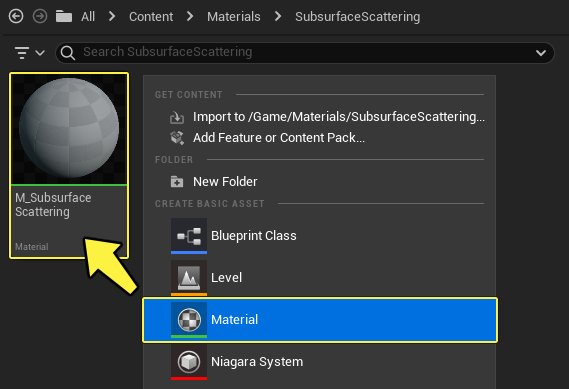
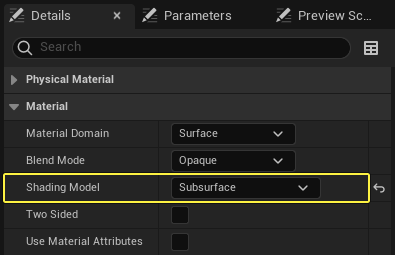
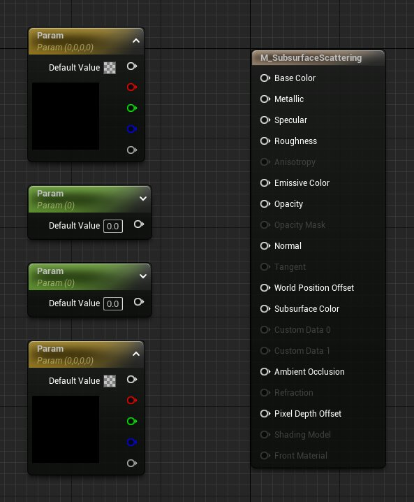
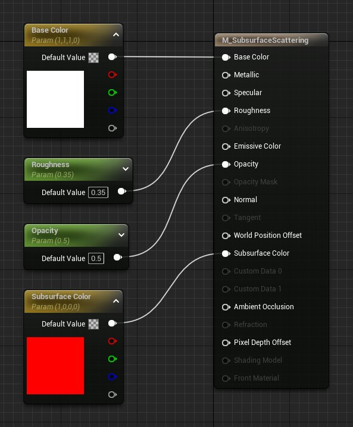
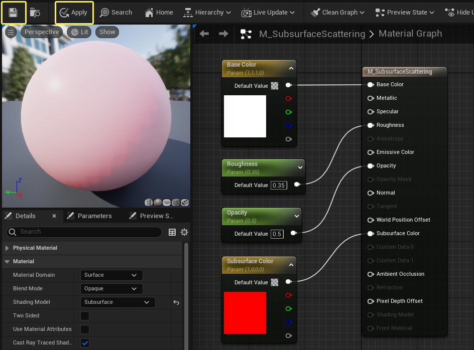
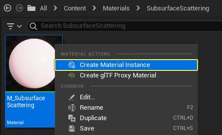
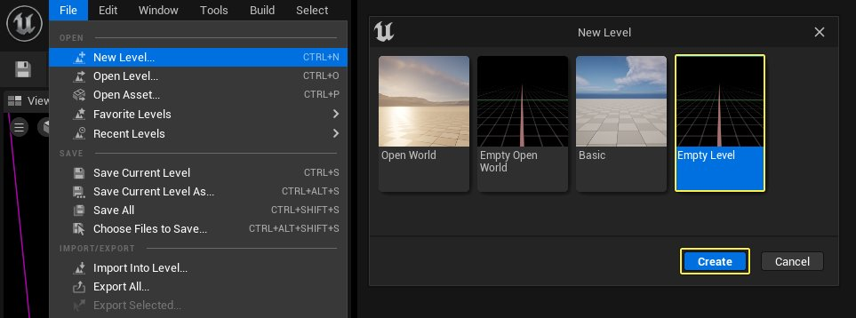
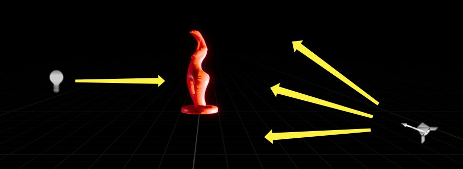

# 在材质中使用次表面散射

> 路径：虚幻引擎5.7文档 / 设计视觉、渲染和图形效果 / 材质 / 材质教程 / 在材质中使用次表面散射

> 原始页面：https://dev.epicgames.com/documentation/unreal-engine/using-subsurface-scattering-in-unreal-engine-materials

"次表面散射"术语用来描述光线穿过透明/半透明表面时发生散射的照明现象。

虚幻引擎（UE）提供了称为[次表面](../../unreal-engine-material-properties/shading-models/subsurface-shading-model/index.md)的特殊[着色模型](../../unreal-engine-material-properties/shading-models/index.md)，专门用于需要此类互动的材质，例如皮肤或蜡状物。

以下教程将阐述在材质中使用次表面散射所需了解的所有内容。

## 启用次表面着色模型

使材质能够使用次表面着色模型的步骤如下所示。

1. 首先，通过在 **内容浏览器** 中 **右键单击**，然后从 **创建基本资源（Create Basic Asset）**列表中选择"材质"（Material），创建新材质。给材质一个描述性的名称，如 **M_Subsurface_Scattering**。 完成后，你的 **内容浏览器** 应该如下所示。

   
2. 在内容浏览器中

   双击

   资产，将材质打开。
3. 在材质编辑器的细节面板中，将其 **着色模型（Shading Model）**从 **默认点亮（Default Lit）**更改为 **次表面（Subsurface）**。

   
4. 此材质现在已可用作次表面材质。

## 设置次表面材质

继续使用上文中启用了次表面散射的材质，让我们设置一个基本材质，以便查看关卡内作用中的次表面散射。

1. 我们需要布置一些材质表达式节点，以便有一些可处理的内容。 在本示例中，我们将添加下列节点。

   - 矢量参数（Vector Parameter）

     x 2
   - 标量参数（Scalar Parameter）

     x 2

   

   > [!TIP]
   > 我们使用参数材质节点而非一般材质节点的原因是，这样可以根据此材质来建立材质实例，从而方便在编辑器内进行微调。
2. 在开始连接节点之前，我们首先需要对其命名，并为其设置默认值。这些节点的名称及默认值如下所示。

   

   | 属性名称 | 值 |
   | --- | --- |
   | **Base_Color** | r:1.0, g:1.0, b:1.0 |
   | **Roughness** | 0.35 |
   | **Opacity** | 0.5 |
   | **Subsurface_Color** | r:1.0, b:0, g:0 |
3. 将所有4个参数表达式重命名并设置其默认值，然后将它们连接到对应主材质节点上对应的输入，如上所示。
4. 将所有节点连接完毕后，请务必按 **应用（Apply）**按钮以编译材质，并将其 **保存（Save）**。编译完成后，结果如下图所示。

   
5. 编译材质完成后，你可以关闭材质编辑器窗口。接着，在 **内容浏览器** 内，选中该材质，**右键单击**，然后从菜单中选择 **创建材质实例（Create Material Instance）**选项。

   

## 测试次表面材质

材质实例创建完毕后，你就在关卡中测试材质了。

1. 为此，你首先需要创建新的空白关卡以便在其中工作，具体方法是：打开主菜单，然后从 **文件（File）**选项中选择 **新建关卡（New Level）**。当系统提示你选择关卡类型时，请选择 **空关卡（Empty Level）**。

   
2. 为了测试材质，我们要使用初学者内容包中的静态网格体，在其前方使用 **点光源（Point Light）**照明，并在其后方使用一个非常明亮的 **聚光源（Spot Light）**。这种强烈的逆光有助于展示次表面材质如何传播和散射光线。光照配置应该如下图所示。

   
3. 在内容浏览器的 **StarterContent** > **Props** 中找到 **SM_Statue** 资产，将其添加到关卡。本示例中的位置和旋转设置如下所示：

   | 属性名称 | 值 |
   | --- | --- |
   | 位置（Location）： | X:0, Y: 0, Z:0 |
   | 位置（Location）： | X:0, Y: 0, Z:-23 |
4. 将 **M_Subsurface_Scatterin_Inst** 材质实例从内容浏览器拖动到关卡中的静态网格体上，将材质实例应用到雕像。或将其拖动到细节面板中雕像的两个材质元素（Material Elements）上。

   > 图片已省略：Statue details panel
5. 打开 **放置Actor（Place Actors）** 菜单，将一个 **点光源（Point Light）** 和一个 **聚光源（Spot Light）** 添加到关卡。

   > 图片已省略：Add lights to level
6. 选中点光源，在细节面板中配置设置如下：

   | 属性名称 | 值 |
   | --- | --- |
   | 位置（Location）： | X:380, Y: 0, Z:80 |
   | 强度（Intensity）： | 8.0 cd |

   > 图片已省略：Point Light Details
7. 选中聚光源，在细节面板中配置设置如下：

   | 属性名称 | 值 |
   | --- | --- |
   | 位置（Location）： | X:-650, Y: 100, Z:-75 |
   | 旋转（Rotation）： | X:0, Y:20, Z:0 |
   | 强度（Intensity）： | 1500 cd |

   > 图片已省略：Spot Light Details

## 使用次表面材质

次表面材质现已应用完毕，你可以开始调整材质实例的设置。

在下列各节中，我们将回顾如何控制次表面材质的外观，以及如何调整材质实例中的各种选项以获得我们所需的结果。

### "不透明"（Opacity）控制

在次表面材质的当前设置中，"不透明"（Opacity）输入控制着我们要让对象散射的光线量。

设置 0 将允许所有光线散射，而设置 1 不允许任何光线散射。 以下示例显示了被雕像散射的光线，其中，左图的"不透明"（Opacity）值设置为 0，而右图设置为0.35、0.65和1.0。 请注意，随着数值从 0 增大到 1，我们可以看到穿过对象的光线量变得越来越少。

> 图片已省略：Subsurface Opacity comparison

> [!TIP]
> 虽然"不透明"（Opacity）确实有助于消除大量散射光，但是你可能会注意到，仍存在一些次表面散射。要完全消除该效果，你还必须调整"次表面颜色"（Subsurface Color）的 **值（Value）**（下面的"次表面颜色值"一节提供了这方面的更多信息。）

### 次表面颜色值

虽然你可通过"不透明"（Opacity）输入来调整次表面散射量，但也可以使用 **取色器** 中的 **值（Value）**滑块进行此调整。

例如，将"不透明"（Opacity）设置为值 1.0 并将"次表面颜色值"（Subsurface Colors Value）从白色调整为黑色将有效地关闭次表面散射，如以下示例所示。

> 图片已省略：次表面颜色值为0、0.5和1.0。

**次表面颜色值为0、0.5和1.0。**

以下是以实时方式调整值的示例。请注意，随着颜色值从红色调整为黑色，次表面散射影响量也会受影响。

## 使用纹理作为次表面影响蒙版

你可使用纹理作为蒙版，以进一步控制接收或不接收次表面散射的区域。 为此，你只需将所要使用的纹理作为蒙版连接到材质的 **不透明（Opacity）**通道。 在以下示例中，我们不仅使用蒙版纹理，还使用标量值来控制蒙版强度，以便进一步控制所发生的次表面散射量。

> 图片已省略：Masked Subsurface graph

> [!TIP]
> 蒙版纹理根据从黑色到白色的值来工作。接近黑色的值将允许次表面效果穿透，而接近白色的值不允许次表面效果穿透。

下图为使用蒙版纹理时以上材质在关卡中的显示效果。 请注意立方体上的黑色斑点。 这些黑色斑点是在蒙版纹理中使用纯白色值的结果。

> 图片已省略：Masked Subsurface example
