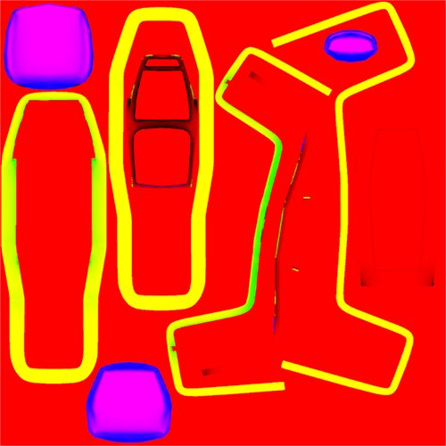
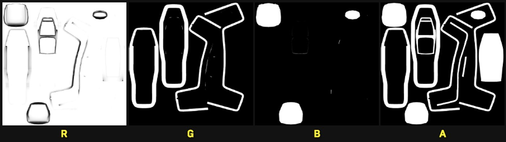
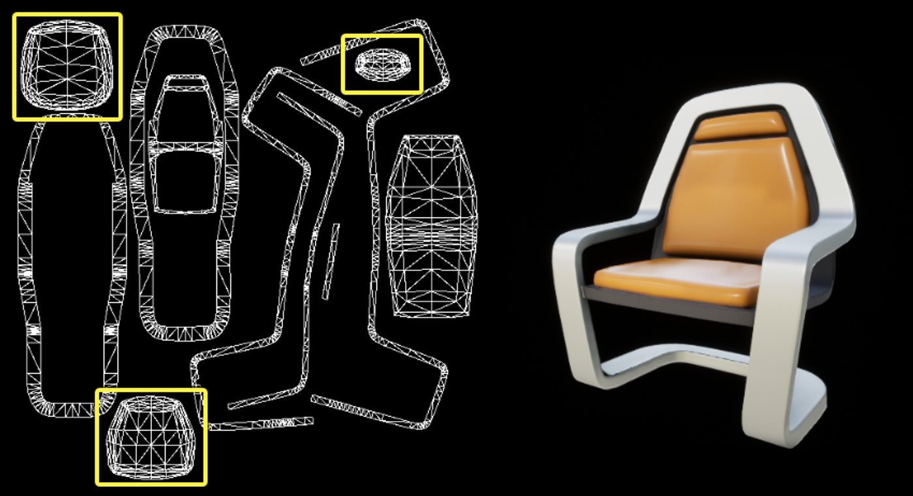
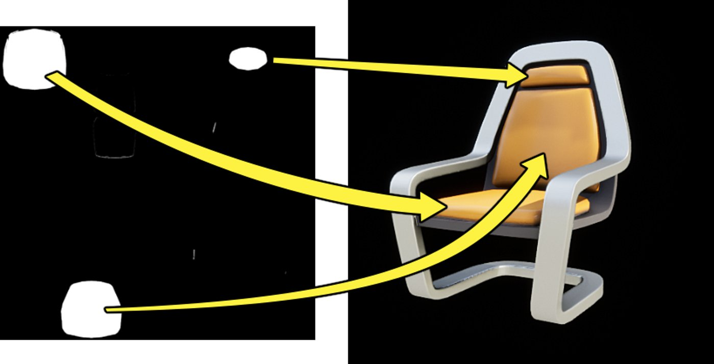
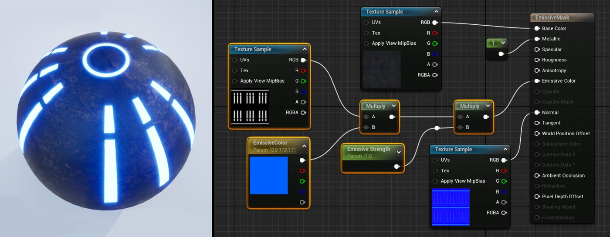
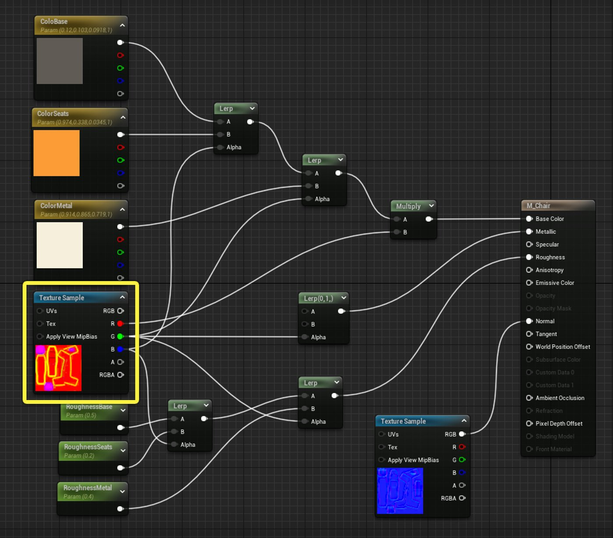
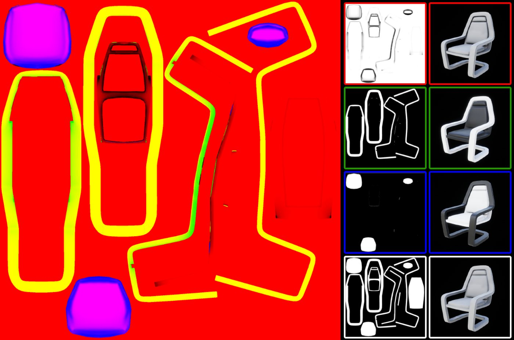
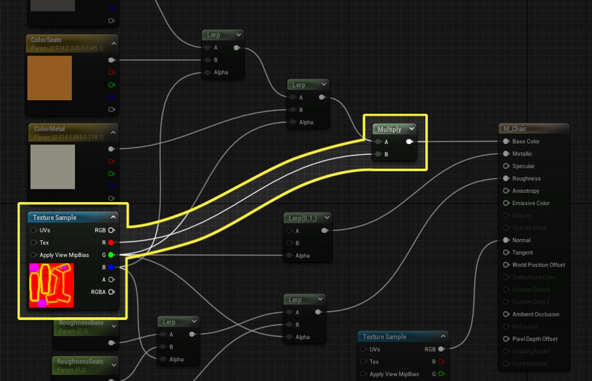

# 使用纹理遮罩

> 路径：虚幻引擎5.7文档 / 设计视觉、渲染和图形效果 / 材质 / 材质教程 / 使用纹理遮罩

> 原始页面：https://dev.epicgames.com/documentation/unreal-engine/using-texture-masks-in-unreal-engine

在创建3D资产时，你可能会发现需要在同一材质中定义不同的表面类型。 要轻松以低开销方法实现此目，可以使用**纹理遮罩（Texture Mask）**，定义表面的哪些部分应受材质的哪些部分的影响。

本教程将介绍如何在虚幻引擎材质中使用纹理遮罩。

## 纹理遮罩

**纹理遮罩**是一种灰阶纹理，或纹理的单个通道（R、G、B或A），用于限制**材质**中的效果区域。

遮罩通常包含在另一个纹理的单个通道中，例如漫反射或法线贴图的**Alpha通道**。 在其他情况下，单个图像文件通常包含"粗糙度（Roughness）"、"金属感（Metallic）"和"环境光遮蔽（Ambient Occlusion）"遮罩，每个遮罩占用一个通道。

这称为"通道打包"，是通过减少材质所需的纹理样本数来提高材质性能的好方法。 从技术上讲，任何纹理的任何通道都可以被认为是纹理遮罩并用作纹理遮罩。

下面是初学者内容包中静态网格体**SM_Chair**的纹理遮罩的示例。

实际上，此图像文件在四个颜色通道（RGBA）的每一个通道中包含不同的黑白遮罩。

## 创建纹理遮罩

你可以在任何2D图像处理程序中创建纹理遮罩。 你也可以在主要内容创作程序中直接从几何体烘焙遮罩，或者使用专用的纹理工具（如Marmoset Toolbag、Xnormal或Substance Painter/Designer）烘焙遮罩。

手动创建遮罩时，你通常会从一个显示网格体UV布局的图像开始。 在本例中，目的是遮盖座垫。 下图中突出显示了相应的UV。 下图突出显示了对应的UV。 要遮罩模型的特定部分，你需要将图像的该区域涂成纯白色，同时将其他区域留黑。

如上所示，这允许你将特定的表面属性应用于被遮罩的区域。 在本例中，使用遮罩为座垫指定橙色。

> [!NOTE]
> 在创建纹理遮罩时，应该始终使用纯黑色或纯白色，而不要使用颜色信息。 在虚幻引擎中使用遮罩时，使用任何其他类型的颜色可能会导致奇怪的瑕疵。

## 导出纹理遮罩

遮罩纹理绘制完成后，你可以将其导出为单个图像，也可以将多个遮罩一起打包到单个图像的R、G、B和A通道中并进行导出。 这通常称为RGB通道打包，是创建遮罩时的首选方法，因为它只需极少的额外工作即可实现显著的性能提升和内存节省。

> [!TIP]
> 如果你将某些内容打包到纹理的Alpha通道中，请切记要在你使用的任何2D图像处理软件中启用Alpha导出。 否则，你将面临Alpha通道不会与纹理一起导出的风险。

## 使用纹理遮罩

你可以在"虚幻材质编辑器（Unreal Material Editor）"中以多种不同方式使用遮罩纹理。 常见用途包括定义自发光光源，定义网格体的哪些部分是金属和非金属，或将不同颜色映射到模型的不同部分，如椅子示例中所示。

以下小节将演示在虚幻引擎中使用纹理遮罩的一些最常见方法。

### 自发光遮罩

遮罩纹理最常见的用途之一是控制材质的自发光部分。 为此，通常的方法是首先创建一个自发光遮罩纹理，该遮罩纹理将使用纯白色来定义材质应该发光的部分。 自发光遮罩通常附带两个参数：

- 要更改自发光光源的颜色，可以将自发光遮罩乘以由**向量参数（Vector Parameter）**定义的颜色。
- 要更改自发光光源的强度，可以将其乘以**标量参数（Scalar Parameter）**。 增加标量参数中的值可以提高发光的亮度。

下图中突出显示的四个节点显示了一个自发光遮罩乘以控制光照颜色和亮度的参数。 球体仅在对应自发光遮罩的白色区域中发光。 球体的其余部分则显示基础颜色纹理。

### 材质遮罩

纹理遮罩的第二个常见用途是在单独的R、G、B和Alpha通道中存储不同类型的纹理信息。 初学者内容包附带的SM_Chair静态网格体上的材质便是这种技术的完美示例。

> [!TIP]
> 首先转到**内容浏览器（Content Browser）**，选择**Starter Content**文件夹，然后在搜索框中输入"chair"，即可找到SM_Chair及其附带的所有内容。 这将显示与椅子相关的所有内容。 如果没有看到椅子，可能意味着你没有在项目中包含初学者内容包。 为解决此问题，你需要新建项目或尝试使用[迁移资产（Migrating Assets）](../../../../understanding-the-basics/assets-and-content-packs/migrating-assets/index.md)工具，将椅子内容从另一个项目移到 这个新项目中。

打开椅子材质M_Chair，我们可以看到纹理贴图效果的完美示例。

在此材质中，遮罩纹理**T_Chair_M**用于将特定的表面属性映射到网格体上的不同区域。 纹理遮罩可以帮助定义哪些部分是金属或非金属，还用于为椅子的不同部分指定不同的粗糙度和颜色值。

下图中详解了如何使用遮罩纹理中的每个通道。 左侧是合成的RGB图像，或者在图像被视为纹理时的外观。 中间一栏显示了每个颜色通道（从上到下为R、G、B、A）中包含的黑白遮罩。 最右边的图像显示了遮罩的目标是椅子的哪一部分；椅子的白色部分对应于遮罩中的白色部分。

下面详解了椅子遮罩纹理的每个通道中存储的信息类型。

- **红色通道**：环境光遮蔽信息。 在材质中，这用于帮助在两个表面靠得很近的地方添加细微的接触阴影。

  
- **绿色通道**：金属感遮罩。 在材质中，这用于定义哪些部分应该是金属的 也用于帮助定义金属应该是什么颜色。

  > 图片已省略：绿色通道 - 金属感遮罩
- **蓝色通道**：非金属感遮罩。 在材质中，这用于定义哪些部分是非金属的。 此遮罩也可帮助定义非金属部分的颜色。

  > 图片已省略：蓝色通道 - 非金属感遮罩
- **Alpha通道**：完整对象遮罩。 材质目前不使用此遮罩。

总而言之，椅子在虚幻引擎关卡中如下所示：

> 图片已省略：关卡中的椅子

## 遮罩提示和技巧

纹理遮罩是一个非常强大的工具，尤其是与虚幻引擎中的其他工具结合使用时。 以下小节将介绍在作品中充分利用纹理遮罩的一些提示和技巧。

### 纹理遮罩和材质分离

一种较好的做法是将纹理遮罩与材质实例结合使用，从而为资产添加几乎无穷无尽的多样性。 例如，可以使用纹理遮罩来定义哪些区域应该具有某些属性（比如颜色），然后在"实例编辑器（Instance Editor）"中使用不同的材质实例对这些属性进行自定义。 如需了解详情，请参阅[材质实例化](../../instanced-materials/index.md)。

> 图片已省略：初学者内容包椅子的不同颜色的实例。

通过结合使用材质遮罩和材质实例化，可以让美术师快速轻松地更改材质中的颜色和其他值。 这种方法会产生可高度自定义的资产，如上图中的SM_Chair所示。

### 遮罩和通道瑕疵

由于DirectX的某种奇怪原因，纹理的**绿色通道**通常会提供最佳压缩结果。 如果你的任何遮罩受到压缩瑕疵的严重影响，请首先尝试将信息放入图像的绿色通道中，看看是否有帮助。 如果这不能解决问题，请尝试使用Alpha通道来存储遮罩。

> [!TIP]
> 尝试使用纹理的Alpha通道来存储遮罩信息时要谨慎。 将Alpha通道添加到纹理将大幅增加该纹理占用的内存， 如果频繁这样做，则通过将不同遮罩打包到纹理的RGB通道中所节省的所有空间都可能会因此丢失。

### sRGB和遮罩纹理

将多个遮罩纹理打包到单个纹理中时，应在"纹理编辑器（Texture Editor）"中取消选中"sRGB"，因为不应该对遮罩进行伽玛校正。

> 图片已省略：禁用sRGB

如果为之前在材质中采样的纹理禁用sRGB，则样本类型不会在现有2D纹理采样器节点中自动更新。 你需要确保调整所有现存2D纹理取样器节点中的节点类型。 如果不更改**取样器类型（Sampler Type）**，材质将无法编译，同时统计日志中会显示以下消息。

> 图片已省略：取样器类型错误

要修复此错误，只需将"采样器类型（Sampler Type）"从默认的"颜色（Color）"更改为"线性颜色（Linear Color）"，警告就会消失。 此外，你还应重新编译材质，以确保更改成功。 完成后，警告将消失。

## 总结

纹理遮罩是一个非常强大的概念，一旦掌握了它，你就可以用很少的源内容创建几乎无穷无尽的变化。 请注意，任何图像文件中均只提供四个通道用于纹理遮罩，因此需要谨慎使用每个通道。 不要忘记在遮罩纹理上禁用sRGB，因为这样可以极大地帮助提高遮罩的清晰度。
