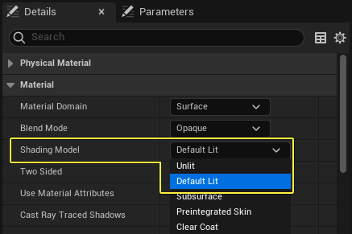
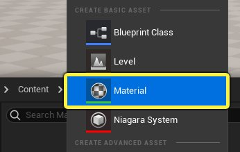
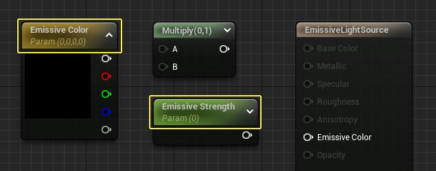
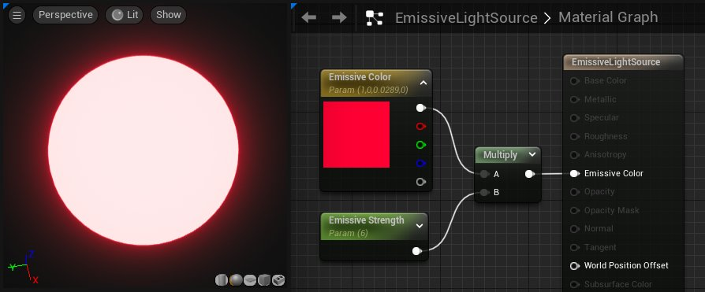
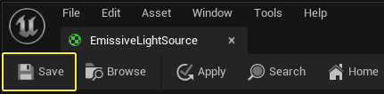
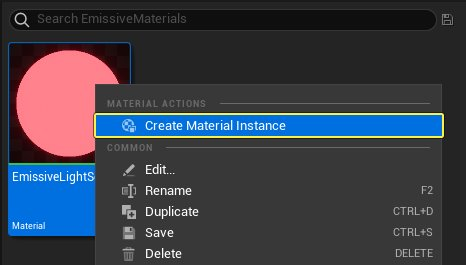
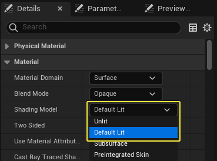
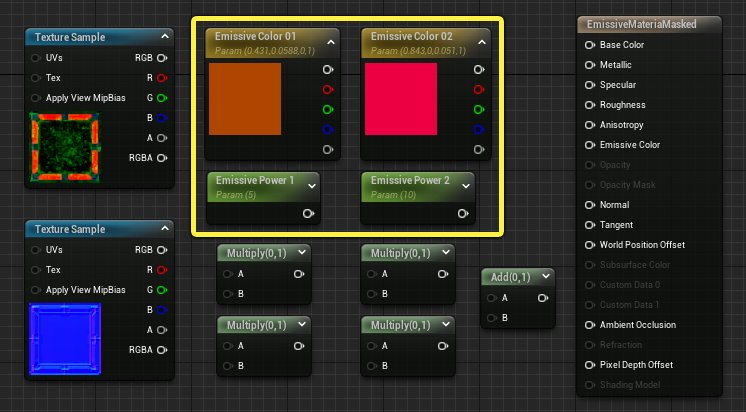

# 使用自发光材质输入

> 路径：虚幻引擎5.7文档 / 设计视觉、渲染和图形效果 / 材质 / 材质教程 / 使用自发光材质输入

> 原始页面：https://dev.epicgames.com/documentation/unreal-engine/using-the-emissive-material-input-in-unreal-engine

在项目开发过程中，你可能需要用到自发光材质或发光材质。在虚幻引擎中，Self-Illuminated和Emissive材质均称为自发光材质。在接下来的教程中，你将学习如何使用 **自发光颜色（Emissive Color）** 输入来创建材质，以及如何创建可将光线实际投射到正在创建的世界中的自发光材质。

## 自发光光照

在虚幻引擎中，借助自发光材质，美术师能够以成本很低但有效的方式来创建表面发光或投射光的视觉效果，而无需使用虚幻的任何标准光源类型。根据你的设置，自发光材质可以充当真正的光源（此时会将光照投射到周围的环境中），也可以仅自发光而不向场景中发射光。

通过在[主材质节点（Main Material Node）](../../unreal-engine-material-editor-user-guide/using-the-main-material-node/index.md)上的 **自发光颜色（Emissive Color）** 输入中输入大于1.0的值即可创建自发光材质。 这样就会将材质推入HDR范围，从而产生[泛光效果](../../../post-process-effects/bloom/index.md)。

## 光照和无光照自发光材质

自发光材质会自发光，这意味着可以将这种材质用于 **光照（Lit）** 和 **无光照（Unlit）着色模型**。创建完全自发光的材质时，可以使用无光照着色模型，因为它会生成一个渲染成本更低的着色器。 如果需要材质在某种程度上接收场景中的光照，则可以使用默认光照着色模型（Default Lit Shading Model）。

- **何时使用无光照着色模型**：如果自发光材质不需要与关卡中的光照交互，则应使用无光照着色模型。例如，自发光材质仅用于模拟光源（如发光板或灯泡表面积）时。
- **何时使用默认光照着色模型**：如果希望自发光材质使用主材质节点上的任何其他着色器输入，则应使用光照着色模型。 例如，使用纹理遮罩确保只有部分材质自发光时。如果要为配备光源的枪支创建材质，则应使用默认光照着色模型，这样法线贴图（Normal Map）、基础颜色（Base Color）和其他着色器输入仍然有效。 如果希望自发光材质照亮周围的对象，必须使用默认光照着色模型。

## 创建完全自发光材质

本小节说明如何创建仅用于模拟光源的完全自发光材质。 这种材质将有两个参数可控制光源的颜色和亮度。

1. 在内容浏览器（Content Browser）中 **单击右键**，然后从上下文菜单的 **创建基本资产（Create Basic Asset）** 分段中选择 **材质（Material）**。 将新材质重命名为 **EmissiveLightSource**。

   
2. 将以下节点添加到你的材质图表中。

   - 向量参数（Vector Parameter）
   - 标量参数（Scalar Parameter）
   - 乘法（Multiply）

   将"向量参数（Vector Parameter）"重命名为 **自发光颜色（Emissive Color）**，将"标量参数（Scalar Parameter）"重命名为 **自发光强度（Emissive Strength）**。完成后，你的图表应如下图所示。

   
3. 如下图所示连接节点，并将"乘法（Multiply）"输出连接到 **自发光颜色（Emissive Color）** 输入。在"细节（Details）"面板中选择每个参数并设置默认值。 在下面的示例中，**自发光颜色（Emissive Color）** 设置为红色，**自发光强度（Emissive Strength）** 设置为6。

   
4. 单击工具栏中的 **保存（Save）** 以编译材质并保存资产。关闭材质编辑器。

   
5. 在内容浏览器（Content Browser）中，**右键单击** EmissiveLightSource材质，然后选择 **创建材质实例（Create Material Instance）**。

   
6. 双击 **EmissiveLightSource_Inst** 资产以在材质实例编辑器中打开该资产。 通过选中参数名称旁边的复选框来启用这两个参数。启用后，即可实时覆盖 **Emissive Color（自发光颜色）** 和 **Emissive Strength（自发光强度）** 值。

## 创建带遮罩的自发光材质

此示例说明如何创建材质以使用纹理遮罩定义材质的自发光部分。 由于这种材质只是部分自发光，因此需要使用默认光照着色模型。

> [!NOTE]
> 本教程采用虚幻引擎初学者内容包中的资产。此处介绍的技术适用于任何纹理，但如果你想重建该示例，请确保在你的项目中包含 **初学者内容包**。 如果在创建项目时没有包含初学者内容包，请阅读[迁移资产](../../../../understanding-the-basics/assets-and-content-packs/migrating-assets/index.md)页面，了解如何将内容迁移到你的当前项目。

1. 创建一个新材质并在材质编辑器中将其打开。 此材质应使用 **默认光照（Default Lit）** 着色模型。

   
2. 将以下材质表达式添加到你的图表中。

   - 向量参数（Vector Parameter）

     x 2
   - 标量参数（Scalar Parameter）

     x 2
   - 纹理样本（Texture Sample）

     - T_Tech_Panel_M
   - 纹理样本（Texture Sample）

     - T_Tech_Panel_N
   - 乘法（Multiply）

     x 4
   - 加法（Add）

     x 1

   这些参数将用于控制自发光强度和颜色，如前面的示例所示。将两个"向量参数（Vector Parameter）"分别重命名为 **自发光颜色1（Emissive Color 1）** 和 **自发光颜色2（Emissive Color 2）**。 将两个"标量参数（Scalar Parameter）"分别重命名为 **自发光强度1（Emissive Power 1）** 和 **自发光强度2（Emissive Power 2）**。将默认值更改为你选择的颜色和强度。

   
3. **T_Tech_Panel_M** 纹理在其每个通道中包含四个不同的图像遮罩。 此材质将使用 **红色** 和 **蓝色** 通道在材质上创建两个不同的自发光部分。

   > 图片已省略：Emissive Mask textures

   如下图所示连接节点。 此逻辑之所以有效，是因为纹理遮罩包含纯黑白值。 当颜色参数与纹理遮罩中的值相乘时，遮罩中的任何黑色像素都将输出自发光值 **0**。 只有遮罩的白色部分会自发光，如下面的预览所示。 可以独立更改材质实例中两个自发光区域的颜色和强度。

   > 图片已省略：undefined

   点击图片以查看大图。
4. 单击工具栏中的 **保存（Save）** 以编译材质并保存资产。关闭材质编辑器。
5. 在内容浏览器（Content Browser）中，**右键单击** **EmissiveMaterialMasked** 资产，然后选择 **创建材质实例（Create Material Instance）**。
6. 双击 **EmissiveMaterialMasked_Inst** 资产以在材质实例编辑器中打开该资产。 选中所有四个参数旁边的复选框以在材质实例中覆盖这四个参数。 启用后，可以单独控制两个发光区域的外观，包括将 **自发光强度（Emissive Power）** 参数设置为 **0** 以开启或关闭这两个自发光区域。

## 创建测试贴图

在其余示例中，下面显示的简单测试贴图用于演示自发光在虚幻环境中的传播方式。

> 图片已省略：Emissive demo scene

请按照以下步骤创建类似的测试贴图。 此场景中的所有资产均来自虚幻初学者内容包。

1. 按以下方式创建一个新关卡：转到 **文件（File）** > **新建关卡（New Level）**，然后在"新建关卡（New Level）"对话框中选择 **时间（Time of Day）** 选项。

   > [!TIP]
   > 还可以通过按键盘上的 **CRTL + N** 来创建新关卡。
2. 此处的演示场景是使用下列资产创建的。

   - Wall_500x500

     - 五个实例排列成一个房间的形状，如下图所示。
   - M_Brick_Clay_New

     - 应用于所有五个Wall实例的材质。
   - Shape_sphere

     - 放置在测试房间中央。

   > 图片已省略：Emissive test scene setup
3. 创建完毕后，按键盘上的 **CTRL + S** 保存贴图。

## 自发光材质与流明

启用流明全局光照（Lumen Global Illumination）后，自发光材质的光线会自动在场景中传播，不会产生额外的性能成本。 这是一种强大且高度动态的光照方法，但在使用非常小或非常亮的自发光光源时应谨慎，因为这两种光源都会导致噪点瑕疵。

> [!NOTE]
> 在新建的虚幻引擎5项目中会默认启用流明全局光照。 如果要将较旧的UE4项目转换为UE5，则需要手动启用流明。 要了解如何启用流明，请[点击此处](../../../../building-virtual-worlds/lighting-the-environment/global-illumination/lumen-global-illumination-and-reflections/index.md)。

下面的视频展示了自发光材质如何在启用流明的场景中投射光照。需要注意自发光光源的大小如何改变光照的表观亮度和衰减距离。

## 自发光材质与静态光照

使用静态光照（Static Lighting）时，自发光材质可以将光投射到关卡中，但默认不启用此功能。 如果在场景中没有其他光照的情况下创建CPU Lightmass版本，则自发光材质的自发光部分为可见状态，但该材质不会照亮其周围的任何对象。

> 图片已省略：Emissive with static lighting disabled

要使此材质将光线投射到场景中，必须在"细节（Details）"面板中启用一项设置。 选择应用该自发光材质的静态网格体。 在此例中为立方体。

在"细节（Details）"面板中搜索"自发光（emissive）"，然后在 **Lightmass设置（Lightmass Settings）** 下选中相应复选框以启用 **将自发光用于静态光照（Use Emissive for Static Lighting）**。

还有一项 **自发光增强（Emissive Boost）** 设置。 如果创建一个Lightmass版本，但自发光太暗，则可以输入一个大于 **1** 的值来增强自发光。 另一种增加亮度的方法是增加材质实例中的 **自发光强度（Emissive Power）** 参数。

下面的幻灯片显示了当"将自发光用于静态光照（Use Emissive for Static Lighting）"选项开启并增加到2时，静态光照如何变化。

(1)"将自发光用于静态光照（Use Emissive for Static Lighting）"选项关闭，(2)"将自发光用于静态光照（Use Emissive for Static Lighting）"选项启用，(3)"Emissive Boost（自发光增强）"设置为2。

### 自发光和GPU Lightmass

使用GPU Lightmass来烘焙光照时，不需要使用 **将自发光用于静态光照（Use Emissive for Static Lighting）** 设置。 自发光材质的光线会自动传播到GPU Lightmass结果中。 如果需要在GPU Lightmass烘焙中增加或减少自发光的亮度，可以修改材质或材质实例中的亮度值。

## 自发光影响和泛光

增加自发光材质的亮度时，从材质自发光部分生成的后期处理泛光（Bloom）效果也将变得越来越亮。 有时可能希望增加材质中的自发光值，但不希望图像中的泛光效果过强。

为此，可在 **后期处理体积（Post Process Volume）** 中控制泛光效果不受自发光强度影响。这样便可以在提高或降低自发光亮度时将泛光效果保持在合理程度。

如果将自发光值设置得很高以便让自发光材质将更多静态光投射到世界中，调整此值将有助于进行补偿。

在下面的视频中，其中一个"自发光强度（Emissive Power）"值增加到100，泛光效果变得强烈。 一种补偿方法是选择"后期处理体积（Post Process Volume）"，搜索"泛光（bloom）"，减小该值，从而获得视觉上更友好的结果。 另一种方法是将"Bloom（泛光）"设置更改为 **卷积（Convolution）** 以模拟摄像机的星爆效果。

## 间接光照的多次反弹

启用 **将自发光用于静态光照（Use Emissive for Static Lighting）** 后，可以使用间接光照的多次反弹进行平滑并改善光照效果。 在 **世界设置（World Settings）* 面板中，展开**Lightmass设置（Lightmass Settings）**并提高**天空光照反弹次数（Num Sky Lighting Bounces nces）@@@** 的值。

此场景示例中的自发光静态光照提供间接光照的多次反弹。
