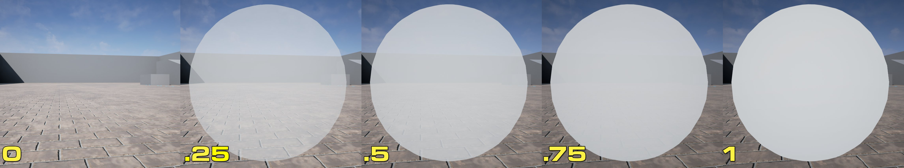
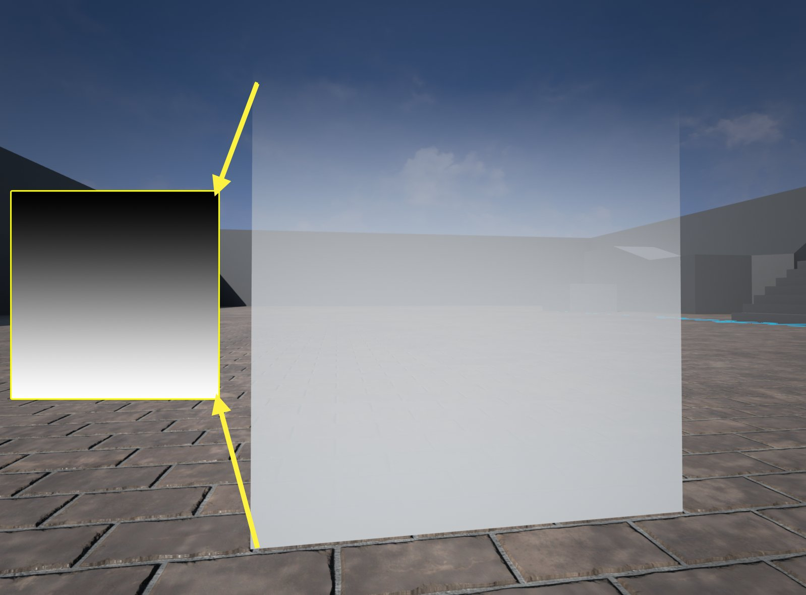
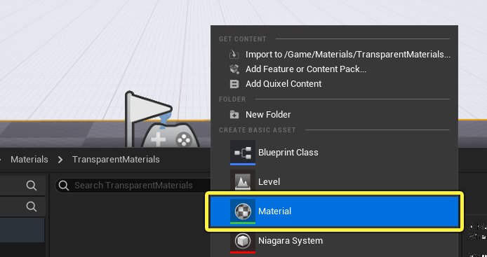
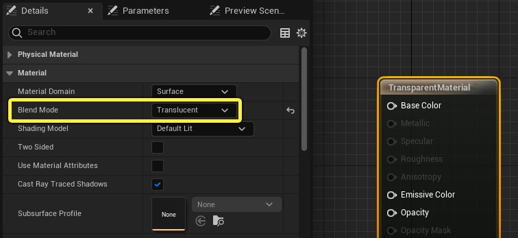
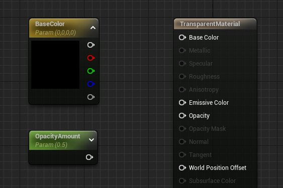
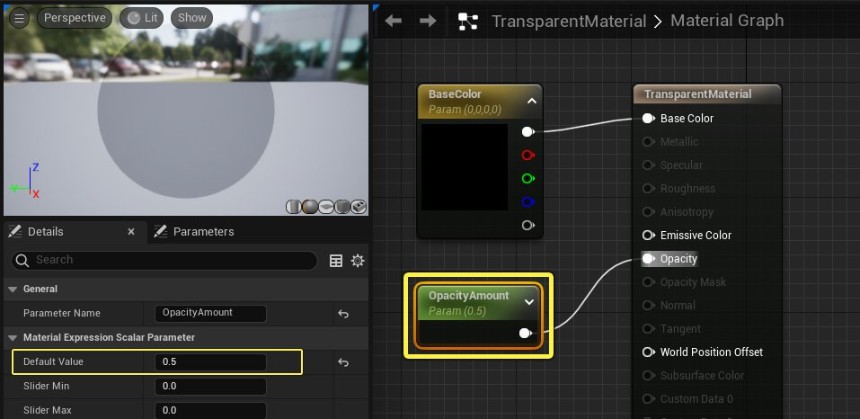
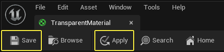
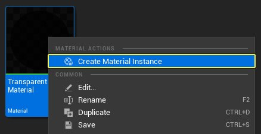

# 在材质中使用透明度

> 路径：虚幻引擎5.7文档 / 设计视觉、渲染和图形效果 / 材质 / 材质教程 / 在材质中使用透明度

> 原始页面：https://dev.epicgames.com/documentation/unreal-engine/using-transparency-in-unreal-engine-materials

在创建水或玻璃等特定类型的表面时，你不仅要使表面能透视，还要使表面具备厚度感和颜色。 在现实世界中，这些属性称为 **透明度（Transparency）** 或 **不透明度（Opacity）** ，这两者常常互换使用，说的是一回事。在虚幻引擎中，**透明度（Transparency）** 和 **不透明度（Opacity）** 的含义不同。

- 透明度（Transparency）

  用于定义表面是否可以透视。
- 不透明度（Opacity）

  用于定义表面透射光线的程度。 换言之，不透明度值将决定表面有多么透明或不透明（即能够透视/无法透视的程度）。

以下教程将全方位介绍如何在虚幻引擎材质中使用透明度。

## 透明度

**透明度（Transparency）** 一词用于说明表面阻止或允许光线通过的能力。例如，砖块没有透明度。彩色玻璃可透射一部分光线，但透射不了全部光线，因此它是有透明度的表面。你可以使用透明度来模拟现实世界中各种类型的表面，包括下面列出的类型。

- 毛发
- 玻璃
- 水
- 烟雾或火焰视觉效果
- 云
- 撞击贴花
- 植被

## 透明度和不透明度

在虚幻引擎中，透明度的工作方式是为每个像素分配0到1之间的 **不透明度（Opacity）** 值。 **不透明度（Opacity）** 为1时，表面完全不透明，这意味着它会阻止照射到它上面的100%的光线。 **不透明度（Opacity）** 为0时，表面允许所有光线通过。0到1之间的不透明度值会产生部分可透视的像素。下图显示了静态网格体上从0增加到1的不透明度值。

你还可以使用灰阶纹理定义不透明度。 下图演示了纹理如何帮助定义网格体的哪些部分应该有透明度，以及应该有多么透明。该纹理是从顶部黑色（或完全透明）到底部白色（或完全不透明）的梯度。中间的区域根据纹理中的像素靠近黑色或白色的程度，拥有不同程度的不透明度。

## 在材质中使用透明度

你可以使用以下步骤设置透明材质：

> [!NOTE]
> 本教程使用虚幻引擎 **初学者内容包（Starter Content）** 中的资产。如果你未在项目中包含初学者内容包，请阅读[迁移](../../../../understanding-the-basics/assets-and-content-packs/migrating-assets/index.md) 内容页面，了解如何在项目之间迁移内容。你可以通过这种方式将初学者内容包添加到当前项目，不必新建。

1. 首先在 **内容浏览器（Content Browser）** 中 **右键点击** ，然后从上下文菜单的 **创建基本资产（Create Basic Asset）** 分段中选择 **材质（Material）** 。

   
2. 将材质命名为 **TransparentMaterial** ，然后在 **内容浏览器（Content Browser）** 中 **双击** 打开材质缩略图。界面上将打开材质编辑器。
3. 点击材质图表的背景，在 **细节（Details）** 面板中显示材质属性。 在 **材质（Material）** 分段下，将 **混合模式（Blend Mode）** 从 **不透明（Opaque）** 更改为 **半透明（Translucent）** 。

   
4. 现在 **混合模式（Blend Mode）** 已正确设置，将以下材质表达式添加到你的图表。你可以在材质控制板中的搜索栏中输入节点名称来查找节点。找到之后， **左键点击** 并将其从控制板拖入材质图表中。

   - 向量参数

     x 1
   - 标量参数

     x 1

   
5. 将向量参数节点重命名为 **BaseColor** ，并为其提供颜色值。将向量参数节点的输出连接到主材质节点上的 **基础颜色（Base Color）** 输入。
6. 将标量参数重命名为 **Opacity** ，并为其提供默认值0.5。将标量参数插入主着色器节点上的 **不透明度（Opacity）** 输入。

   
7. 在材质编辑器工具栏中点击 **应用（Apply）** ，然后点击 **保存（Save）** ，编译材质并保存资产。

   
8. 在 **内容浏览器（Content Browser）** 中找到 **TransparentMaterial** 资产，右键点击缩略图，并在上下文菜单中选择 **创建材质实例（Create Material Instance）** 。

   
9. 在 **内容浏览器（Content Browser）** 中，导航到初学者内容包中的 **形状（Shapes）** 文件夹。左键点击并将 **Shape_Sphere** 静态网格体拖入视口中，然后释放鼠标左键，在关卡中生成该网格体。

   > 图片已省略：将球体添加到关卡
10. 在内容浏览器中找到 **TransparentMaterial_Instance** 资产。 左键点击并将材质实例拖入球体上，然后释放鼠标左键，将其应用于网格体。

    > 图片已省略：将材质应用于对象
11. 在 **内容浏览器（Content Browser）** 中 **双击** 打开材质实例。在材质实例编辑器中，选中 **OpacityAmount** 参数名称旁边的复选框来覆盖该参数。启用之后，你可以调整 **OpacityAmount** 的值，更改对象的透明程度。

## 透明度和反射

利用了透明度的对象可以在设置了以下选项时显示场景反射。但请记住，大量使用启用了反射的半透明材质可能会导致性能问题。

1. 在 **内容浏览器（Content Browser）** 中 **双击** 打开上面创建的 **TransparentMaterial** 。 在 **半透明（Translucency）** 类别下的 **细节（Details）** 面板中，将 **光照模式（Lighting Mode）** 从 **体积非定向（Volumetric NonDirectional）** 更改为 **表面半透明体积（Surface TranslucencyVolume）** 。

   > 图片已省略：表面半透明体积设置
2. 在材质图表中，选择 **OpacityAmount** 参数，并按键盘上的 **CTRL + D** 复制两次。完成后，你的材质图表应该如下所示。

   > 图片已省略：复制材质表达式
3. 将新材质表达式节点重命名为 **Metallic** 和 **Roughness**。将 **金属感（Metallic）** 材质表达式的默认值设置为1.0，并将 **粗糙度（Roughness）** 的默认值设置为0。然后将每个材质表达式连接到主材质节点上的对应输入。

   > 图片已省略：半透明反光材质图表
4. 在材质编辑器工具栏中点击 **应用（Apply）** 和 **保存（Save）** ，然后关闭材质编辑器。

   > 图片已省略：应用和保存材质
5. 现在你应该能够在关卡中的球体上看到反射。

   > 图片已省略：关卡中带反射的透明材质

调整材质实例的参数可以使透明度产生极其不同的外观结果。

## 染色或彩色透明度

你可以使用 **薄透明（Thin Transparent）** 着色模型和材质表达式，准确表示染色和彩色透明材质，例如彩色玻璃和塑料。该着色模型为透明表面启用了带有正确染色的背景色的白色高光度高光。

> 图片已省略：标准半透明着色模型

> 图片已省略：薄半透明着色模型

标准半透明着色模型

薄半透明着色模型

薄半透明材质图表的示例如下所示。

> 图片已省略：undefined

点击放大图像。

使用 **细节（Details）** 面板中的以下属性配置材质：

- 将

  混合模式（Blend Mode）

  更改为

  半透明（Translucent）

  。
- 将

  着色模型（Shading Model）

  更改为

  薄半透明（Thin Translucent）

  。
- 在半透明类别中，将

  光照模式（Lighting Mode）

  更改为

  表面前向着色（Surface ForwardShading）

  。

将 **薄半透明材质（Thin Translucent Material）** 表达式添加到图表，并将Constant3Vector或向量参数连接到输入。该节点将控制透明表面的色调。

## 半透明彩色阴影

半透明材质能够在一些情况下投射有光透射的彩色阴影。能通过材质的光线量决定于其不透明度值以及有多少光线投射到该材质。

> 图片已省略：半透明彩色阴影

> [!NOTE]
> 半透明彩色阴影目前仅可通过[静态光照](../../../../building-virtual-worlds/lighting-the-environment/light-types-and-their-mobility/static-light-mobility/index.md)和[Lightmass](../../../../building-virtual-worlds/lighting-the-environment/global-illumination/lightmass-basics/index.md)实现。
>
> 如需了解更多信息和用法，请参阅[使用彩色半透明阴影](../using-colored-translucent-shadows/index.md)。

## 透明度和性能

> 图片已省略：着色器复杂度视口

如果场景中有太多透明的对象，那么透明度（尤其是光照透明度）可能很快会成为性能瓶颈。这个问题用术语来讲就是过度绘制。**过度绘制（Overdraw）** 是指大量带透明度的对象在彼此之上渲染。过度绘制会导致这种性能问题的原因是，你后续每引入一层透明度，渲染透明度的成本会越来越昂贵。

为了帮助你更好地识别是否以发生了该问题及发生在何处，虚幻引擎推出了一种特殊的视图模式，即 **着色器复杂度（Shader Complexity）** 模式。着色器复杂度模式用颜色显示复杂度，向你展示了渲染给定表面有多复杂。显示的颜色越偏向绿色，渲染成本就越低。显示的颜色越偏向红色，该帧的渲染成本就越高。 请使用以下步骤来启用着色器复杂度视图模式。

1. 要启用 **着色器复杂度（Shader Complexity）** ，请点击编辑器视口顶部的 **视图模式（View Mode）** 选项。默认情况下，视图模式设置为 **光照（Lit）** 。

   > 图片已省略：视图模式菜单
2. 从上下文菜单选择 **着色器复杂度（Shader Complexity）** 选项。

   > 图片已省略：切换着色器复杂度
3. 激活 **着色器复杂度（Shader Complexity）** 视图模式后，关卡视口应该如以下视频所示。

随着摄像机在关卡中围绕透明球体旋转，视频中非常清晰地演示了过度绘制。球体全部并排显示时，没有过度绘制，并且视口大部分为绿色。所有六个球体都在相同视距时，重叠最多的区域会变为鲜红色，表示过度绘制。虽然要去除所有过度绘制并不是100%可行，也不建议这么做，但该视图模式非常有助于尝试弄清楚你的性能问题到底源自哪里。

## 半透明排序优先级

场景中有多个透明对象紧挨在一起时，你可能会注意到，引擎有时很难确定将哪个对象渲染在其他透明对象前面或后面。 以下示例使用上面的材质和初学者内容包中的光照蒸汽视觉特效处理，演示了这种情况。

请注意，蒸汽最初在网格体前面渲染，然后突然冒到每个球体后面。要防止发生这种情况，**半透明排序优先级（Translucency Sort Priority）** 需要设置为使烟雾的视觉特效处理始终在场景中其他半透明之上渲染。要更改视觉特效处理上的 **半透明排序优先级（Translucency Sort Priority）** ，请执行以下操作。

1. 首先选择你想在关卡中其他所有半透明之上渲染的对象。 在本例中，选择视觉特效处理粒子系统。

   > 图片已省略：在视口中选择粒子系统。
2. 在 **细节（Details）** 面板中，找到 **渲染（Rendering）** 分段，然后展开 **高级（Advanced）** 子类别。

   > 图片已省略：细节面板中的高级渲染设置
3. 从新的选项列表中，查找 **半透明排序优先级（Translucency Sort Priority）** ，然后输入值 **100** 。

   > 图片已省略：半透明排序优先级设置

   > [!NOTE]
   > 默认情况下，添加到关卡中的所有内容的 **半透明排序优先级（Translucency Sort Priority）** 都为0。如果你希望某个透明的对象始终在其他每个透明对象之上绘制，请使用正数。如果你希望某个透明的对象始终在其他每个透明对象后面绘制，请使用负数。
4. 现在查看场景中的蒸汽视觉特效处理。将 **半透明排序优先级（Translucency Sort Priority）** 设置为100后，蒸汽会始终在其他半透明对象之上绘制。
5. 将 **半透明排序优先级（Translucency Sort Priority）** 设置为-100后，蒸汽始终在其他半透明对象后面绘制。

虽然调整 **半透明排序优先级（Translucency Sort Priority）** 可以修复关卡中的排序问题，但也可能在Gameplay期间生成效果或对象时带来新的排序问题。因此，最好定义要使用的 **半透明排序优先级（Translucency Sort Priority）** 数字以及在何处使用。例如，你可以说，所有生成的效果的 **半透明排序优先级（Translucency Sort Priority）** 都将为100。所以，如果关卡中有一些排序问题，你可以将关卡中的对象的 **半透明排序优先级（Translucency Sort Priority）** 调整为最高99的任意数字。这样一来，生成的游戏效果始终会在其他每个对象之上渲染，而无论关卡中的对象有什么样的 **半透明排序优先级（Translucency Sort Priority）** 。

## 结论

透明度是一种非常强大的工具，能让你的3D项目更逼真。请务必尽量减少使用反射的透明对象的数量，因为这很容易降低性能。最后，要在编辑器中以及Gameplay期间定期检查着色器复杂度模式，尽量减少透明度过度绘制。
