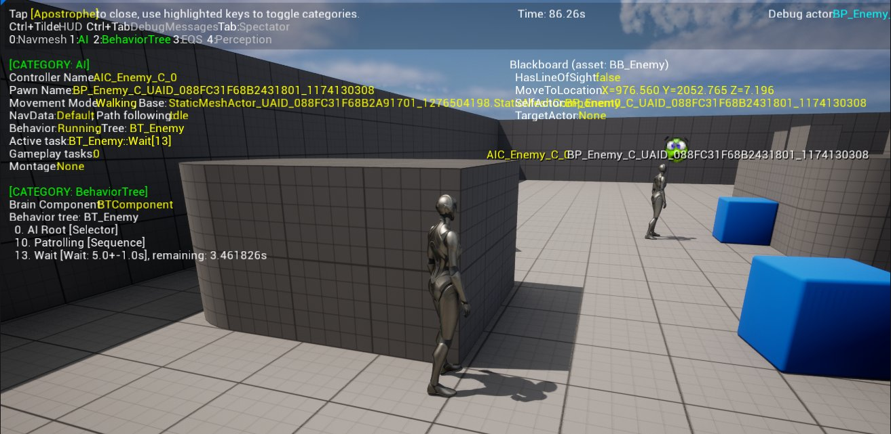
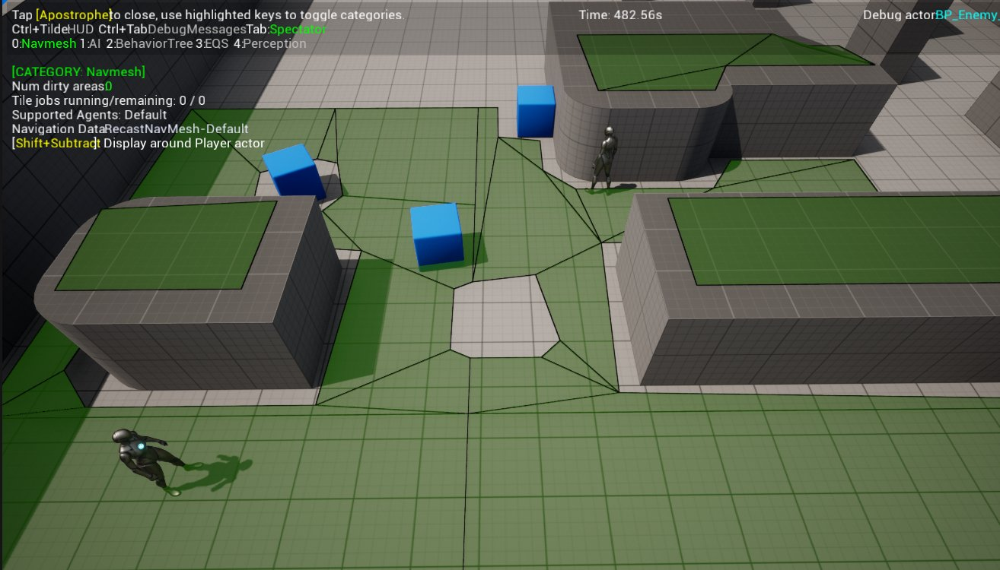
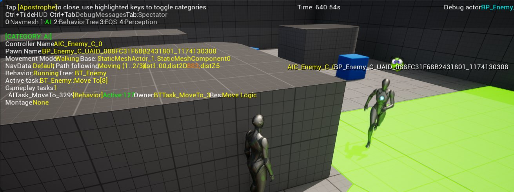
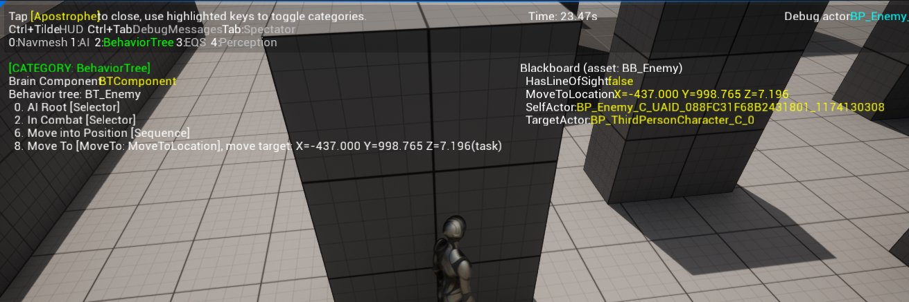
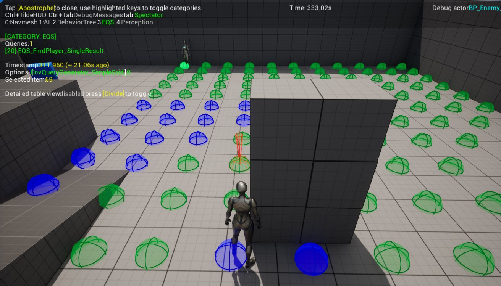
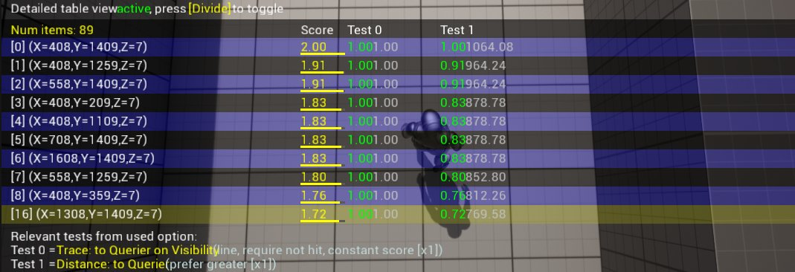
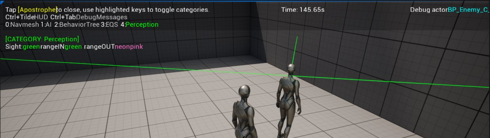
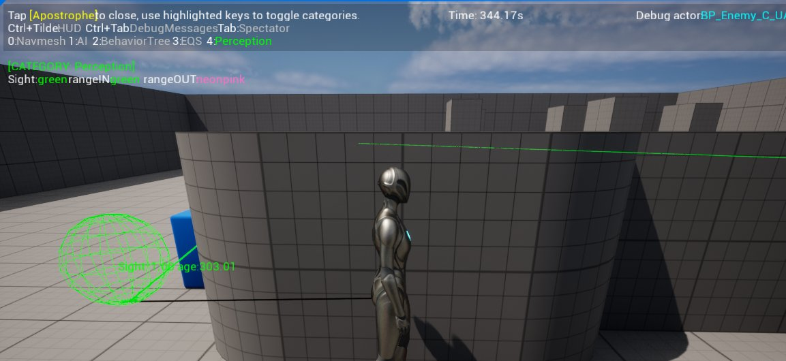

# AI调试

> 路径：虚幻引擎5.7文档 / Gameplay系统 / 人工智能 / AI调试

> 原始页面：https://dev.epicgames.com/documentation/unreal-engine/ai-debugging-in-unreal-engine

SEO-介绍使用AI调试工具调试AI的不同方法。 Version: 5.0 Parent: making-interactive-experiences/artificial-intelligence Type: Overview Engine-Concept: Making Interactive Experiences Skill-Family: Foundation Tags: AI Tags: Behavior Trees Tags: EQS Tags: AI Perception Tags: AI Systems topic-image:enabled-ai-debugging.png social-image:enabled-ai-debugging.png topic-icon: image:enabled-ai-debugging.png Order: 3

创建AI（AI）实体后，你就可以使用AI调试工具进行问题诊断或查看AI在任何特定时刻的行为。启用后，你可以在同一集中位置循环查看[行为树](../behavior-trees/index.md)、[环境查询系统（EQS）](../environment-query-system/index.md)和[AI感知（AI Perception）](../ai-perception/index.md)系统。

> [!NOTE]
> 为充分利用AI调试工具，你需要在运行行为树、或拥有一个AI感知组件的关卡中设置一个具备 **AI控制器** 的 **Pawn**。如果你的AI正在执行一个EQS，其运行时将被反映到AI调试工具中。

## 启用AI调试

在游戏运行时按下 **撇号（'）** 键即可启用AI调试。

AI调试工具被启用后有以下选项可用：

| 命令 | 选项 |
| --- | --- |
| **'（撇号键）** | 关闭AI调试工具。 |
| **数字键（0-4）** | 切换显示中的AI信息： **数字键0**：切换当前可用的寻路网格体（Nav Mesh）数据的显示。 **数字键1**：切换常用AI调试信息的显示。 **数字键2**：切换行为树调试信息的显示。 **数字键3**：切换EQS调试信息的显示。 **数字键4**：切换AI感知调试信息的显示。 |
| **Ctrl + `（波浪号键）** | 切换正在使用的HUD类的显示（如可用）。 |
| **Ctrl + Tab** | 切换显示的调试信息。 |

> [!NOTE]
> 上述数字键及其相关联的调试信息为默认调试器所拥有。可根据实际项目需求，针对每个项目在0-9的范围内对这些值进行动态调整。

## 寻路网格体

启用AI调试工具后，按下数字键0即可切换显示AI当前能够使用 **寻路网格体边界体积（Nav Mesh Bounds Volume）** （如果已放置于关卡中）从现今位置导航到的位置。

你也可以在游戏进程中通过控制台命令 **show Navigation true**（显示寻路网格体）或 **show Navigation false**（隐藏寻路网格体），切换寻路网格体的显示。

## AI

启用AI调试工具后，按下数字键1将显示常用AI调试信息：

AI调试工具中的AI类目会显示AI的常规信息，例如：

| 选项 | 说明 |
| --- | --- |
| **控制器名称（Controller Name）** | 显示所指定的AI控制器类。 |
| **Pawn名称（Pawn Name）** | 显示所指定的Pawn类。 |
| **移动模式（基础）（Movement Mode (Base)）** | 显示当前的移动模式（以及当前正在移动的网格体）。 |
| **导航数据（路径跟随）（Nav Data (Path following)）** | 显示导航类（如果AI正在移动）。 |
| **行为（树）（Behavior (Tree)）** | 显示行为树是否正在运行（以及正在运行的行为树类别）。 |
| **活跃任务（Active task）** | 显示指定的行为树中当前正在tick的任务。 |
| **Gameplay任务（Gameplay tasks）** | 显示队列中的任务数量。Gameplay任务的例子包括 **GameplayAbilitySystem** 任务。 |
| **蒙太奇（Montage）** | 显示当前活跃的动画蒙太奇。 |

除以上选项外，你会在关卡中的Pawn上方看到所指定的AI控制器类和Pawn类（也会在视口的右上角显示）。

## 行为树

启用AI调试工具后，按下数字键2将切换为显示[行为树](../behavior-trees/index.md)信息。

行为树调试信息分为两类：行为树信息（左）和黑板信息（右）。行为树信息会显示正在使用的行为树的类以及当前正在执行树的哪个分支（以及该分支内的节点）。黑板调试信息将显示与任何黑板键一起使用的黑板资源及其当前值（这适用于确定AI根据键的值是否执行操作的原因）。

> [!TIP]
> 在行为树资源中，你还可以添加类似于普通蓝图的 **断点**，从而在到达特定节点时暂停脚本的执行。这有助于你在行为中任何特定时间发生的情况进行诊断。

## EQS

启用AI调试工具后，你可以按下数字键3来显示活跃[环境查询（Environmental Queries）](../environment-query-system/index.md)的相关信息。

> [!NOTE]
> **视觉记录器（Visual Logger）** 会记录并参考EQS数据。请查看链接页面了解更多详细信息。

EQS调试信息将显示当前与所用生成器一起运行的环境查询。在上例中，我们使用一个简单网格来确定最佳位置，这个位置可以为距离敌方AI角色最近的玩家提供视线。在此例中，我们还会看到网格上的点（用球体表示）。

绿色球体是通过了我们测试的位置（玩家有视线），而蓝色球体代表未通过测试的位置（玩家无视线）。每个球体都通过一个数值来权重，我们将权重值最高的球体视为"赢家"，AI会选择移动到该球体位置。

你也可以按/（除）键显示详细的表格明细，其将显示你的测试结果。

在上面的示例图像中，最右边一列中的灰色浮点数是以厘米为单位的距离，绿色浮点数是标准化的值（来自测试中所指定的值）。

> [!NOTE]
> 除使用AI调试工具外，EQS还使用了一种特殊类型的Pawn，提供一种在游戏未运行时对查询进行调试的方法。请查看[EQS测试Pawn（EQS Testing Pawn）](../environment-query-system/environment-query-testing-pawn/index.md)了解更多详细信息。

## 感知

启用AI调试工具后，在运行时按下数字键4将显示[感知系统（Perception System）](../ai-perception/index.md)信息。

上图中的AI角色设置为可视（由角色头部绘制的绿色调试线表示）。在下图中，当AI角色看到玩家（这是视觉的刺激源）时，该位置由绿色球体表示为 **最后已知位置（Last Known Location）**。

在 **感官配置（Senses Config）** 下的 **AI感知（AI Perception）** 组件上定义的所有感官都将显示在调试窗口中。

> 图片已省略：Any Senses that have been defined on the AI Perception Component under Senses Config will be displayed in the debug window

我们在上方调试的是视觉（绿色）和听觉（黄色）感官。

> [!NOTE]
> 你可以使用 **调试颜色（Debug Color）** 属性更改 **AI感知（AI Perception）** 组件上用于感官的调试颜色。
