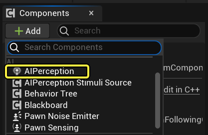
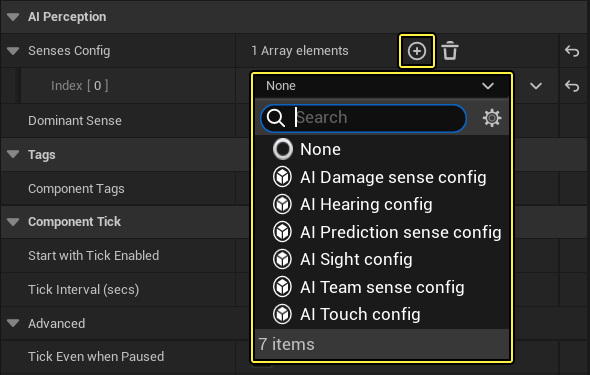
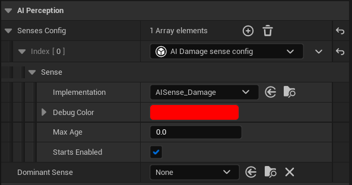
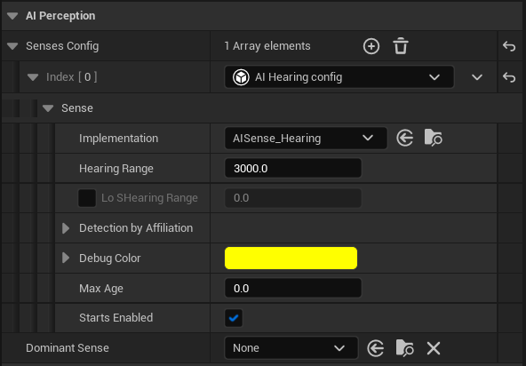
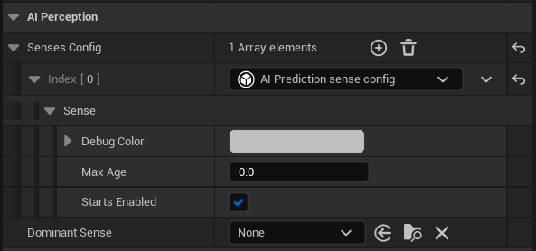
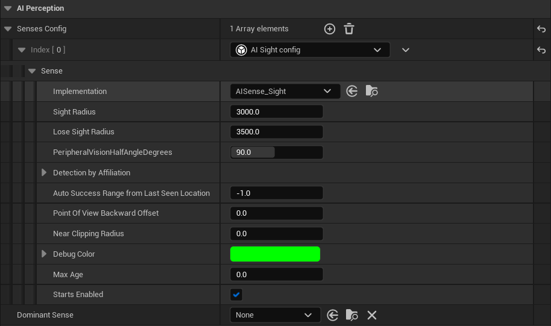
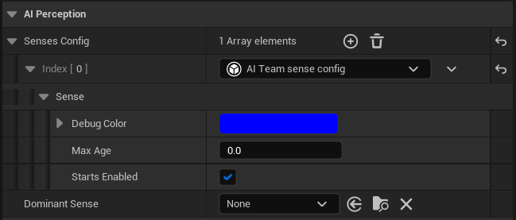
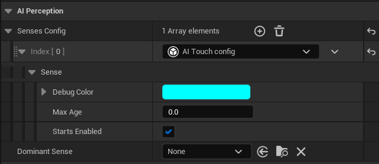

# AI感知

> 路径：虚幻引擎5.7文档 / Gameplay系统 / 人工智能 / AI感知

> 原始页面：https://dev.epicgames.com/documentation/unreal-engine/ai-perception-in-unreal-engine

除可用于决定所执行逻辑的[行为树](../behavior-trees/index.md)，以及用于获取环境信息的[场景查询系统（EQS）](../environment-query-system/index.md)之外，AI框架中可用于为AI提供感官数据的另一个工具是 **AI感知系统（AI Perception System）** 。该系统为Pawn提供了一种从环境中接收数据的方式，例如噪音的来源、AI是否遭到破坏、或AI是否看到了什么。这通过 **AI感知组件（AI Perception Component）** 来完成。该组件相当于刺激监听器，将收集已注册的刺激源。

刺激源被注册后将调用 **On Perception Updated** （或用于目标选择的 **On Target Perception Updated** ）事件，你可以使用该事件来启动新的蓝图脚本和（或）对验证行为树分支的变量进行更新。

## AI感知组件

**AI感知组件** 是一种 **组件**，可以从 **组件（Components）** 窗口添加至Pawn的AI控制器中。它可用于定义要监听的感官、这些感官的参数以及检测到感官时的响应方式。你还可以使用几个不同的函数来获取所感应到内容的信息、所感应到的Actor，甚至禁用或启用某个特定类型的感应。

要添加 **Ai感知组件** ，请单击蓝图中的 **+添加组件（+Add Component）** 按钮，然后选择 **AI感知（AIPerception）** 。

添加 **AI感知组件** 后，即可在 **细节（Details）** 面板中访问其属性。

### AI感知属性

除 **AI感知组件** **细节（Details）** 面板中的常见属性之外，你还可以在 **AI感知（AI Perception）** 和 **感官配置（Senses Config）** 部分添加要感知的 **感官** 类型。根据 **感官** 的类型，可用不同的属性调整 **感官** 的感知方式。

> [!NOTE]
> **主导感官（Dominant Sense）** 属性可用于指定一种 **感官**，确定被感测Actor的位置后，该感官应优先于其他感官。应该将其设为 **感官配置（Senses Config）** 部分中所配置的一种感官，或者设为 **无（None）** 。

#### AI伤害

如果希望AI对伤害事件（如 **Event Any Damage** 、 **Event Point Damage** 或 **Event Radial Damage** ）作出反应，可以使用 **AI伤害感知配置（AI Damage Sense Config）** 。**实现（Implementation）** 属性（默认为引擎类 **AISense_Damage** ）可以用来确定处理伤害事件的方式，但你也可以通过C++代码创建自己的伤害类。

| 属性 | 描述 |
| --- | --- |
| **实现（Implementation）** | 用于这些条目的AI感知类（默认为 **AISense_Damage** ）。 |
| **调试颜色（Debug Color）** | 使用[AI调试](../ai-debugging/index.md)工具时用于绘制调试线的颜色。 |
| **最大时长（Max Age）** | 决定由该感官产生的刺激被遗忘所需的时间（0表示永远不会被遗忘）。 |
| **初始启用（Starts Enabled）** | 决定特定感官是初始即为启用状态，还是必须手动启用/禁用。 |

#### AI听觉

**AI听觉（AI Hearing）** 感官可用于检测由 **报告噪点事件（Report Noise Event）** 产生的声音，例如发射物击中某物发出的声音，该声音可通过AI听觉来注册。

| 属性 | 描述 |
| --- | --- |
| **实现（Implementation）** | 用于此条目的AI感知类（默认为 **AISense_Hearing**）。 |
| **听觉范围（Hearing Range）** | AI感知系统所能感知的听觉距离。 |
| **Lo Shearing范围** | 这用于在调试器中显示 **听觉范围** 的不同半径。 |
| **按归属检测（Detection by Affiliation）** | 确定 **敌方（Enemies）** 、 **中立方（Neutrals）** 或 **友方（Friendlies）** 是否可以触发这种感官。 |
| **调试颜色（Debug Color）** | 使用[AI调试](../ai-debugging/index.md)工具时用于绘制调试线的颜色。 |
| **最大时长（Max Age）** | 决定由该感官产生的刺激被遗忘所需的时间（0表示永远不会被遗忘）。 |
| **初始启用（Starts Enabled）** | 决定特定感官是初始即为启用状态，还是必须手动启用/禁用。 |

#### AI感知

这要求感知系统（Perception System）在PredictionTime秒内向请求者提供PredictedActor的预计位置。

| 属性 | 描述 |
| --- | --- |
| **调试颜色（Debug Color）** | 使用[AI调试](../ai-debugging/index.md)工具时用于绘制的调试线的颜色。 |
| **最大时长（Max Age）** | 决定由该感官产生的刺激被遗忘所需的时间（0表示永远不会被遗忘）。 |
| **初始启用（Starts Enabled）** | 决定特定感官是初始即为启用状态，还是必须手动启用/禁用。 |

#### AI视觉

你可以在 **AI视觉（AI Sight）** 配置中定义参数，而这些参数决定着AI角色在关卡中所能"看见"的事物。当一个Actor进入 **视觉半径** 后，AI感知系统将发出更新信号，并穿过被看到的Actor（举例而言，一个玩家进入该半径，并被具备视觉感知的AI所察觉）。

| 属性 | 描述 |
| --- | --- |
| **实现（Implementation）** | 用于该条目的AI感知类（默认为 **AISense_Sight** ）。 |
| **视觉半径（Sight Radius）** | 该感官可以开始感知的最大距离。 |
| **视觉丢失半径（Lose Sight Radius）** | 视觉感官不能再感知已看见目标的最大距离。 |
| **周边视觉半角度数（Peripheral Vision Half Angle Degrees）** | AI最远可以看到的侧面角度。该值代表相对于前向矢量测量（而非整个范围）的角度。 在运行时，你可以使用蓝图中的 **SetPeripheralVisionAngle** 对该值进行更改。 |
| **按归属检测（Detection by Affiliation）** | 决定 **敌方（Enemies）** 、 **中立方（Neutrals）** 或 **友方（Friendlies）** 是否可以触发这种感官。 该属性可用于设置团队视觉感知。目前，**归属关系（Affiliation）** 只能在C++中定义。对蓝图而言，你可以使用 **检测中立方（Detect Neutrals）** 选项来检测所有Actor，然后使用 **标签（Tags）** 过滤Actor的类型。 |
| **从最后看到位置开始的自动成功范围（Auto Success Range from Last Seen Location）** | 该数值大于零时，只要之前已被看到的目标位于此处指定的范围之内，AI便始终能够看到该目标。 |
| **视角向后偏移（Point of View Backward Offset）** | 用于椎体计算的视角后移距离。结合近剪裁距离，这将用作近距离感知和周边视觉。 |
| **近裁剪半径（Near Clipping Radius）** | 与视角向后偏移结合使用的近裁剪距离。将用作近距离感知和周边视觉。 |
| **调试颜色（Debug Color）** | 使用[AI调试](../ai-debugging/index.md)工具时用于绘制调试线的颜色。 |
| **最大时长（Max Age）** | 决定由该感官产生的刺激被遗忘所需的时间（0表示永远不会被遗忘）。 |
| **初始启用（Starts Enabled）** | 决定特定感官是初始即为启用状态，还是必须手动启用/禁用。 |

#### AI团队

这会通知感知组件的拥有者同团队中有人处在附近（发送该事件的游戏代码也会发送半径距离）。

| 属性 | 描述 |
| --- | --- |
| **调试颜色（Debug Color）** | 使用[AI调试](../ai-debugging/index.md)工具时用于绘制调试线的颜色。 |
| **最大时长（Max Age）** | 决定由该感官产生的刺激被遗忘所需的时间（0表示永远不会被遗忘）。 |
| **初始启用（Starts Enabled）** | 决定特定感官是初始即为启用状态，还是必须手动启用/禁用。 |

#### AI触觉

通过 **AI触觉（AI Touch）** 配置能够检测到AI与物体发生主动碰撞，或是与物体发生被动碰撞。举例而言，在潜入类型的游戏中，你可能希望玩家在不接触敌方AI的情况下偷偷绕过他们。使用此感官可以确定玩家与AI发生接触，并能用不同逻辑做出响应。

| 属性 | 描述 |
| --- | --- |
| **调试颜色（Debug Color）** | 使用[AI调试](../ai-debugging/index.md)工具时用于绘制调试线的颜色。 |
| **最大时长（Max Age）** | 决定该感官产生的刺激被遗忘所需的时间（0表示永远不会被遗忘）。 |
| **初始启动（Starts Enabled）** | 决定特定感官是初始即为启用状态，还是必须手动启用/禁用。 |

### 感知事件

在 **事件（Events）** 部分中，你能够定义AI感知系统收到更新或AI感知组件被激活或停用时将发生的事件。

> 图片已省略：在事件分段中，你能够定义AI感知系统收到更新或AI感知组件被激活或停用时将发生的事件

| 属性 | 描述 |
| --- | --- |
| **感知更新时（On Perception Updated）** | On Perception Updated 当感知系统接收到更新时，将触发此事件并返回发出更新信号的Actor排列。 |
| **目标感知信息更新时（On Target Perception Info Updated）** | [INCLUDE:#otpiu |
| **On Target Perception Updated** | On Target Perception Updated 感知系统接收到更新时将触发此事件并返回发出更新信号的Actor。它还会返回 **AI刺激（AI Stimulus）** 结构体，可将其分解来获得附加信息。 Target Perception Stimulus Event 属性： **时长（Age）**：刺激发生后的时长。 **失效时长（Expiration Age）**：该刺激失效前的时长。 **强度（Strength）**：刺激中定义的强度。 **刺激位置（Stimulus Location）**：该刺激的起源位置。 **接收者位置（Receiver Location）**：该刺激由AI感知系统所注册的位置。 **标签（Tag）**：与该刺激相关联的所有Gameplay标签。 **成功感知（Successfully Sensed）**：该刺激是否被AI感知系统感应（返回True或False）。 |
| **组件激活时（On Component Activated）** | AI感知组件被激活时所触发的事件。 |
| **组件停用时（On Component Deactivated）** | AI感知组件被停用时所触发的事件。 |

### 感知函数调用

以下函数可以通过蓝图调用，进而从感知系统获取信息，或对感知系统产生影响。

| 函数 | 描述 |
| --- | --- |
| **Get Actors Perception** | 获取针对给定Actor的感知，并返回被感知Actor的数据结构。 |
| **Get Currently Perceived Actors** | 返回基于给定感官被感知的全部Actor。如果未指定感官，则返回当前以任意方式感知到的所有Actor。 |
| **Get Known Perceived Actors** | 返回基于给定感官被感知的（且尚未被遗忘）的所有Actor。如果未指定感官，则被感知到的所有Actor均将被返回。 |
| **Get Perceived Hostile Actors** | 返回敌方Actor列表（发出的刺激已被感知且未失效或已成功感知的所有敌方Actor)。本方法可以在蓝图中重写，返回用户所需的任意Actor列表。 |
| **Request Stimuli Listener Update** | 手动强制AI感知系统更新指定目标的刺激监听器的属性。 |
| **Set Sense Enabled** | 启用或禁用指定的 **感官类** 。 只有在针对目标组件实体配置给定感官后，该设置才有效。 |

## 刺激源（Stimuli Source）

**AI感知刺激源（AI Perception Stimuli Source）** 组件为其拥有的Actor提供了一种方法，可以自动将自己注册成为感知系统中指定感官的一个刺激源。举例而言，可设置一个AI角色，其拥有的AI感知组件被设为基于视觉来感知刺激。然后你可以在一个Actor（如物品拾取Actor）中使用刺激源组件，并将其注册为视觉刺激（这将使AI能够"看到"关卡中的Actor）。

添加 **AI感知刺激源** 组件的方法是：单击蓝图中的 **+添加组件（+Add Component）** 按钮，然后选择 **AI感知刺激源（AIPerception Stimuli Source）** 。

> 图片已省略：单击蓝图中的+添加按钮并选择AIPerception刺激源

添加 **AI感知刺激源** 组件后，便可以在 **细节（Details）** 面板中访问其属性。

### 刺激属性

在 **AI感知刺激源** 组件的 **细节（Details）** 面板中，AI感知有以下两个可用选项：

> 图片已省略：在 **AI感知刺激源** 组件的 **细节（Details）** 面板中，AI感知有以下两个可用选项

| 属性 | 描述 |
| --- | --- |
| **自动注册为源（Auto Register as Source）** | 是否针对拥有指定感官的Actor自动注册为刺激。 |
| **注册为感官源（Register as Source for Senses）** | 注册为源的感官排列。单击 **+** 符号添加一个源，然后单击下拉列表并指定所需的感官。 注册为感官源 |

> [!NOTE]
> 你还可以指定基于 **AISense** 类的所有自定义感官。

### 刺激函数调用

以下函数可以通过 **AI感知刺激源** 组件的蓝图调用：

| 函数 | 描述 |
| --- | --- |
| **注册为感官（Register for Sense）** | 将拥有Actor注册为指定感官类的刺激源。 |
| **注册到感知系统（Register with Perception System）** | 将拥有Actor注册为 **注册为感官源（Register as Source for Senses）** 属性中所指定感官的刺激源，并通过 **Register for Sense** 函数调用。 如果启用了自动注册为源（Auto Register as Source）属性，则不需要调用此函数。 |
| **从感知系统中注销（Unregister from Perception System）** | 取消将拥有Actor注册为感知刺激源。 |
| **从感知中注销（Unregister from Sense）** | 取消注册拥有actor特定感官的刺激。 |

## AI感知调试

你可以使用AI调试工具调试AI感知。操作方法是在游戏运行时按下撇号（'）键，然后按数字键4调出感知信息。

> 图片已省略：AI感知调试

> [!NOTE]
> 欲知更多信息，请参见AI调试工具页面和[感知](../ai-debugging/index.md#%E6%84%9F%E7%9F%A5)章节。
