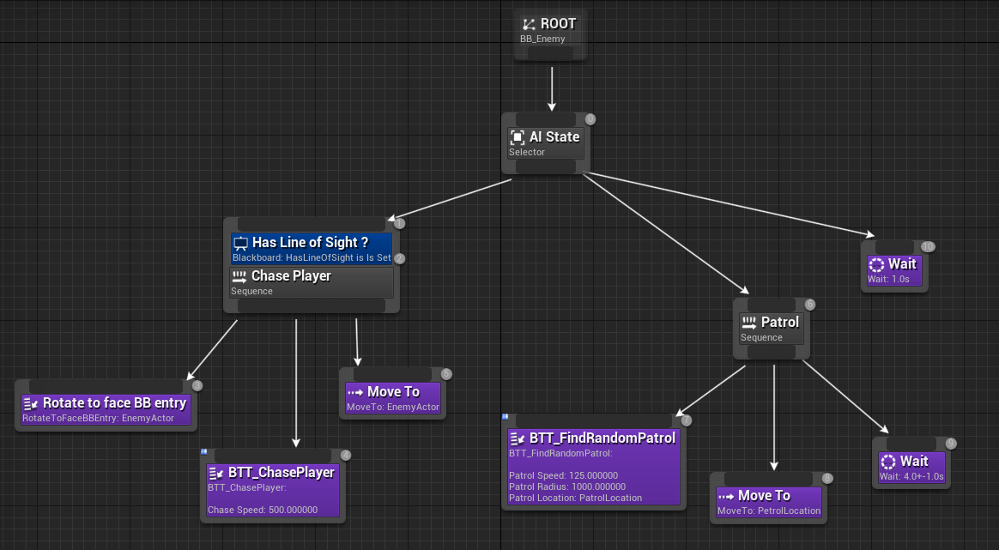
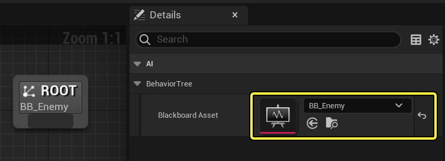
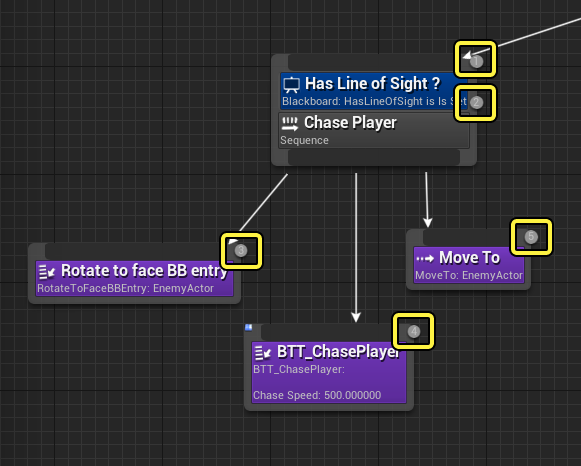
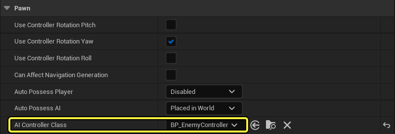
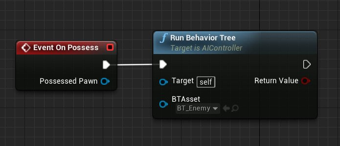
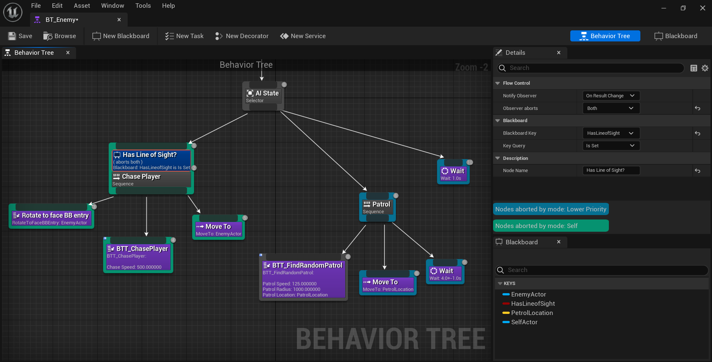
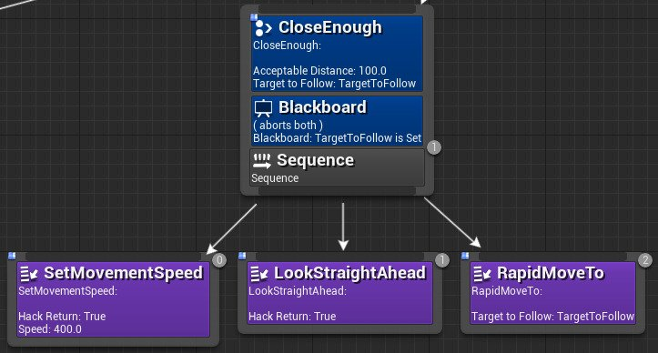
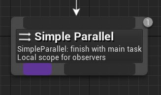

# 行为树概述

> 路径：虚幻引擎5.7文档 / Gameplay系统 / 人工智能 / 行为树 / 行为树概述

> 原始页面：https://dev.epicgames.com/documentation/unreal-engine/behavior-tree-in-unreal-engine---overview

在虚幻引擎4（UE4）中，可以用多种不同的方式为角色创建AI。可以使用 [蓝图可视化脚本](../../../../blueprints-visual-scripting/index.md) 来指示角色"执行某种操作"，例如播放动画、移动到特定位置、被物体击中时做出的反应等等。希望AI角色自行思考并自行做出决定时，**行为树** 便能派上用场！下方展示了一个行为树的例子，该行为树中的AI角色会在巡逻和追逐玩家之间切换。

单击查看大图。

## 行为树基础

行为树与蓝图相似，皆是以一种可视化方式创建，将一系列具备功能的节点添加并连接至行为树图表。执行逻辑时，行为树会使用一种名为 **黑板** 的独立资源来存储它需要知道的信息（名为 **黑板键**），从而做出有根据的决策。常见工作流程是创建一块黑板，添加一些黑板键，然后创建一个使用黑板资源的行为树（如下图所示，黑板被指定到行为树）。

UE4中的行为树按照从左到右，从上到下的顺序执行逻辑。操作的数字顺序显示在图表中所放置节点的右上角。在下图中，位于行为树图表最左侧的分支示例拥有一些节点。如果对设置了黑板键 *HasLineOfSight*，这些节点会指示AI追逐玩家。

上图中的蓝色节点被称为[装饰器](../behavior-tree-node-reference/unreal-engine-behavior-tree-node-reference-decorators/index.md)节点（在其他行为树系统中被称为 *条件语句*）。它连接到一个[合成](../behavior-tree-node-reference/unreal-engine-behavior-tree-node-reference-composites/index.md)节点，用于验证该黑板键是否为true。这决定了该分支的其余部分是否能够执行。紫色节点是[任务（Task）](../behavior-tree-node-reference/unreal-engine-behavior-tree-node-reference-tasks/index.md)节点，是AI可以完成的动作。

> [!NOTE]
> 欲知创建和编辑行为树的更多信息，请参见[行为树用户指南](../behavior-tree-in-unreal-engine---user-guide/index.md)。

创建了行为树和逻辑后，则需要在游戏中运行行为树。通常会有一个[Pawn](https://dev.epicgames.com/documentation/404)（就是AI的"身体"，它可以是一个角色或者其他实体），并且这个Pawn有一个关联的[AI控制器](https://dev.epicgames.com/documentation/404)，用于对Pawn所执行动作进行控制和指导（其中之一便是运行行为树）。在下方，我们已经为Pawn指定了一个自定义AI控制器类。

在我们的AI控制器中，当该控制器"占据"此Pawn时，将运行一个行为树：

为了让Pawn在环境中导航，需要在关卡中添加一个 **寻路网格体包围体** 。

> [!NOTE]
> 欲知使用行为树设置AI的更详细的步骤指南，请参见[行为树快速入门](../behavior-tree-in-unreal-engine---quick-start-guide/index.md)。

## 虚幻引擎中的行为树的差异

本章节概述了虚幻引擎行为树与传统行为树系统的一些差异。

### 行为树由事件驱动

虚幻引擎行为树和其他行为树系统的一个不同点是虚幻引擎行为树由事件驱动，可避免每帧进行不必要的工作。行为树并不会一直检查所有相关的变化是否已发生，而会被动地监听可用于触发树中变化的"事件"。在下图中，一个事件被用于更新黑板键 *HasLineOfSight?*。这使得所有低优先级任务被中止，从而优先执行最左边的高优先级分支。

单击查看大图。

构建由事件驱动的架构可以对性能和调试进行改良。然而，为充分利用这些改良，需要理解虚幻引擎行为树的其它不同之处，并合理构建行为树。因为编码不需要在每个tick通过整个树进行迭代，所以性能更佳。从概念上来说，这就好比我们没有不停地问"我们到了吗？"而是在一直休息，直到有人提醒我们说"我们到了！"

当在行为树的执行历史中前进和后退，对行为进行可视调试时，建议让历史显示相关的变化、不显示不相关的变化。在虚幻引擎事件驱动的实现中，没有必要过滤掉那些在整个树上迭代并且选择和之前相同行为的不相关步骤，因为额外的迭代从一开始就并未发生。事实上，只有树中的执行位置或黑板值的变化才有意义，显示的也正是这些差异。

### 条件语句并非叶节点

在行为树的标准模式中，条件句是任务叶节点，其并不执行成功或失败之外的任何操作。您可以设置传统的条件语句任务，但我们强烈建议使用[装饰器](../behavior-tree-node-reference/unreal-engine-behavior-tree-node-reference-decorators/index.md)节点作为条件语句。

用条件语句装饰器替代任务节点有以下几个明显的优点：

1. 条件语句装饰器使行为树用户界面更直观、更易读。
2. 所有叶节点都是操作任务节点，因此更容易分辨树在指示进行哪些实际操作。

条件语句位于其所控制的子树根部，如果未满足条件语句，便能立即看到树的哪个部分已被"关闭"。此外，所有的叶节点都是操作任务节点，所以更容易分辨有哪些操作。在传统模式下，条件语句会出现在叶节点中，所以分辨哪些叶节点是条件语句、哪些叶节点是动作会消耗大量时间。

在上文的行为树章节中，装饰器 **Close Enough** 和 **黑板** 可以阻止 **序列** 节点子项的执行。条件语句装饰器的另一个优点是可以轻松将装饰器设为树中关键节点上的观察者（等待事件）。要充分利用树事件驱动的特点，此特性十分关键。

### 并发行为

标准行为树通常使用并行合成节点来处理并发行为，该平行节点会同时在其所有子项上开始执行。如果一个或多个子树结束，特殊规则将决定如何操作（取决于所需的行为）。

> [!NOTE]
> 平行节点不一定为多线程（同时执行任务）。从概念来来说，它们只是同时执行几项任务的一种方式。通常它们仍在同一个线程上运行，并以某种顺序开始。该顺序应无关紧要，因为它们都将在同一帧中发生，但有时它仍然很重要。

虚幻引擎行为树没有采用复杂的平行节点，而是采用了 **简单平行** 节点、一种称为[服务](../behavior-tree-node-reference/unreal-engine-behavior-tree-node-reference-services/index.md)节点的特殊节点，以及[装饰器](../behavior-tree-node-reference/unreal-engine-behavior-tree-node-reference-decorators/index.md)节点的 **观察者中止（Observer Aborts）** 属性来完成相同类型的行为。

#### 简单平行节点

简单平行节点只有两个子项：一个必须是单个任务节点（拥有可选的装饰器），另一个可以是完整的子树。可以将简单平行节点理解为"执行A的同时，也在执行B"。例如"攻击敌人，同时也朝敌人移动。"从基本上而言，A是主要任务，B是在等待A完成期间的次要任务或填充任务。

有一些选项可以处理次要任务（任务B）。较之于传统平行节点，该节点在概念上仍相对简单。然而它支持平行节点的大多数常规用法。利用简单平行节点可以轻松使用事件驱动的优化，而完整平行节点的优化则更为复杂。

#### 服务节点

[服务](../behavior-tree-node-reference/unreal-engine-behavior-tree-node-reference-services/index.md)节点是与任意合成节点（选择器节点、序列节点或简单平行节点）相关联的一种特殊节点，它能够针对指定秒数的每个回调进行注册，并能对多种需要周期性出现的类型进行更新。

举例而言，当AI Pawn面对当前敌人、继续在其行为树中正常行动时，可以使用服务节点为该Pawn确定最适合追逐的敌人。

只要执行仍位于服务节点所加入的合成节点的分支树中，服务节点便为活跃状态。

#### 观察者中止

标准平行节点的一个常见用处是不断检查条件。一旦任务所需的条件变成false，该任务就可以中止。

举例而言，有一只猫在执行序列节点（例如"发出嘶声"和"扑击"）。如果老鼠逃入洞里，则需要猫立即放弃。如果使用平行节点，你要设置一个子项检查是否可以扑击老鼠，然后设置另一个子项检查序列要执行的动作。因为虚幻引擎行为树由事件驱动，所以我们要解决此问题。可以通过条件装饰器观察其数值，并且在必要时中止。在本例中，可以在序列上设置"是否可以扑击老鼠？（Mouse Can Be Pounced On?）"装饰器节点，把"观察者中止（Observer Aborts）"设置为"自身（Self）"。

#### 虚幻引擎处理并发行为的优点

以下是虚幻引擎处理并发行为的三个主要优点：

1. **明确**- 使用服务节点和简单平行节点创造的树更简明，易于观察和理解。
2. **调试简单**- 图表更清晰，便于纠错。此外同时执行路径更少，更易于观察正在执行的内容。
3. **更易于优化**- 由事件驱动的图表如果没有同时执行大量子树，将更易于优化。
