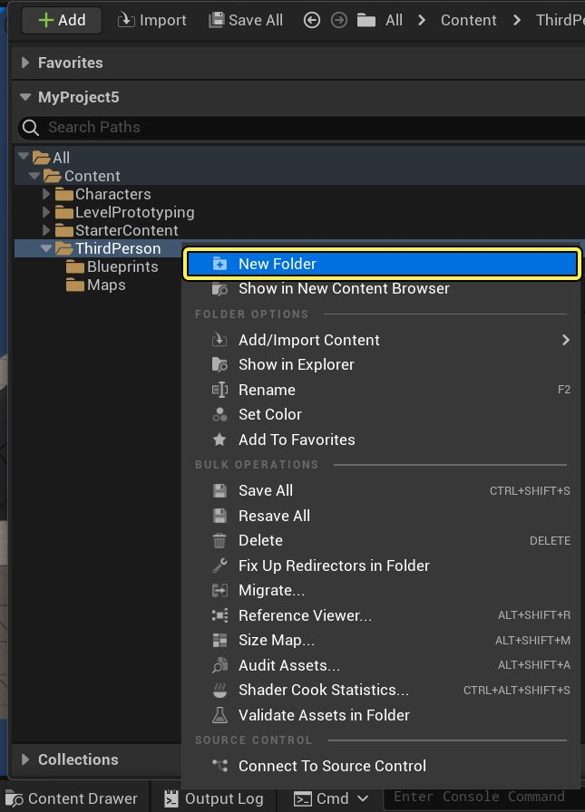
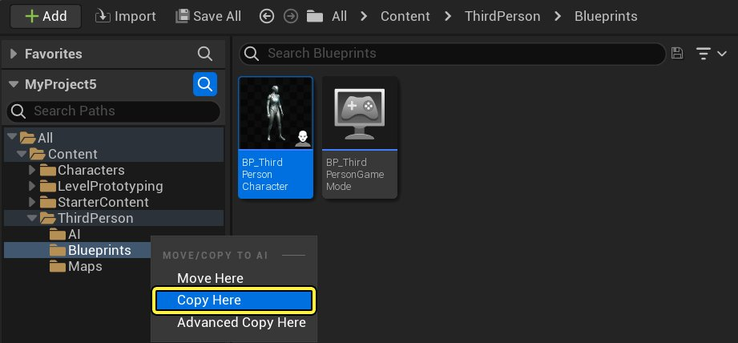
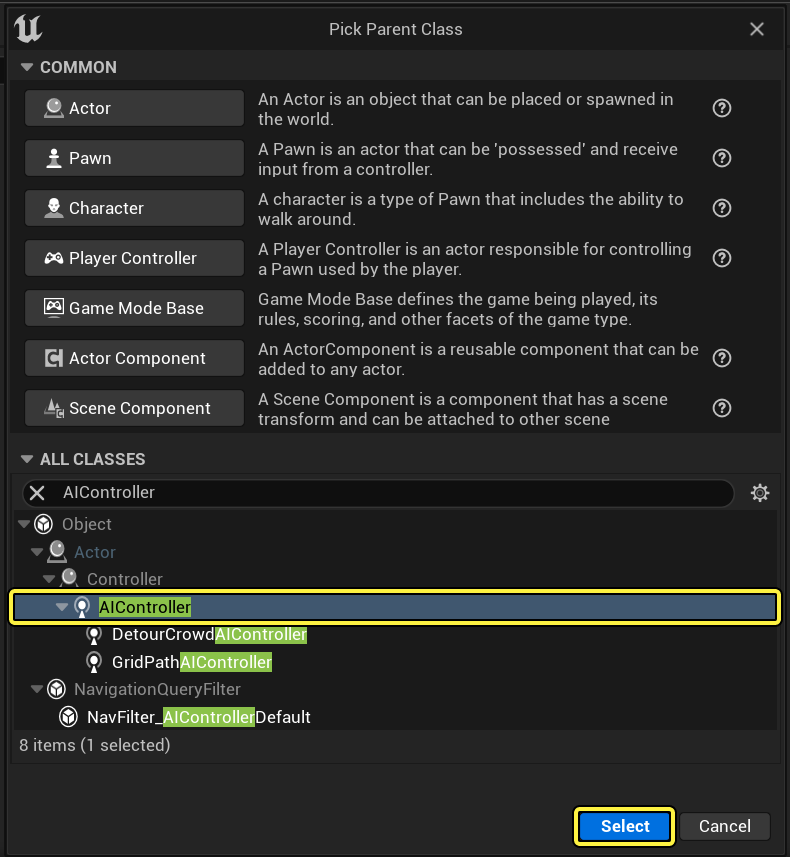
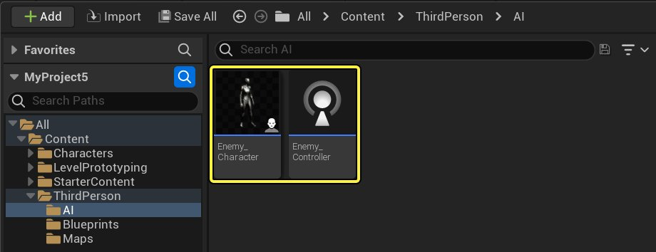
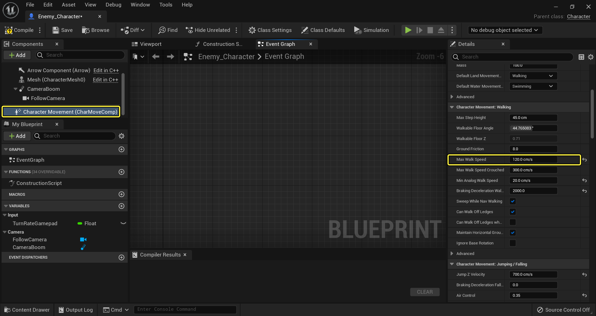
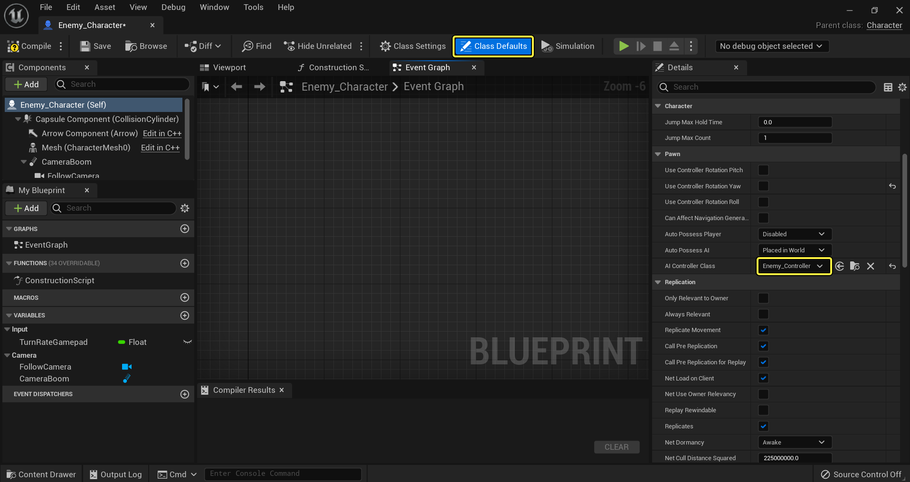
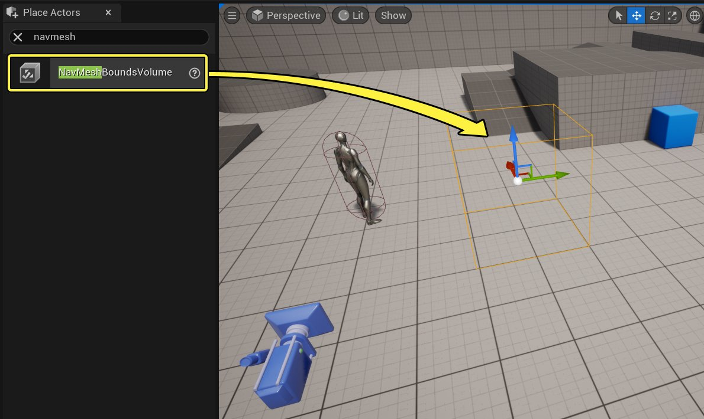
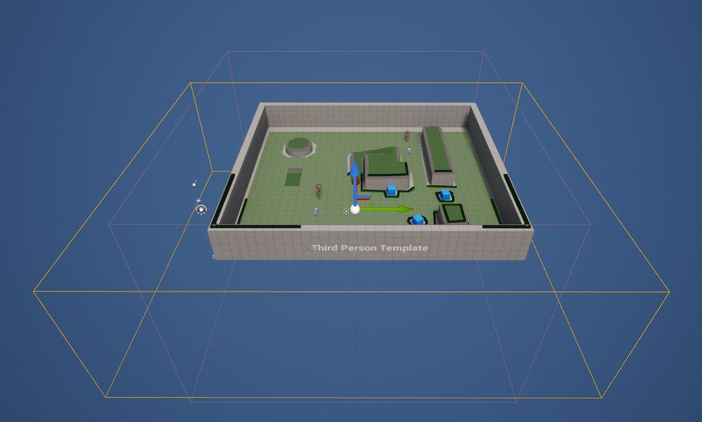

# 行为树快速入门指南

> 路径：虚幻引擎5.7文档 / Gameplay系统 / 人工智能 / 行为树 / 行为树快速入门指南

> 原始页面：https://dev.epicgames.com/documentation/unreal-engine/behavior-tree-in-unreal-engine---quick-start-guide

在 **行为树快速入门指南** 中，你将学会如何创建一个敌方AI，该AI看到玩家后会做出反应并展开追逐。当玩家离开视线后，AI将在几秒钟后（这可根据你的需求进行调整）放弃追逐，并在场景中随机移动，再次看到玩家时便会继续追逐。如下例视频所示。

阅读完本指南后，你将了解以下系统：

1. 蓝图可视化脚本（Blueprint Visual Scripting）
2. AI控制器（AI Controllers）
3. 黑板（Blackboard）
4. 行为树（Behavior Trees）
5. 行为树服务节点（Behavior Tree Services）
6. 行为树装饰器节点（Behavior Tree Decorators）
7. 行为树任务节点（Behavior Tree Tasks）

## 1 - 必需的项目设置

在第一步中，我们将用需要的资产来设置项目，使AI角色在场景中活动。

> [!NOTE]
> 在本指南中，我们使用一个新的 **蓝图第三人称模板** 项目。

1. 展开 **源（Sources）** 面板，然后右键单击 **ThirdPersonBP** 文件夹，创建一个名为 **AI** 的 **新文件夹**。

   
2. 在 **ThirdPersonBP > Blueprints** 文件夹中，将 **ThirdPersonCharacter** 拖到 **AI** 文件夹上，然后选择 **复制到此处（Copy Here）**。

   
3. 在 **AI** 文件夹中，基于 **AIController** 类创建一个新的 **蓝图类**。

   
4. 将 **AIController** 蓝图命名为 **Enemy_Controller**，将 **BP_ThirdPersonCharacter** 蓝图命名为 **Enemy_Character**。

   
5. 打开 **Enemy_Character**，从图表中删除所有脚本。
6. 选择 **角色移动（Character Movement）** 组件，然后在 **细节（Details）** 面板中将 **最大行走速度（Max Walk Speed）** 设置为 **120.0**。

   

   *点击查看大图。*

   当AI角色（AI Character）进行巡逻且并未追逐玩家时，这会降低它们在场景中的移动速度。
7. 从工具栏中选择 **默认类（Class Defaults）**，然后在 **细节（Details）** 面板中，将 **Enemy_Controller** 分配为 **AI控制器类（AI Controller Class）**。

   

   *点击查看大图。*

   我们将会把AI放入场景，如果要在该场景加载后生成AI，则需要把 **自动控制AI（Auto Possess AI）** 设置改为 **已生成（Spawned）**。
8. ****将**Enemy_Character**从**内容浏览器** 拖入关卡。
9. 在 **放置Actor（Place Actors）** 面板中，把 **导航网格体边界体积（Nav Mesh Bounds Volume）** 拖入关卡。

   
10. 选中 **寻路网格体边界体积（Nav Mesh Bounds Volume）** 后，按下 **R** 缩放体积，封装整个关卡。

    

    这将生成寻路网格体，使我们的AI角色能够在场景中移动。你可以按下 **P** 键打开或关闭视口中寻路网格体的显示（绿色区域表示可导航的位置）。

    > [!TIP]
    > 在游戏过程中，你可以使用 **显示导航（show Navigation）** 控制台命令来切换寻路网格体的显示和关闭。

我们的项目设置已经完成，下一步我们将设置 **黑板** 资产。

## 2 - 黑板设置

在这步中我们将创建 **黑板** 资产，它本质上是AI的大脑。我们希望AI知道的任何信息都会有一个能够引用的 **黑板键**。我们将创建用于玩家的键，用于控制AI是否能看到玩家，以及AI不追逐玩家时可以移动到的位置。

1. 在 **内容浏览器** 中，单击 **新增（New New）**，在 **AI（Artificial Intelligence）** 下，选择 **黑板（Blackboard）** 并将其命名为 **BB_Enemy**。

   > 图片已省略：In the Content Drawer click Add and under Artificial Intelligence select Blackboard and call it BB_Enemy
2. 在 **BB_Enemy** 黑板内，单击 **创建新键（New Key）** 按钮并选择 **Object**。

   > 图片已省略：Inside the BB_Enemy Blackboard click the New Key button and select Object

   **黑板** 资产由两个面板组成，**黑板（Blackboard）** 使你能够添加并对 **黑板键**（要监控的变量）进行跟踪，通过 **黑板细节（Blackboard Details）** 能够命名和指定键的类型。
3. 针对 **Object** 键，输入 **EnemyActor** 作为 **条目名称**，输入 **Actor** 作为 **基类**。

   > 图片已省略：For the Object key enter EnemyActor as the Entry Name and Actor as the Base Class
4. 添加另一个 **键**， 将 **键类型** 设置为 **布尔**，并命名为 **HasLineOfSight**。

   > 图片已省略：Add another Key with the Key Type set to Bool called HasLineOfSight

   这将用于记录AI是否能看到玩家。
5. 添加另一个 **键（Key）**， 将 **键类型** 设置为 **向量**，并命名为 **巡逻位置（PatrolLocation）**。

   > 图片已省略：Add another Key with the Key Type set to Vector called PatrolLocation

   这将被用来记录AI不追逐玩家时可以移动到的关卡位置。

在 **黑板** 上设置好需要跟踪的内容后，下一步我们将对我们的 **行为树** 进行布局。

## 3 - 行为树布局

在这一步中，我们将确定 **行为树** 的布局，以及我们希望AI进入的状态。通过在 **行为树** 中布局出AI可能进入的状态，有助于你了解进入这些状态需要创建何种类型的逻辑和规则。

1. 在 **内容浏览器** 中，单击 **新增（Add New）**，在 **AI（Artificial Intelligence）** 下，选择 **行为树（Behavior Tree）** 并将其命名为 **BT_Enemy**。

   > 图片已省略：In the Content Drawer click Add and under Artificial Intelligence select Behavior Tree and call it BT_Enemy

   > [!NOTE]
   > 命名规则可能会有所不同，但是在命名中添加资产类型的首字母缩写通常是一个较好的做法。
2. 打开 **BT_Enemy** ，并将 **BB_Enemy** 指定为 **黑板资产**。

   > 图片已省略：Open the BT_Enemy assign the BB_Enemy as the Blackboard Asset

   > [!NOTE]
   > 如果你没有看到之前创建的 **黑板键**，请单击黄色箭头清除 **黑板资产**，然后重新指定 **Enemy_BB**，将这些键刷新。

   **行为树** 由三个面板组成：可以在 **行为树（Behavior Tree）** 图表面板直观地布局定义行为的分支和节点；可以在 **细节（Details）** 面板定义节点的属性；可以在 **黑板（Blackboard）** 面板看到游戏运行时的 **黑板键** 及其当前值，这对调试非常有用。
3. 在图表中，单击鼠标左键并拖出 **根（Root）** 节点，然后添加一个 **选择器（Selector）** 节点。

   > 图片已省略：In the graph left-click and drag off the Root and add a Selector node

   **合成（Composites）** 节点是流控制的一种形式，决定了与其相连的子分支的执行方式。

   | 合成节点 | 描述 |
   | --- | --- |
   | **选择器（Selector）** | 从左到右执行分支，通常用于在子树之间进行选择。当选择器找到能够成功执行的子树时，将停止在子树之间移动。举例而言，如果AI正在有效地追逐玩家，选择器将停留在那个分支中，直到它的执行结束，然后转到选择器的父合成节点，继续决策流。 |
   | **序列（Sequence）** | 从左到右执行分支，通常用于按顺序执行一系列子项。与选择器节点不同，序列节点会持续执行其子项，直到它遇到失败的节点。举例而言，如果我们有一个序列节点移动到玩家，则会检查他们是否在射程内，然后旋转并攻击。如果检查玩家是否在射程内便已失败，则不会执行旋转和攻击动作 |
   | **简单平行（Simple Parallel）** | 简单平行节点有两个"连接"。第一个是主任务，它只能分配一个任务节点（意味着没有合成节点）。第二个连接（后台分支）是主任务仍在运行时应该执行的活动。简单平行节点可能会在主任务完成后立即结束，或者等待后台分支的结束，具体依属性而定。 |
4. 针对 **选择器** 节点，在**细节（Details）**面板中将 **节点名称（Node Name）** 更改为 **AI Root**。

   > 图片已省略：For the Selector node in the Details panel change the Node Name to AI Root

   重命名图表中的节点是一个很好的方法，可以很容易地从较高层面识别节点所完成的操作。在本例中，我们将其命名为 **AI Root**，因为这是行为树真正的"根"，它将在子分支之间切换。创建行为树时自动添加的默认根节点，可用于配置行为树的属性并指定它所使用的黑板资产。
5. 单击左键并拖出 **AI Root**，添加一个名为 **Chase Player** 的 **序列** 节点。

   > 图片已省略：undefined

   点击查看大图。

   此处使用了序列节点，因为我们打算告诉AI完成一系列动作：旋转朝向玩家，改变移动速度，然后移动并追逐玩家。
6. 单击左键并拖出 **AI Root**，添加一个名为 **Patrol** 的 **序列** 节点。

   > 图片已省略：undefined

   点击查看大图。

   对于AI，我们将使用 **序列** 节点在地图中找到一个随机位置，移动到该位置，然后在该位置等待一段时间，最后再重复该过程来寻找新位置。

   你可能还会注意到节点右上角的数字：

   > 图片已省略：The numbers in the upper-right corner of the nodes

   它表示操作的顺序。**行为树** 会从左到右和自上而下执行，因此节点的排列很重要。对AI最重要的动作通常应该放在左边，而次要的动作（或退却行为）应该放在右边。子分支会以相同的方式执行，如果任何子分支失败，整个分支将会停止执行，导致失败并返回上级树。举例而言，如果 **追逐玩家（Chase Player）** 节点失败，它将返回至上级 **AI根（AI Root）**，然后转变为 **巡逻** 节点。
7. 从 **AI Root** 连出引线，然后在 **巡逻（Patrol）** 右侧添加 **等待（Wait）** 任务节点，并将 **等待时间（Wait Time）** 设置为 **1.0**。

   > 图片已省略：undefined

   点击查看大图。

   你可以看到这个节点是紫色的，表示它是一个 **任务** 节点。任务节点是你希望 **行为树** 执行的具体操作。****如果某种原因使**行为树**让Chase Player或Patrol节点皆运行失败，那么**等待（Wait）** 任务节点将接管事件。。
8. 从 **追逐玩家** 节点连出引线并添加 **旋转至面向黑板条目（Rotate to Face BBEntry）** 节点。

   > 图片已省略：undefined

   点击查看大图。

   这个特殊的 **任务** 节点使你能够指定一个想要旋转并面向的 **黑板条目**，在本例中此条目是 **Enemy Actor**（玩家）。添加该节点后，你会在 **细节（Details）** 面板中看到 **黑板键** 将自动设为 **EnemyActor**，因为它过滤Actor的黑板变量，而且是列表中的第一个变量。如果需要调整成功条件范围并更改 **节点名称（Node Name）**，可对 **精度（Precision）** 选项进行调整。
9. 在 **工具栏** 中，单击 **新建任务（New Task）** 按钮。

   > 图片已省略：From the Toolbar click the New Task button

   除使用内置任务节点外，你还可以创建和指定自己的自定义任务节点，可以为这些节点自定义并定义附加逻辑。该任务节点将用于改变AI的移动速度，以便它追逐玩家。新建任务节点时，将自动创建并打开新的 **蓝图**。

   > 图片已省略：undefined

   点击查看大图。
10. 在 **内容侧滑菜单** 中，将该新资产重命名为 **BTT _ChasePlayer**。

    > 图片已省略：In the Content Browser rename the new asset as BTT _ChasePlayer

    创建 **任务（Tasks）**、**装饰器（Decorators）** 或 **服务（Service）** 节点时，建议立即对这些新建节点进行重命名。正确的命名规则是用创建的资产类型为资产命名添加前缀：**BTT** 代表行为树任务节点，**BTD** 代表行为树装饰器节点，**BTS** 代表行为树服务节点。
11. 在 **BT_Enemy** 中，添加 **BTT_ChasePlayer** 任务，随后添加 **移动至（Move To）**。

    > 图片已省略：undefined

    点击查看大图。

    我们的新任务目前还没有逻辑，但随后将返回来添加改变AI角色移动速度的逻辑，之后AI将移动至（Move To）EnemyActor（玩家）。
12. 创建一个新 **任务节点**，并将其重命名为 **BTT_FindRandomPatrol**，然后将其连接到 **巡逻（Patrol）** 节点。

    > 图片已省略：undefined

    点击查看大图。
13. 添加 **移动至（Move To）** 任务节点，并将 **黑板键** 设为 **巡逻位置（PatrolLocation）**。

    > 图片已省略：undefined

    点击查看大图。

    这将指示AI移动至（Move To）巡逻位置（PatrolLocation），该位置将在BTT_FindRandomPatrol任务中进行设置。
14. 在 **移动至（Move To）** 后添加 **等待（Wait）** 任务节点，设置 **等待时间（Wait Time）** 为 **4.0**、**随机偏差（Random Deviation）** 为 **1.0**。

    > 图片已省略：undefined

    点击查看大图。

    这会指示AI在巡逻位置（PatrolLocation）等待3-5秒（随机偏差将在等待时间上+或-1秒）。

我们已经完成了 **行为树** 的框架。在下一步中，我们将添加AI在巡逻时找到一个随机的导航位置后改变其移动速度的逻辑，以及确定AI应该在什么时候追逐玩家或进行巡逻的逻辑。

## 4 - 任务设置 - 追逐玩家

在这一步中，我们设置了 **追逐玩家任务（Chase Player Task）**，改变AI追逐玩家时的移动速度。

1. 在 **BTT_ChasePlayer** 中点击右键并添加 **Event Receive Execute AI** 节点。

   > 图片已省略：Inside BTT_ChasePlayer right-click and add an Event Receive Execute AI node

   当在 **行为树** 中激活此任务时将触发Event Receive Execute AI节点。

   > [!NOTE]
   > 如果代理是AI控制器，则应该固定选择AI版本的 **Event Receive Execute**、**Event Receive Abort** 和 **Event Receive Tick**。如果泛型和AI事件版本都已实现，则只会调用更合适的版本，这意味着会针对AI调用AI版本，其他情况下会调用泛型版本。
2. **Controlled Pawn** 引脚后连接 **Cast to Enemy_Character** 节点。

   > 图片已省略：Off the Controlled Pawn pin use a Cast to Enemy_Character node

   在此，我们将使用 [Cast](https://dev.epicgames.com/documentation/404) 节点来访问名为 **Enemy_Character** 的AI **角色蓝图**。
3. 在 **内容浏览器中，打开**Enemy_Character**蓝图，并添加一个名为**更新行走速度（Update Walk Speed）**的**函数**。

   > 图片已省略：Inside the Content Drawer open the Enemy_Character Blueprint and add a Function called Update Walk Speed

   该函数将从我们的行为树中调用，并将用于修改AI的移动速度。

   > [!NOTE]
   > 从技术角度而言，我们可以在追逐玩家任务（Chase Player Task）中访问Cast节点之后的 **角色移动（Character Movement）** 组件，并在任务节点中调整移动速度，但让行为树直接改变子对象的属性并不是推荐的最佳做法。相反，我们可以让行为树在角色内部调用一个函数，然后进行所需的修改。
4. 在 **更新行走速度（Update Walk Speed）** 函数的 **细节（Details）** 面板中，添加名为 **新行走速度（NewWalkSpeed）** 的 **浮点** 输入。

   > 图片已省略：In the Details panel for the Update Walk Speed function add a Float input called NewWalkSpeed
5. 将 **角色移动（CharacterMovement）** 组件拖离"组件（Component）"选项卡。

   > 图片已省略：Drag the **CharacterMovement** Component off the Components tab
6. 点击并拖动 **角色移动（CharacterMovement）** 的引脚，在动作菜单中输入 **设置最大行走速度（Set Max Walk Speed）**，然后在菜单中点击 **设置最大步行速度**。

   Click and drag off the pin of Character Movement and from the actions menu type in Set Max Walk Speed then click that function from the menu
7. 使用 **设置最大行走速度（Set Max Walk Speed）**，并按下图连接。

Use Set Max Walk Speed and connect as shown below

从行为树调用这个函数时，我们可以传递一个数值作为新的速度。

1. 回到 **BTT_ChasePlayer** 任务节点内，从 **作为敌人角色（As Enemy Character）** 节点调用 **更新行走速度（Update Walk Speed）** 函数并设置为 **500.0**，然后按下图进行连接。

   > 图片已省略：Back inside the BTT_ChasePlayer Task from the As Enemy Character node call Update Walk Speed set to 500.0 and connect

   > [!NOTE]
   > 看不到已创建的 **更新行走速度（Update Walk Speed）** 函数？你可能需要先 **编译** **Enemy_Character** 蓝图，然后才能将其添加到 **追逐玩家任务（Chase Player Task）** 中。
2. 在 **更新行走速度（Update Walk Speed）** 之后，添加两个 **结束执行（Finish Execute）** 节点，并按下图进行连接。

   > 图片已省略：Following Update Walk Speed, add two Finish Execute nodes and connect

   我们成功将其投射到Enemy_Character后，我们在此将该任务标记为成功结束。如果被控制的Pawn不是Enemy_Character，我们需要处理这种情况，所以我们将任务标记为不成功，将任务中止。
3. 右键单击 **新行走速度（New Walk Speed）** 引脚，然后将其提升为变量，并命名为 **追逐速度（ChaseSpeed）**。

   > 图片已省略：Right-click the New Walk Speed pin then promote it to a variable and call it ChaseSpeed
4. 必须启用 **追逐速度（ChaseSpeed）** 的 **实例可编辑（Instance Editable）**。

   > 图片已省略：For ChaseSpeed make sure to enable Instance Editable

   将 **最大行走速度（Max Walk Speed）** 的数值提升为 **实例可编辑（Instance Editable）** 变量后，我们便可以从蓝图外部对其进行设置，并将该值作为 **行为树** 的内部属性进行调用。

   > 图片已省略：The value of Max Walk Speed can be set from outside of this Blueprint and will be available as a property inside our Behavior Tree

   我们现在可以很轻松地改变被发送至 **Enemy_Character** 蓝图的 **追逐速度（Chase Speed）** 数值，以便调整AI追逐玩家的速度。

我们完成了 **追逐玩家任务（Chase Player Task）**，下一步我们将设置 **寻找随机巡逻任务（Find Random Patrol Task）** 逻辑，让AI获得可前往的随机位置。

## 5 - 任务设置 - 寻找随机巡逻

在这一步中，我们将设置 **寻找随机巡逻任务（Find Random Patrol Task）**，AI没有追逐玩家时就会移动到一个随机位置。

> [!TIP]
> 应用蓝图行为树任务节点是一种快速迭代的明智方法。但是如果需要考虑性能问题，那么你可以决定转移至本地行为树任务节点。

1. 在 **BTT_FindRandomPatrol** 中，使用 **Event Receive Execute AI** 和 **Cast to Enemy_Character**，连接它们。

   > 图片已省略：nside BTT_FindRandomPatrol use Event Receive Execute AI and Cast to Enemy_Character
2. 在 **作为敌人角色（As Enemy Character** 之后调用 **更新行走速度（Update Walk Speed）**，并将 **新行走速度（New Walk Speed）** 提升为一个变量，命名为 **巡逻速度（Patrol Speed）**，设置步骤如下：

> 图片已省略：undefined

点击查看大图。

**- Variable Name** to **PatrolSpeed** **- Instance Editable** to **Enabled** **- Patrol Speed (Default Value)** to **125.0**

我们在此处降低了敌人巡逻时的移动速度。

1. 在 **Controlled Pawn** 之后连出引线，连接**Get Actor Location**，然后设置 **GetRandomReachablePointInRadius**，其 **返回数值** 需连接至一个 **分支**。
2. 使用以下设置将 **GetRandomReachablePointInRadius** 上的 **半径** 提升为变量：

> 图片已省略：undefined

点击查看大图。

**- Variable Name** to **PatrolRadius** **- Instance Editable** to **Enabled** **- Patrol Radius (Default Value)** to **1000.0**

此处我们在敌人角色当前位置的1000个单位内寻找一个随机位置。我们还要使用分支节点，处理无法找到要移动到的随机点这种极端情况。

1. 在 **随机位置（Random Location）** 引脚后连出引线，使用 **设置黑板数值作为向量（Set Blackboard Value as Vector）**，并将 **键（Key）** 提升为名为 **巡逻位置（PatrolLocation）** 的变量。
2. 使用另一个 **设置黑板数值作为向量（Set Blackboard Value as Vector）** 节点，设置该 **数值** 的来源为 **Get Actor Location**。
3. 继续上一步，如下所示连接两个节点，使得 **结束执行（Finish Execute）** 被标记为 **成功（Success）**。

> 图片已省略：undefined

点击查看大图。

如果敌人找到了一个要前往的随机位置，它将作为要前往的位置被存储在黑板中。如果找不到位置，它将使用当前位置，并在尝试新位置之前保持不动。我们还需要对受控Pawn不是Enemy_Character的极端情况进行处理。

1. 从

   Cast

   节点的

   Cast Failed

   引脚连出引线，使用

   结束执行（Finish Execute）

   节点，将

   成功（Success）

   禁用。

> 图片已省略：undefined

点击查看大图。

如果受控Pawn不是Enemy_Character，此任务将被标记为不成功并被中止。

我们已完成 **寻找随机巡逻任务（Find Random Patrol Task）**。在下一步中，我们将学习更多关于 **装饰器节点** 的知识，以及它们如何被用作条件语句、如何设置AI控制器。

## 6 - AI控制器设置

在这一步中，我们将在AI控制器内部进行设置，为最后一步做准备，设置一个 **装饰器节点** 来决定进入 **行为树** 的哪个分支。

1. 在 **内容浏览器** 中打开 **Enemy_Controller** 蓝图，添加一个 **Event On Possess** 节点。
2. 从 **Event On Possess** 连出引线，添加一个 **运行行为树（Run Behavior Tree）** 节点，将其 **BTAsset** 设为 **BT_Enemy**。

   > 图片已省略：Off Event On Possess and add a Run Behavior Tree node with BTAsset set to BT_Enemy

   **运行行为树（Run Behavior Tree）** 节点是以AI控制器类蓝图为目标的情境函数调用，使你能够执行指定的 **行为树** 资产。
3. 在 **组件（Components）** 窗口中单击 **+添加组件（Add Component）**，搜索并添加 **AI感知组件（AIPerception Component）**。

   > 图片已省略：In the Components window click Add Component and search for and add an AIPerception Component

   **AI感知组件（AIPerception Component）** 用于在 **AI感知系统（AI Perception System）** 中创建一个刺激监听器，收集可以响应的已注册刺激（本例中我们可以使用视觉）。这将使我们能够确定AI何时能实际看到玩家，并做出相应的反应。
4. 在 **AI感知组件（AIPerception Component）** 的 **细节（Details）** 面板中，添加 **AI视觉配置（AI Sight config）**，并启用 **检测中立方（Detect Neutral）**。

   > 图片已省略：In the Details panel for the AIPerception Component add an AI Sight config and enable Detect Neutrals

   使用 **按归属检测检测（Detection by Affiliation）** 属性可以建立基于团队的AI，与相同归属的队友并肩作战，攻击敌方成员。默认情况下 **Actor** 不会被指定归属，会被视为中立。

   > [!NOTE]
   > 目前，你还不能通过蓝图分配归属，因此为了检测玩家，我们要启用 **检测中立方（Detect Neutral）** 标签。另外一种方法是使用 **Actor标签（Actor Tagging）** 来确定哪个角色是玩家，并强制AI角色只追逐被标记为玩家的Actor。
5. 在 **AI感知（AIPerception）** 的 **事件（Events）** 部分，点击 **On Target Perception Updated** 旁边的 **+** 符号。

   > 图片已省略：In the Events section for AIPerception click the plus sign next to On Target Perception Updated
6. 在图表中 **On Target Perception Updated** 后连出引线，添加一个 **Actor Has Tag** 节点，将 **Tag** 设为 **玩家**。

   > 图片已省略：Off On Target Perception Updated in the graph and add an Actor Has Tag node with Tag set to Player
7. 从 **刺激（Stimulus）** 引脚，添加 **Break AIStimulus** 节点。
8. 添加 **分支** 节点，将其 **条件（Condition）** 按照下图进行设置。

   > 图片已省略：Add a Branch node with the Condition

   此处我们检查该Actor是否被成功感知，以及该Actor是否拥有玩家标签。

   > [!NOTE]
   > 你可以选择 **Break AIStimulus** 节点，在 **细节（Details）** 面板中，使用 **隐藏未连接的引脚（Hide Unconnected Pins）**，隐藏所有未连接的引脚，使你的图表看起来与上图相似。
9. 从该 **分支** 的 **False** 连出引线，使用 **按事件设置定时器（Set Timer by Event）**，将其 **时间（Time）**设为 **4.0**。
10. 右键单击将 **时间（Time）** 提升为变量，并将其命名为 **Line Of Sight Timer**。

    > 图片已省略：undefined

    *点击查看大图。*

    该变量和指定的数值将决定AI在多长时间后将放弃追逐玩家，并在此时执行附加的事件。
11. 右键单击 **按事件设置定时器（Set Timer by Event）** 的 **返回数值（Return Value）**，将其提升为名为 **敌人计时器（EnemyTimer）** 的变量。

    > 图片已省略：undefined

    *点击查看大图。*

    这通过 **句柄（Handle）** 的方式保存对定时器（Timer）的引用。该句柄可以通过脚本调用，从而使自身无效，并清除任何相关事件（防止相关事件被执行）。我们可以在稍后当AI在Line of Sight Timer耗尽之前再次看到玩家时使用该节点，这可以防止AI让玩家离开视野并放弃追逐。
12. 创建一个 **自定义事件**，并将其命名为 **StartEnemyTimer**，然后将其连接至 **按事件设置定时器（Set Timer by Event）** 的 **事件（Event）**引脚。

    > 图片已省略：undefined

    *点击查看大图。*
13. 单击右键，然后在 **变量 > AI** 下，添加一个 **获取黑板（Get Blackboard）** 节点。

    > 图片已省略：Add a Get Blackboard node under Variables AI
14. 在 **黑板（Blackboard）** 后连出引线，使用 **Set Value as Bool** 和 **Set Value as Object**，并按如下所示进行连接。

    > 图片已省略：Off Blackboard and use Set Value as Bool and Set Value as Object and connect

    这使我们能够更新用新数值定义的 **黑板键**。
15. 右键单击并将两个 **键名（Key Name）** 分别提升为名为 **HasLineOfSight** 和 **EnemyActor** 的 **变量**。
16. **编译** 蓝图，并将两个 **键名（Key Name）** 的 **默认值** 分别设置为 **HasLineOfSight** 和 **EnemyActor**。

    > 图片已省略：undefined

    *点击查看大图。*
17. 断开 **分支** 的 **True**，使用 **Get EnemyTimer**，然后使用 **Clear and Invalidate Timer by Handle**。

    > 图片已省略：undefined

    *点击查看大图。*

    当AI看到玩家时，它将清除Line Of Sight Timer，直到它再次让玩家离开视线（新的Line Of Sight Timer将从这里开始）。
18. 复制并粘贴 **黑板** 节点，如图对 **将数值设置为（Set Value as）** 节点和 **键名（Key Name）** 节点进行设置。

    > 图片已省略：undefined

    *点击查看大图。*
19. 在 **Set Value as Bool** 节点上启用 **Bool Value**，并将 **Actor**引脚拖至 **Object Value**，如图所示。

    > 图片已省略：undefined

    *点击查看大图。*

    这会把 **Has Line Of Sight** 的 **黑板键数值（Blackboard Key Values）** 设为 **True**，并把 **EnemyActor** 设置为被我们感知的 **Actor**（我们已将其设置为只有玩家才能使其触发）。
20. 单击 **编译（Compile）** 进行编译，然后关闭蓝图。

    > 图片已省略：undefined

    *点击查看大图。*

    完成后的图表应与上图相似。

## 7 - 装饰器及最终设置

在最后部分，我们会调整玩家角色和敌人角色蓝图上的一些设置。我们还会在 **行为树** 中设置 **装饰器节点**，它将根据特定条件决定我们可以进入哪个分支。

1. 在 **内容浏览器** 中的 **内容 > 第三人称蓝图 > 蓝图（Content > ThirdPersonBP > Blueprints）**下，打开 **第三人称角色（ThirdPersonCharacter）** 蓝图。
2. 在 **细节（Details）** 面板中，查找并添加 **标签**，并设置为 **玩家**。

   ![ In the Details panel search for and add a Tag set to Playerbtqs-step-6-18.png)

   通过设置添加玩家标签，AI现在可以感知玩家并对其做出反应。
3. 打开 **AI** 文件夹中的 **Enemy_Character** 蓝图。
4. 在 **细节（Details）** 面板中查找 **旋转（Rotation）** 并启用 **使用控制器旋转Yaw（Use Controller Rotation Yaw）**。

   > 图片已省略：n the Details panel, search for Rotation and enable Use Controller Rotation Yaw

   这会使AI在从我们的 **行为树** 调用 **旋转至面向黑板条目（Rotate to face BB entry）** 时进行正确旋转。

   > [!NOTE]
   > 看不到Pawn选项？你可能需要首先单击工具栏中的 **默认类别（Class Defaults）** 按钮。
5. 打开 **BT_Enemy**，右键单击 **追逐玩家（Chase Player）**，然后在 **添加装饰器..（Add Decorator..）** 下选择 **黑板（Blackboard）**。

   > 图片已省略：undefined

   *点击查看大图。*

   当你右键单击 **行为树** 中的节点时，可以添加提供额外函数的子节点：

   | 子节点 | 描述 |
   | --- | --- |
   | **装饰器（Decorator）** | 也称为条件语句。这种节点附着于另一个节点，决定着树中的一个分支，甚至单个节点是否能够被执行。 |
   | **服务（Service）** | 这类节点连接至 **任务（Task）** 节点和 **合成（Composite）** 节点，只要它们的分支正在执行，它们就会以所定义的频率执行。这些节点通常用于检查和更新 **黑板**。它们取代了其他行为树系统中的传统平行（Parallel）节点。 |

   我们将使用 **黑板装饰器（Blackboard Decorator）** 来确定 **黑板键** 的数值，当它有效时，将会允许这个分支的执行。
6. 选择所添加的 **Blackboard Based Condition**，并对 **细节（Details）** 面板进行以下设置。

   > 图片已省略：undefined

   *点击查看大图。*

   - 将

     观察者终止（Observer aborts）

     设为

     两者（Both）**
   - 将

     黑板键（Blackboard Key）

     设为

     HasLineOfSIght
   - 将

     节点名称（Node Name）

     设为

     Has Line of Sight?

   我们在此说明，当 **HasLineOfSight** 的数值为 **已设置（Is Set）** （或为true）时，会执行这个 **追逐玩家（Chase Player）** 分支。**观察者终止（Observer aborts）** 中设置为 **两者（Both）** 意味着当我们分配的 **黑板键** 改变时，中止本身（**追逐玩家**）和任何低优先级的任务。这意味着，当 **HasLineOfSight** 的数值改变且未设置时，其将中止自身（**追逐玩家**），此时将执行下一个分支（**巡逻**）。当 **HasLineOfSight** 数值再次变成 **已设置（Is Set）** 时，观察者将中止优先级较低的任务，并使 **追逐玩家（Chase Player）** 分支能够再次被执行。
7. **编译** 并关闭 **行为树**，然后在编辑器中 **运行**。

### 最终结果

你现在可以对AI进行测试，它看到你的时候便会尾随着你。

当你走出AI的视野后，它仍然会尝试追踪并重新让你进入视线。输入 **Line Of Sight Timer** 数值后，它将放弃追逐，返回巡逻状态。

你可以在运行时观察 **行为树** 的运行情况，看它如何在不同的分支之间切换。当你在进行游戏的时候，也可以在 **行为树** 中观察这些变量，以了解AI当前的数值。

## 8 - 自行设置！

现在你的AI角色将追逐玩家，如果在特定的时间之后没有看到玩家，它会返回巡逻状态，你可以尝试在 **行为树** 中添加以下元素！

- 在

  行为树

  中，向两个

  移动至（Move To）

  任务节点添加新的

  服务

  节点，该服务集成了优先于它的

  任务

  节点的功能。

  - 我们最初的 **行为树** 使用了一个单独的 **任务** 节点调整移动速度（在追逐玩家的情况下）和寻找一个随机的巡逻位置并降低移动速度（在巡逻的情况下）。将这些转换为附加到 **移动至任务（Move To Task）** 的 **服务** 节点。
  - **提示：****服务** 节点中的脚本类似于每个 **任务** 节点中的脚本，但是你最好使用 **Event Receive Activation AI**，而不使用 **Event Receive Execute AI**。因为它们是 **服务** 节点，所以你也不需要 **结束执行（Finish Execute）** 节点。
- 不要使用随机巡逻点来移动。创建一个

  巡逻路径蓝图

  ，其中包含一个数组变量的向量数值，AI可以在这些向量之间移动。

  - 提示：

    循环并获取数组中的下一个条目，从而在各个位置之间移动AI，然后根据数组中的当前条目更新

    黑板键

    的数值

    巡逻位置（PatrolLocation）

    。
- 当玩家走出视线后，将AI移动到玩家最后已知的位置，而不是获取玩家的当前位置。

  - 提示：

    在

    转向和追逐玩家（Turning and Chasing the Player）

    的

    移动至（Move To）

    命令中，你需要指定一个位置，而不是使用

    EnemyActor

    ，因为它当前被设为获取

    EnemyActor

    的位置（它会获取玩家的当前位置）。
- 当AI追上玩家后，为其增加攻击功能。

  - 提示：

    添加一个新的

    合成

    节点作为

    转向和追逐玩家（Turning and Chasing the Player）

    的

    后台任务（Background Task）

    。当AI追上玩家后，为其增加攻击动画的

    任务

    节点。
