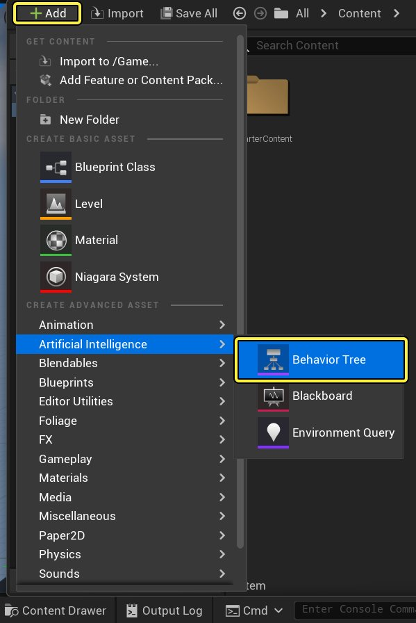
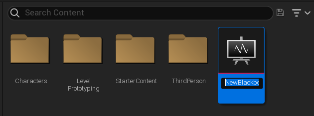
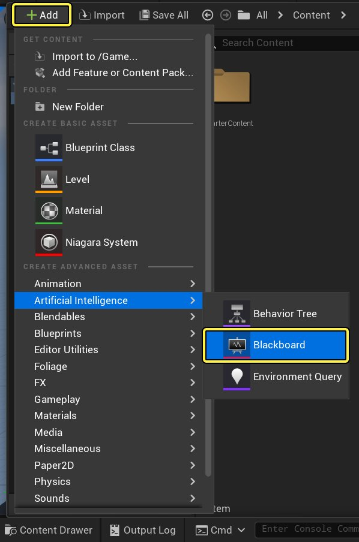
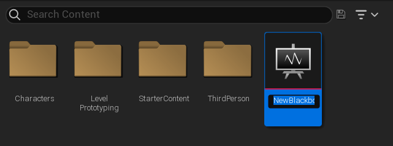
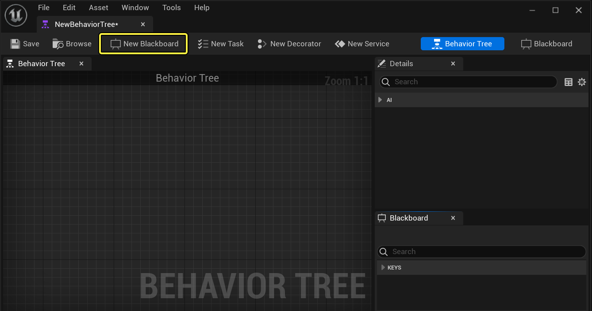
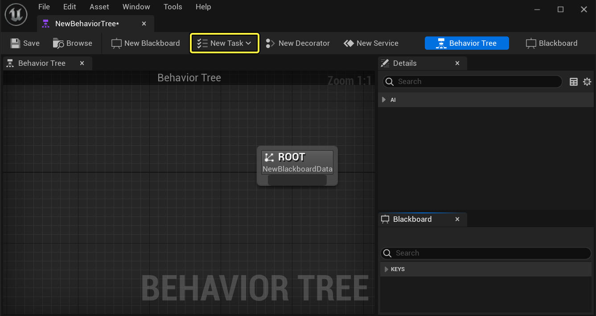
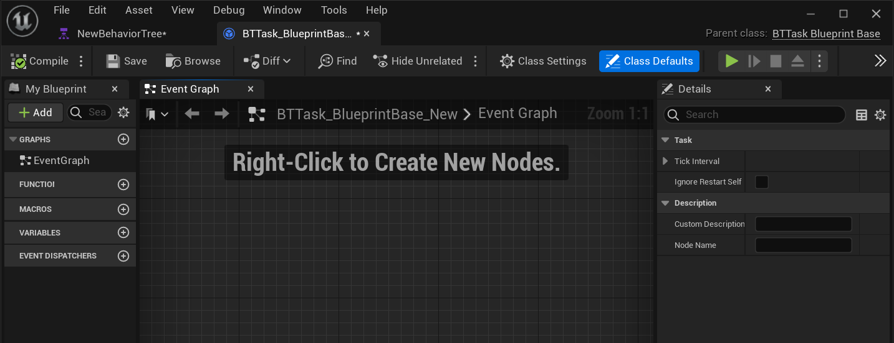
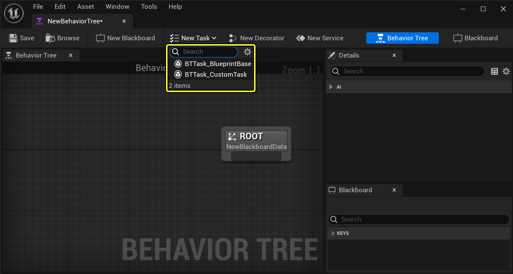

# 行为树用户指南

> 路径：虚幻引擎5.7文档 / Gameplay系统 / 人工智能 / 行为树 / 行为树用户指南

> 原始页面：https://dev.epicgames.com/documentation/unreal-engine/behavior-tree-in-unreal-engine---user-guide

## 创建行为树资源

本章节讲述如何在虚幻引擎5内创建 **行为树** 资源。

### 创建行为树

**行为树** 本质上是AI的处理器，可以根据这些决策的结果做出决策并执行各种分支。可以按照以下方式在 **内容浏览器** 内创建 **行为树**：

点击 **添加（Add New）** 按钮，然后在 **创建高级资源（Create Advanced Asset）** 下选择 **AI（Artificial Intelligence）** 和 **行为树（Behavior Tree）**。

新的 **行为树** 资源将被添加至 **内容侧滑菜单**，可以在其中定义它的名称。

> [!TIP]
> 也可以使用右键单击快捷菜单，然后选择**+添加 > AI > 行为树（+Add > Artificial Intelligence > Behavior Tree）。**

### 创建黑板

可以将 **黑板** 资源视作AI的"大脑"，它会储存 **键** 的值，以便 **行为树** 作出决策。可以使用以下方式创建 **黑板** 资源：

点击 **+添加（+Add）** 按钮，然后在 **创建高级资源（Create Advanced Asset）** 下选择 **AI（Artificial Intelligence）** 和 **黑板（Blackboard）**。

新的 **黑板** 资源将被添加至 **内容浏览器**，可根据需要将其重命名。

创建黑板的另一种方式是在行为树中：

在 **行为树编辑器** 的工具栏中，单击 **新建黑板（New Blackboard ）** 按钮。

此操作将在 **内容浏览器** 中创建一个新的 **黑板** 资源。

### 创建行为树任务

**任务** 节点是你希望AI执行的"动作"，比如移动到一个位置或旋转朝向某个物体。

> [!NOTE]
> 如果需要考虑优化，则可能需要考虑把蓝图行为树任务节点切换为本地行为树任务节点。

除现有可用的 **任务** 节点，还可以用自己的逻辑创建自定义 **任务** 节点：

在 **行为树编辑器** 的工具栏中单击 **新建任务（New Task）** 按钮。

此操作将打开 **BTTask_BlueprintBase** 类的新 **蓝图**，可以在其中提供 **任务** 逻辑。

**任务蓝图** 将被创建在 **内容浏览器** 中，并位于和 **行为树** 资源相同的位置。

> [!TIP]
> 在 **行为树编辑器** 中创建新 **任务** 时，较好的习惯是不使用默认名称，而进入 **内容浏览器** 中进行重命名。

创建新 **任务** 时，在下拉菜单中将其选中便可以使用已存在的 **行为树任务** 作为 **父类** 来继承其功能。

### 创建行为树装饰器

**装饰器** 节点（也被称为条件语句）会连接至 **行为树** 内部的节点，可以用它来决定树中的一个分支（甚至单个节点）是否可以被执行。可以在 **行为树** 中使用几种默认 **装饰器** 节点，也可以创建自定义装饰器。

在 **行为树编辑器** 的工具栏中单击 **新建装饰器（New Decorator）** 按钮。

> 图片已省略：Click the New Decorator button from the Toolbar inside the Behavior Tree Editor

此操作将打开新的 **BTDecorator_BlueprintBase** 类，可以在其中提供 **装饰器** 逻辑。

> 图片已省略：This will open a new BTDecorator_BlueprintBase class where you can provide your Decorator logic

**装饰器蓝图** 将被创建在 **内容浏览器** 中，并位于和 **行为树** 资源相同的位置。

> [!TIP]
> 在 **行为树编辑器** 中创建新 **装饰器** 时，较好的习惯是不使用默认名称，而进入 **内容浏览器** 中进行重命名。

创建新 **装饰器** 时，在下拉菜单中将其选中便可以使用已存在的 **行为树装饰器** 作为 **父类** 来继承其功能。

> 图片已省略：You can use an existing Behavior Tree Decorator as the Parent Class to inherit functionality from by selecting it from the drop-down menu

### 创建行为树服务

**服务** 节点通常连接至 **合成** 节点，只要它们的分支正在执行，它们就会以所定义的频率执行。它们通常被用于检查和更新 **黑板**，代替其它行为树系统中的传统平行节点。虽然默认状态下有一些 **服务** 节点可用，但可能需要创建您自己的自定义 **服务** 节点，以便帮助确定如何执行 **行为树**。

> [!NOTE]
> 如果需要考虑优化，你可能需要考虑把蓝图行为树服务节点切换为本机行为树服务节点。

在 **行为树编辑器** 工具栏内单击 **新建服务（New Service）** 按钮。

> 图片已省略：Click the New Service button from the Toolbar inside the Behavior Tree Editor

此操作将打开新的 **BTService_BlueprintBase** 类，可以在其中提供 **服务** 逻辑。

> 图片已省略：This will open a new BTService_BlueprintBase class where you can provide your Service logic

**服务** **蓝图** 将被创建在 **内容浏览器** 中，并位于和 **行为树** 资源相同的位置。

> [!TIP]
> 在 **行为树编辑器** 中创建新 **服务** 时，较好的习惯是不使用默认名称，而进入 **内容浏览器** 中进行重命名。

创建新 **服务** 时，在下拉菜单中将其选中便可以使用已存在的 **行为树服务** 作为 **父类** 来继承其功能。

> 图片已省略：You can use an existing Behavior Tree Service as the Parent Class to inherit functionality from by selecting it from the drop-down menu

## 编辑黑板

由于 **行为树** 会在其决策过程中引用 **黑板**，通常需要先创建 **黑板**、再创建 **行为树**（在这之后可以随时根据需要添加 **键**）。可以在 **内容浏览器** 中双击该 **黑板** 资源，将其在 **黑板编辑器** 中打开进行编辑。

> 图片已省略：You can edit a Blackboard asset by double-clicking on the asset in the Content Drawer to open it up in the Blackboard Editor

如果正在编辑的 **行为树** 拥有一个已指定的 **黑板**，可以点击窗口右上角的选项卡切换到 **黑板**。

> 图片已省略：You can switch to the Blackboard by clicking the tab in the upper-right corner of the window

在 **黑板细节（Blackboard Details）** 面板中，可以指定一个不同的 **黑板** 作为 **父项**，从其中继承 **键**。

> 图片已省略：In the Blackboard Details panel you can assign a different Blackboard as the Parent, inheriting Keys from it

可以单击 **黑板（Blackboard）** 窗口中的 **新键（New Key）** 按钮来添加 **键**。

> 图片已省略：You can add Keys by clicking the New Key button in the Blackboard window

> [!NOTE]
> 欲知可存储为 **键** 各种变量的详细信息，请参见 **蓝图变量**。

**键** 被创建后，可以在 **黑板细节（Blackboard Details）** 面板中定义与该 **键** 相关的属性。

> 图片已省略：You can define properties associated with the Key in the Blackboard Details panel

| 属性 | 描述 |
| --- | --- |
| **条目名称（Entry Name）** | 用户定义的键名。 |
| **条目说明（Entry Description）** | 用于解释该黑板键作用的可选描述。 |
| **键类型（Key Type）** | 虽然在创建键时已经将其定义，但 **对象** 键和 **类** 键也会提供定义特定 **类** 的更多选项。这样便能在其中存储从对象（例如Actor）继承的任何类型数据。 |
| **实例同步（Instance Synced）** | 用于决定该键是否在该黑板的所有实例间同步。 |

若要 **重命名** 或 **删除** 键，右键单击该 **键** 打开快捷菜单，或在该 **键** 上按下 **F2** 或 **Delete**。

> 图片已省略：To Rename or Delete Key right-click a Key to bring up the context menu

针对 **类** 键和 **对象** 键，可以单击 **键类型（Key Type）** 旁边的小三角形，这样便能定义要使用的基本Actor类。

> 图片已省略：For Class and Object Keys you can click the little triangle beside Key Type

针对 **列举** 键，单击 **键类型（Key Type）** 旁边的小三角形可设置附加属性。

> 图片已省略：For Enum Keys there are additional properties that can be set by clicking the little triangle beside Key Type

| 属性 | 描述 |
| --- | --- |
| **列举类型（Enum Type）** | 要使用的指定列举。 |
| **列举名称（Enum Name）** | 在C++编码中定义的列举名称，它优先于 **列举类型** 下指定的资源。 |
| **列举名称有效（Is Enum Name Valid）** | 设置 **列举名称（Enum Name）** 覆盖何时有效且活跃。 |

## 编辑行为树

如需编辑 **行为树**，请打开 **行为树** 资源。

在 **内容浏览器** 中双击 **行为树** 资源进入 **行为树模式**。

> 图片已省略：Double-click a Behavior Tree asset in the Content Drawer to enter Behavior Tree Mode

或切换至 **行为树模式**：

单击 **行为树编辑器** 右上角的 **行为树（Behavior Tree）** 选项卡。

> 图片已省略：Click the Behavior Tree tab in the upper-right corner of the Behavior Tree Editor

要切换至 **行为树模式**，需要一个当前已打开的 **行为树** 资源，从 **黑板模式** 切换。

### 指定黑板

为使 **行为树** 访问 **黑板**，必须指定 **黑板** 资源。

在图表中选中 **根** 节点（或取消选择所有节点），然后在 **细节（Details）** 面板中设置所需的 **黑板** 资源。

> 图片已省略：In the Details panel set your desired Blackboard Asset

指定 **黑板** 后，该 **黑板** 面板会更新其关联的 **黑板键**。

> 图片已省略：The Blackboard panel will update with its associated Blackboard Keys

### 使用节点

要将 **合成** 节点或 **任务** 节点添加至 **行为树** 图中，请右键单击该图表，打开快捷菜单，然后选择所需的节点。

> 图片已省略：Right-click the graph to bring up the context menu and select your desired node

> [!NOTE]
> 只有 **合成** 节点可以连接至 **行为树** 的 **根** 节点。

你也可以从节点连出引线，然后从快捷菜单选择要添加的节点。

> 图片已省略：You can also drag off a node and select a node to add from the context menu

要从图表中删除节点，请选中该节点（或多个节点）并按下 **Delete** 键（或右键单击并选择 **删除（Delete）**。

> 图片已省略：To remove nodes from the graph select a node or nodes and press Delete or right-click and select Delete

从输出引脚左键单击并拖动到另一个节点上的输入引脚即可把节点连接在一起。

> 图片已省略：To connect nodes together left-click and drag from the output pin, to an input pin on another node

> [!NOTE]
> 只有将输出引脚连接到输入引脚，**行为树** 中的节点才会有效相连（不能从输入引脚连接至输出引脚）。

如需断开节点，请右键单击该节点（或定义一次要选择的多个节点），并选择所需的 **断开所有引脚连接（Break All Pin Link(s)）** 方式。

> 图片已省略：To disconnect nodes right-click a node or define a selection of nodes and select your desired Break Link(s) method

**断开所有引脚连接（Break All Pin Link(s)）** 可用于断开单个连接或多个相连的节点。**断开连接至...（Break link to...)** 将断开与指定节点的链接。

> [!NOTE]
> 也可以按住alt，同时左键单击一个输入或输出引脚来断开连接。

要编辑节点，请选择该节点，然后即可在 **细节** 面板中修改其属性。

> 图片已省略：Select a node and in the Details panel you can adjust its properties

也可以复制并粘贴所选的节点及其设置。要实现该操作，请选择一个节点（或在要选择的多个节点周围拖动选择框），然后按下ctrl+c（进行复制）和ctrl+v（进行粘贴）。

> 图片已省略：To copy or paste a node select a node then press ctrl+c to copy and ctrl+v to paste

### 节点装饰器和服务

可以从节点快捷菜单为 **行为树** 图表中的节点添加 **装饰器** 或 **服务**。

实现该操作的方法是右键单击 **合成** 或 **任务** 节点，然后选择想要添加至该节点的 **装饰器** 或 **服务**。

> 图片已省略：To do this right-click a Composite or Task node then select the Decorator or Service you want to add to the node

要从节点移除 **装饰器** 或 **服务**，请选择 **装饰器** 或 **服务**，然后按下 **Delete** 键，或使用右键点击的快捷菜单。

> 图片已省略：To remove a Decorator or Service from a node select a Decorator or Service then press the Delete key or use the right-click context menu

要编辑连接至节点的 **装饰器** 或 **服务**，首先选择 **装饰器** 或 **服务**，然后即可以在 **细节（Details）** 面板中修改所需的属性。

> 图片已省略：To edit a Decorator or Service attached to the node first select the Decorator or Service then you can adjust your desired properties in the Details panel

可以打开添加至节点的 **合成装饰器** 进行编辑。

要打开合成装饰器，双击 **合成装饰器** 打开返回布尔（true或false）值的图表。

> 图片已省略：undefined

单击查看全图。

任何从工具栏创建的 **任务**、**装饰器** 或 **服务** 都可以在 **蓝图** 中被打开并编辑。

创建 **任务**、**装饰器** 或 **服务** 并将其添加至图表后，即可双击它打开进行编辑。

> 图片已省略：After creating a custom Task Decorator or Service and adding it to your graph double-click it to open it for editing

也可以在 **内容浏览器** 中打开任何自定义的 **任务**、**装饰器** 或 **服务**。

在 **内容浏览器** 中双击自定义的 **任务**、**装饰器** 或 **服务**，在 **蓝图** 中将其打开进行编辑。

> 图片已省略：Double-click a custom Task Decorator or Service in the Content Drawer to open it in Blueprint for editing

也可以复制 **装饰器** 或 **服务**，并将其粘贴到其他节点上。

选择装饰器或服务，然后在另一个节点上按下ctrl+c（进行复制）和ctrl+v（进行粘贴）。

> 图片已省略：Select a Decorator or Service and press ctrl+c to copy and ctrl+v to paste onto another node
