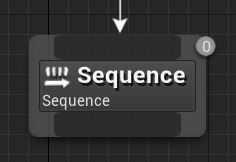
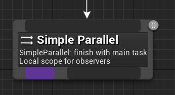

# 行为树节点参考：复合节点

> 路径：虚幻引擎5.7文档 / Gameplay系统 / 人工智能 / 行为树 / 行为树节点参考 / 行为树节点参考：复合节点

> 原始页面：https://dev.epicgames.com/documentation/unreal-engine/unreal-engine-behavior-tree-node-reference-composites

**合成（Composite）** 节点定义分支的根，以及执行该分支的基本规则。您可以对其应用 [装饰器（Decorators）](../unreal-engine-behavior-tree-node-reference-decorators/index.md)节点，从而修改进入它们分支的条目，甚至取消执行中的条目。此外，它们还可以连接[服务（Services）](../unreal-engine-behavior-tree-node-reference-services/index.md)节点，这些服务节点只有在合成节点的子节点正在被执行时才会激活。

> [!NOTE]
> 只有合成节点可以被连接至行为树的根节点。

## 选择器

**选择器（Selector）** 节点按从左到右的顺序执行其子节点。当其中一个子节点执行成功时，选择器节点将停止执行。如果选择器的一个子节点成功运行，则选择器运行成功。如果选择器的所有子节点运行失败，则选择器运行失败。

| 属性 | 描述 |
| --- | --- |
| **应用装饰器范围（Apply Decorator Scope）** | 如果启用此设置，当以下分支完成执行流时，分支中所有装饰器都将被移除（此节点上的装饰器不受影响）。 |
| **节点名称（Node Name）** | 节点在行为树图中显示的名称。 |

## 序列

**序列（Sequence）** 节点按从左到右的顺序执行其子节点。当其中一个子节点失败时，序列节点也将停止执行。如果有子节点失败，那么序列就会失败。如果该序列的所有子节点运行都成功执行，则序列节点成功。

| 属性 | 描述 |
| --- | --- |
| **应用装饰器范围（Apply Decorator Scope）** | 如果启用此设置，当以下分支完成执行流时，分支中的所有装饰器都将被移除（此节点上的装饰器不受影响）。 |
| **节点名称（Node Name）** | 节点在行为树图中显示的名称。 |

## 简单平行节点

**简单平行（Simple Parallel）** 节点允许一个主任务节点沿整个的行为树执行。主任务完成后，**结束模式（Finish Mode）** 中的设置会指示该节点是应该立即结束，同时中止次要树，还是应该推迟结束，直到次要树完成。

| 属性 | 描述 |
| --- | --- |
| **结束模式（Finish Mode）** | **立即（Immediate）**：主任务完成后，后台树的执行将立即中止。 **推迟（Delayed）**：主任务完成后，允许后台树继续执行直至完成。 |
| **节点名称（Node Name）** | 节点在行为树图中显示的名称。 |
