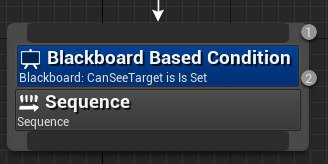
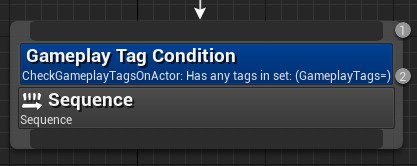
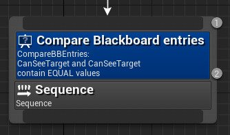
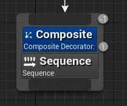
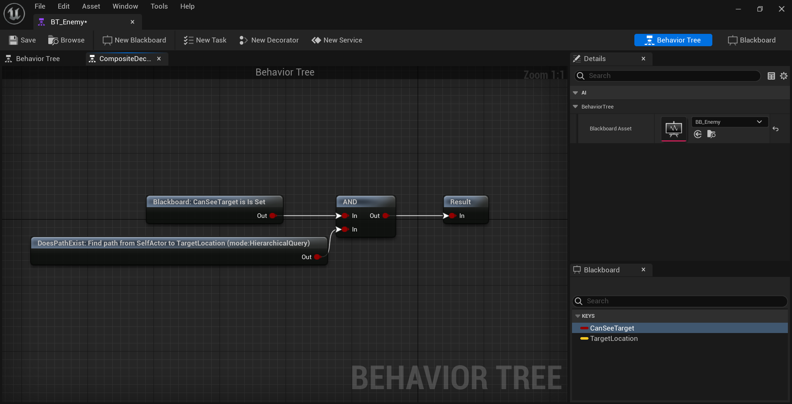
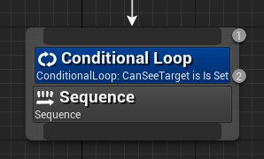
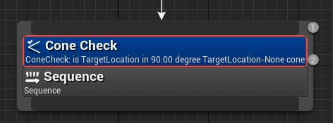
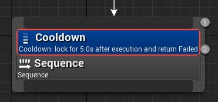

# 行为树节点参考：装饰器节点

> 路径：虚幻引擎5.7文档 / Gameplay系统 / 人工智能 / 行为树 / 行为树节点参考 / 行为树节点参考：装饰器节点

> 原始页面：https://dev.epicgames.com/documentation/unreal-engine/unreal-engine-behavior-tree-node-reference-decorators

**装饰器节点**（在其他行为树系统中也称为条件语句）连接到[合成（Composite）](../unreal-engine-behavior-tree-node-reference-composites/index.md)或[任务（Task）](../unreal-engine-behavior-tree-node-reference-tasks/index.md)节点，并定义树中的分支，甚至单个节点是否可以执行。

## 黑板

**黑板（Blackboard）** 节点将检查给定的 **黑板键（Blackboard Key）** 上是否设置了值。

| 属性 | 描述 |
| --- | --- |
| **通知观察者（Notify Observer）** | **结果改变时（On Result Change）**：仅在条件改变时进行重新计算。 **值改变时（On Value Change）**：仅在观察到的黑板键改变时进行重新计算。 |
| **观察者中止（Observer Aborts）** | **无（None）**：不中止执行。 **自身（Self）**：中止此节点自身和在其下运行的所有子树。 **低优先级（Lower Priority）**：中止此节点右侧的所有节点。 **两者（Both）**：中止此节点自身和在其下运行的所有子树，以及此节点右侧的所有节点。 |
| **黑板键（Blackboard Key）** | 装饰器将运行的黑板键。 |
| **键查询（Key Query）** | **已经设置（Is Set）**：数值是否已设置？ **尚未设置（Is Not Set）**：数值是否尚未设置？ |
| **节点名称（Node Name）** | 节点应该在行为树图表中显示的名称。 |

## 检查Gameplay标签条件

| 属性 | 描述 |
| --- | --- |
| **要检查的Actor（Actor to Check）** | 黑板键，包含了需要检查的Actor的引用。 |
| **要匹配的标签（Tags to Match）** | 装饰器是否应该匹配 **Gameplay标签（Gameplay Tags）** 属性中列出的 **任意（Any）** 或 **所有（Al）** 标签。 |
| **Gameplay标签（Gameplay Tags）** | 加载 **Gameplay标签（Gameplay Tag）** 编辑器，选择应在该装饰器中使用的标签。 |
| **反转条件（Inverse Condition）** | 是否反转此装饰器的结果，其中false变为true、true变为false。 |
| **节点名称（Node Name）** | 节点在行为树图中显示的名称。 |

## 比较黑板条目

**比较黑板条目（Compare BBEntries）** 节点将比较两个 **黑板键** 的值，并根据结果（等于或不等）阻止或允许节点的执行。

| 属性 | 描述 |
| --- | --- |
| **观察者中止（Observer Aborts）** | **无（None）**：不中止执行。 **自身（Self）**：中止此节点自身和在其下运行的所有子树。 **低优先级（Lower Priority）**：中止此节点右侧的所有节点。 **两者（Both）**：中止此节点自身和在其下运行的所有子树，以及此节点右侧的所有节点。 |
| **运算符（Operator）** | **相等（Is Equal To）**：这两个键的值是否相等？ **不等（Is Not Equal To）**：这两个键的值是否不相等？ |
| **黑板键A（Blackboard Key A）** | 该比较中使用的第一个键。 |
| **黑板键B（Blackboard Key B）** | 该比较中使用的第二个键。 |
| **节点名称（Node Name）** | 节点在行为树图表中显示的名称。 |

## 合成

**合成装饰器（Composite Decorator）** 节点使您能够设置比内置节点更高级的逻辑，但复杂程度却不及完整的蓝图。将合成装饰器添加到节点后，双击合成装饰器，调出合成图表。右键单击图表区域即可以将装饰器节点添加为standalone节点，然后通过 **AND** 节点、**OR** 节点和 **NOT** 节点将它们连接在一起，以此创建更高级的逻辑：

单击查看全图。

| 属性 | 描述 |
| --- | --- |
| **合成名称（Composite Name）** | 节点在行为树图表中显示的名称。 |
| **显示操作（Show Operations）** | 此属性会让操作以纯文本形式列出在节点上。 |

> [!NOTE]
> 以这种方式使用合成装饰器将影响内存和性能。也可以在C++中创建一个装饰器来执行同样的自定义行为，但效率更高。

## 条件语句循环

只要满足了 **键查询（Key Query）** 条件，该装饰器将使它所连接节点进行循环。

| 属性 | 描述 |
| --- | --- |
| **黑板键（Blackboard Key）** | 装饰器将运行的黑板键。 |
| **键查询（Key Query）** | **已经设置（Is Set）**：数值是否已设置？ **尚未设置（Is Not Set）**：数值是否尚未设置？ |
| **节点名称（Node Name）** | 节点在行为树图表中显示的名称。 |

## 椎体检查

**椎体检查（Cone Check）** 装饰器采用了三个矢量键：第一个确定椎体的起始位置，第二个用于定义锥体朝向的方向，第三个用于检查该位置是否在锥体内部。您可以使用 **锥体半角（Cone Half Angle）** 属性来定义锥体的角度。

| 属性 | 描述 |
| --- | --- |
| **观察者中止（Observer Aborts）** | **无（None）**：不中止执行。 **自身（Self）**：中止此节点自身和在其下运行的所有子树。 **低优先级（Lower Priority）**：中止此节点右侧的所有节点。 **两者（Both）**：中止此节点自身和在其下运行的所有子树，以及此节点右侧的所有节点。 |
| **Cone Half Angle** | 锥形的半角。例如，对于90度的锥体，该值应设置为45度。 |
| **椎体原点（Cone Origin）** | 锥体的起始位置（锥形尖端）。 |
| **椎体方向（Cone Direction）** | 锥体开口应指向的方向。 |
| **观察对象（Observed）** | 正在检查的位置或Actor是否位于锥体中。 |
| **条件反转（Inverse Condition）** | 是否反转此装饰器的结果，其中false变为true、true变为false。 |
| **节点名称（Node Name）** | 节点在行为树图表中显示的名称。 |

## 冷却

**冷却（Cooldown）** 将锁定节点或分支的执行，直到冷却时间结束。

| 属性 | 描述 |
| --- | --- |
| **观察者中止（Observer Aborts）** | **无（None）**：不中止执行。 **自身（Self）**：中止此节点自身和在其下运行的所有子树。 **低优先级（Lower Priority）**：中止此节点右侧的所有节点。 **两者（Both）**：中止此节点自身和在其下运行的所有子树，以及此节点右侧的所有节点。 |
| **冷却时间（Cool Down time）** | 冷却装饰器应该锁定该节点执行的时间，以秒为单位。 |
| **节点名称（Node Name）** | 节点在行为树图表中显示的名称。 |

## 自定义装饰器

> 图片已省略：Custom Decorator

您可以通过单击 **新建装饰器（New Decorator）** 按钮，用自己的自定义蓝图逻辑和（或）参数创建新的 **装饰器**。

> 图片已省略：You can create new Decorators by clicking the New Decorator button

您的自定义逻辑也将包含以下参数：

| 属性 | 描述 |
| --- | --- |
| **观察者中止（Observer Aborts）** | **无（None）**：不中止执行。 **自身（Self）**：中止此节点自身和在其下运行的所有子树。 **低优先级（Lower Priority）**：中止此节点右侧的所有节点。 **两者（Both）**：中止此节点自身和在其下运行的所有子树，以及此节点右侧的所有节点。 |
| **显示属性细节（Show Property Details）** | 显示节点上属性的细节信息。 |
| **节点名称（Node Name）** | 节点在行为树图表中显示的名称。 |
| **条件反转（Inverse Condition）** | 是否反转此装饰器的结果，其中false变为true、true变为false。 |

## 路径是否存在

> 图片已省略：The Does Path Exist node checks to see if a path can be made from the two vectors

**路径是否存在（Does Path Exist）** 节点会检查是否可以在以下两个矢量之间创建路径：黑板键A（Blackboard Key A）和黑板键B（Blackboard Key B）

| 属性 | 描述 |
| --- | --- |
| **观察者中止（Observer Aborts）** | **无（None）**：不中止执行。 **自身（Self）**：中止此节点自身和在其下运行的所有子树。 **低优先级（Lower Priority）**：中止此节点右侧的所有节点。 **两者（Both）**：中止此节点自身和在其下运行的所有子树，以及此节点右侧的所有节点。 |
| **黑板键A（Blackboard Key A）** | 路径中的第一个位置。 |
| **黑板键B（Blackboard Key B）** | 路径中的第二个位置。 |
| **路径查询类型（Path Query Type）** | **寻路网格体光线投射2D（NavMesh Raycast 2D）**：极快 **分层查询（Hierarchical Query）**：较快 **常规通道搜寻（Regular Path Finding）**：缓慢 |
| **条件反转（Inverse Condition）** | 是否反转此装饰器的结果，其中false变为true、true变为false。 |
| **过滤器类（Filter Class）** | 应该使用哪些导航数据？如果设置为 **无（None）**，将使用默认导航数据。 |
| **节点名称（Node Name）** | 节点在行为树图表中显示的名称。 |

## 强制成功

> 图片已省略：The Force Success Decorator changes the node result to a success

**强制成功（Force Success）** 装饰器会将节点结果更改为成功。

| 属性 | 描述 |
| --- | --- |
| **节点名称（Node Name）** | 节点在行为树图表中显示的名称。 |

## 在位置处（Is At Location）

> 图片已省略：The Is At Location Decorator node checks if the AI controlled Pawn is at the given location

**在位置处（Is At Location）** 装饰器节点将检查AI控制的Pawn是否位于给定位置。

| 属性 | 描述 |
| --- | --- |
| **接受半径（Acceptable Radius）** | 被视为"在位置处"的距离阈值。 |
| **参数化接受半径（Parametrized Acceptable Radius）** | 基于参数的接受半径（Acceptable Radius）（例如 **随机数**）。 |
| **几何距离类型（Geometric Distance Type）** | **基于寻路的测试（Path Finding Based Test）** 被禁用时，该函数让您可以将距离类型设置为3D、2D或Z轴的数值。 |
| **使用寻路代理目标位置（Use Nav Agent Goal Location）** | 如果移动至一个Actor，而该Actor是寻路代理（Nav Agent），那么我们会移动至其的寻路代理目标位置（Nav Agent Goal Location）。 |
| **基于寻路的测试（Path Finding Based Test）** | 如启用，结果将与跟踪路径时完成的测试一致。如禁用，请使用 **距离类型（Distance Type）** 所配置的 **几何距离（Geometric Distance）**。 |
| **条件反转（Inverse Condition）** | 是否反转此装饰器的结果，其中false变为true、true变为false。 |
| **黑板键（Blackboard Key）** | 要测试的黑板键值。 |
| **节点名称（Node Name）** | 用户定义的节点名称。 |

## Is BBEntry Of Class

> 图片已省略：The Is BBEntry Of Class Decorator node is used to determine if the designated Blackboard Key is of a specified Class

**Is BBEntry Of Class** 装饰器节点用于确定所指定的黑板键是否属于指定的类。

| 属性 | 描述 |
| --- | --- |
| **观察者中止（Observer Aborts）** | **无（None）**：不中止执行。 **自身（Self）**：中止此节点自身和在其下运行的所有子树。 **低优先级（Lower Priority）**：中止此节点右侧的所有节点。 **两者（Both）**：中止此节点自身和在其下运行的所有子树，以及此节点右侧的所有节点。 |
| **测试类（Test Class）** | 针对黑板键属性对象的类进行测试的类类型。 |
| **黑板键（Blackboard Key）** | 被测试的黑板键。 |
| **节点名称（Node Name）** | 节点在行为树图表中显示的名称。 |

## 保持于椎体内

> 图片已省略：The Keep in Cone Decorator node that bases its condition on whether the observed position is still inside a cone

**保持于椎体内（Keep in Cone）** 装饰器节点会根据所观察到的位置是否仍位于锥体内部来确定其条件。当节点首次拥有相关性时，将计算锥体的方向。

| 属性 | 描述 |
| --- | --- |
| **观察者中止（Observer Aborts）** | **无（None）**：不中止执行。 **自身（Self）**：中止此节点自身和在其下运行的所有子树。 **低优先级（Lower Priority）**：中止此节点右侧的所有节点。 **两者（Both）**：中止此节点自身和在其下运行的所有子树，以及此节点右侧的所有节点。 |
| **锥体半角（Cone Half Angle）** | 椎体的半角。举例而言，对于90度的锥体，该值应设置为45度。 |
| **椎体原点（Cone Origin）** | 锥体的起始位置（锥形尖端） |
| **观察对象（Observed）** | 需要保持在椎体内部的位置或Actor。 |
| **节点名称（Node Name）** | 节点在行为树图表中显示的名称。 |

## 循环

> 图片已省略：The Loop Decorator loops the node or branch

**循环（Loop）** 装饰器会对节点或分支进行多次循环或无限次循环。

| 属性 | 描述 |
| --- | --- |
| **循环次数（Num Loops）** | 该循环运行的次数。 |
| **无限次循环（Infinite Loop）** | 该循环是否应当无限次运行? |
| **无限次循环超时时间（Infinite Loop Timeout Time）** | 启用 **无限次循环（Infinite Loop）** 的超时时间数值（负值将永远循环）。 |
| **节点名称（Node Name）** | 节点在行为树图表中显示的名称。 |

## 设置标签冷却

> 图片已省略：A Decorator node that bases its condition on whether a cooldown timer from a Gameplay Tag has expired

通过 **设置标签冷却（Set Tag Cooldown）** 可以设置Gameplay标签的冷却时长。

| 属性 | 描述 |
| --- | --- |
| **标签冷却（Tag Cooldown）** | 用于冷却的Gameplay标签。 |
| **冷却时长（Cooldown Duration）** | 冷却的时长，以秒为单位。 |
| **加至现有时长（Add to Existing Duration）** | 如果给定的Gameplay标签上已有冷却时间，是否应增加更多？ |
| **节点名称（Node Name）** | 节点应该在行为树图中显示的名称。 |

## 标签冷却

> 图片已省略：The Time Limit Decorator will give a branch or node a set amount of time

一个装饰器节点，其条件基于Gameplay标签的冷却计时器是否过期。

| 属性 | 描述 |
| --- | --- |
| **观察者中止（Observer Aborts）** | **无（None）**：不中止执行。 **自身（Self）**：中止此节点自身和在其下运行的所有子树。 **低优先级（Lower Priority）**：中止此节点右侧的所有节点。 **两者（Both）**：中止此节点自身和在其下运行的所有子树，以及此节点右侧的所有节点。 |
| **标签冷却（Tag Cooldown）** | 用于冷却的Gameplay标签。 |
| **冷却时长（Cooldown Duration）** | 冷却的时长，以秒为单位。 |
| **加至现有时长（Add to Existing Duration）** | 如果给定的Gameplay标签上已有冷却时间，是否应增加更多？ |
| **在停用时添加/设置冷却时长（Adds/Sets Cooldown on Deactivation）** | 当装饰器停用后，是否添加/设置冷却标签的值。 |
| **节点名称（Node Name）** | 节点在行为树图表中显示的名称。 |

## 时间限制

**时间限制（Time Limit）** 装饰器会为一个分支或节点设置在终止其运行并失败前，完成运行所需的一段时间。每当该节点被聚焦时，计时器都会重置。

| 属性 | 描述 |
| --- | --- |
| **观察者中止（Observer Aborts）** | **无（None）**：不中止执行。 **自身（Self）**：中止此节点自身和在其下运行的所有子树。 **低优先级（Lower Priority）**：中止此节点右侧的所有节点。 **两者（Both）**：中止此节点自身和在其下运行的所有子树，以及此节点右侧的所有节点。 |
| **时间限制（Time Limit）** | 节点运行失败前的时间限制，以秒为单位。 |
| **节点名称（Node Name）** | 节点在行为树图表中显示的名称。 |
