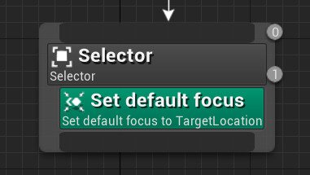
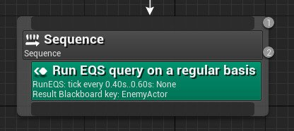
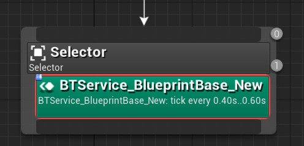

# 行为树节点参考：服务节点

> 路径：虚幻引擎5.7文档 / Gameplay系统 / 人工智能 / 行为树 / 行为树节点参考 / 行为树节点参考：服务节点

> 原始页面：https://dev.epicgames.com/documentation/unreal-engine/unreal-engine-behavior-tree-node-reference-services

**服务（Service）** 节点通常连接至[合成（Composite）](../unreal-engine-behavior-tree-node-reference-composites/index.md)节点或[任务（Task）](../unreal-engine-behavior-tree-node-reference-tasks/index.md)节点，只要其分支被执行，它们就会以定义的频率执行。这些节点常用于检查和更新黑板。它们取代了其他行为树系统中的传统平行（Parallel）节点。

## 默认聚焦

**默认聚焦(Default Focus）** 通过设置控制器的聚焦来创建访问 **蓝图** 和代码中Actor的快捷方式。将AI控制器的聚焦设置到Actor上后，你便能直接从AI控制器对其进行访问，而不需要访问黑板键。

| 属性 | 描述 |
| --- | --- |
| **黑板键（Blackboard Key）** | 此属性接受Actor键（基类设置为Actor的对象键），以便AI控制器使用 `GetFocusActor` 对其进行快速引用。 |
| **节点名称（Node Name）** | 节点在行为树图表中显示的名称。 |

## 运行EQS

**运行EQS（Run EQS）** 服务节点可用于以指定的时间间隔定期执行[场景查询系统（EQS）](../../../environment-query-system/index.md)模板，并可对指定的黑板键进行更新。

| 属性 | 描述 |
| --- | --- |
| **查询模板（Query Template）** | 要运行的EQS资源。 |
| **查询配置（Query Config）** | 要包含在查询中的附加参数的可选数组。 |
| **EQS查询黑板键（EQSQuery Blackboard Key）** | 选择使用保存EQS查询模板的黑板键，而不使用特定的EQS查询模板。 |
| **运行模式（Run Mode）** | **选出最佳项目（Single Best Item）**：选择得分最高的第一个项目。 **从前5%中随机选择项目（Single Random Item from Best 5%）**：从得分在总分`95%`至`100%`的项目中随机选择。 **从前25%中随机选择项目（Single Random Item from Best 25%）**：从得分在总分`75%`至`100%`的项目中随机选择。 **所有匹配（All Matching）**：获取所有符合条件的项目。 |
| **失败时更新黑板（Update BBOn Fail）** | EQS查询失败时更新黑板。 |
| **黑板键（Blackboard Key）** | 服务节点写入结果的黑板键，可以是一个FVector或Actor。 |
| **时间间隔（Interval）** | 定义服务节点后续tick之间的时间间隔。 |
| **随机偏差（Random Deviation）** | 将一个随机范围数值添加至服务节点的 **时间间隔（Interval）** 值。 |
| **搜索开始时调用Tick（Call Tick on Search Start）** | 当任务搜索进入此节点时，调用Tick事件（也会调用 **搜索开始（Search Start）**）。 |
| **每次激活时重启计时器（Restart Timer on Each Activation)** | 设置此项后，当节点激活时，下一个Tick的时间将始终被重置为服务节点的 **时间间隔（Interval）** 值。 |
| **节点名称（Node Name）** | 节点在行为树图表中显示的名称。 |

## 自定义服务节点

你可以通过单击包含蓝图逻辑和（或）参数的工具栏中的 **新建服务（New Service）** 按钮来创建 **服务节点**。

> [!NOTE]
> 蓝图服务节点的性能不如C++服务节点。如果你有优化的顾虑，可能需要使用原生服务节点。

创建服务节点时，下列属性同样可用。

| 属性 | 描述 |
| --- | --- |
| **显示属性细节（Show Property Details）** | 启用后显示属性的细节信息。 |
| **显示事件细节（Show Property Details）** | 启用后显示应用事件的细节信息。 |
| **节点名称（Node Name）** | 节点在行为树图表中显示的名称。 |
| **时间间隔（Interval）** | 定义服务节点后续tick之间的时间间隔。 |
| **随机偏差（Random Deviation）** | 将一个随机范围数值添加至服务节点的 **时间间隔（Interval）** 值。 |
| **搜索开始时调用Tick（Call Tick on Search Start）** | 当任务搜索进入此节点时，调用Tick事件（也会调用 **搜索开始（Search Start）**）。 |
| **每次激活时重启计时器（Restart Timer on Each Activation)** | 设置此项后，当节点激活时，下一个Tick的时间将始终被重置为服务节点的 时间间隔（Interval） 值。 |
