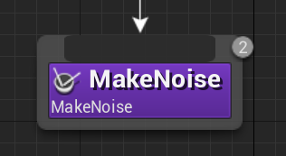
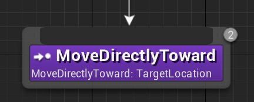
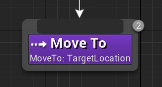
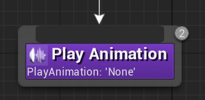
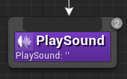
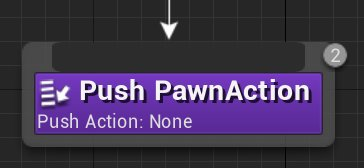
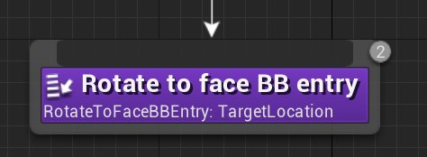

# 行为树节点参考：任务节点

> 路径：虚幻引擎5.7文档 / Gameplay系统 / 人工智能 / 行为树 / 行为树节点参考 / 行为树节点参考：任务节点

> 原始页面：https://dev.epicgames.com/documentation/unreal-engine/unreal-engine-behavior-tree-node-reference-tasks

本页面为行为树编辑器中可用的 **任务（Task）** 节点的参考页面。任务节点的功能是实现操作，例如移动AI或调整黑板值。它们可以连接至 [装饰器（Decorators）](../unreal-engine-behavior-tree-node-reference-decorators/index.md)节点 或 [服务（Services）](../unreal-engine-behavior-tree-node-reference-services/index.md)节点。

## 以结果完成（Finish With Result）

**以结果完成（Finish With Result）** 任务节点可用于在完成时即时输出一个给定结果。该节点会基于所定义的结果强制分支结束或继续。

| 属性 | 描述 |
| --- | --- |
| **结果（Result）** | **已成功（Succeeded）**：成功结束运行。 **失败（Failed）**：运行失败。 **中止（Aborted）**：结束运行并中止。 **过程中（In Progress）**：在进程中结束运行。 |
| **无视重启自身（Ignore Restart Self）** | 启用后，当选择执行的任务已在运行时，任务搜索将被放弃。 |
| **节点名称（Node Name）** | 节点在行为树图表中显示的名称。 |

## 发出噪音

如果受控Pawn拥有 **PawnNoiseEmitter** 组件，**发出噪音（Make Noise）** 任务将使Pawn"产生噪声"（发送消息），使其它拥有 **PawnSensing** 组件的Pawn听到（接收消息）。

| 属性 | 描述 |
| --- | --- |
| **响度（Loudness）** | 产生的音量大小。 |
| **无视重启自身（Ignore Restart Self）** | 启用后，当选择执行的任务已在运行时，任务搜索将被放弃。 |
| **节点名称（Node Name）** | 节点在行为树图表中显示的名称。 |

## 直接移动至

**直接移动至（Move Directly Toward）** 任务节点会将AI Pawn沿直线移向指定的Actor或位置（矢量）黑板条目，而不参考任何导航系统。如果需要AI按导航移动，请改用 **移动至（Move To）** 任务节点。

| 属性 | 描述 |
| --- | --- |
| **可接受半径（Acceptable Radius）** | 任务节点成功运行时Pawn与目标之间所需的距离。 |
| **过滤器类（Filter Class）** | 应该使用哪些导航数据？如设为 **无（None）**，将使用默认导航数据。 |
| **允许扫射（Allow Strafe）** | 是否允许AI在向目的地移动时进行扫射。 |
| **到达测试包括代理半径（Reach Test Includes Agent Radius）** | 启用后，AI胶囊体的半径将被添加至AI和目标位置之间的阈值。 |
| ****到达测试包括目标半径（Reach Test Includes Goal Radius）**** | 启用后，目标处胶囊体的半径将被添加至AI和目标位置之间的阈值。 |
| **允许不完整路径（Allow Partial Path）** | 启用后，将允许AI在无法移动至目标位置时使用不完整的路径。 |
| **跟踪移动目标（Track Moving Goal）** | 启用后，当Actor移动时，目标Actor的路径将自动更新。 |
| **投射目标位置（Project Goal Location）** | 启用后，目标位置将在使用前被投射至寻路网格体上。 |
| **观察黑板值（Observe Blackboard Value）** | 如果黑板中的移动目标发生变化，移动目标将设置为新的地点。 |
| **黑板键（Blackboard Key）** | 用于检查的键。这对可以返回 `无（None）` 的数据类型（如Object）最为有用，因为其它类型的数据可能会返回它们的初始值（例如：0、false、{0,0,0}）。 |
| **无视重启自身（Ignore Restart Self）** | 启用后，选择执行的任务已在运行时任务搜索将被放弃。 |
| **节点名称（Node Name）** | 节点在行为树图表中显示的名称。 |

## 移动至

**移动至（Move To）**任务将使拥有角色移动组件的Pawn使用寻路网格体移动至矢量黑板键。

| 属性 | 描述 |
| --- | --- |
| **可接受半径（Acceptable Radius）** | 任务节点成功运行时Pawn与目标之间所需的距离。 |
| **过滤器类（Filter Class）** | 应该使用哪些导航数据？如设为 **无（None）**，将使用默认导航数据。 |
| **允许扫射（Allow Strafe）** | 是否允许AI在向目的地移动时进行扫射。 |
| **到达测试包括代理半径（Reach Test Includes Agent Radius）** | 启用后，AI胶囊体的半径将被添加至AI和目标位置之间的阈值。 |
| **到达测试包括目标半径（Reach Test Includes Goal Radius）** | 启用后，目标处胶囊体的半径将被添加至AI和目标位置之间的阈值。 |
| **允许不完整路径（Allow Partial Path）** | 启用后，将允许AI在无法移动至目标位置时使用不完整的路径。 |
| **跟踪移动目标（Track Moving Goal）** | 启用后，当Actor移动时，目标Actor的路径将自动更新。 |
| **投射目标位置（Project Goal Location）** | 启用后，目标位置将在使用前被投射至寻路网格体上。 |
| **观察黑板值（Observe Blackboard Value）** | 如果黑板中的移动目标发生变化，移动目标将设置为新的地点。 |
| **黑板键（Blackboard Key）** | 用于检查的键。``这对可以返回 `无（None）` 的数据类型（如Object）最为有用，因为其它类型的数据可能会返回它们的初始值（例如：0、false、{0,0,0}）。 |
| **无视重启自身（Ignore Restart Self）** | 启用后，选择执行的任务已在运行时任务搜索将被放弃。 |
| **节点名称（Node Name）** | 节点在行为树图表中显示的名称。 |

## 播放动画

**播放动画（Play Animation）** 节点可用于播放指定的动画资源。

> [!NOTE]
> 所选的动画必须与行为树控制的Pawn骨架相匹配。

| 属性 | 描述 |
| --- | --- |
| **要播放的动画（Animation to Play）** | 要播放的动画资源。 |
| **循环（Looping）** | 启用后，该动画将持续循环播放。 |
| **Non Blocking** | 启用后，任务（Task）节点会触发该动画，并立即结束。 |
| **无视重启自身（Ignore Restart Self）** | 启用后，选择执行的任务已在运行时任务搜索将被放弃。 |
| **节点名称（Node Name）** | 节点在行为树图表中显示的名称。 |

## 播放音效

**播放音效（Play Sound）** 节点会播放在 **要播放的音效（Sound to Play）** 属性中给定的音效。

| 属性 | 描述 |
| --- | --- |
| **要播放的音效（Sound to Play）** | 要播放的Sound Cue资源。 |
| **无视重启自身（Ignore Restart Self）** | 启用后，选择执行的任务已在运行时任务搜索将被放弃。 |
| **节点名称（Node Name）** | 节点在行为树图表中显示的名称。 |

## 推送Pawn动作

**推送Pawn动作（Push Pawn Action）** 节点使你能够将指定的动作推送至Pawn的控制器。

| 属性 | 描述 |
| --- | --- |
| **动作（Action）** | 被推送至Pawn控制器的动作类型。 |
| **无视重启自身（Ignore Restart Self）** | 启用后，选择执行的任务已在运行时任务搜索将被放弃。 |
| **节点名称（Node Name）** | 节点在行为树图表中显示的名称。 |

## 旋转至面向黑板条目

**旋转至面向黑板条目（Rotate to face BB entry）** 任务节点会使关连Pawn向指定的黑板键旋转。

> [!NOTE]
> 该Pawn必须启用 **使用控制器旋转Yaw（Use Controller Rotation Yaw）** 才能成功旋转。

| 属性 | 描述 |
| --- | --- |
| **精度（Precision）** | 被视为成功条件的度数。 |
| **黑板键（Blackboard Key）** | 目标旋转所朝向的黑板键。这可以是一个矢量、Object或Actor。 |
| **无视重启自身（Ignore Restart Self）** | 启用后，选择执行的任务已在运行时任务搜索将被放弃。 |
| **节点名称（Node Name）** | 节点在行为树图表中显示的名称。 |

## 运行行为

> 图片已省略：The Run Behavior Task enables you to run another Behavior Tree by pushing sub-trees onto the execution stack

利用 **运行行为（Run Behavior）** 任务节点可以将分支树推送到执行堆栈上，从而运行另一个行为树。然而，要考虑的一个限制是在运行时不能改变该子树资源。存在该限制的原因是给子树的根等级装饰器节点提供支持，这些装饰器节点将注入到父树中。此外，在运行时不能修改运行树的结构。

> [!NOTE]
> 如果你需要在运行时能修改的子树，可以使用 **运行动态行为树（Run Behavior Tree Dynamic）** 节点。

| 属性 | 描述 |
| --- | --- |
| **行为资源（Behavior Asset）** | 要运行的 **行为树** 资源。 |
| **无视重启自身（Ignore Restart Self）** | 启用后，选择执行的任务已在运行时任务搜索将被放弃。 |
| **节点名称（Node Name）** | 节点在行为树图表中显示的名称。 |

## 运行动态行为

> 图片已省略：The Run Behavior Dynamic Task enables pushing subtrees on the execution stack

**运行动态行为（Run Behavior Dynamic）** 任务节点使你能够在执行堆栈上推送子树。使用 **行为树组件** 上的 **SetDynamicSubtree** 函数即可以在运行时分配子树资源。

> [!NOTE]
> 本函数不会为子树的根等级装饰器节点提供支持。

| 属性 | 描述 |
| --- | --- |
| **注入标签（Injection Tag）** | 打开 **Gameplay标签（Gameplay Tag）** 编辑器，你可以使用它对子树注入的任务进行识别。 |
| **默认行为资源（Default Behavior Asset）** | 要运行 **行为树** 的初始资源。 |
| **无视重启自身（Ignore Restart Self）** | 启用后，选择执行的任务已在运行时任务搜索将被放弃。 |
| **节点名称（Node Name）** | 节点在行为树图表中显示的名称。 |

## 运行EQS查询

> 图片已省略：The Run EQS Query node runs the specified Environment Query System asset when the Task node is executed

当任务节点被执行时，**运行EQS查询（Run EQS Query）** 节点将运行指定的[场景查询系统（EQS）](../../../environment-query-system/index.md)资源。

| 属性 | 描述 |
| --- | --- |
| **查询模板（Query Template）** | 要运行的EQS资源。 |
| **查询配置（Query Config）** | EQS测试包含的附加参数。 |
| **EQS查询黑板键（EQSQuery Blackboard Key）** | 当不使用 **查询模板（Query Template）** 下指定的黑板键时，可选用的黑板键（存有EQS查询模板）。 |
| **运行模式（Run Mode）** | **选出最佳项目（Single Best Item）**：选择得分最高的第一个项目。 **从前5%中随机选择项目（Single Random Item from Best 5%）**：从得分在总分`95%`至`100%`的项目中随机选择。 **从前25%中随机选择项目（Single Random Item from Best 25%）**：从得分在总分`75%`至`100%`的项目中随机选择。 **所有匹配（All Matching）**：获取所有符合条件的项目。 |
| **失败时更新黑板（Update BBOn Fail）** | EQS查询失败时更新黑板。 |
| **黑板键（Blackboard Key）** | 需要基于EQS结果进行更新的黑板键数值。 |
| **无视重启自身（Ignore Restart Self）** | 启用后，选择执行的任务已在运行时任务搜索将被放弃。 |
| **节点名称（Node Name）** | 节点在行为树图表中显示的名称。 |

## 设置标签冷却

> 图片已省略：Sets a Cooldown Tag value and is used with Cooldown Tag Decorators to prevent Behavior Tree execution

设置 **冷却标签（Cooldown Tag）** 数值，并与 **冷却标签装饰器（Cooldown Tag Decorators）** 一起使用，从而防止行为树的执行。

| 属性 | 描述 |
| --- | --- |
| **冷却标签（Cooldown Tag）** | 用于冷却的Gameplay标签。 |
| **冷却时长（Cooldown Duration）** | 冷却的时长，以秒为单位。 |
| **加至现有时长（Add to Existing Duration）** | 如果给定的Gameplay标签上已有冷却时间，是否应增加更多？ |
| **无视重启自身（Ignore Restart Self）** | 启用后，选择执行的任务已在运行时任务搜索将被放弃。 |
| **节点名称（Node Name）** | 节点在行为树图表中显示的名称。 |

## 等待

> 图片已省略：The Wait Task can be used in the Behavior Tree to cause the tree to wait on this node until the specified Wait Time is complete

**等待（Wait）** 任务节点可以在行为树中使用，使树在此节点上等待，直至指定的 **等待时间（Wait Time）** 结束。

| 属性 | 描述 |
| --- | --- |
| **等待时间（Wait Time）** | 等待的时长，以秒为单位。 |
| **随机偏差（Random Deviation）** | 允许向 **等待时间（Wait Time）** 属性添加随机时间（正或负）。 |
| **无视重启自身（Ignore Restart Self）** | 启用后，选择执行的任务已在运行时任务搜索将被放弃。 |
| **节点名称（Node Name）** | 节点在行为树图表中显示的名称。 |

## 等待黑板时间

> 图片已省略：Works just like the Wait Task node, except it will pull a Blackboard value for how long it should wait

与 **等待（Wait）** 任务节点的原理类似，但该节点会拉取等待时间黑板值。

| 属性 | 描述 |
| --- | --- |
| **黑板键（Blackboard Key）** | 引用的浮点黑板键，确定等待时间。 |
| **无视重启自身（Ignore Restart Self）** | 启用后，选择执行的任务已在运行时任务搜索将被放弃。 |
| **节点名称（Node Name）** | 节点在行为树图表中显示的名称。 |

## 自定义任务节点

> 图片已省略：Custom Task Creation

你可以单击 **新建任务节点（New Task）** 按钮，用自己的自定义蓝图逻辑和（或）参数创建新的 **任务节点**。

> 图片已省略：Custom Task Toolbar

> [!NOTE]
> 蓝图任务节点运行会比原生任务节点慢。如果你希望对内容进行优化，请切换使用原生任务节点。

你的自定义逻辑也将包含以下参数。

| 属性 | 描述 |
| --- | --- |
| **间隔（Interval）** | 任务连续两次更新之间的间隔时间。 |
| **无视重启自身（Ignore Restart Self）** | 启用后，选择执行的任务已在运行时任务搜索将被放弃。 |
| **显示属性细节（Show Property Details）** | 显示节点上属性的细节信息。 |
| **节点名称（Node Name）** | 节点在行为树图表中显示的名称。 |
