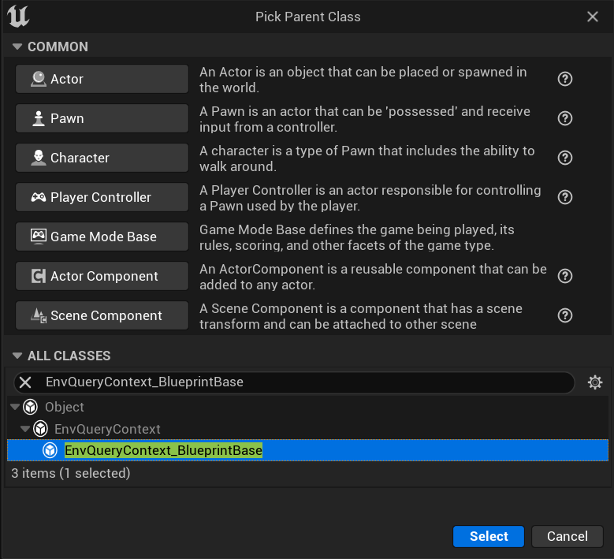
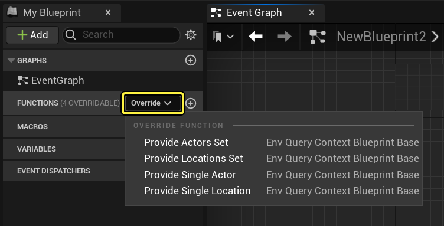

# EQS节点参考：情境

> 路径：虚幻引擎5.7文档 / Gameplay系统 / 人工智能 / 场景查询系统 / 场景查询系统节点参考 / EQS节点参考：情境

> 原始页面：https://dev.epicgames.com/documentation/unreal-engine/eqs-node-reference-contexts-in-unreal-engine

在场景查询系统（EQS）中，**情境** 为使用的所有[测试](../eqs-node-reference-tests/index.md)或[生成器](../eqs-node-reference-generators/index.md)提供参考框架。情境可以是简单的 **查询器**（其执行测试），也可以比较复杂，例如 **某种类型的所有Actor**。**Points:Grid** 之类的生成器可以使用返回多个位置或Actor的情境。这将会在每个情境的位置处创建一个网格（按照定义的大小和密度）。除了引擎提供的情境以外，还可以在蓝图中使用 **EnvQueryContext_BlueprintBase** 类或通过 C++ 代码创建自定义情境。

## EnvQueryContext_Item

**项目（Item）** 由生成器创建，如果使用 **EQS测试Pawn** 创建，那么它们就是出现在编辑器中的球体。EnvQueryContext_Item是位置（FVector）或Actor（AActor）。

## EnvQueryContext_Querier

**查询器** 是当前被AI控制器占据的Pawn，执行启动场景查询的[行为树](../../../behavior-trees/index.md)。举例而言，可以使用查询器作为情境的一种情况是：希望在AI角色周围的场景中搜索它们可以使用的物品，或者寻找可以使其获得掩护躲避玩家的地方，或者只是确定AI执行查询的当前位置。

在生成器类型的 **细节（Details）** 面板中，可以将查询器指定为下列属性的情境：

| 生成器 | 属性 |
| --- | --- |
| **Actors of Class** | **Search Center** Actors of Class |
| **Current Location** | **Query Context** Current Location |
| **Points:Circle** | **Circle Center** Circle Point |
| **Points:Cone** | **Center Actor** Cone Point |
| **Points:Donut** | **Center** Donut Point |
| **Points:Grid** | **Generate Around** Grid Point |
| **Points:Pathing Grid** | **Generate Around** Pathing Grid Point |

## EnvQueryContext_BlueprintBase

可以通过蓝图使用 **EnvQueryContext_BlueprintBase** 类创建自定义情境。这会提供四个可覆盖的函数，以便用户添加自己的自定义情境，用于查询中的测试。

使用自定义情境的方法：

1. 创建 **EnvQueryContext_BlueprintBase** 类的新蓝图。

   
2. 在EnvQueryContext_BlueprintBase中，单击 **覆盖（Override）** 并选择要使用的函数类型。

   

请参见下表了解每种函数覆盖的描述：

| 函数 | 描述 |
| --- | --- |
| Provide Single Location | 这会返回单个位置（矢量）。生成该位置的方式由用户来决定。举例而言，下面的函数将返回在距离查询器1500厘米以内范围发现的随机Actor（在DesiredObjectType中发现的Actor，如Pawn、载具）的追踪命中位置。 [undefined](https://d1iv7db44yhgxn.cloudfront.net/documentation/images/d3db6c30-724f-4eaa-a432-75c89f2d4013/provide-single-location.png) |
| Provide Single Actor | 这会返回单个Actor。可以通过任何想要的方法获取该Actor。在这个示例中，该函数将返回玩家0的受控Actor： Provide Single Actor |
| Provide Locations Set | 这会返回位置（矢量）的数组。生成这些位置的方式由您决定。在下面的示例中，此函数将从位于一个半径1500单位的圆上的16个等间距位置进行追踪，返回场景中的成功命中： [undefined](https://d1iv7db44yhgxn.cloudfront.net/documentation/images/89fbb221-4639-42c2-8127-1c6fa46a12f9/provide-locations-set.png) |
| Provide Actors Set | 这会返回Actor的排列。可以使用任何想要的方法获取这些Actor。下面的示例使用了一个"获取所有Actors of Class"（Get All Actors of Class）节点来将我们指定的类获取为要返回的Actor： Provide Actors Set |
