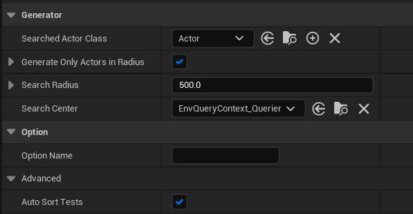
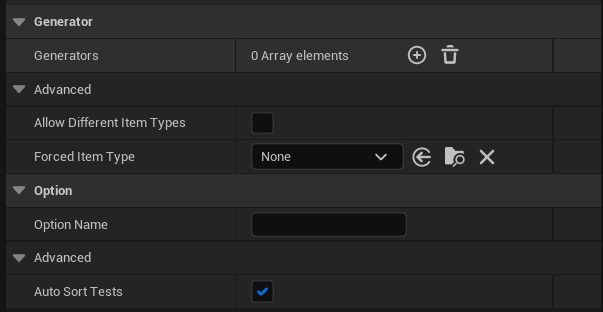
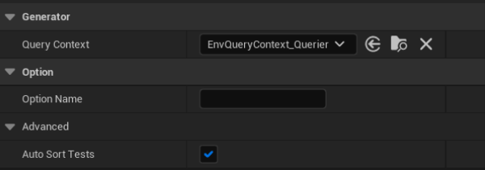
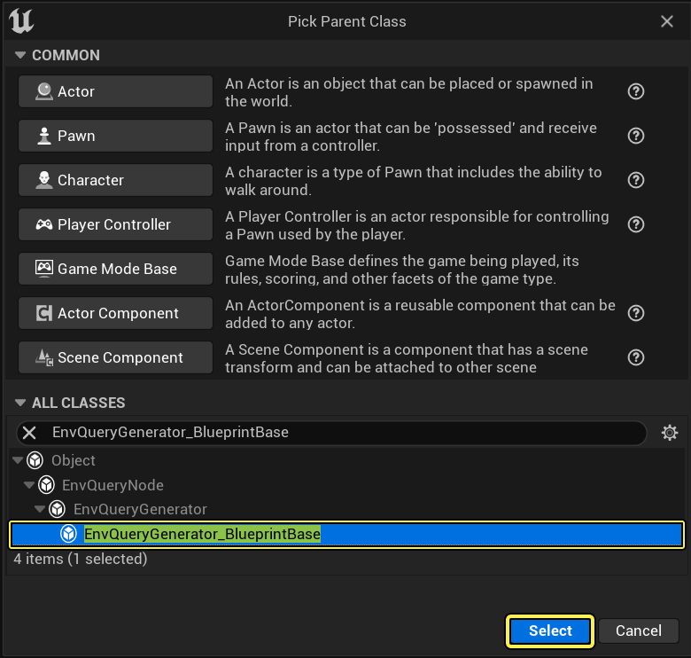
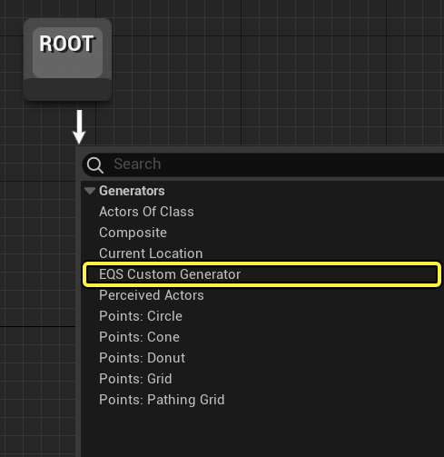

# EQS节点参考：生成器

> 路径：虚幻引擎5.7文档 / Gameplay系统 / 人工智能 / 场景查询系统 / 场景查询系统节点参考 / EQS节点参考：生成器

> 原始页面：https://dev.epicgames.com/documentation/unreal-engine/eqs-node-reference-generators-in-unreal-engine

在场景查询系统（EQS）中，**生成器** 用于产生将要测试和加权的位置或Actor（统称为 **项目（Item）**），权重最高的位置或Actor会返回到[行为树](https://dev.epicgames.com/documentation/404)。可以使用不同类型的生成器来检索信息，它们可以在蓝图中创建，也可以在C++中创建。

## Actors of Class

**Actors of Class** 生成器在 **搜索中心** 周围特定的 **搜索半径** 内查找给定类的所有Actor。返回的Actor可以用作测试中的项目。

| 属性 | 描述 |
| --- | --- |
| **搜索的Actor类（Searched Actor Class）** | 要查找的Actor类（例如Pawn、角色）。 |
| **仅在半径内生成Actor（Generate Only Actors in Radius）** | 如果启用该属性，系统将只在 **搜索半径** 内返回特定 **搜索的Actor类** 的Actor。如果禁用该属性，将返回游戏世界场景中指定 **搜索的Actor类** 的所有Actor。可以选择将用户定义的 **数据绑定** 与此选项一起使用。 |
| **搜索半径（Search Radius）** | 查找指定 **搜索的Actor类** 的最大距离。 零值和负值将不会返回任何结果。 |
| **搜索中心（Search Center）** | 作为搜索中心的情境，例如从查询器或其他某些情境开始进行搜索。 |
| **选项名称** | 此属性继承自生成器ActorsOfClass的基类。它主要在显示此生成器的名称时（如HUD或输出消息）使用。 |
| **自动排序测试（Auto Sort Tests）** | 如果启用该选项，运行查询前将自动对测试排序，以获得最佳性能。 |

## Composite

设置EQS查询时，有时可能希望在一个测试用例中包含多个 **生成器**。通过 **合成（Composite）** 节点即可将多个 **生成器** 添加到一个数组，然后将该数组用于测试。

| 属性 | 描述 |
| --- | --- |
| **生成器（Generators）** | 允许添加多个包含在测试中的生成器。 |
| **允许不同项目（Item）类型（Allow Different Item Types）** | 允许对有不同项目（Item）类型的生成器执行测试。 生成器将对原始数据使用 **强制项目（Item）类型（Forced Item Type）**，必须确保子生成器的内存布局正确，因为它们要通过自己的项目（Item）类型写入内存块。例如，当测试通过 **强制项目（Item）类型（Forced Item Type）** 读取项目（Item）位置/属性时，数据必须要能放进 **强制项目（Item）类型（Forced Item Type）** 分配的块中。 |
| **强制项目（Item）类型（Forced Item Type）** | 要在测试中使用的项目（Item）类型。例如Actor、方向或点。 |
| **选项名称** | 此属性继承自生成器ActorsOfClass的基类。它主要在显示此生成器的名称时（如HUD或输出消息）使用。 |
| **自动排序测试（Auto Sort Tests）** | 如果启用该选项，运行查询前将自动对测试排序，以获得最佳性能。 |

## Current Location

**Current Location** 生成器可用于获取指定的 **查询情境** 的位置，以实现测试验证的目的。

| 属性 | 描述 |
| --- | --- |
| **查询情境（Query Context）** | 要在测试中使用的情境及其当前位置。 |
| **选项名称** | 此属性继承自生成器ActorsOfClass的基类。它主要在显示此生成器的名称时（如HUD或输出消息）使用。 |
| **自动排序测试（Auto Sort Tests）** | 如果启用该选项，运行查询前将自动对测试排序，以获得最佳性能。 |

## 自定义生成器

除引擎提供的生成器类型外，还可以创建类型为 **EnvQueryGenerator_BlueprintBase** 类的新蓝图来创建自己的自定义生成器。

> [!NOTE]
> 在C++中开发的生成器执行速度通常快于通过蓝图开发的生成器。

创建自定义生成器后便可以在场景查询中使用它：

在自定义生成器内部有一个可以覆盖的函数，名为 **Do Item Generation**：

> 图片已省略：There is a function you can override called Do Item Generation

当覆盖此函数时，就会获得从场景查询中传入的情境位置的数组。

> 图片已省略：You will get an array of locations that are the Context locations passed in from the Environmental Query

数组可能因情境而异。例如，数组可以只有一个条目，其中包含查询器的位置，或者是关卡中每个体力回复剂的位置。

由于函数只能返回一个值，Do Item Generation函数有两个可以传递回场景查询的数组：**Add Generated Actor** 和 **Add Generated Vector**。

> 图片已省略：Add Generated Actor

Add Generated Actor节点将向Actor返回数组添加Actor。该节点也可以和 **Add Generated Vector** 节点（下文）配合使用，同时返回位置值。生成器根据从Environment Query节点设置的黑板键来确定实际传递回行为树的数值。

> 图片已省略：Add Generated Actor

## Points:Circle

> 图片已省略：Circle Generator

**Points:Circle** 生成器从 **Circle Center** 进行放射性追踪，以项目（Item）形式返回在（生成圆的）半径边缘的命中。

> 图片已省略：Circle Generator radiates traces out from the Circle Center

| 属性 | 描述 |
| --- | --- |
| **圆半径（Circle Radius）** | 将从 **Circle Center** 情境外延的圆的最大半径。 |
| **生成间隔（Spawn Between）** | 在圆的外侧边缘上生成的项目（Item）的间隔（以厘米计）。 |
| **点数（Number Of Points）** | 要在圆上生成的项目（Item）数量。 |
| **圆弧方向（Arc Direction）** | 定义用于确定圆弧方向的模式。可以选择 **两点（Two Points）**（从一个情境位置到另一个情境位置的方向）或 **旋转（Rotation）**（使用情境的旋转作为方向）。 |
| **圆弧角（Arc Angle）** | 定义圆弧的角度，按度数计。 |
| **圆心（Circle Center）** | 用作圆心的情境。 |
| **生成圆时忽略所有情境Actor（Ignore Any Context Actors when Generating Circle）** | 如果启用此属性，则在生成圆时忽略对情境Actor的追踪。 |
| **圆心Z偏移（Circle Center ZOffset）** | 应用于情境的Z轴可选偏移。 |
| **追踪数据（Trace Data）** | 与如何执行追踪相关的选项。 **追踪模式（Trace Mode）**：用于几何式追踪的形状。 **导航过滤器（Navigation Filter）**：用于追踪的导航过滤器。 **范围X（Extent X）**：追踪的形状参数。 |
| **投影数据（Projection Data）** | 是否应该将生成的项目（Item）投射到寻路网格体上（以及使用哪个寻路网格体数据集）。 |
| **选项名称** | 此属性继承自生成器ActorsOfClass的基类。它主要在显示此生成器的名称时（如HUD或输出消息）使用。 |
| **自动排序测试（Auto Sort Tests）** | 如果启用该选项，运行查询前将自动对测试排序，以获得最佳性能。 |

## Points:Cone

> 图片已省略：Cone Generator

**Points:Cone** 从 **中心Actor** 放射出指定 **锥体角度** 的锥体追踪作为项目（Item）。

> 图片已省略：Cone radiates a trace out from the Center Actor in the shape of a cone with the specified Cone Degrees as Items

| 属性 | 描述 |
| --- | --- |
| **对齐的点距（Aligned Points Distance）** | 同一角度上每个点之间的距离。 |
| **锥体角度（Cone Degrees）** | 生成锥体的最大角度。 |
| **角度步幅（Angle Step）** | 角度增大的步幅。角度步幅必须大于或等于一。数值越小，生成的项目（Item）越少。 |
| **射程（Range）** | 从情境生成锥体的距离。 |
| **中心Actor（Center Actor）** | 将会在其面对方向生成锥体的Actor。 |
| **包含情境位置（Include Context Location）** | 生成项目（Item）时是否包含 **中心Actor** 位置。 此选项会跳过 **MinAngledPointsDistance** 参数。 |
| **投射数据（Projection Data）** | 是否应该将产生的项目（Item）投射到寻路网格体上（以及使用哪个寻路网格体数据集）。 |
| **选项名称** | 此属性继承自生成器ActorsOfClass的基类。它主要在显示此生成器的名称时（如HUD或输出消息）使用。 |
| **自动排序测试（Auto Sort Tests）** | 如果启用该选项，运行查询前将自动对测试排序，以获得最佳性能。 |

## Points: Donut

> 图片已省略：Donut Generator

**Points:Donut** 按照用户指定的 **环数** 产生从 **中心** 情境辐射出的基于形状的追踪。

> 图片已省略：Donut Generator, creates a shape based trace with the user specified Number Of Rings radiating from the Center Context

| 属性 | 描述 |
| --- | --- |
| **内半径（Inner Radius）** | 点和情境之间的最小距离。 |
| **外半径（Outer Radius）** | 点和情境之间的最大距离。 |
| **环数（Number Of Rings）** | 要生成的环数。 |
| **每环点数（Points Per Rig）** | 每个环要生成的点数。 |
| **圆弧方向（Arc Direction）** | 定义用于确定圆弧方向的模式。你可以选择 **两点（Two Points）**（从一个情境位置到另一个情境位置的方向）或 **旋转（Rotation）**（使用情境的旋转作为方向）。 |
| **圆弧角（Arc Angle）** | 定义圆弧的角度，按度数计。 |
| **使用螺旋模式（Use Spiral Pattern）** | 如果启用该选项，圆环将以螺旋模式旋转。如果禁用该选项，则所有环都是零旋转，看起来更像车轮的辐条。 |
| **中心（Center）** | 要作为搜索中心的情境，例如从查询器或其他某些情境出发进行搜索。 |
| **投射数据（Projection Data）** | 是否应该将产生的项目（Item）投射到寻路网格体上（以及使用哪个寻路网格体数据集）。 |
| **选项名称** | 此属性继承自生成器ActorsOfClass的基类。它主要在显示此生成器的名称时（如HUD或输出消息）使用。 |
| **自动排序测试（Auto Sort Tests）** | 如果启用该选项，运行查询前将自动对测试排序，以获得最佳性能。 |

## Points: Grid

> 图片已省略：Grid Generator

**Points:Grid** 将在 **Generate Around** 下指定的查询器周围生成项目（Item）网格。

> 图片已省略：Grid Generator will generate a grid of Items around the specified querier assigned under Generate Around

| 属性 | 描述 |
| --- | --- |
| **网格半大小（GridHalfSize）** | 要生成的项目（Item）网格的高度和宽度。 |
| **间隔（Space Between）** | 网格项目（Item）的间距。 |
| **生成围绕（Generate Around）** | 用于围绕其生成网格的情境。 |
| **投射数据（Projection Data）** | 是否应该将产生的项目（Item）投射到寻路网格体上（以及使用哪个寻路网格体数据集）。 这将把可能被墙壁围起或阻挡的项目（Item）移动回寻路网格体上，如果网格线恰好在寻路网格体边缘以外，这可能造成聚束。 |
| **选项名称** | 此属性继承自生成器ActorsOfClass的基类。它主要在显示此生成器的名称时（如HUD或输出消息）使用。 |
| **自动排序测试（Auto Sort Tests）** | 如果启用该选项，运行查询前将自动对测试排序，以获得最佳性能。 |

## Points: Pathing Grid

> 图片已省略：Pathing Grid

可以使用 **Points:Pathing Grid** 围绕给定的情境位置生成网格。

> 图片已省略：Pathing Grid to generate a grid around the given Context location

| 属性 | 描述 |
| --- | --- |
| **到项目（Item）的路径（Path to Item）** | 寻路方向应该指向项目（Item）（启用）还是远离它（禁用）。 |
| **导航过滤器（Navigation Filter）** | 要在寻路过程中使用的导航过滤器。 |
| **网格半大小（GridHalfSize）** | 方块范围的一半（边缘距离）。 |
| **间隔（Space Between）** | 定义网格上的点的生成密度。 |
| **生成围绕（Generate Around）** | 用于围绕其生成网格的情境。 |
| **投射数据（Projection Data）** | 是否应该将产生的项目（Item）投射到寻路网格体上（以及使用哪个寻路网格体数据集）。 这将把可能被墙壁围起或阻挡的项目（Item）移动回寻路网格体上，如果网格线恰好在寻路网格体边缘以外，这可能造成聚束。 |
| **选项名称** | 此属性继承自生成器ActorsOfClass的基类。它主要在显示此生成器的名称时（如HUD或输出消息）使用。 |
| **自动排序测试（Auto Sort Tests）** | 如果启用该选项，运行查询前将自动对测试排序，以获得最佳性能。 |
| **扫描范围乘数（Scan Range Multiplier）** | 点和情境之间的最大距离的乘数。 |
