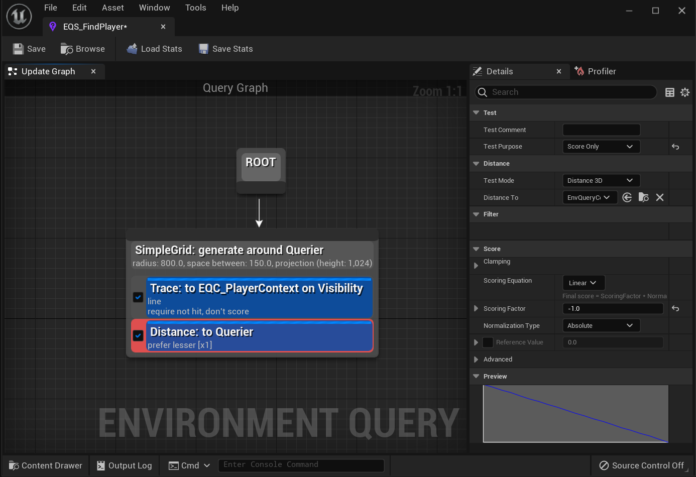
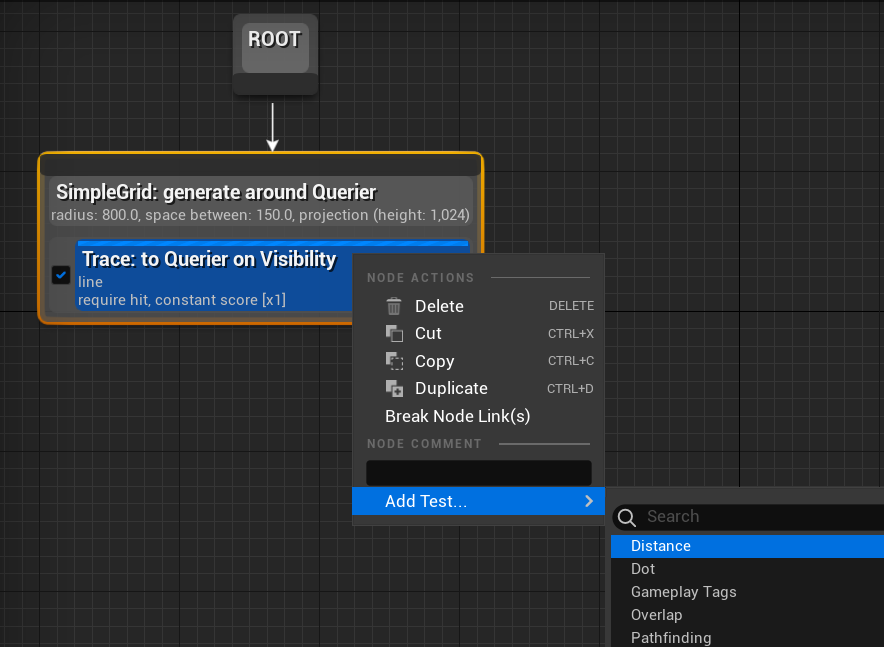
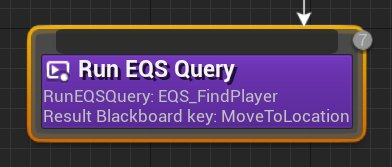
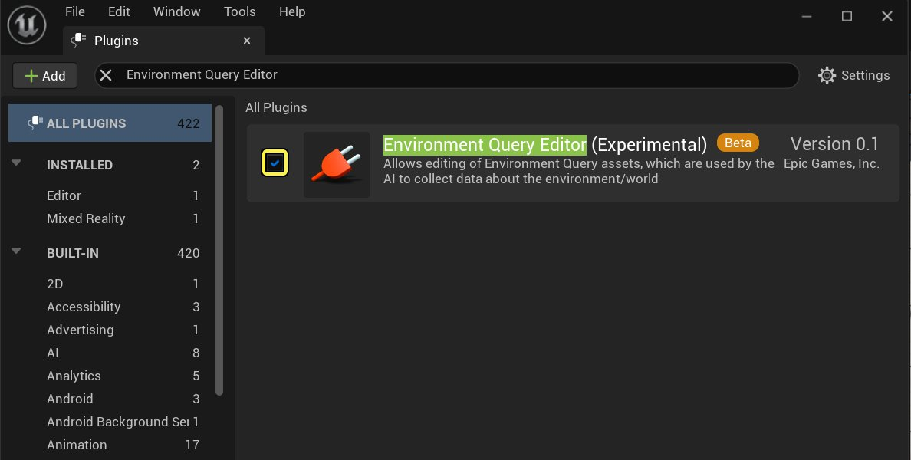
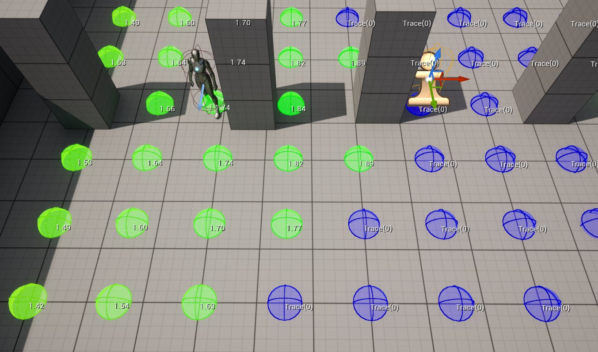

# 场景查询系统概述

> 路径：虚幻引擎5.7文档 / Gameplay系统 / 人工智能 / 场景查询系统 / 场景查询系统概述

> 原始页面：https://dev.epicgames.com/documentation/unreal-engine/environment-query-system-overview-in-unreal-engine

**场景查询系统**（简称EQS）是虚幻引擎5（UE）AI工具中的一种功能，可用于收集场景相关的数据。然后该系统可以使用[生成器](../environment-query-system-node-reference/eqs-node-reference-generators/index.md)，通过各种用户定义的[测试](../environment-query-system-node-reference/eqs-node-reference-tests/index.md)就这些数据提问，返回符合所提问题类型的最佳 **项目（Item）**。EQS的一些使用范例包括：找到最近的回复剂或弹药、判断出威胁最大的敌人，或者找到能看到玩家的视线（下面就会显示这样的一个示例）。

> [!NOTE]
> EQS背后的概念和理论来自虚幻引擎3的 **场景战术查询**（ETQ）系统，可在以下文章中读到关于该系统的更多内容：[询问场景智能问题](https://epicgames.box.com/s/b5vbufy1pp58k638wkrdp6xeht53k1zb)。

## EQS基础

EQS查询资源可以在 **内容浏览器** 中创建，并可在特殊的 **场景查询编辑器** 中编辑。场景查询编辑器是一个基于节点的编辑器，可以在其中添加生成器节点来生成项目（Item），添加需要在这些项目上运行的测试，以及运行它们的[情境](../environment-query-system-node-reference/eqs-node-reference-contexts/index.md)。虚幻引擎默认提供了多种生成器类型，但用户可以通过蓝图创建自己的自定义生成器（还可通过C++创建，这样执行更快）。

*在上面我们对现有的生成器添加了一个 **距离** 测试。*

与生成器类似，可以运行多种不同类型的测试来过滤返回的项目（Item）和（或）对其计分。与生成器不同的是，自定义测试只能通过C++创建。可以将多个测试添加到一个生成器，这是缩小返回项目（Item）结果范围的常见做法。对生成器添加测试的顺序并不重要，因为过滤测试都会在计分测试之前执行。这是为了减少返回且需要计分的项目（Item）。请参见下表了解测试类型。

| 节点类型 | 描述 |
| --- | --- |
| **生成器** | 生成统称为 **项目（Item）** 的位置或Actor，系统将对它们进行测试和加权。 |
| **情景** | 这是各种测试和生成器的参考框架。 |
| **测试** | 这是场景查询系统确定来自生成器的项目（Item）是否为"最佳"选项的方式。 |

> [!NOTE]
> 请参见[EQS节点参考](../environment-query-system-node-reference/index.md)页面，了解每种类型节点的更多信息。

设置EQS查询后，就可以使用 **运行EQS查询（Run EQS Query）** 任务节点通过[行为树](../../behavior-trees/index.md)来运行。

> [!NOTE]
> 欲知创建和使用EQS查询的完整介绍，请参见[EQS快速入门指南](../environment-query-system-quick-start/index.md)。

## 启用EQS

在使用EQS之前，需要从 **项目设置（Project Settings）** 菜单将其启用。

- 如有需要，在 **设置（Settings）> 插件（Plugins）** 部分，启用 **场景查询系统（Environmental Query System）** 选项。

  

## 预览EQS查询

可以在编辑器中预览EQS查询的结果，会以调试球体显示加权/过滤后的结果。

在上图中，我们调试了一个EQS查询，它返回了能看到关卡中角色的一个位置。

> [!NOTE]
> 欲知更多信息，请参见[AI调试](../../ai-debugging/index.md)或[EQS测试Pawn](../environment-query-testing-pawn/index.md)。
