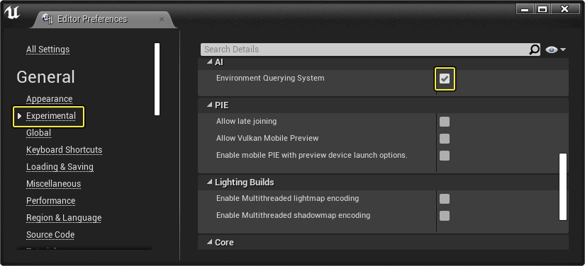
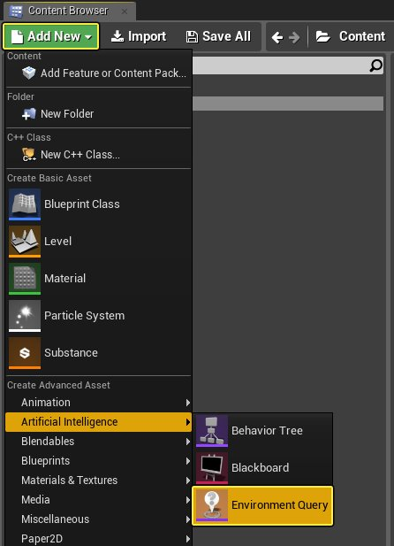
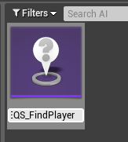
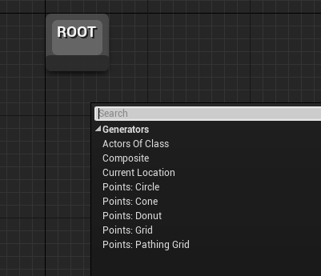
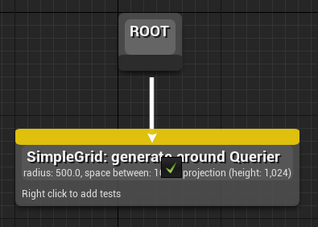
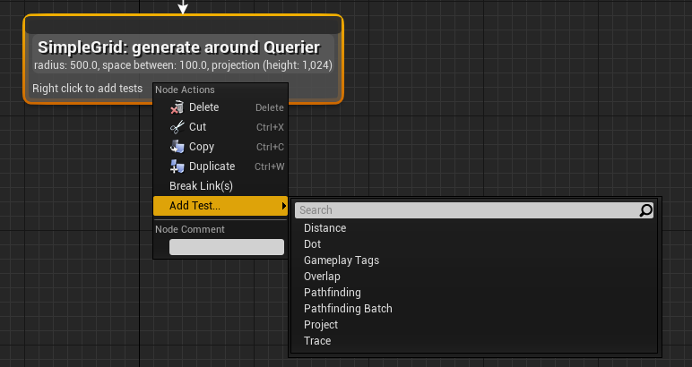
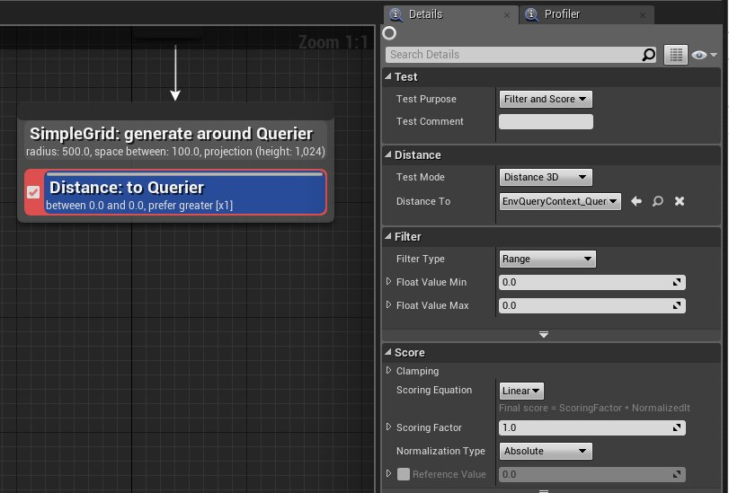
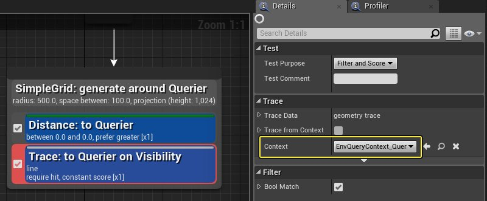

# 场景查询系统用户指南

> 路径：虚幻引擎5.7文档 / Gameplay系统 / 人工智能 / 场景查询系统 / 场景查询系统用户指南

> 原始页面：https://dev.epicgames.com/documentation/unreal-engine/environment-query-system-user-guide-in-unreal-engine

本页面讲述了启用、创建和编辑场景查询系统（EQS）资源的常规工作流程。

## 启用EQS

在使用EQS之前，需要从 **编辑器首选项（Editor Preferences）** 菜单将其启用。

- 在 **编辑器首选项（Editor Preferences）> 试验性（Experimental）> AI** 部分，启用 **场景查询系统（Environmental Query System）** 选项。

  

## 创建EQS查询

创建EQS资源的方法：

1. 在 **内容浏览器** 中单击 **新增（Add New）** 按钮，然后在 **AI（Artificial Intelligence）** 下面选择 **场景查询（Environment Query）**。

   
2. 输入新EQS资源的名称。

   

> [!NOTE]
> 除场景查询外，还可以在内容浏览器中创建自定义[生成器](../environment-query-system-node-reference/eqs-node-reference-generators/index.md#customgenerators)和[情境](../environment-query-system-node-reference/eqs-node-reference-contexts/index.md#envquerycontext_blueprintbase)蓝图资源。

## 编辑EQS查询

在EQS资源中，可以使用[生成器](../environment-query-system-node-reference/eqs-node-reference-generators/index.md)来生成将要测试和加权的位置或Actor，提供[情境](../environment-query-system-node-reference/eqs-node-reference-contexts/index.md)或参考框架，并进行[测试](../environment-query-system-node-reference/eqs-node-reference-tests/index.md)来决定生成器产生的哪个项目（Item）是最佳选择。下节将说明如何在EQS资源中创建它们。

添加生成器的方法：

- 在EQS图表中右键单击，然后选择需要的生成器类型。

  

  添加生成器之后，拖出Root节点，把它连接到你的生成器。

  

  > [!NOTE]
  > 虽然可以将多个生成器连接到Root，但查询中只会使用最左侧的生成器。

添加测试的方法：

- 右键单击生成器，并选择要添加的测试。

  

  添加测试后，它将出现并连接到生成器。选择测试，在 **细节（Details）** 面板中调节其属性。

  

定义情境的方法：

- 在测试的 **细节（Details）** 面板中，将 **EnvQueryContext** 更改为需要的情境。

  

  > [!NOTE]
  > 属性名称可能根据测试类型而变化。请参见[测试](../environment-query-system-node-reference/eqs-node-reference-tests/index.md)了解更多信息。

## 预览EQS查询

可以在编辑器中预览EQS查询的结果，会以调试球体显示加权/过滤后的结果。

> 图片已省略：EQSUG_Preview.png

在上图中，我们调试了一个EQS查询，它返回了能看到关卡中角色的一个位置。

> [!NOTE]
> 欲知更多信息，请参见[AI调试](../../ai-debugging/index.md)或[EQS测试Pawn](../environment-query-testing-pawn/index.md)。

## 将EQS用于行为树

创建EQS查询后，可以在[行为树](https://dev.epicgames.com/documentation/404)中将查询作为 **任务** 的一部分来运行。

1. 在行为树中右键单击并添加 **运行EQS查询（Run EQS Query）** 任务节点。

   > 图片已省略：EQSUG_RunEQS.png
2. 针对 **运行EQS查询（Run EQS Query）******，分配要执行的**查询模板（Query Template）**（所需的EQS资源）和它应该返回的**黑板键（Blackboard Key）**。

   > 图片已省略：EQSUG_EditEQSBT.png

   返回的黑板键是权重最高的结果（对象或矢量）。在上面的示例中，我们有一个EQS查询用于定位玩家，并将该位置重新提供给一个黑板键，其名为 **MoveToLocation。**

   > [!TIP]
   > 可以通过 **查询配置（Query Config）** 选项选择性地添加要传递到EQS测试的参数。

## 结合原生代码使用EQS

虽然EQS查询通常是在行为树中运行，但也可以直接从原生代码使用它。以下示例展示了一个虚构的查询，要在指定区域内为角色或物品寻找安全生成地点：

```
	// 以下名称必须与查询中使用的变量名一致	static const FName SafeZoneIndexName = FName(TEXT("SafeZoneIndex"));	static const FName SafeZoneRadiusName = FName(TEXT("SafeZoneRadius")); 	// 运行查询，根据区域索引和安全半径寻找安全的生成点	bool AMyActor::RunPlacementQuery(const UEnvQuery* PlacementQuery)	{		if (PlacementQuery)		{			// 设置查询请求			FEnvQueryRequest QueryRequest(PlacementQuery, this); 			// 设置查询参数			QueryRequest.SetIntParam(SafeZoneIndexName, SafeZoneIndexValue);			QueryRequest.SetFloatParam(SafeZoneRadiusName, SafeZoneRadius); 			// 执行查询			QueryRequest.Execute(EEnvQueryRunMode::RandomBest25Pct, this, &AFortAthenaMutator_SpawningPolicyBase::OnEQSSpawnLocationFinished); 			// 返回true说明查询已开始			return true;		} 		// 返回false说明查询未能开始		return false;	}
```
