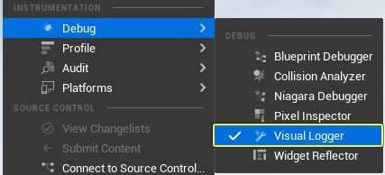
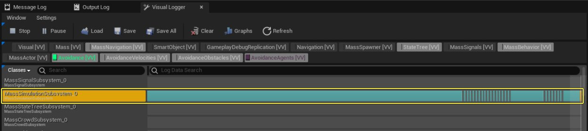
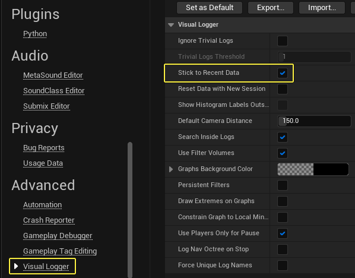
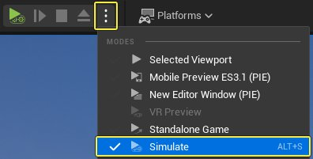

# 群体避障概述

> 路径：虚幻引擎5.7文档 / Gameplay系统 / 人工智能 / MassEntity / 群体避障 / 群体避障概述

> 原始页面：https://dev.epicgames.com/documentation/unreal-engine/mass-avoidance-overview-in-unreal-engine

## 概述

**群体避障（Mass Avoidance）** 是集成在[MassEntity](../../overview-of-mass-entity/index.md)中的基于力的避障系统。该系统可为使用MassEntity系统的所有实体提供高性能避障。

该系统使用 **UMassMovingAvoidanceProcessor** 处理多个输入，并将转向力输出到 **FMassForceFragment** 中。输出力将用于调整实体的方向，使其绕开环境中的其他实体。

## 系统输入

| **输入** | **说明** |
| --- | --- |
| **FMassForceFragment** | 代表施加给实体力，以便该实体离开其他实体。 |
| **FMassNavigationEdgesFragment** | 提供了用于实体避障的边缘（墙壁）列表。 |
| **FMassMoveTargetFragment** | 代表实体的目的地。其中还包含了其他信息，例如正前方向和当前状态（静止不动、正在移动等） |
| **FDataFragment_Transform** | 代表实体的变换。 |
| **FMassVelocityFragment** | 代表实体的速度。 |
| **FDataFragment_AgentRadius** | 代表实体的半径。 |

## 系统输出

| **输出** | **说明** |
| --- | --- |
| **FMassForceFragment** | 为实体施加的最终转向力。 |

## 系统执行

### UMassMovingAvoidanceProcessor

**UMassMovingAvoidanceProcessor** 会计算每个实体的分离力和避障力的总和。这些力是由附近的实体和障碍产生的。

其他实体会以碰撞物（见FMassAvoidanceColliderFragment）的形式呈现，对于人类和载具，分别呈胶囊和药丸形状。你可以调整多项设置，平衡这些力的效果。

附近的实体会通过 **FNavigationObstacleHashGrid2D**（归属于 **UMassNavigationSubsystem**）采集，并且只会考虑最接近的实体。障碍物会以边缘的形式呈现，主要来自 **FMassNavigationEdgesFragment**。 避障力是预测性的，其方向是根据未来的碰撞位置所计算的。分离力术语正交力，旨在与环境保持一定的距离。

### UMassStandingAvoidanceProcessor

**UMassStandingAvoidanceProcessor** 是一个类似的处理器，主要在实体静止不动时使用。

### UMassNavigationObstacleGridProcessor

**UMassNavigationObstacleGridProcessor** 可用于将障碍物信息传递到 **FNavigationObstacleHashGrid2D** 中。

### UMassZoneGraphLaneCacheBoundaryProcessor

**UMassZoneGraphLaneCacheBoundaryProcessor** 会与区域图表结合使用，为当前追踪的缓存道路部分构造边缘（见FMassZoneGraphCachedLaneFragment和FMassZoneGraphPathFollowTask）。

这些边缘会被添加到 **FMassNavigationEdgesFragment** 里。

### 系统设置

群体避障设置会存储在 **FMassMovingAvoidanceParameters** 和 **FMassStandingAvoidanceParameters** 中。要查看所有可用设置的详细说明，请参考项目文件中的 **MassAvoidanceFragments.h**，了解设置选项的详细信息。

## 群体避障调试

你可以使用 **可视化日志（Visual Logger）** 和 **Gameplay调试程序（Gameplay Debugger）**，对群体避障系统进行调试。

### 可视化日志

你可以使用 **可视化日志**，在编辑器中显示以下类别：

| **类别** | **说明** |
| --- | --- |
| **LogAvoidance** | 显示基础信息，例如初始和最终转向力，以及当前实体。 |
| **LogAvoidanceVelocity** | 显示实体的当前速度和理想速度。 |
| **LogAvoidanceAgents** | 显示障碍物边缘、预测碰撞和实体相关的力。 |

#### 启用可视化日志

1. 点击 **工具 > 调试 > 可视化日志（Tools > Debug > Visual Logger）**，打开 **可视化日志（Visual Logger）** 窗口。

   
2. 在列表中选择 **MassSimulationSubsystem** 轨道。

   
3. 进入 **编辑 > 编辑器偏好设置（Edit > Editor Preferences）**，打开 **编辑器偏好设置** 窗口。点击 **可视化日志（Visual Logger）** 类别，启用 **装载最新数据（Stick to Recent Data）** 勾选框，显示实时数据。

   
4. 按下 **~** 键打开 **命令行**，输入 **ai.debug.mass.DebugEntity** 或 **ai.debug.mass.SetDebugEntityRange**，设置在调试期间显示的实体。
5. 按下 **运行设置菜单（Play Settings menu）** 按钮，点击 **模拟（Simulate）**，在编辑器中查看可视化窗口。

   

> [!NOTE]
> 要进一步了解如何使用可视化日志，请参考[可视化日志](../../../../../testing-and-optimizing-content/visual-logger/index.md)文档。

### Gameplay调试程序

你可以使用 **Gameplay调试程序**，在编辑器中显示实体的移动目标、转向和碰撞物等信息。

#### 启用Gameplay调试程序

在游戏运行时，按下 **`** 键可以激活Gameplay调试程序。随后按下 **Shift+O** 可以查看 **实体概况**，按下 **Shift+V** 则可显示 **避障**。

> [!NOTE]
> 打开 **GameplayDebuggerCategory_Mass.cpp** 源文件可以查看更多信息，了解如何为Mass Avoidance使用Gameplay调试程序。
