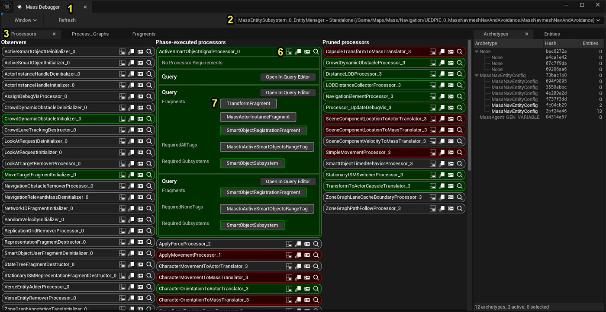
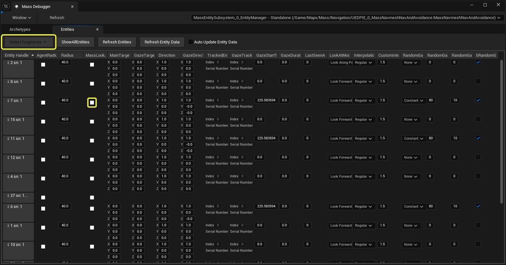
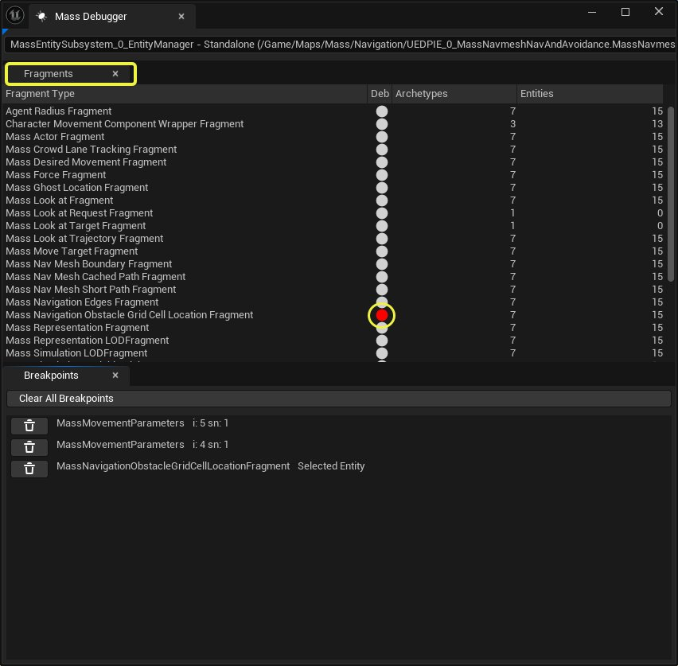

# 批量调试器概述

> 路径：虚幻引擎5.7文档 / Gameplay系统 / 人工智能 / MassEntity / 批量调试器概述

> 原始页面：https://dev.epicgames.com/documentation/unreal-engine/mass-debugger-overview

## 概述

**批量调试器**工具已得到了显著改进，将具有许多新功能，包括：实时检查实体片段数据、特定于实体的片段权限断点、 **Gameplay调试器**集成以及改进的处理器检查。

## 使用批量调试器

要启动批量调试器，请从编辑器中选择**工具（Tool）> 调试（Debug）> 批量调试器（Mass Debugger）** 。 注意：如果你启动了旧版本的批量调试器，则可能需要重置布局才能看到新的选项卡（在批量调试器窗口中点击**窗口（Window）> 重置布局（Reset Layout）**）。

### 界面工作流程

要查看处理器数据权限重叠：

1. 打开批量调试器。
2. 使用**环境选择器（Environment Picker）**选择你想要检查的批量运行时环境。
3. 打开**处理器（Processors）选项卡**（窗口（Window） > 处理器（Processors））。
4. 在列表中找到想要检查的处理器。
5. 点击处理器条目上的**显示片段权限（Show Fragment Access）**按钮。
6. 点击展开的处理器条目上的**查询（Queries）**列表中的片段。

> [!NOTE]
> 处理器的颜色将根据每个处理器的权限而改变。 绿色表示读取（常量）权限，红色表示写入（可变）权限。

要从已选择活动环境的批量调试器检查实体上的片段数据，请按以下步骤操作：

1. 打开**实体（Entities）选项卡**（**窗口（Window）> 实体（Entities）**，或使用调试器UI中的任何快捷**显示实体（Show Entities）**按钮）。
2. 点击**选择片段（Select Fragments）**下拉菜单并检查要检查的片段。

   1. 注意：片段列表与列出的实体的组成有关。
   2. 注意：仅显示被标记为UPROPERTY的所选片段结构的成员变量。 不需要其他编辑器可见性元数据。

要为特定实体上的特定片段设置片段写入断点，请按以下步骤操作：

1. 在**实体（Entities）选项卡**中显示所需实体的片段数据。
2. 点击**设置写入断点（Set Write Breakpoint）**按钮。
3. 注意：断点将在MassExecutionContext::EntitiyIterator的EntityIterator代码中触发。 只有使用该迭代器或该迭代器的封装器的代码才会以这种方式触发断点。 触发代码通常位于调用堆栈的上两到三层。
4. 要从IDE中清除断点并恢复执行，请使用IDE中的监视功能并将bDisableThisBreakpoint变量设置为"true"或"1"。

要为给定片段设置片段写入断点，以便为选定的任何实体触发，请按以下步骤操作：

1. 打开**片段（Fragments）**选项卡。
2. 找到所需的片段。
3. 单击**为所选实体写入时中断（Break on writes for the selected entity）**按钮。
4. 使用**实体（Entities）**选项卡或**Gameplay调试工具（Gameplay Debugger Tool）**（"EnableGDT"控制台命令）选择一个实体。

## 局限性

- 断点功能仅在Visual Studio 2022中测试过，其他IDE可能不支持
- 断点仅针对使用MassExecutionContext::CreateEntityIterator进行实体迭代的代码触发
- 片段检查需要UPROPERTY RTTI，因此仅显示带有UPROPERTY标记的成员变量
