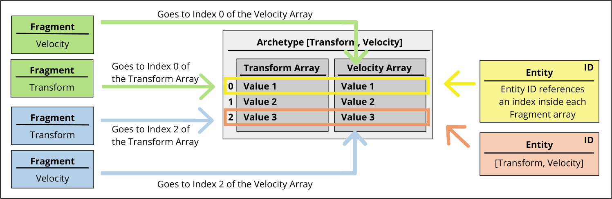
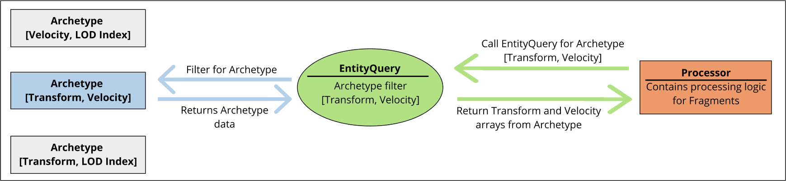

# MassEntity概述

> 路径：虚幻引擎5.7文档 / Gameplay系统 / 人工智能 / MassEntity / MassEntity概述

> 原始页面：https://dev.epicgames.com/documentation/unreal-engine/overview-of-mass-entity-in-unreal-engine

## 基本概念

**MassEntity** 是虚幻引擎5提供的一种框架，用于实现面向数据的计算。

MassEntity的主要数据结构是 **片段（Fragment）** ，表示计算中用到的某类原子数据。常见片段包括变换、速度和LOD索引。片段可以组合成集合，集合实例又可以关联一个ID。集合的实例称为 **实体（Entity）** 。

实体的创建类似于面向对象编程中的类实例化。但是，实体不像类一样需要去声明，而是由片段构成。构成（composition）可以在运行时更改。例如，一个实体的组合可以包括两个片段，例如变换和速度。

需要注意的是，片段和实体是不包含逻辑的纯数据元素。

**Archetype** 是一组拥有相同构成（composition）的实体。不同Archetype，其片段组合都会有所不同。例如，如果某个Archetype的片段构成是[变换，速度]（[Transform, Velocity]），则此Archetype关联的所有实体都拥有该片段构成。

Archetype中的实体整理在内存 **块** 中。这能确保从内存中检索同一类Archetype的实体片段时，实现最佳性能。

**处理器（Processors）** 是为片段提供处理逻辑的无状态类。处理器使用 **EntityQuery** 来指定操作哪种片段。EntityQueries会向处理器批量提供片段，而不考虑单个实体ID。

**标签（Tag）** 是一种不包含数据的简单片段。标签存在与否本身就是一种数据。标签是实体构成的一部分。

**ChunkFragment** 是与块（Chunk）关联的片段，而不是实体。ChunkFragments用于保存在管理处理中会用到的块数据，例如细节级别（LOD）计算。ChunkFragments是实体的构成的一部分。

## 处理实体

### MassCommandBuffer

处理器可以通过添加或删除片段或标签来更改实体构成。但是，在处理实体时，更改实体构成会导致该实体从一个Archetype移动到另一个Archetype。

处理器可以使用 **MassCommandBuffer** 命令请求组合更改。这些命令在当前处理批次结束时进行批处理，以便避免上述问题。

### EntityView

片段的序列化处理是对实体执行操作的最有效方式。但是，有时需要访问当前未处理的其他实体。处理器可以使用 **EntityView** 命令完成此操作。

EntityView可提供安全且优化的方式来访问当前不在处理队列中的其他实体的数据。

## 子系统

MassEntity框架分为几个子系统，用于封装和代码整理。所有子系统都是世界子系统，这意味着子系统的生命周期与创建了这个子系统的世界的生命周期绑定。

### MassEntity管理器

**MassEntity管理器（MassEntity Manager）** 是MassEntity框架中最重要的不分。该子系统创建并托管实体Archetype。

该管理器用作实体操作的接口，例如添加和删除片段。它还负责在Archetype之间移动实体。其他子系统可以使用MassCommandBuffer命令异步调用此功能。

### 实体模板

**实体模板（Entity Templates）** 由在虚幻引擎编辑器（Unreal Engine Editor）中创建的 **MassEntityConfig** 资产中的数据生成。这些资产可以声明一组可以在创建实体期间添加到实体的特征（Trait）。此外，MassEntityConfig资产可以有父资产并从它继承特征。

### 特征

**特征（Trait）** 是对能够提供特定功能的片段和处理器的统称。你可以将任意数量的特征实例添加给实体。每个特征实例负责以某种方式添加和配置片段，从而使实体表现出特征提供的行为。常见特征包括避障行为、注视目标和使用状态树。
