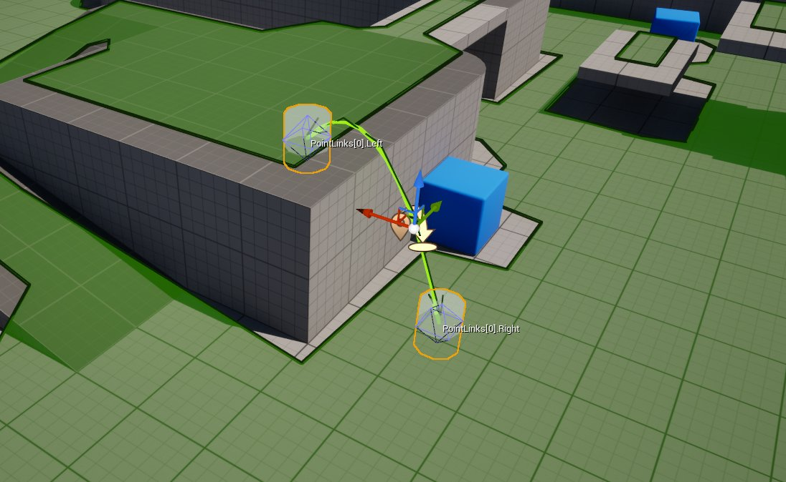
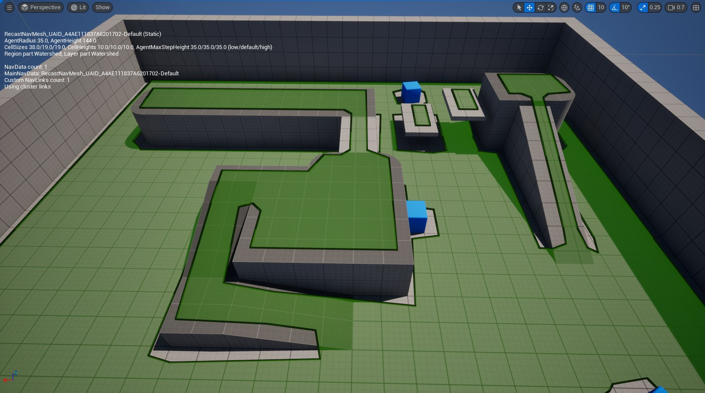
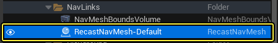
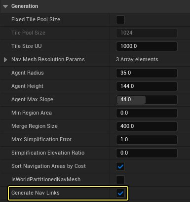
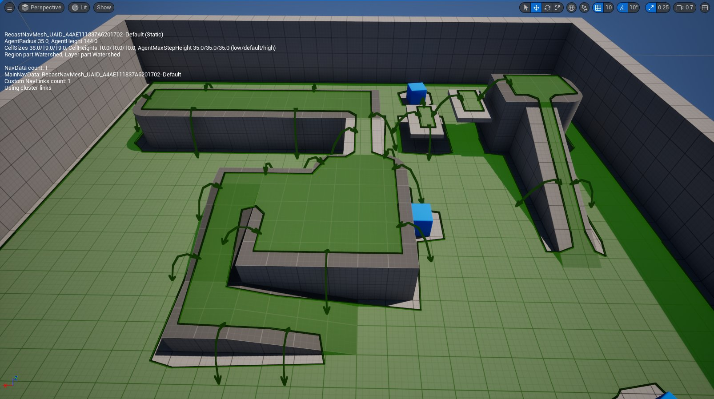
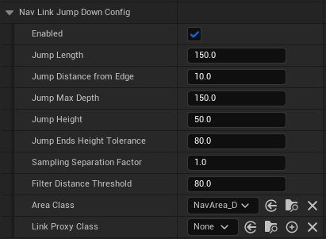
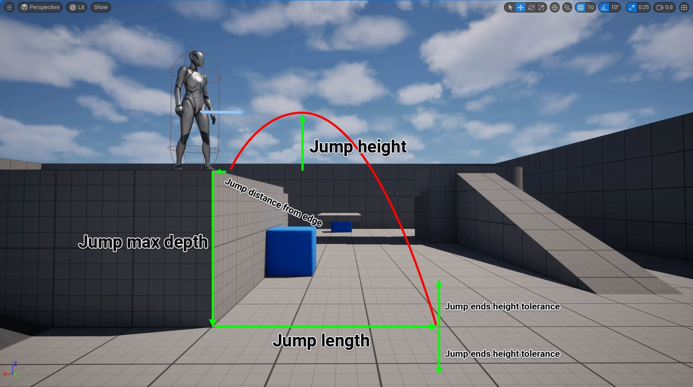
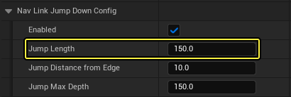

# 自动生成寻路链接

> 路径：虚幻引擎5.7文档 / Gameplay系统 / 人工智能 / 寻路系统 / 自动生成寻路链接

> 原始页面：https://dev.epicgames.com/documentation/unreal-engine/automatic-navigation-link-generation

## 虚幻引擎中的寻路链接

**寻路链接** 用于连接关卡中两个可寻路但并不直接相连的区域。例如高处的平台和地面，或者并不直接相连的两处平台。

要想手动添加寻路链接，开发者可以在关卡中放置 **寻路链接代理Actor（NavLink Proxy Actors）** 并定义可寻路区域之间的连接点。

如需详细了解 **寻路链接代理Actor** ，请参阅[修改寻路网格体](../modifying-the-navigation-mesh/index.md)文档。

## 自动生成寻路链接

虚幻引擎5.5在寻路网格体的设置中引入了 **自动生成寻路链接（automatic generation of Navigation Links）** 项。

> 动图已省略：自动生成寻路链接

要启用自动生成，请执行以下操作：

1. 在关卡中放置 **寻路网格体边界体积（Navigation Mesh Bounds Volume）** Actor并将其设置为需要。

   
2. 在

   大纲视图（Outliner）

   中，选择

   RecastNavMesh-Default

   Actor。

   - 转到

     细节（Details）

     面板，向下滚动到

     生成（Generation）

     分段并

     勾选

     生成寻路链接（Generate Nav Links）

     复选框。

   

   
3. 虚幻引擎将自动生成寻路链接。

   

## 配置寻路链接的生成

虚幻引擎将根据寻路链接下跳配置（Nav Link Jump Down Config）的设置生成寻路链接。这些链接主要用于实现AI代理（NPC）的跳跃或坠落动作。

设置如下：

| 设置 | 说明 |
| --- | --- |
| 跳跃长度（Jump Length） | 水平跳跃长度。 |
| 边缘跳跃距离（Jump Distance from Edge） | 从寻路网格体边缘起算的跳跃距离。 |
| 最大跳跃深度（Jump Max Depth） | 在起始高度之下多远寻找着陆点。 |
| 跳跃高度（Jump Height） | 相对于起始高度的峰值高度。 |
| 跳跃末端高度公差（Jump Ends Height Tolerance） | 跳跃点两端能够到达地面的公差。 |
| 取样分隔系数（Sampling Separation Factor） | 该值乘以单元尺寸，即可得出取样轨迹之间的距离。默认值为1。值越大，生成速度越快，但可能造成取样误差。 |
| 过滤距离阈值（Filter Distance Threshold） | 过滤相似链接时，用于比较片段端点之间的距离，以匹配相似链接。 |
| 区域类（Area Class） | 此配置生成的链接的区域类。 |
| 链接代理类（Link Proxy Class） | 用于处理此配置所生成链接的类。它允许开发者在使用寻路链接时实现自定义的行为。 |

下面是设置的示意图：

## 性能注意事项

在图块生成过程中，生成和验证寻路链接的过程会耗费额外的CPU周期，从而影响图块生成时间。遵循下列建议可尽量减少相关开销。

**跳跃长度**

该值对生成开销的影响最大。长度够大时会增加寻路网格体图块的光栅化尺寸。请将跳跃长度保持为合理的值，以提高性能。

**取样分隔系数**

> 图片已省略：取样分隔系数

> 图片已省略：数值越大，垂直轨迹取样之间的距离就越大。

该值默认为1（无效果），但可以增大数值以增加垂直轨迹取样之间的距离。这提供了进行简单优化的机会，但取样精度降低，可能会导致一些寻路链接发生碰撞。

**寻路网格体边缘的数量**

寻路链接的生成和验证过程将按寻路网格体边界的边缘逐个执行。这意味着寻路网格体图块越复杂，生成寻路链接的开销就越高。

**寻路链接生成时间**

要查看各项调整对寻路链接生成时间的影响，请执行以下步骤：

1. 在 **大纲视图（Outliner）** 中，选择 **RecastNavMesh-Default** Actor，并前往 **细节（Details）** 面板。

   > 图片已省略：xxx
2. 向下滚动到 **显示（Display）** 分段，并 **勾选** **绘制图块构建时间（Draw Tile Build Times）** 复选框。

   > 图片已省略：选择大纲视图中的RecastNavMesh-Default Actor
3. 这时屏幕上会显示 **平均链接构建时间** 。

   > 图片已省略：屏幕上显示平均链接构建时间

## 为寻路链接添加自定义行为

生成的寻路链接与可以被你手动添加到关卡中的 **寻路链接代理Actor** 相同。这意味着你可以通过为链接指定 **链接代理类（Link Proxy Class）** 来添加自定义行为。

要将 **跳越能力** 添加到寻路链接，请执行如下步骤：

1. 右键点击

   内容浏览器（Content Browser）

   ，选择

   蓝图类（Blueprint Class）

   以打开

   选取父类（Pick Parent Class）

   窗口。

   - 展开

     所有类（All Classes）

     类别，搜索并选择

     GeneratedNavLinksProxy

     。
   - 点击

     选择（Select）

     并命名资产。

   > 图片已省略：搜索并选择GeneratedNavLinksProxy
2. 在

   内容浏览器（Content Browser）

   中双击打开资产。

   - 添加如下所示的蓝图代码。
   - 编译（Compile）

     并

     保存（Save）

     。

   > 图片已省略：寻路链接蓝图代码
3. 在

   大纲视图（Outliner）

   中，选择

   RecastNavMesh-Default

   Actor。

   - 转到

     细节（Details）

     面板，向下滚动到

     寻路链接下跳配置（Nav Link Jump Down Config）

     分段，添加你用下拉菜单创建的

     链接代理类（Link Proxy Class）

     。

   > 图片已省略：选择大纲视图中的RecastNavMesh-Default Actor

   > 图片已省略：添加你用下拉菜单创建的链接代理类

## 测试寻路链接行为

要测试自定义行为，请创建一个AI代理，让其使用寻路链接随机前往目的地。

> [!NOTE]
> 本指南将展示设置过程，但不会逐步讲解。如需详细了解AI代理的创建过程，请参阅[人工智能](../../index.md)文档。

执行以下步骤以创建AI代理：

1. 新建一个 **Actor** 类型的蓝图作为AI代理的目的地，并将其命名为 **BP_Target** 。下方示例添加了一个带有 **球形网格体** 的 **静态网格体组件** 作为视觉表示。

   > 图片已省略：新建Actor类型的蓝图作为目的地
2. 复制虚幻引擎第三人称模板中的 **BP_ThirdPersonCharacter** 蓝图，并将其命名为 **BP_NPC** 。

   > 图片已省略：复制BP_ThirdPersonCharacter并命名为BP_NPC

   > [!NOTE]
   > 你也可以点击 **添加+（Add+） > 添加功能或内容包（Add Feature or Content Pack）** ，然后选择 **第三人称（Third Person）** 模板，将其添加到项目中。
3. 删除

   事件图表（Event Graph）

   中所有的现有代码，并添加下图中的代码。

   - 编译（Compile）

     并

     保存（Save）

     。

   > 图片已省略：AI代理蓝图代码
4. 将你的 **AI代理** 和数个 **BP_Target** Actor放置到关卡中。

   > 图片已省略：将你的AI代理和数个BP_Target Actor放置到关卡中
5. 按下

   模拟（Simulate）

   以查看AI代理在目的地之间的行动。

1. 下方示例显示了多个AI代理前往随机目的地的情况。
