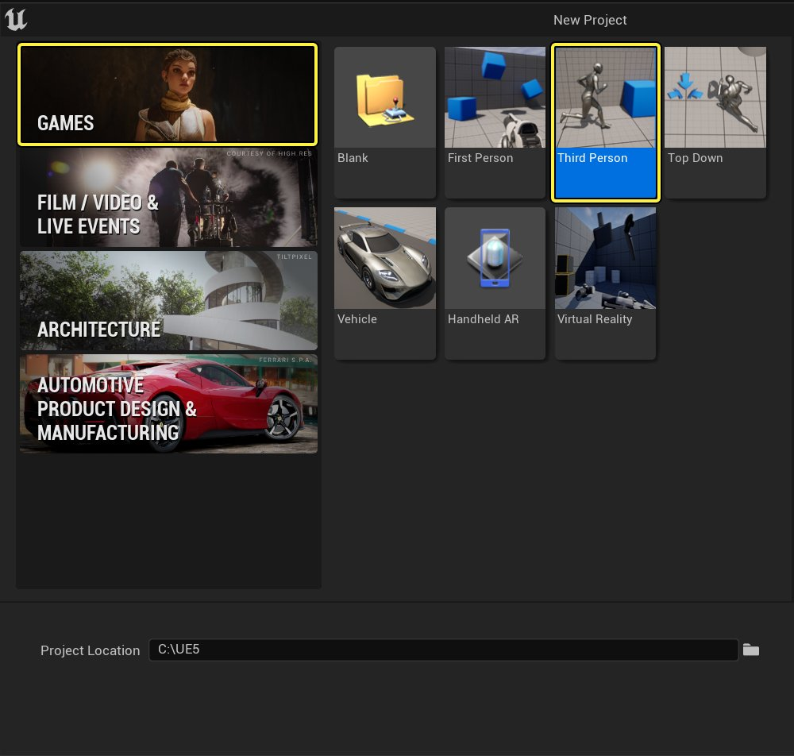
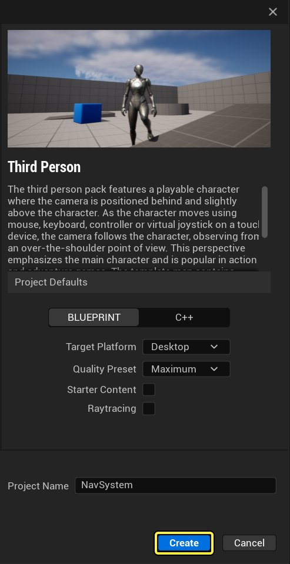
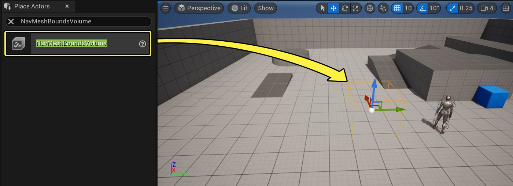
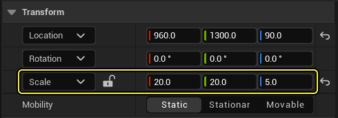
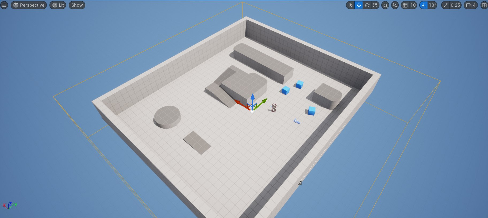
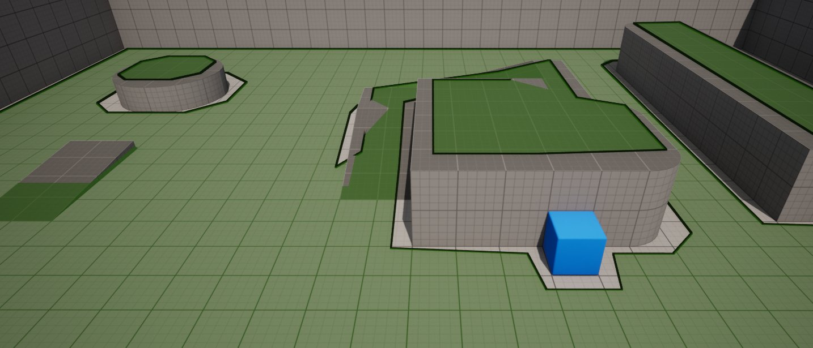
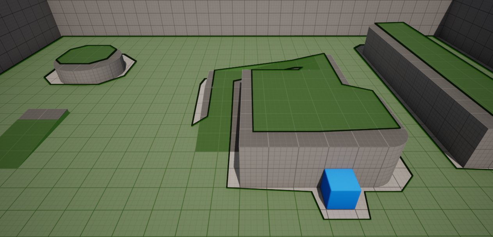

# 基本寻路

> 路径：虚幻引擎5.7文档 / Gameplay系统 / 人工智能 / 寻路系统 / 基本寻路

> 原始页面：https://dev.epicgames.com/documentation/unreal-engine/basic-navigation-in-unreal-engine

## 概述

**虚幻引擎寻路系统** 用于为人工智能代理（AI Agent）提供寻路功能。

为了帮助AI确定起点和终点之间的路径，引擎会根据场景中的碰撞体生成寻路网格体。这种简化的多边形网格体代表了关卡中的可寻路空间。默认情况下，寻路网格体会细分为多个区块，允许你重新构建寻路网格体的局部区域。

生成的网格体由多个多边形组成，每个多边形都有一个"成本"值。搜索路径时，寻路算法会尝试找到总成本最低的路径。

寻路系统包含多种功能，你可以使用这些功能，根据你的需求自定义代理的寻路行为。

## 目标

在本快速入门指南中，你将学习如何创建一个简单的代理，让它使用寻路系统在关卡中游走。

## 任务

- 在关卡中使用寻路网格体Actor来实现寻路。
- 学习在关卡中显示寻路网格体，并对其进行调整以满足你的需求。
- 修改ThirdPersonCharacter蓝图，使其能够使用寻路系统在关卡中四处游走。

## 1 - 必要设置

1. 在虚幻项目浏览器的 **新项目分类（New Project Categories）** 中，选择 **游戏（Games）**，然后点击 **第三人称（Third Person）** 模板。

   
2. 选择 **蓝图（Blueprint）** 和 **不含初学者内容（No Starter Content）**，然后点击 **创建（Create）**。

   

### 阶段成果

你已经创建了一个新的第三人称项目，现在可以了解寻路系统。

## 2 - 构建寻路网格体

在本小节中，你将使用 **寻路网格体边界体积（Navigation Mesh Bounds Volume）** 来指定关卡中需要生成寻路的区域。代理将使用此信息在关卡中到达目的地。

1. 在项目的默认 **ThirdPersonExampleMap** 中，打开 **放置Actor（Place Actors）** 面板，搜索 **寻路网格体边界体积（Nav Mesh Bounds Volume）**，并将其拖到关卡中。

   
2. 选择 **寻路网格体边界体积（Nav Mesh Bounds Volume）** 之后，转到 **细节（Details）** 面板，将 **体积** 缩放为X=20、Y=20和Z=5。移动体积使其覆盖整个播放区域，如下所示。

   

   
3. 在 **世界大纲视图（World Outliner）** 窗口中选择 **ThirdPersonCharacter** 蓝图，并将其从关卡中移除。

   
4. 按键盘上的 **P 键**，可视化关卡中的寻路网格体。如下图所示，寻路网格体默认显示为绿色。

   > [!NOTE]
   > 将寻路网格体边界体积Actor添加到关卡或调整其大小后，虚幻引擎会自动生成寻路网格体。|

   
5. 注意寻路网格体在楼梯上无法正确绘制。出现这种况是因为，寻路网格体是关卡中碰撞体的简化呈现。在 **世界大纲视图（World Outliner）** 窗口中选择 **RecastNavMesh-Default** Actor，然后前往 **细节（Details）** 面板。前往 **显示（Display）** 分段，并将 **绘制偏移（Draw Offset）** 值设置为 **50**。此操作可调整绘制寻路网格体的高度偏移，以提高可读性。

   

### 阶段成果

在本分段中，你将寻路网格体边界体积Actor添加到关卡，并对其进行缩放以便匹配游戏区域。你还学习了如何通过按P键可视化最终的寻路网格体。

## 3 - 可视化寻路网格体

在此小节中，你将学习如何修改各种寻路网格体设置，以及如何更改关卡中网格体的可视化方式。

1. 打开 **世界大纲视图（World Outliner）** 并选择 **RecastNavMesh-Default**Actor。

   > 图片已省略：Select the Recast Nav Mesh Actor Default from the World Outliner
2. 选择Actor后，转到 **细节（Details）** 面板并向下滚动到 **显示（Display）** 分段。这里你将找到各种选项，可以更好地可视化生成的寻路网格体。在下面的示例中，我选择了 **绘制多边形边缘（Draw Poly Edges）** 来查看构成网格体的多边形。

   > 图片已省略：Select Draw Poly Edges to see the polygons that make up the mesh
3. 你还可以启用 **绘制区块边界（Draw Tile Bounds）** 复选框来可视化各个寻路区块。

   > 图片已省略：Enable Draw Tile Bounds to visualize the Navigation Tiles
4. 你可以前往 **生成（Generation）** 分段，更改其选项来修改寻路网格体的生成方式。

### 阶段成果

在本节中，你学习了如何更改寻路网格体的显示设置，以及如何通过调整各种选项来影响其生成。

## 4 - 创建你的第一个代理

在本分段中，你将创建一个简单的代理，通过选择附近的随机位置并走到该位置，该代理将在你的关卡中游走。代理到达目的地后将等待几秒钟，然后再次重复该过程。

1. 在 **内容侧滑菜单（Content Browser）** 中，右键点击并选择 **新建文件夹（New Folder）**，以新建文件夹。将文件夹命名为 **NavigationSystem**。
2. 在 **内容侧滑菜单** 中，转到 **ThirdPerson > 蓝图（Blueprints）**，然后选择 **ThirdPersonCharacter** 蓝图。将其拖放到 **NavigationSystem**文件夹，然后选择选项 **复制此处（Copy Here）**。

   > 图片已省略：Drag the Third Person Character Blueprint into the Navigation System folder and select Copy Here
3. 转到 **NavigationSystem** 文件夹，并将该蓝图重命名为 **BP_NPC_NavMesh**。双击打开蓝图类，然后找到 **事件图表（Event Graph）**。选择所有输入节点并将其删除。
4. 右键点击 **事件图表（Event Graph）**，然后搜索并选择 **添加自定义事件（Add Custom Event）**。将事件命名为 **MoveNPC**。

   > 图片已省略：Right click in the Event Graph and search for Add Custom Event
5. 右键点击 **事件图表（Event Graph）**，然后搜索并选择 **获取Actor位置（Get Actor Location）**。

   > 图片已省略：Right click the Event Graph then search for and select Get Actor Location
6. 从 **GetActorLocation** 节点拖出，然后搜索并选择 **获取半径内的随机可达点（Get Random Reachable Point In Radius）**。将 **半径（Radius）** 设置为1000个单位。

   > 图片已省略：Drag from the Get Actor Location node and search for and select Get Random Reachable Point In Radius
7. 从 **GetRandomReachablePointInRadius** 节点的 **随机位置（Random Location）** 引脚拖出，然后选择 **提升到变量（Promote to Variable）**。

   > 图片已省略：Drag from the Random Location pin of the Get Random Reachable Point In Radius node and select Promote to variable
8. 将 **MoveNPC** 节点连接到刚才创建的 **RandomLocation** 节点。

   > 图片已省略：Connect the Move NPC node to the Random Location node
9. 右键点击 **事件图表（Event Graph）**，然后搜索并选择 **AI移动至（AI Move To）**。将 **RandomLocation** 节点连接到 **AI Move To** 节点。

   > 图片已省略：Right click the Event Graph, then search for and select AI Move To
10. 右键点击 **事件图表（Event Graph）**，然后搜索并选择 **获取对自我的引用（Get a reference to self）**。

    > 图片已省略：Right click the Event Graph and search for and select Get a reference to self
11. 将 **Self** 节点连接到 **AI Move To** 节点的 **Pawn** 引脚。将 **Random Location** 节点的 **黄色** 引脚连接到 **AI Move To** 节点的 **目的地（Destination）** 引脚，如下所示。

    > 图片已省略：Connect the Self node to the Pawn pin of the AI Move To node
12. 从 **AI Move To** 节点的 **成功时（On Success）** 引脚拖出，然后搜索并选择 **延迟（Delay）**。将节点 的 **时长（Duration）** 设置为4。从 **Delay** 节点的 **已完成（Completed）** 引脚拖出，然后搜索并选择 **MoveNPC**，如下所示。

    > 图片已省略：Drag from the On Success pin of the AI Move To node and add a Delay node. Set Duration to 0.4. Drag from the Delay node and add a Move NPC node
13. 重复上述步骤，以将这些节点添加到 **AI Move To** 节点的 **失败时（On Fail）** 引脚。将 **Delay** 节点的 **时长（Duration）** 设置为0.1。

    > 图片已省略：Repeat the steps above to add nodes to the On Fail pin of the AI Move To node
14. 右键点击 **事件图表（Event Graph）**，然后搜索并选择 **事件开始播放（Event Begin Play）**。从 **Event Begin Play** 节点拖出，然后搜索并选择 **MoveNPC**。

    > 图片已省略：Right-click the Event Graph, then search for and select Event Begin Play

    > 图片已省略：Drag from the Event Begin Play node, then search for and select Move NPC
15. **编译（Compile）** 并 **保存（Save）** 蓝图。
16. 将你的 **BP_NPC_NavMesh** 蓝图拖到你的关卡，并点击 **模拟（Simulate）**。你应该会看到你的代理在关卡中游走。

    > 动图已省略：Your Agent is now moving in the Level

    > 动图已省略：Multiple Agents are moving in the Level

### 阶段成果

在本小节中，你学习了如何使用 **寻路网格体** 创建一个在关卡中游走的简单代理。
