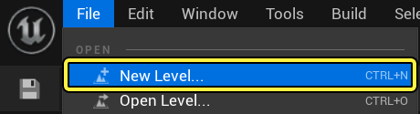
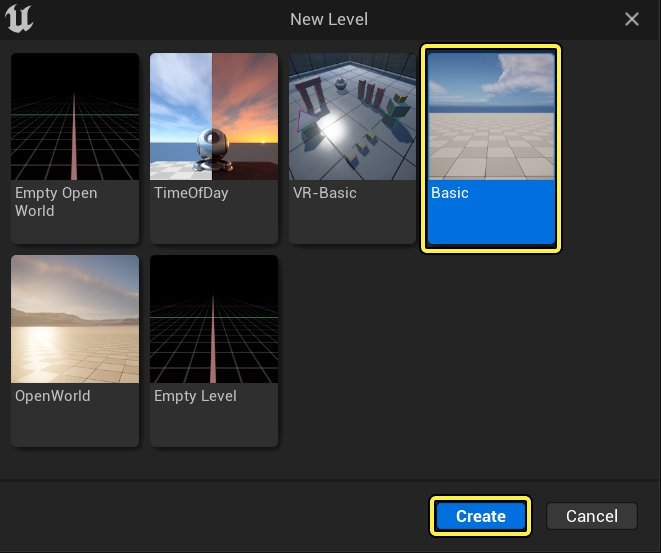
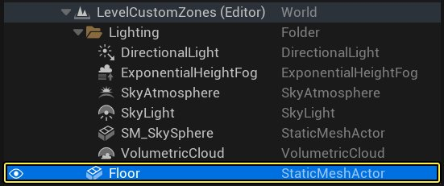
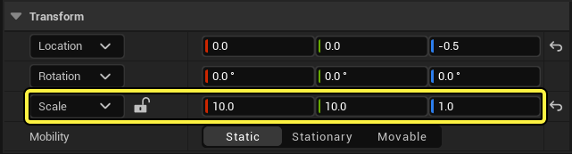
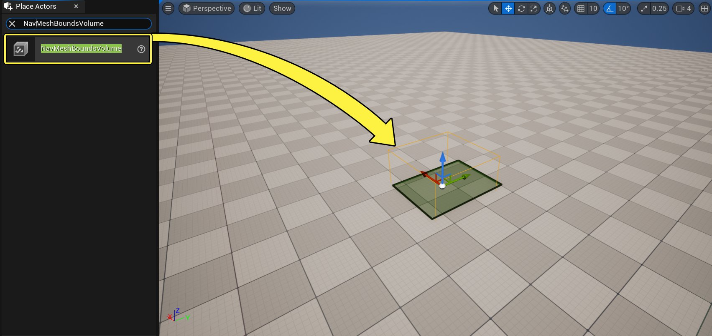
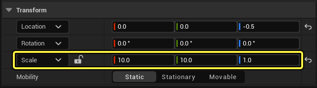

# 自定义导航区域和查询筛选器准备指南

> 路径：虚幻引擎5.7文档 / Gameplay系统 / 人工智能 / 寻路系统 / 自定义寻路区域和查询筛选器 / 自定义导航区域和查询筛选器准备指南

> 原始页面：https://dev.epicgames.com/documentation/unreal-engine/custom-navigation-areas-and-query-filters-preparation-guide-in-unreal-engine

## 概述

本文档将帮助你了解创建关卡和AI代理的初始步骤，以便了解导航系统中的自定义区域和查询筛选器。

你还可以下载[完整示例项目](https://d1iv7db44yhgxn.cloudfront.net/documentation/attachments/4b30780f-37c0-4348-9f88-c4c5ea654041/navsystemsample.zip)，其中包含本指南中涵盖的所有素材。

## 目的

- 创建新关卡，并通过在关卡中放置一个导航网格体Actor来设置导航。
- 将ThirdPersonCharacter蓝图修改为使用特定的查询筛选器导航到目的地。

## 1 - 必要设置

1. 在虚幻项目浏览器的 **新项目分类（New Project Categories）** 分段，选择 **游戏（Games）> 第三人称（Third Person）**，然后点击 **下一步（Next）**。

   
2. 选择 **蓝图（Blueprint）** 和 **不含初学者内容包（No Starter Content）** 选项，然后点击 **创建（Create）**。

   

### 阶段成果

你创建了一个新的第三人称项目，现在可以了解创建区域类和导航查询筛选器的信息。

## 2 - 创建测试关卡

1. 点击菜单栏上的 **文件（File）>新关卡（New Level）**。

   
2. 选择 **基础（Basic）** 关卡并点击 **创建**。

   
3. 在 **世界大纲视图（World Outliner）** 中选择 **地板（Floor）**静态网格体Actor（Static Mesh Actor），在 **细节（Details）** 面板中，将 **缩放（Scale）** 设置为X=10，Y=10，Z=1。

   

   
4. 转到 **放置Actor（Place Actors）** 面板，搜索 **导航网格体边界体积（Nav Mesh Bounds Volume）**。将其拖入关卡，放置在地板网格体上。

   
5. 选择 **导航网格体边界体积（Nav Mesh Bounds Volume）** 之后，转到 **细节（Details）** 面板，将 **缩放（Scale）** 设置为X=5、Y=10和Z=1。

   
6. 转到 **放置Actor（Place Actors）** 面板，然后转到 **形状（Shape）** 类别。将 **球体（Sphere）** Actor拖到关卡中。

   > 图片已省略：Drag a Sphere Actor into the Level

### 阶段成果

在本小节中，你创建了新关卡并添加了导航网格体和球体Actor。你现在可以创建将走向球体目标的代理。

## 3 - 创建代理

在本小节中，你将创建导航到其目标Actor的代理。

1. 在 **内容侧滑菜单（Content Drawer）** 中，右键点击并选择 **新建文件夹（New Folder）**，以新建文件夹。将文件夹命名为 **NavigationSystem**。
2. 在 **内容侧滑菜单（Content Drawer）**，转到 **ThirdPersonBP > 蓝图（Blueprints）**，然后选择 **ThirdPersonCharacter** 蓝图。将其拖放到 **NavigationSystem** 文件夹，然后选择选项 **复制到此处（Copy Here）**。

   > 图片已省略：Drag the Third Person Character Blueprint to the Navigation System folder and select Copy Here
3. 找到 **NavigationSystem** 文件夹，并将该蓝图重命名为 **BP_NPC_CustomZone**。双击打开蓝图类，然后找到 **事件图表（Event Graph）**。选择所有输入节点并将其删除。
4. 右键点击 **事件图表（Event Graph）**，然后搜索并选择 **添加自定义事件（Add Custom Event）**。将事件命名为 **MoveNPC**。

   > 图片已省略：Right-click the Event Graph, then search for and select Add Custom Event. Name the event Move NPC
5. 转到 **我的蓝图（My Blueprint）** 面板，然后点击 **变量（Variables）** 旁边的 **添加(+)（Add (+)）** 按钮创建新变量。将变量命名为 **Target**。

   > 图片已省略：Click the Add next to Variables to create a new variable and name it Target
6. 转到 **细节（Details）** 面板，并点击 **变量类型（Variable Type）** 下拉菜单。搜索 **Actor** 并选择 **对象引用（Object Reference）**。启用 **可编辑实例（Instance Editable）** 复选框。

   > 图片已省略：Click the Variable Type dropdown and select the Actor Object Reference

   > 图片已省略：Enable the Instance Editable checkbox
7. 将 **Target** 变量拖动到 **事件图表（Event Graph）**，然后选择选项 **Set Active**。从 **Target** 节点拖出，然后搜索并选择 **Is Valid** 宏，如下所示。

   > 图片已省略：Drag from the Target node, then search for and select the Is Valid macro
8. 右键点击 **事件图表（Event Graph）**，然后搜索并选择 **获取对自身的引用（Get a reference to self）**。

   > 图片已省略：Right-click the Event Graph, then search for and select Get reference to self
9. 从 **Self** 节点拖出，然后搜索并选择 **获取AI控制器（Get AIController）**。

   > 图片已省略：Drag from the Self node, then search for and select Get AI Controller
10. 从 **AI Controller** 节点拖出，然后搜索并选择 **移动至Actor（Move to Actor）**。

    > 图片已省略：Drag from the AI Controller node, then search for and select Move to Actor
11. 将 **Is Valid** 节点的 **有效（Is Valid）** 引脚连接到 **Move to Actor** 节点。将 **Move to Actor** 节点的 **可接受半径（Acceptance Radius）** 设置为50。拖移 **目标（Target）** 变量并将其连接到 **Move to Actor** 节点的 **目标（Goal）** 引脚。

    > 图片已省略：Connect the Is Valid pin of the Is Valid node to the Move to Actor node
12. 右键点击 **Move to Actor** 节点的 **筛选器类（Filter Class）** 引脚，然后选择 **提升为变量（Promote to Variable）**。转到 **细节（Details）** 面板，并启用 **可编辑实例（Instance Editable）** 复选框。

    > 图片已省略：Right-click the Filter Class pin of the Move to Actor node and select Promote to Variable

    > 图片已省略：Enable the Instance Editable checkbox
13. 右键点击 **事件图表（Event Graph）**，然后搜索并选择 **事件开始播放（Event Begin Play）**。从 **Event Begin Play** 节点拖移，然后搜索并选择 **MoveNPC**。

    > 图片已省略：Right-click the Event Graph, then search for and select Event Begin Play

    > 图片已省略：Drag from the Event Begin Play node and search for and select MoveNPC
14. **编译（Compile）** 并 **保存（Save）** 蓝图。最终的蓝图看起来应该类似于下图。

    > 图片已省略：This is the final Blueprint Setup
15. 将 **BP_NPC_CustomZone** 蓝图拖放到你的关卡中。找到 **细节（Details）** 面板，点击 **目标（Target）** 旁边的下拉菜单。搜索并选择 **球体（Sphere）**，如下所示。

    > 图片已省略：Drag the BP_NPC_CustomZone Blueprint into your Level

    > 图片已省略：Navigate to the Details panel and click the dropdown next to Target. Search for and select Sphere
16. 按下 **模拟（Simulate）**，并观察代理向球体移动的情况。

    > 动图已省略：Your Agent is now moving towards the Sphere

### 阶段成果

在本小节中，你创建了一个导航到其目标并可以使用导航查询筛选器的代理。你现在可以了解关于添加[自定义导航区域和查询筛选器](../custom-navigation-areas-and-query-filters-quick-start/index.md)的信息。
