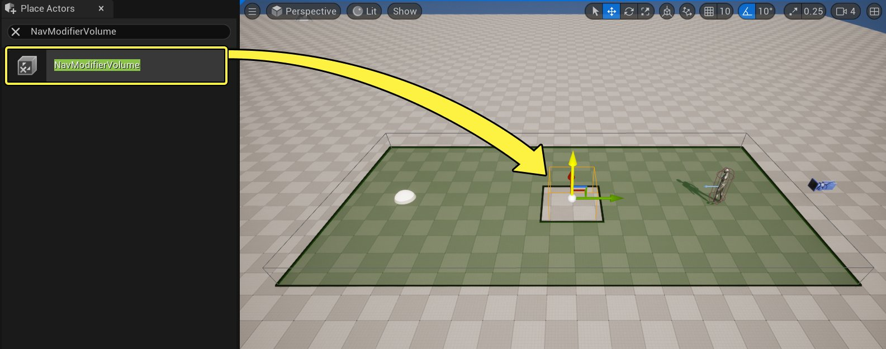
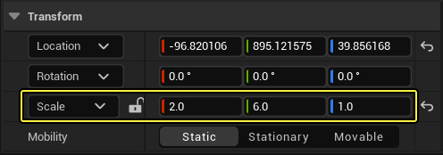
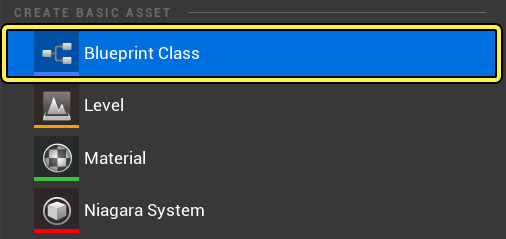
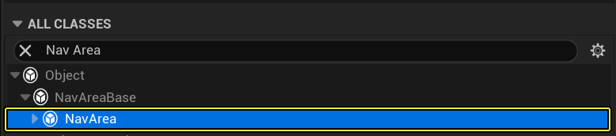
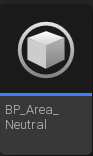
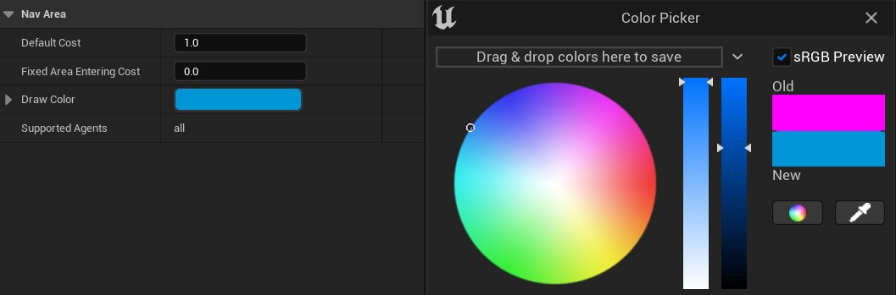
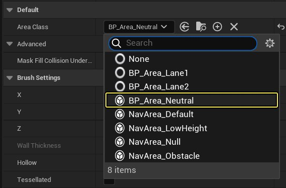
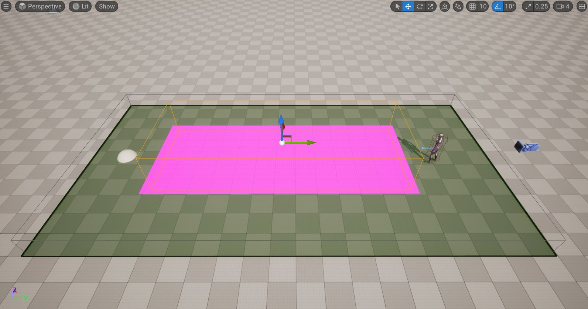

# 自定义寻路区域和查询筛选器概述

> 路径：虚幻引擎5.7文档 / Gameplay系统 / 人工智能 / 寻路系统 / 自定义寻路区域和查询筛选器 / 自定义寻路区域和查询筛选器概述

> 原始页面：https://dev.epicgames.com/documentation/unreal-engine/custom-navigation-areas-and-query-filters-quick-start-in-unreal-engine

## 概述

虚幻引擎的 **寻路系统** 允许代理使用 **寻路网格体** 来计算路径并在关卡中走动。

代理会比较寻路多边形的成本，确定到达目的地的最佳路线。如果多边形成本相等，则选择最短路径（通常是直线）。

你可以使用 **寻路修饰体积（Navigation Modifier Volumes）** 和 **寻路查询筛选器（Navigation Query Filters）** 来控制寻路三角形的成本。

寻路修饰体积会使用 **区域类（Area Classes）** 来确定体积内寻路的 **默认成本（Default Cost）** 乘数。区域类还定义了 **固定区域进入成本（Fixed Area Entering Cost）**，这是代理进入该区域时采用的初始成本。你可以根据需要创建任意数量的区域类来影响代理如何寻路关卡。

**寻路查询筛选器（Navigation Query Filters）** 包含有关一个或多个区域类的信息，如有需要，可以重载成本值。你可以根据需要创建任意数量的查询筛选器来进一步自定义代理如何寻路关卡。

## 目标

在本快速入门指南中，你将学习如何创建和使用自己的寻路区域和查询筛选器，从而影响不同的代理如何遍历同一寻路网格体以达到它们的目标。

## 目的

- 创建三个自定义区域类以便与寻路修饰体积一起使用。
- 创建供代理使用的两个寻路查询筛选器。

## 1 - 创建自定义区域类

1. 转到 **放置Actor（Place Actors）** 面板，搜索 **寻路修饰体积（Nav Modifier Volume）**。将 **寻路修饰体积（Nav Modifier Volume）** Actor 拖放到关卡中，放于地板网格体上。转到 **细节（Details）** 面板，将 **缩放（Scale）** 设置为 X = 2、Y= 6、Z = 1。

   

   
2. 在 **内容侧滑菜单（Content Drawer）** 中，右键点击并在 **创建基本资产（Create Basic Asset）** 分段下选择 **蓝图类（Blueprint Class）**。

   
3. 在 **选择父类（Pick Parent Class）** 窗口中，转到 **全部类（All Classes）** 分段，并展开箭头。搜索并选择 **寻路区域（Nav Area）。**点击**选择（Select）** 并将蓝图命名为 **BP_Area_Neutral**。

   

   
4. 重复前两个步骤两次，并将这些蓝图命名为 **BP_Area_Lane1** 和 **BP_Area_Lane2**。
5. 双击打开 **BP_Area_Lane1** 蓝图。你可以在体积内寻路时修改 **默认成本（Default Cost）** 乘数和 **固定区域进入成本（Fixed Area Entering Cost）**。对于此示例，保留默认值设置。
6. 点击 **绘制颜色（Draw Color）** 栏，并选择 **蓝** 色。**编译（Compile）** 并 **保存（Save）**。

   
7. 对 **BP_Area_Lane2** 蓝图重复上一步，并将其 **绘制颜色（Draw Color）** 更改为 **红色**。
8. 在关卡中选择 **寻路修饰体积（Nav Modifier Volume）**，然后在 **细节（Details）** 面板中，点击 **区域类（Area Class）** 下拉菜单并选择 **BP_Area_Neutral**。

   

   
9. 复制 **寻路修饰体积（Nav Modifier Volume）** 并按照上述步骤将 **区域类（Area Class）** 更改为 **BP_Area_Lane1**。将体积移到一侧以创建如下所示的通道。

   > 图片已省略：Duplicate the Nav Modifier Volume and follow the steps above to change the Area Class to BP_Area_Lane 1
10. 重复上一步以复制 **寻路修饰体积（Nav Modifier Volume）** 并将 **区域类（Area Class）** 设置为 **BP_Area_Lane2**。将体积移到一侧以创建如下所示的通道。

    > 图片已省略：Duplicate the Nav Modifier Volume and follow the steps above to change the Area Class to BP_Area_Lane 2
11. 你现在可以试着更改每个 **区域类（Area Class）** 的值，以便影响代理到达目标点的路径。在下面的示例中，**BP_Area_Neutral** 和 **BP_Area_Lane1** 的 **默认成本（Default Cost）** 均设为4。

    > 动图已省略：In this example the Default Cost of BP_Area_Neutral and BP_Area_Lane 1 are both set to 4
12. 在此示例中，**BP_Area_Neutral** 和 **BP_Area_Lane2** 的 **默认成本（Default Cost）** 均设为4。

    > 动图已省略：In this example the Default Cost of BP_Area_Neutral and BP_Area_Lane 2 are both set to 4

### 阶段成果

在本节中，你创建了三个自定义 **区域类** 并将它们放置在了关卡中。你还更改了这些 **区域类** 的 **默认成本** 值，以便影响代理朝向其目标的寻路。

## 2 - 创建寻路查询筛选器

1. 在 **内容侧滑菜单（Content Drawer）** 中，右键点击并在 **创建基本资产（Create Basic Asset）** 分段下选择 **蓝图类（Blueprint Class）**。

   > 图片已省略：Select Blueprint Class under the Create Basic Asset section
2. 在 **选择父类（Pick Parent Class）** 窗口中，转到 **全部类（All Classes）** 分段，并展开箭头。搜索并选择 **寻路查询筛选器（Navigation Query Filter）**。**点击** 选择（Select）**并将蓝图命名为**BP_QueryFilter1**。

   > 图片已省略：Search for and select Navigation Query Filter

   > 图片已省略：Name the Blueprint BP_QueryFilter 1
3. 双击打开 **BP_QueryFilter1** 蓝图。点击 **区域（Areas）** 分段旁边的 **添加(+)（Add (+)）** 按钮将其展开。

   > 图片已省略：Click on the Add button next to the Areas section to expand it
4. 点击 **区域类（Areas Class）** 旁边的下拉菜单，搜索并选择 **BP_Area_Neutral**。启用 **移动成本重载（Travel Cost Override）** 复选框，并输入100。

   > 图片已省略：Click the dropdown next to Area Class and search for and select BP_Area_Neutral

   > 图片已省略：Enable the Travel Cost Override checkbox and enter 100
5. 重复上一步，将 **BP_Area_Lane1** 和 **BP_Area_Lane2** 添加到列表。对于 **BP_Area_Lane2**，启用 **移动成本重载（Travel Cost Override）** 复选框，并输入100。

   > 图片已省略：Repeat the previous step to add BP_Area_Lane 1 and BP_Area_Lane 2 to the list
6. 在 **内容侧滑菜单（Content Drawer）** 中，右键点击 **BP_QueryFilter1** 蓝图，并选择 **复制（Duplicate）**。
7. 双击打开 **BP_QueryFilter2** 蓝图。对于区域类 **BP_Area_Lane1**，启用 **移动成本重载（Travel Cost Override）** 复选框，并将值设为100。对于区域类 **BP_Area_Lane2**，禁用 **移动成本重载（Travel Cost Override）** 复选框。

   > 图片已省略：Enable Travel Cost Override for BP_Area_Lane 1 and disable Travel Cost Override for BP_Area_Lane2
8. **编译（Compile）** 并 **保存（Save）** 蓝图。
9. 在关卡中选择 **BP_NPC** 蓝图，然后在 **细节（Details）** 面板上，点击 **筛选器类（Filter Class）** 下拉菜单并选择 **BP_QueryFilter1**。

   > 图片已省略：Click the Filter Class dropdown, then search for and select BP_QueryFilter 1
10. 点击 **模拟（Simulate）**，并观察代理现在如何使用 **寻路查询筛选器（Navigation Query Filter）** 来确定到达目的地的最佳路线。由于 **BP_QueryFilter1** 将 **BP_Area_Lane1** 视为最便宜的路线，因此代理使用它到达球体。

    > 动图已省略：Since BP_QueryFilter 1 has the BP_Area_Lane 1 as the cheapest route, the Agent uses it to reach the Sphere
11. 选择 **BP_NPC** 蓝图，并将 **筛选器类（Filter Class）** 更改为 **BP_QueryFilter2**。点击 **模拟（Simulate）**，并观察代理现在如何使用 **BP_Area_Lane2** 区域到达其目的地。

    > 动图已省略：The Agent now uses BP_Area_Lane 2 area to reach its destination

### 阶段成果

在本小节中，你创建了两个 **寻路查询筛选器**，并添加了前三个 **区域类**。你还更改了与 **区域类** 关联的成本值，以便在使用不同的 **寻路查询筛选器** 时修改代理的寻路。
