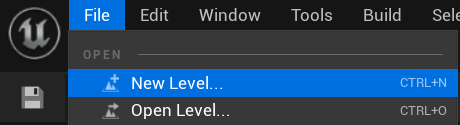
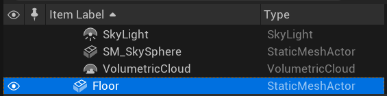
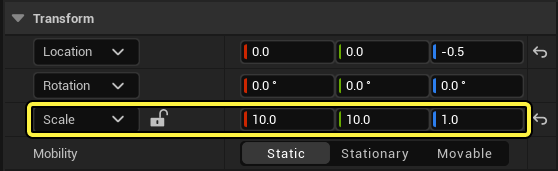
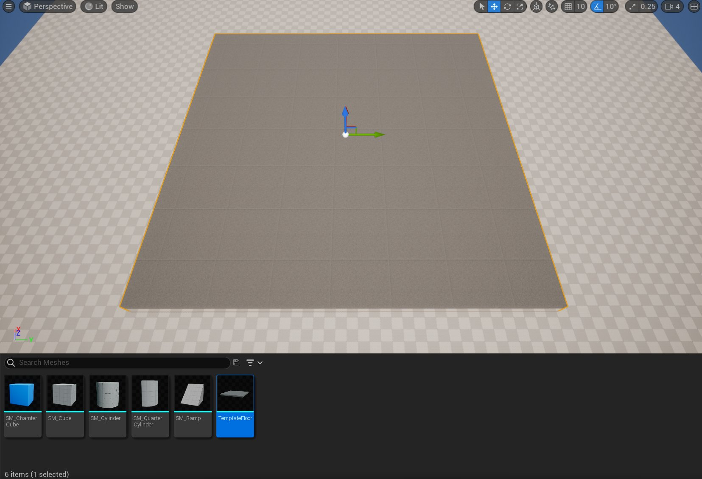
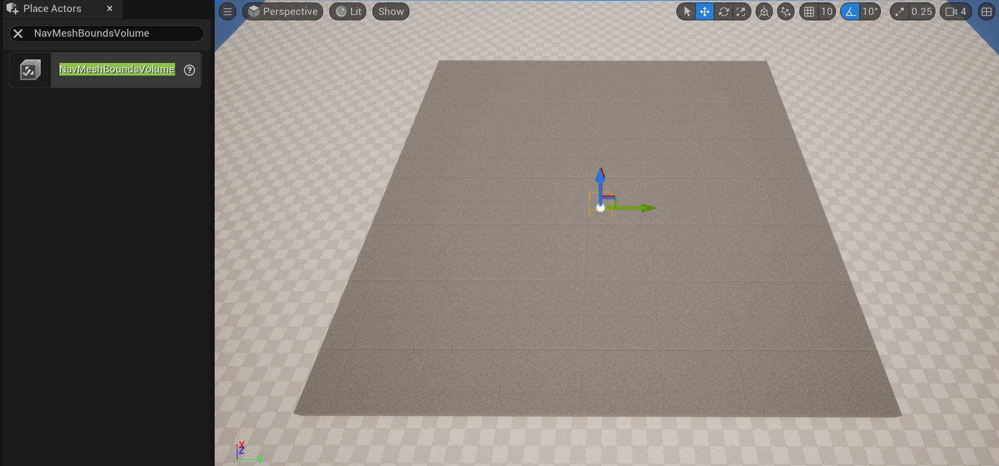

# 关于修改导航系统的准备指南

> 路径：虚幻引擎5.7文档 / Gameplay系统 / 人工智能 / 寻路系统 / 如何修改寻路网格体 / 关于修改导航系统的准备指南

> 原始页面：https://dev.epicgames.com/documentation/unreal-engine/modifying-the-navigation-mesh-preparation-guide-in-unreal-engine

## 概述

本文档将指导你完成创建关卡和AI代理的初步步骤，以演示可以修改导航系统的不同方法。

或者，也可以下载[完整示例项目](https://d1iv7db44yhgxn.cloudfront.net/documentation/attachments/d072fb01-ab85-449e-84df-8dc27bb9c375/navsystemsample.zip)，其中包含本指南所涵盖的所有资料。

## 目的

- 创建简单关卡，并通过在关卡中放入导航网格体边界体积Actor来添加导航。
- 将ThirdPersonCharacter蓝图修改为使用导航系统在关卡中四处游走。

## 1 - 必要设置

1. 在菜单的 **新建项目类别（New Project Categories）** 分段中，选择 **游戏（Games） > 第三人称（Third Person）** 模板。

   
2. 选择 **第三人称（Third Person）** 模板，然后点击 **下一步（Next）**。

   

### 阶段成果

你已创建新的第三人称项目，现在可以开始使用导航网格体构建基本关卡。

## 2 - 创建测试关卡

1. 点击菜单栏上的 **文件（File）>新关卡（New Level）**。

   
2. 选择 **基本（Basic）** 关卡并点击 **创建（Create）** 。

   
3. 在 **大纲视图（Outliner）** 中，选择 **Floor** 静态网格体Actor，并从 **细节（Details）** 面板，将 **缩放（Scale）** 设置为X = 10、Y = 10、Z = 1。

   

   
4. 在 **内容浏览器（Content Browser）** 中，转到 **关卡原型（LevelPrototyping） > 网格体（Meshes）**，并将 **TemplateFloor** 静态网格体拖到关卡中。

   
5. 转到 **放置Actor（Place Actors）** 面板，搜索 **导航网格体边界体积（Nav Mesh Bounds Volume）**。将其拖到关卡中，并放在地板网格体上方。

   
6. 选择 **导航网格体边界体积（Nav Mesh Bounds Volume）** 后，转到 **细节（Details）** 面板，将 **缩放（Scale）** 设置为X = 20、Y= 20、Z = 5，以覆盖整个地板区域。默认情况下，虚幻引擎将自动在导航边界内生成导航。Navmesh Actor **RecastNavMesh-Default** 应该也已添加到关卡中。按 **P** 键以在关卡中可视化导航网格体。

   > [!NOTE]
   > 如果未生成导航，请转到"项目设置（Project Settings） > 导航系统（Navigation System）"，并启用"自动创建导航数据（Auto Create Navigation Data）"复选框。

   > 图片已省略：Set the Scale to X = 20, Y = 20, Z = 5

   > 图片已省略：The Navigation Mesh now covers the entire floor
7. 转到 **放置Actor（Place Actors）** 面板，在 **基本（Basic）** 类别下，将 **立方体（Cube）** 静态网格体 Actor拖到关卡中。

   > 图片已省略：Drag the Cube Static Mesh Actor into your Level
8. 选择 **立方体（Cube）** 之后，转到 **细节（Details）** 面板，将 **缩放（Scale）** 设置为X=1、Y=1、Z=5。

   > 图片已省略：Set the Scale to X = 1, Y = 1, Z = 5

   > 图片已省略：The Cube is now rescaled
9. 将另外三个 **立方体** 拖到关卡中，并按上述立方体的参数进行缩放。将其放在地板四周，创建四个支柱，如下所示。

   > 图片已省略：Drag three more Cubes into the level and scale them like the one above
10. 接下来，在中间添加一段楼梯和一个平台。在 **内容浏览器（Content Browser）** 中，转到 **第三人称（ThirdPerson） > 网格体（Meshes）**，并将 **Linear_Stair_StaticMesh** 拖到关卡中。

    > 图片已省略：Add a stair and a platform in the middle
11. 选择楼梯之后，转到 **细节（Details）** 面板，将 **缩放（Scale）** 设置为X=1. 5、Y=1、Z=1. 3。

    > 图片已省略：Set the Scale to X = 1.5, Y = 1, Z = 1.3
12. 选择楼梯之后，按住 **Alt** 键的同时拖动网格体以进行复制。

    > 图片已省略：Duplicate the stairs mesh
13. 转到 **放置Actor（Place Actors）** 面板，在 **形状（Shapes）** 类别下，将 **立方体（Cube）** 静态网格体 Actor拖到关卡中。转到 **细节（Details）** 面板，将 **缩放（Scale）** 设置为X = 14、Y= 4、Z = 0.1。将Actor放在楼梯边缘以创建平台，如下所示。

    > 图片已省略：Drag a Cube Static Mesh Actor into your Level and set the scale to X = 14, Y = 4, Z = 0.1
14. 转到 **放置Actor（Place Actors）** 面板，在 **基本（Basic）** 类别下，将 **球体（Sphere）** 静态网格体 Actor拖到关卡中。

    > 图片已省略：Drag a Sphere Static Mesh Actor into your Level
15. 选择 **球体** 之后，转到 **细节（Details）** 面板，并从 **碰撞（Collision）** 分段，将 **碰撞预设（Collision Presets）** 设置为 **无碰撞（No Collision）**。

    > 图片已省略：Set the Collision Presets to No Collision
16. 最后，复制球体，并将其放在关卡中的四周，如下所示。

    > 图片已省略：Duplicate the spheres and place them around your Level

### 阶段成果

在本分段中，你创建了一个简单的关卡，并添加了一个导航网格体边界体积。你还添加了五个球体，用于充当代理的目标Actor。

## 3 - 创建代理

在本分段中，你将创建一个将在一系列目标Actor之间移动的AI代理。

1. 在 **内容浏览器（Content Drawer）** 中，右键点击并选择 **新建文件夹（New Folder）**，以新建文件夹。将文件夹命名为 **NavigationSystem**。
2. 在 **内容浏览器中**，转到 **ThirdPersonBP > 蓝图（Blueprints）**，然后选择 **ThirdPersonCharacter** 蓝图。将其拖到 **NavigationSystem** 文件夹中，并选择选项 **复制到此处（Copy Here）**。

   > 图片已省略：Copy the Third Person Character Blueprint to the Navigation System folder
3. 转到 **NavigationSystem** 文件夹并将蓝图重命名为 **BP_NPC_ModNavMesh**。双击蓝图在蓝图编辑器中将其打开，并转到 **事件图表（Event Graph）**。选择所有输入节点并将其删除。
4. 右键点击 **事件图表（Event Graph）**，然后搜索并选择 **添加自定义事件（Add Custom Event）**。将事件命名为 **MoveNPC**。

   > 图片已省略：Right click the Event Graph, then search for and select Add Custom Event. Name it Move NPC
5. 转到 **我的蓝图（My Blueprint）** 面板，然后点击 **变量（Variables）** 旁边的 **加号(+)** 按钮创建新变量。将变量命名为 **TargetList**。

   > 图片已省略：Create a new variable and name it Target List
6. 转到 **细节（Details）** 面板并点击 **变量类型（Variable Type）** 旁边的下拉列表。搜索并选择 **Actor > 对象引用（Object Reference）**。

   > 图片已省略：Set the variable type to Actor Object Reference
7. 点击Actor选择旁边的 **蓝色球体** 图标，然后点击 **数组（Array）** 选项，如下所示。点击 **实例可编辑（Instance Editable）** 复选框将其启用。

   > 图片已省略：Click the blue sphere icon next to Actor selection and click the Array option

   > 图片已省略：Click the Instance Editable checkbox to enable it
8. 将 **TargetList** 变量拖动到 **事件图表（Event Graph）**，然后选择选项 **Get TargetList**。
9. 从 **TargetList** 节点拖出，然后搜索并选择 **上一个索引（Last Index）**。

   > 图片已省略：Drag from the TargetList node, then search for and select Last Index
10. 从 **TargetList** 节点拖出，然后搜索并选择 **Get (a copy)**。

    > 图片已省略：Drag from the TargetList node and search for and select Get a copy
11. 从 **Get** 节点的 **绿色** 引脚拖出，然后搜索并选择 **区间内的随机整数（Random Integer in Range）**。将 **Last Index** 节点的 **绿色** 引脚连接到 **Random Integer in Range** 节点，如下所示。

    > 图片已省略：Drag from the green pin of the Get node, then search for and select Random Integer in Range

    > 图片已省略：Connect the green pin of the Last Index node to the Max pin of the Random Integer in Range node
12. 从 **Get** 节点拖出，然后搜索并选择 **提升到变量（Promote to variable）**。将变量命名为 **CurrentTarget**，并将其连接到 **MoveNPC** 节点。

    > 图片已省略：Drag from the Get node, then search for and select Promote to variable

    > 图片已省略：Name the variable Current Target and connect it to the Move NPC node
13. 从 **CurrentTarget** 节点拖出，然后搜索并选择 **有效（Is Valid）**。将 **IsValid** 宏节点连接到 **Set CurrentTarget** 节点。

    > 图片已省略：Drag from the CurrentTarget node, then search for and select Is Valid

    > 图片已省略：Connect the IsValid macro node to the Set CurrentTarget node
14. 将 **CurrentTarget** 变量拖动到 **事件图表（Event Graph）** 中，然后选择 **获取当前目标（Get Current Target）**。从 **CurrentTarget** 节点拖出，然后搜索并选择 **获取Actor位置（Get Actor Location）**。

    > 图片已省略：Drag from the CurrentTarget node, then search for and select Get Actor Location
15. 从 **GetActorLocation** 节点的 **返回值（Return Value）** 拖出，然后搜索并选择 **获取半径内的随机可达点（Get Random Reachable Point In Radius）**。将 **半径（Radius）** 设置为 **100**。

    > 图片已省略：Drag from the Return Value of the GetActorLocation node, then search for and select Get Random Reachable Point In Radius

    > 图片已省略：Set the Radius value to 100
16. 从 **GetRandomReachablePointInRadius** 节点的 **随机位置（Random Location）** 引脚拖出，然后选择 **提升到变量（Promote to Variable）**。将变量命名为 **RandomLocation**。将 **RandomLocation** 节点连接到 **IsValid** 节点，如下所示。

    > 图片已省略：Drag from the Random Location pin of the GetRandomReachablePointInRadius node and select Promote to variable. Name the variable Random Location

    > 图片已省略：Connect the RandomLocation node to the IsValid node
17. 从 **RandomLocation** 节点拖出，然后搜索并选择 **AO移动至（AI MoveTo）*。

    > 图片已省略：Drag from the Random Location node, then search for and select AI MoveTo
18. 从 **AI MoveTo** 节点的 **Pawn** 引脚拖出，然后搜索并选择 **获取对自身的引用（Get a reference to self）**。将 **RandomLocation** 节点的 **黄色** 引脚连接到 **AI MoveTo** 节点的 **目的地（Destination）** 引脚。最后，将 **AI MoveTo** 节点的 **接受半径（Acceptance Radius）** 设置为50，如下所示。

    > 图片已省略：Drag from the Pawn pin of the AI MoveTo node, then search for and select Get a reference to self

    > 图片已省略：Connect the yellow pin of the Random Location node to the Destination pin of the AI MoveTo node
19. 从 **AI Move To** 节点的 **成功时（On Success）** 引脚拖出，然后搜索并选择 **延迟（Delay）**。将节点 的 **时长（Duration）** 设置为4。从 **Delay** 节点的 **已完成（Completed）** 引脚拖出，然后搜索并选择 **MoveNPC**，如下所示。

    > 图片已省略：Drag from the On Success pin of the AI Move To node, then search for and select Delay. Set the Duration to 4. Drag from the Delay node and add a Move NPC node
20. 重复上述步骤，以将这些节点添加到 **AI Move To** 节点的 **失败时（On Fail）** 引脚。将 **Delay** 节点的 **时长（Duration）** 设置为0.1。

    > 图片已省略：Repeat the steps above to add the nodes to the On Fail pin of the AI Move To node. Set the Duration of the Delay node to 0.1
21. 右键点击 **事件图表（Event Graph）**，然后搜索并选择 **事件开始播放（Event Begin Play）**。从 **Event Begin Play** 节点拖出，然后搜索并选择 **MoveNPC**。

    > 图片已省略：Right-click the Event Graph, then search for and select Event Begin Play

    > 图片已省略：Drag from the Event Begin Play node, then search for and select Move NPC
22. **编译（Compile）** 并 **保存（Save）** 蓝图。
23. 将 **BP_NPC_ModNavMesh** 蓝图拖到关卡中，并在 **细节（Details）** 面板下，找到 **目标列表（Target List）**，然后点击 **添加(+)** 按钮以添加新的目标Actor。

    > 图片已省略：Drag your BP_NPC_ModNavMesh Blueprint into your Level

    > 图片已省略：In the Details panel find the Target List and click the Add button to add a new target Actor
24. 点击下拉列表，然后搜索并选择之前创建的 **球体（Sphere）**Actor。

    > 图片已省略：Click the dropdown, then search for and select the Sphere Actor
25. 重复上一步，添加剩余四个 **球体（Sphere）**Actor。

    > 图片已省略：Repeat the step above to add the remaining four Sphere Actors
26. 点击 **模拟（Simulate）**，查看代理如何在关卡中的目标之间游走。

    > 动图已省略：Click Simulate to see your Agent roam between goals in your Level

### 阶段成果

在本小节中，你创建了一个在一系列目标Actor之间游走的代理。现在，你可以继续学习[修改导航系统](../overview-of-how-to-modify-the-navigation-mesh/index.md)了。
