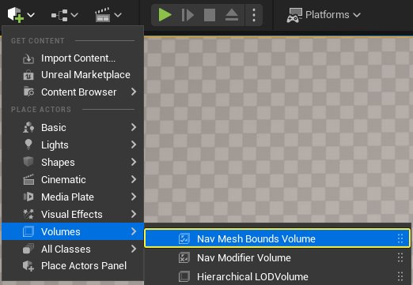
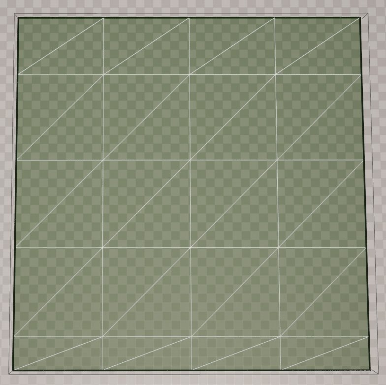
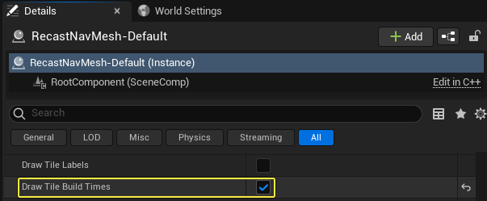
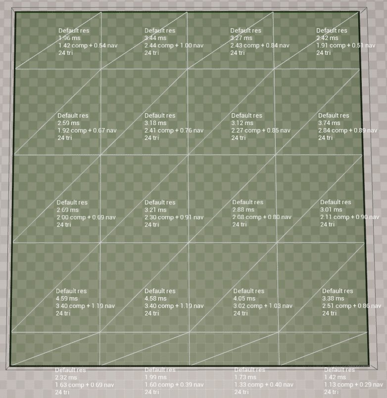
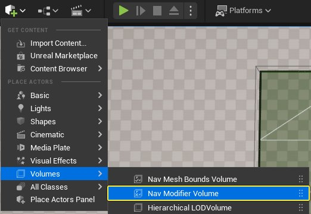
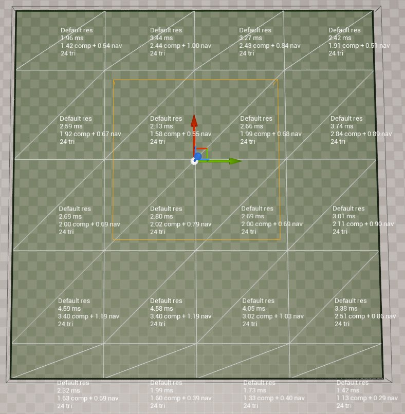
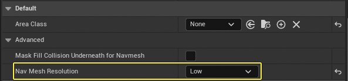
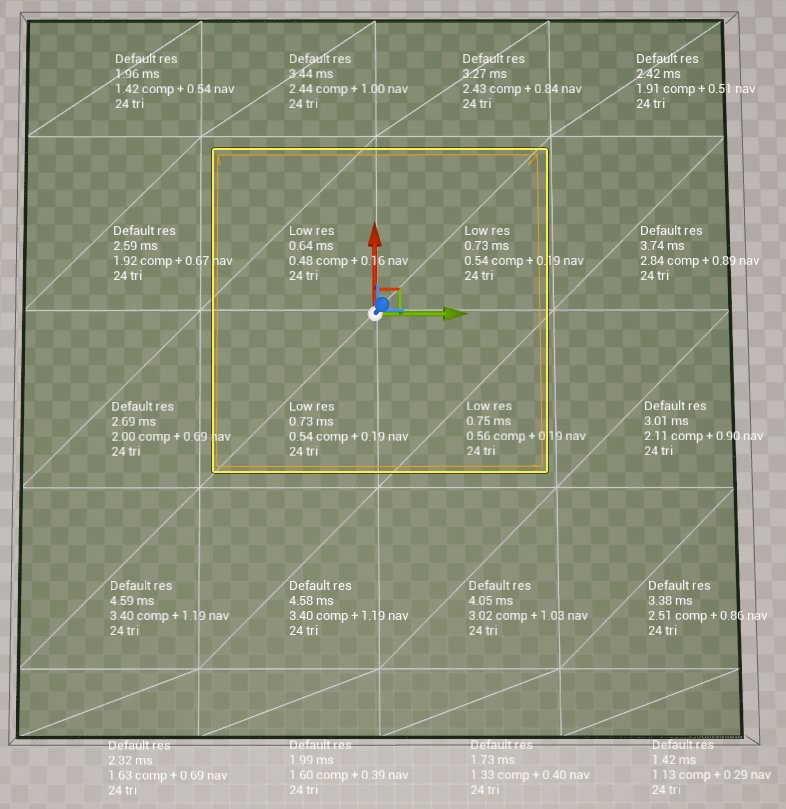

# 寻路网格体分辨率用户指南

> 路径：虚幻引擎5.7文档 / Gameplay系统 / 人工智能 / 寻路系统 / 寻路网格体分辨率用户指南

> 原始页面：https://dev.epicgames.com/documentation/unreal-engine/navigation-mesh-resolutions-user-guide

## 概述

通过 **寻路网格体分辨率（Navigation Mesh Resolutions）** 功能，用户可以在同一寻路网格体中以3种不同的分辨率生成寻路网格体图块。现在，用户可以在高、中（默认）、低三种精度设置下生成图块组，这样可以提升运行时动态寻路网格体的生成速度。

在此实例中，寻路网格体分辨率是指为覆盖指定寻路空间而生成的单元的精度和数量。例如，高分辨率图块可以用更多的多边形细分给定空间，以更好地模拟空间形状。然而，低分辨图块将使用更少的多边形覆盖相同的空间。这样可以更快地生成图块，但代价是牺牲精度。

### 常见用例

在以下用例中，用户可以从此功能中受益：

| 用例 | 说明 |
| --- | --- |
| **提升生成速度** | 当使用动态寻路网格体时，在AI艾真体不需要良好寻路精度的开放空间或区域，使用低分辨率图块。仅在AI艾真体需要在障碍物之间的更小空间寻路的密集区域，使用默认或高分辨率图块。 |
| **减少内存占用** | 相比使用默认或高分辨率图块，将低分辨率图块用于寻路网格体可减少内存占用。对于在内存有限的硬件设备（如手机）上运行的游戏，这很有帮助。 |

## 在寻路网格体中应用多种分辨率

1. 依次点击 **添加+（Add +） > 体积（Volumes） > 寻路网格体边界体积（Nav Mesh Bounds Volume）** ，在你的关卡中放置 **寻路网格体边界体积（Navigation Mesh Bounds Volume）** 。按'**P**'可直观查看寻路网格体。

   

   
2. 在 **大纲视图（Outliner）** 窗口中，选择 **RecastNavMesh-Default** Actor。前往 **细节（Details）** 面板，并 **启用** **绘制图块构建时间（Draw Tile Build Times）** 复选框。这样可显示构建每个寻路网格体图块所需的时间（以毫秒为单位）。

   

   
3. 依次点击 **添加+（Add +） > 体积（Volumes） > 寻路修饰体积（Nav Modifier Volume）** ，将 **寻路修饰体积（Navigation Modifier Volume）** 放置到你的关卡中。放置你的修饰体积，以便其与多个寻路网格体图块重叠。

   

   
4. 选定 **寻路修饰（Navigation Modifier）** 体积后，前往 **细节（Details）** 面板，然后，点击 **寻路网格体分辨率（Nav Mesh Resolution）** 下接菜单，选择 **低（Low）** 。你可以看到寻路修饰体积中的构建时间如何大幅缩短。

   

   
5. 使用Actor蓝图中的 **寻路修饰（Nav Modifier）** 组件，你可以修改寻路网格体图块分辨率。添加NavModifier组件，然后前往 **细节（Details）** 面板。从 **寻路网格体分辨率（Nav Mesh Resolution）** 下拉菜单中，选择所需分辨率。

   > 图片已省略：将NavModifier组件添加到蓝图Actor

   > 图片已省略：从寻路网格体分辨率下拉菜单选择所需的分辨率
6. 在下方示例中，我们创建了Actor蓝图，并添加了 **NavModifier** 组件。然后，我们选择了 **低（Low）** 分辨率设置。注意，当沿着 **寻路网格体（Navigation Mesh）** 体积拖动Actor时，寻路图块发生了重建。

   > 动图已省略：当我们移动Actor时，寻路网格体图块实时重建

## 寻路网格体分辨率可以影响艾真体寻路

寻路网格体图块分辨率可以影响AI艾真体寻路路径。当艾真体必须在近距离障碍物之间或狭窄空间寻路时，尤其如此。

在下图中，我们向寻路网格体添加了3个障碍物，并将图块分辨率设置为 **低（Low）** 。注意，底部两个障碍物之间是没有可用路径。这是因为没有足够的分辨率可用于在这些障碍物之间创建多边形。

> 图片已省略：艾真体无法在底部两个障碍物之间移动

在下面的示例中，我们将图块分辨率更改为 **默认（Default）** 。此分辨率支持更高密度的多边形，使得底部两个障碍物之间有可用路径。在此示例中，艾真体可以在这些障碍物之间寻路，并且其路径经过优化（直线）。

> 图片已省略：艾真体现在可以在底部两个障碍物之间移动

## 最优设置

你可以通过以下步骤更改寻路网格体图块分辨率设置：

1. 点击 **设置（Settings） > 项目设置（Project Settings）** ，打开 **项目设置（Project Settings）** 。

   > 图片已省略：打开项目设置
2. 点击 **寻路网格体（Navigation Mesh）** 类别，向下滚动至 **生成（Generation）** 分段。展开 **寻路网格体分辨率参数（Nav Mesh Resolution Params）** 结构体，查看每种分辨率级别的设置。

   > 图片已省略：展开寻路网格体分辨率参数结构体
3. 现在，你可以更改每种分辨率级别的 **单元尺寸（Cell Size）** 。单元尺寸越大，生成速度越快。

   > 图片已省略：更改每种分辨率级别的单元尺寸

> [!NOTE]
> 为实现最优性能，你可以将每个单元尺寸设置为彼此的倍数，并确保 **图块尺寸UU（Tile Size UU）** 能够被所有 **单元尺寸（Cell Sizes）** 整除。

## 调试工具

在 **大纲视图（Outliner）** 窗口中，选择 **RecastNavMesh-Default** Actor，并前往 **细节（Details）** 面板，你可以访问寻路网格体图块分辨率调试工具。

## 绘制图块分辨率

启用 **绘制图块分辨率（Draw Tile Resolutions）** 复选框，以不同的颜色呈现每个图块的分辨率。下表显示了每种颜色与图块分辨率的关系。

| 分辨率 | 颜色 |
| --- | --- |
| **蓝色** | 低分辨率。 |
| **绿色** | 默认分辨率。 |
| **黄色** | 高分辨率。 |

> 图片已省略：启用绘制图块分辨率复选框

> 图片已省略：每种图块颜色代表不同的分辨率

## 构建时间热图

你可以启用 **绘制图块构建时间热图（Draw Tile Build Times Heat Map）** 复选框，在你的寻路网格体中呈现图块构建时间热图。每种颜色代表一个构建时间范围，淡蓝色代表低水平构建时间，红色代表高水平构建时间。

> 图片已省略：启用绘制图块构建时间热图复选框

> 图片已省略：寻路网格体中显示的构建热图
