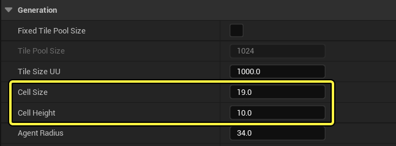
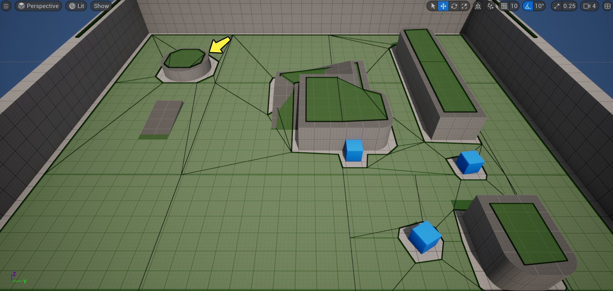
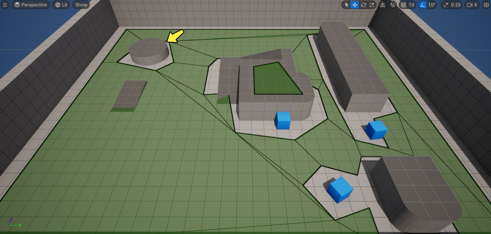
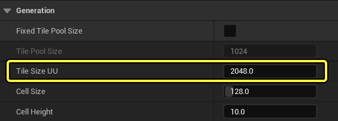
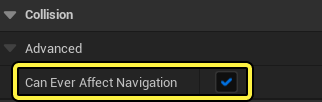
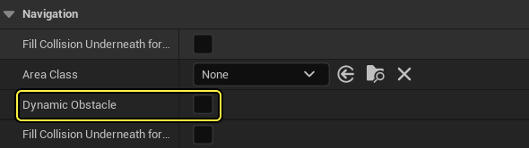

# 优化寻路网格体的生成速度

> 路径：虚幻引擎5.7文档 / Gameplay系统 / 人工智能 / 寻路系统 / 优化寻路网格体的生成速度

> 原始页面：https://dev.epicgames.com/documentation/unreal-engine/optimizing-navigation-mesh-generation-speed-in-unreal-engine

> [!NOTE]
> 本指南的最新版本位于虚幻引擎本地安装中的以下目录下：`Engine\Source\Runtime\NavigationSystem\DevDocs\How To Optimize Navmesh Generation.md`

## 概述

虚幻引擎的 **寻路系统** 向人工智能代理提供了寻路功能。为了能够找到开始位置和目的地之间的路径，从世界的碰撞几何结构生成了 **寻路网格体**。

寻路网格体划分为图块，图块用于在运行时重建寻路网格体的本地化部件。

寻路系统提供了各种设置，可供高级用户用于修改在关卡中计算寻路的方式。本指南提供了优化寻路网格体生成速度的建议。

## 使用尽可能最大的单元格大小和单元格高度

**单元格大小** 和 **单元格高度** 属性定义了用于生成寻路图块的体素大小。体素越小，获得的精度就越高，寻路也就能越准确地绕过障碍物。但是，体素越小，在运行时重建寻路网格体时就需要越多的处理。

为此，请务必在设置单元格（体素）大小时考虑项目中所需的寻路精度，求得均衡。

按照以下步骤操作，调整寻路网格体的"单元格大小"和"单元格高度"属性：

1. 点击 **设置（Settings） > 项目设置（Project Settings）**，打开 **项目设置（Project Settings）** 窗口。

   
2. 转到 **寻路网格体（Navigation Mesh）** 分段，并向下滚动到 **生成（Generation）** 分段。你可以提高 **单元格大小（Cell Size）** 和 **单元格高度（Cell Height）** 值，以提高生成速度。注意，提高"大小"和"高度"值会降低关卡中的寻路网格体精度。

   
3. 或者，也可以在 **世界大纲视图（World Outliner）** 中选择 **RecastNavMesh-Default** Actor并转到 **细节（Details）** 面板，调整关卡中的个别寻路网格体。

   
4. 在本示例中，**单元格大小（Cell Size）** 从 **19** 更改为 **64**。注意，精度会降低，并且寻路网格体在关卡中的对象周围也不够准确。新的"单元格大小"为64，这将阻止在墙壁和箱子之间生成寻路（参见下图中的箭头）。

图块大小为19

图块大小为64

### 建议

在维护代理所需精度的同时，使单元格尽可能大。

在上述示例中，将 **单元格大小（Cell Size）** 设置为64，导致移除了墙壁和箱子之间的路径。如果代理需要此路径，你可以继续调整 **单元格大小（Cell Size）**，直至生成路径为止，或者将箱子移到离墙壁更远的位置。

## 限制图块大小

寻路网格体划分为图块，图块用于在运行时重建寻路网格体的本地化部件。由于每个图块都是根据单元格构建的，重建寻路图块将导致使用新的碰撞信息重新创建其所有单元格。

相较于较小的图块，较大的图块包含更多单元格，重建的成本更高。不过，在处理图块时，系统还会处理图块边缘上的连续单元格。在设置图块大小时，还应考虑这一间接成本，因为有些情况下，处理许多较小图块的间接成本超过了重建单一大图块的成本。

### 建议

**图块大小（Tile Size）** 应设置为每侧 **32** 到**128个单元格**。若在运行时重建图块，这将提供最佳性能。

在之前的示例中，**单元格大小（Cell Size）** 设置为 **64**。在该情况下，**图块大小UU（Tile Size UU）** 应设置为介于 **2048**(64*32) 到 **8192**(64*128)之间。

## 为网格体使用简化的碰撞

寻路系统会使用每个对象的碰撞数据生成寻路网格体。相较于更高的三角形计数碰撞数据，更简单的对象碰撞处理起来会更快。

### 建议

尽可能为静态网格体使用 **简单碰撞（Simple Collision）**。碰撞网格体中使用的三角形计数越低，生成速度就越快。

## 降低会影响寻路网格体的对象数

默认情况下，关卡中的蓝图Actor和静态网格体会影响寻路。如果对象数会影响到寻路图块，那就会直接影响生成该图块的成本。

### 建议

应该配置不会影响寻路网格体的较小对象，这样它们就不会影响寻路。在关卡中选择你的Actor，并转到 **细节（Details）** 面板。向下滚动到 **碰撞（Collision）** 分段，并 **禁用** **可能会影响寻路（Can Ever Affect Navigation）** 复选框。

对于不会影响寻路网格体的任何Actor，例如，在关卡中不可达区域中移动对象，应该禁用此设置。

你应该尽可能避免影响大的图块区域或同时影响多个图块。

## 使用开发人员工具来管理寻路生成

### 在战略性时间锁定和解锁寻路网格体生成

可以停止自动生成寻路网格体，以防加载过多可能影响它的资产。所有资产都完成加载后，即可解锁生成。此方法可防止寻路系统多次重建相同图块。

要锁定寻路网格体生成，请将寻路系统的 **bInitialBuildingLocked** 设置为 **True**。要解锁生成，请调用函数 **ReleaseInitialBuildingLock()**。解锁后，寻路网格体就会重建由已加载资产标记为脏的所有图块。要防止这种情况，可以在解锁生成之前调用 **DefaultDirtyAreasController.Reset()**。

### 启用多线程寻路网格体生成

可以通过在寻路系统中设置 **MaxSimultaneousTileGenerationJobsCount** 属性，以控制多线程寻路网格体生成。注意，此属性的值不能超过 **FRecastNavMeshGenerator::Init()** 中的工作程序线程总数。

### 将动态障碍物用于完全动态寻路网格体生成

可以将关卡中的静态网格体和其他Actor标记为 **动态障碍物（Dynamic Obstacles）**。动态障碍物标记了寻路网格体表面上需要重建生成的地方。这可防止重建整个寻路图块。

使用此方法的成本低于生成完整寻路图块，因此在移动障碍物时，如果不需要寻路网格体表面，就应使用此方法。

### 将数据区块流送用于子关卡中加载的静态寻路网格体

如果对寻路网格体的唯一更改来自加载和卸载子关卡，你可以将寻路网格体生成方法设置为 **静态（Static）** 并使用 **寻路网格体数据区块流送（NavMesh Data Chunk Streaming）**，而不是使用动态寻路网格体。

使用此方法，寻路网格体将完全在编辑器中构建，并且只有相关部件才会在运行时加载进出。
