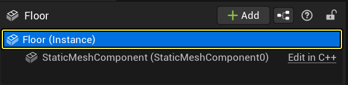
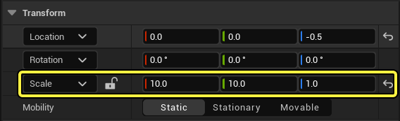
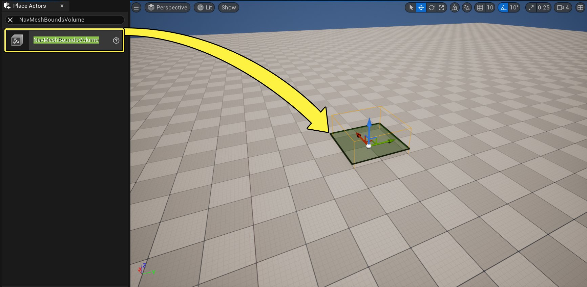
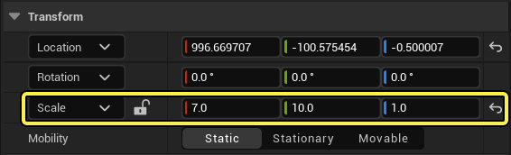

# 在寻路系统中使用避障机制

> 路径：虚幻引擎5.7文档 / Gameplay系统 / 人工智能 / 寻路系统 / 在寻路系统中使用避障机制

> 原始页面：https://dev.epicgames.com/documentation/unreal-engine/using-avoidance-with-the-navigation-system-in-unreal-engine

## 概述

**虚幻引擎的** **寻路系统（Navigation System）** 可以借助 **寻路网格体（Navigation Mesh）** 让代理（Agent）在关卡中实现寻路。

寻路机制可以在静态对象周围生成路径，而避障算法主要用于处理移动障碍物。AI代理有两种方法来绕开移动障碍物，或在彼此间避障，分别是 **相对速度障碍物算法（Reciprocal Velocity Obstacles，即RVO）** 和 **群组绕行管理器（Detour Crowd Manager）**。

**相对速度障碍物算法** 系统会计算每个代理的速度向量，避免和附近的其他代理碰撞。该系统会查看附近的代理，并假定它们在计算的每一步内都以恒速移动。根据代理向目标移动的速度，会选择最佳的速度向量进行匹配。

虚幻引擎中的RVO系统进行了优化，减少所需的帧率要求。其他的优化项还有避免重复计算恒定路径，并提供优先级系统来解决可能的碰撞。RVO不使用寻路网格体进行避障，因此它无需寻路系统即可用于代理。该系统包含在角色类的 **角色移动（Character Movement）** 组件中。

**群组绕行管理器（Detour Crowd Manager）** 系统通过自适应RVO采样计算来解决代理之间的规避问题。它会计算一个粗略的速度采样，并且着重在代理的移动方向，相较于传统的RVO规避方式，显著提升规避性能。该系统还使用可见度和拓扑路径优化项，进一步提升碰撞规避。

群组绕行管理器系统可以高度配置特定示例模式选项、最大代理数和代理半径。该系统包括在 **群组绕行AI控制器（DetourCrowd AI Controller）** 类中，可以和任意Pawn类一起使用。

两种系统各自独立工作，在你的项目中只能使用其中一种。

### 进一步对比避障方式

| 方法 | 描述 | 局限性 |
| --- | --- | --- |
| 相对速度障碍物算法 | 代理使用特定半径内的速度向量规避障碍物。 包含在角色类的角色移动（Character Movement）组件中。 | 相较于群组绕行管理器更难配置。 仅限于角色类中。 不使用寻路网格体进行规避，因此代理可能会任性地"出走"。 |
| 群组绕行管理器 | 代理通过路径优化和特定半径内的速度向量规避障碍物。 包含在群组绕行AI控制器（DetourCrowd AI Controller）类中。\| 在项目设置中定义了固定的最大代理数量。 | 在项目设置中定义了固定的最大代理数量。 |

## 目标

在本指南中，你可以通过比较多个代理的交互行为，了解如何使用相对速度障碍物算法和群组绕行管理器这两种规避方式。

## 任务

- 调整第三人称角色蓝图（ThirdPersonCharacter Blueprint），以便导航至目标。
- 调整代理蓝图（Agent Blueprint），以便使用RVO规避。
- 调整代理蓝图，以便使用群组绕行规避。

## 1 - 所需设置

1. 在虚幻项目浏览器的 **新项目类型（New Project Categories）** 分段中，选择 **游戏（Games）> 第三人称（Third Person）** 模板。

   
2. 选择 **蓝图（Blueprint）** 和 **不带初学者内容包（No Starter Content）** 并点击 **创建（Create）**。

   

### 阶段成果

你创建了一个新的第三人称游戏项目，以便继续了解虚幻引擎中提供的避障方式。

## 2 - 创建测试关卡

1. 点击菜单栏上的 **文件>新建关卡（File > New Level）**。

   
2. 选择 **默认（Default）** 关卡。

   
3. 在 **大纲视图（Outliner）** 中选择 **Floor** 静态网格体Actor，在下方的 **细节（Details）** 面板中，将 **缩放（Scale）** 设置为X = 10, Y = 10, Z = 1。

   

   
4. 来到 **放置Actor（Place Actors）** 面板，找到 **导航网格体边界体积（Nav Mesh Bounds Volume）**。将它拖拽到关卡中并放置在地面网格体（floor mesh）上。将 **导航网格体边界体积** 的缩放调整至X = 7, Y=10, Z = 1。

   

   
5. 来到 **放置Actor（Place Actors）** 面板，从 **形状（Basic）** 分类中拖拽两个 **球体（Sphere）** Actor到关卡中。

   > 图片已省略：Drag two Sphere Actors into the Level

### 阶段成果

在这一部分中，你创建了一个新的关卡，并添加了寻路网格体。你还添加了两个球体Actor，它们将会作为代理的移动目标。

## 3 - 创建代理

1. 在 **内容侧滑菜单（Content Drawer）** 中，右键点击选择 **新建文件夹（New Folder）** 来创建一个新的文件夹，并将它命名为 **寻路系统（NavigationSystem）**。
2. 在 **内容侧滑菜单（Content Drawer）** 中，找到 **ThirdPerson > Blueprints** 并选择 **BP_ThirdPersonCharacter** 蓝图。将其拖拽到 **寻路系统（NavigationSystem）** 文件夹中并选择 **复制到这里（Copy Here）**。

   > 图片已省略：Drag the Third Person Character Blueprint to the Avoidance folder and select Copy Here
3. 打开 **寻路系统（NavigationSystem）** 文件夹，将蓝图重命名为**BP_NPC_NoAvoidance**。双击打开蓝图并找到 **事件图表（Event Graph）**。选择并删除所有输入节点。
4. 右击 **事件图表**，找到并选择 **添加自定义事件（Add Custom Event）**。将该事件命名为 **移动NPC（MoveNPC）**。

   > 图片已省略：Right-click the Event Graph, then search for and select Add Custom Event. Name the event Move NPC
5. 找到 **我的蓝图（My Blueprint）** 面板，点击 **变量（Variables）** 旁边的 **添加（Add）加号** 按钮创建一个新的变量。将该变量命名为 **目标（Target）**。

   > 图片已省略：Click the Add button next to Variables to create a new variable. Name the variable Target
6. 来到 **细节（Details）** 面板，点击 **变量类型（Variable Type）** 出现下拉菜单。搜索 **Actor** 并选择 **对象引用（Object Reference）**。勾选 **可编辑示例（Instance Editable）** 复选框。

   > 图片已省略：Set the Variable Type to Actor Object Reference

   > 图片已省略：Enable the Instance Editable checkbox
7. 将 **目标（Target）** 变量拖拽到 **事件图表（Event Graph）** 中并选择 **获取目标（Get Target）**。拖拽 **目标（Target）** 节点，然后搜索并选择 **是否有效（Is Valid）** 指令，如下图所示。

   > 图片已省略：Drag from the Target node, then search for and select the Is Valid macro
8. 右击 **事件图表（Event Graph）**，搜索并选择 **获得一个对自身的引用（Get reference to self）**。

   > 图片已省略：Right-click the Event Graph, then search for and select Get reference to self
9. 右击 **事件图表（Event Graph）**然后搜索并选择 **AI移动至（AI Move To）**。

   > 图片已省略：Right-click the Event Graph, then search for and select AI Move To
10. 将 **是否有效（Is Valid）** 节点的 **是否有效（Is Valid）** 引脚和 **AI移动至（AI Move To）** 节点连接起来。接着，将 **自身（Self）** 节点和 **AI移动至（AI Move To）** 节点的 **Pawn** 引脚连接起来。拖拽 **目标（Target）** 变量并和 **AI移动至（AI Move To）** 节点的 **目标Actor（Target Actor）** 引脚连接。

    > 图片已省略：Connect the Is Valid node to the AI Move To node. Connect the Target variable to the AI Move To node
11. 右键点击 **事件图表（Event Graph）**，搜索并选择 **事件开始运行（Event Begin Play）**。从 **事件开始运行（Event Begin Play）** 节点拖拽，搜索并选择 **移动NPC（MoveNPC）**。

    > 图片已省略：Right click the Event Graph, then search for and select Event Begin Play

    > 图片已省略：Drag from the Event Begin Play node, then search for and select Move NPC
12. **编译（Compile）** 并 **保存（save）** 蓝图。最终的蓝图效果如下所示。

    > 图片已省略：This is the final Blueprint setup
13. 将 **BP_NPC_NoAvoidance** 蓝图拖拽到关卡中。在 **细节（Details）** 面板中，打开 **目标（Target），** 旁边的下拉菜单，搜索并选择代理前方的那个 **球体（Sphere）** Actor。

    > 图片已省略：Drag the BP_NPC_NoAvoidance Blueprint into your Level

    > 图片已省略：Click the dropdown next to Target, then search for and select the Sphere Actor
14. 复制 **BP_NPC_NoAvoidance** 蓝图，如下所示。

    > 图片已省略：Duplicate the BP_NPC_NoAvoidance Blueprint
15. 重复最后两个步骤，在关卡另一边创建一组代理，并将放置在它们前面的 **球体（sphere）** 作为目标。
16. 点击 **模拟（Simulate）** 查看代理如何寻路至目标。注意观察没有避障系统时是如何在关卡中心创建碰撞的。

    > 动图已省略：Click Simulate and watch as the Agents navigate toward their goals

### 阶段目标

在这一部分中，你创建了一个没有使用避障系统寻路至目标的代理。

## 4 - 向代理添加相对速度障碍物算法

1. 在 **内容侧滑菜单（Content Drawer）** 中，右键点击 **BP_NPC_NoAvoidance** 蓝图并选择 **复制（Duplicate）**。将新蓝图命名为 **BP_NPC_RVO**。

   > 图片已省略：Duplicate the BP_NPC_NoAvoidance Blueprint and name it BP_NPC_RVO
2. 双击 **BP_NPC_RVO** 蓝图并在蓝图编辑器中打开。选择 **角色移动（Character Movement）** 组件，并且在 **细节（Details）** 面板中，找到 **角色移动：避障（Character Movement: Avoidance）** 分段。

   > 图片已省略：Select the Character Movement component

   > 图片已省略：Go to the Avoidance section
3. 勾选 **使用RVO避障（Use RVOAvoidance）** 复选框，将 **避障考虑半径（Avoidance Consideration Radius）** 调整为 **100**。

   > 图片已省略：Enable the Use RVOAvoidance checkbox and set Avoidance Consideration Radius to 100
4. **编译（Compile）** 并 **保存（save）** 该 **蓝图**。这样，你的代理就可以使用相对速度障碍物避障了。
5. 将多个 **BP_NPC_RVO** 蓝图拖拽到你的关卡中，并按照之前的步骤进行相同的配置。点击 **模拟（Simulate）** 查看结果。

   > 动图已省略：Drag several BP_NPC_RVO Blueprints to your Level and follow the same configuration as before

### 阶段成果

在这一部分中，你学习了如何向代理应用相对速度障碍物避障（RVO）。

## 5 - 向代理应用群组绕行避障

1. 在 **内容侧滑菜单（Content Drawer）** 中，右键点击 **BP_NPC_NoAvoidance** 蓝图并选择 **复制（Duplicate）**。将新蓝图命名为 **BP_NPC_DetourCrowd**。

   > 图片已省略：Duplicate the BP_NPC_NoAvoidance Blueprint and name it BP_NPC_DetourCrowd
2. 双击打开 **BP_NPC_DetourCrowd**。在 **细节（Details）** 面板中搜索 **AI控制器（AI Controller）**。

   > 图片已省略：Go to the Details panel and search for AI Controller
3. 打开 **AI控制器类（AI Controller Class）** 旁边的下拉菜单，选择 **群组绕行AI控制器（DetourCrowdAIController）**。

   > 图片已省略：Click the dropdown next to AI Controller Class and select Detour Crowd AI Controller
4. **编译（Compile）** 并 **保存（save）** 蓝图。这样，你的代理就可以使用群组绕行避障了。
5. 将几个 **BP_NPC_DetourCrowd** 蓝图拖拽到你的关卡中，并按照之前的步骤进行相同的配置。点击 **模拟（Simulate）** 查看结果。

   > 动图已省略：Drag several BP_NPC_DetourCrowd Blueprints to your Level and follow the same configuration as before
6. 你可以在 **设置>项目设置（Settings > Project Settings）** 中找到 **群组管理器（Crowd Manager）** ，调整 **群组绕行管理器（Detour Crowd Manager）** 设置。

   > 图片已省略：Click Project Settings
7. 在这一部分中，你可以调整 **群组绕行管理器（Detour Crowd Manager）** 系统中的一些设置，例如系统使用的 **最大代理数（Max Agents）** 以及用于避障计算的 **最大代理半径（Max Agent Radius）**。

   > 图片已省略：In this section you can adjust several settings for the Detour Crowd Manager system

## 阶段成果

在这一部分中，你学习了如何向代理应用群组绕行避障。
