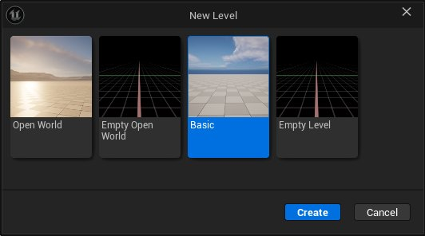
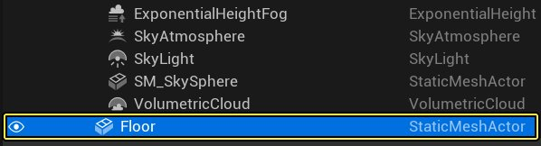
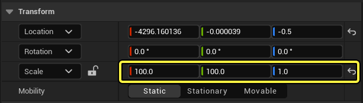
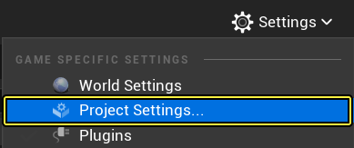
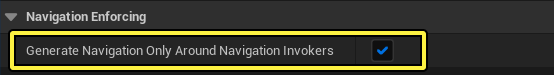

# 使用寻路调用程序

> 路径：虚幻引擎5.7文档 / Gameplay系统 / 人工智能 / 寻路系统 / 使用寻路调用程序

> 原始页面：https://dev.epicgames.com/documentation/unreal-engine/using-navigation-invokers-in-unreal-engine

## 概述

虚幻引擎的 **寻路系统** 允许代理使用 **寻路网格体** 寻路，以在关卡中寻路。除了寻路网格体的各种 **运行时生成** 方法之外，该系统还包含仅在特定目标周围本地构建寻路的方法。

**寻路调用程序（Navigation Invokers）** 是在运行时在代理周围生成寻路网格体的蓝图Actor组件。使用寻路调用程序，就无需在编辑器中构建寻路网格体，并且还可以限制在运行时生成的图块数。

寻路调用程序非常适合大型关卡，因为在编辑器中构建寻路网格体不切实际。

## 目标

在本指南中，你会学习将寻路调用程序用于代理，在游戏过程中生成寻路网格体。

## 任务

- 创建新的关卡，并配置寻路系统以使用寻路调用程序。
- 将ThirdPersonCharacter蓝图修改为使用寻路调用程序在关卡中四处游走。

## 1 - 必要设置

1. 在虚幻项目浏览器的 **新建项目类别（New Project Categories）** 分段中，选择 **游戏（Games）> 第三人称（Third Person）** 模板。

   
2. 选择 **蓝图（Blueprint）** 和 **无初学者内容包（No Starter Content）** 选项，然后点击 **创建（Create）**。

   

### 阶段成果

你已创建新的第三人称项目，现在可以开始学习寻路调用程序。

## 2 - 创建测试关卡

1. 点击菜单栏中的 **文件（File） > 新建关卡（New Level）**。

   
2. 选择 **基础（Basic）** 关卡。

   
3. 在 **世界大纲视图（World Outliner）** 中，选择 **Floor** 静态网格体Actor，并转到 **细节（Details）** 面板。将 **缩放** 设置为X = 100、Y = 100、Z = 1。

   

   
4. 点击 **设置（Settings） > 项目设置（Project Settings）**，并转到 **寻路系统（Navigation System）** 类别。启用 **仅在寻路调用程序周围生成寻路（Generate Navigation Only Around Navigation Invokers）** 复选框。

   

   
5. 转到 **寻路网格体（Navigation Mesh）** 类别，并向下滚动到 **运行时（Runtime）** 分段。点击 **运行时生成（Runtime Generation）** 下拉列表并选择 **动态（Dynamic）**。

   > 图片已省略：Click the Runtime Generation dropdown and select Dynamic
6. 转到 **放置Actor（Place Actors）** 面板，搜索 **寻路网格体边界体积（Nav Mesh Bounds Volume）**。将其拖入关卡，放置在地板网格体上。将 **寻路网格体边界体积（Nav Mesh Bounds Volume）** 缩放为X = 500、Y = 500、Z = 10。

   > 图片已省略：Drag the Nav Mesh Bounds Volume to the Level

   > 图片已省略：Set the Scale to X = 500, Y=500, Z = 10

### 阶段成果

在本分段中，你创建了新的关卡，并配置了寻路系统以使用寻路调用程序。

## 3 - 创建代理

1. 在 **内容侧滑菜单（Content Drawer）** 中，右键点击并选择 **新建文件夹（New Folder）**，以新建文件夹。将文件夹命名为 **NavigationSystem**。
2. 在 **内容侧滑菜单** 中，找到 **ThirdPerson > 蓝图（Blueprints）**，然后选择 **BP_ThirdPersonCharacter** 蓝图。将其拖到 **NavigationSystem** 文件夹中，并选择选项 **复制到此处（Copy Here）**。

   > 图片已省略：Drag the Third Person Character Blueprint to the Navigation System folder and select Copy Here
3. 找到 **NavigationSystem** 文件夹并将蓝图重命名为 **BP_NPC_Invoker**。双击打开蓝图类，然后找到 **事件图表（Event Graph）**。选择所有输入节点并将其删除。
4. 右键点击 **事件图表（Event Graph）**，然后搜索并选择 **添加自定义事件（Add Custom Event）**。将事件命名为 **MoveNPC**。

   > 图片已省略：Right-click the Event Graph, then search for and select Add Custom Event. Name the event Move NPC
5. 右键点击 **事件图表（Event Graph）**，然后搜索并选择 **获取Actor位置（Get Actor Location）**。

   > 图片已省略：Right-click the Event Graph, then search for and select Get Actor Location
6. 从 **GetActorLocation** 节点拖出，然后搜索并选择 **获取半径内的随机可达点（Get Random Reachable Point In Radius）**。将 **半径（Radius）** 设置为1000。

   > 图片已省略：Drag from the Get Actor Location node and search for and select Get Random Reachable Point In Radius
7. 从 **GetRandomReachablePointInRadius** 节点的 **随机位置（Random Location）** 引脚拖出，然后选择 **提升到变量（Promote to Variable）**。

   > 图片已省略：Drag from the Random Location pin of the Get Random Reachable Point In Radius node and select Promote to variable
8. 将 **MoveNPC** 节点连接到刚才创建的 **RandomLocation** 节点。

   > 图片已省略：Connect the Move NPC node to the Random Location node
9. 右键点击 **事件图表（Event Graph）**，然后搜索并选择 **AI移动至（AI Move To）**。将 **RandomLocation** 节点连接到 **AI Move To** 节点。

   > 图片已省略：Right-click the Event Graph, then search for and select AI Move To
10. 右键点击 **事件图表（Event Graph）**，然后搜索并选择 **获取对自身的引用（Get a reference to self）**。

    > 图片已省略：Right-click the Event Graph, then search for and select Get a reference to self
11. 将 **Self** 节点连接到 **AI Move To** 节点的 **Pawn** 引脚。将 **Random Location** 节点的 **黄色** 引脚连接到 **AI Move To** 节点的 **目的地（Destination）** 引脚，如下所示。

    > 图片已省略：Connect the Self node to the Pawn pin of the AI Move To node. Connect the yellow pin of the Random Location node to the Destination pin of the AI Move To node
12. 从 **AI Move To** 节点的 **成功时（On Success）** 引脚拖出，然后搜索并选择 **延迟（Delay）**。将节点 的 **时长（Duration）** 设置为4。从 **Delay** 节点的 **已完成（Completed）** 引脚拖出，然后搜索并选择 **MoveNPC**，如下所示。

    > 图片已省略：Drag from the On Success pin of the AI Move To node and add a Delay node. Set the Duration to 4. Drag from the Duration node and add a Move NPC node
13. 重复上述步骤，以将这些节点添加到 **AI Move To** 节点的 **失败时（On Fail）** 引脚。将 **Delay** 节点的 **时长（Duration）** 设置为0.1。

    > 图片已省略：Repeat the steps above to add these nodes to the On Fail pin
14. 右键点击 **事件图表（Event Graph）**，然后搜索并选择 **事件开始播放（Event Begin Play）**。从 **Event Begin Play** 节点拖出，然后搜索并选择 **MoveNPC**。

    > 图片已省略：Right-click the Event Graph, then search for and select Event Begin Play

    > 图片已省略：Drag from the Event Begin Play node, then search for and select Move NPC
15. 转到 **组件（Components）** 选项卡，点击 **添加组件（Add Component）** 下拉列表，然后搜索并选择 **寻路调用程序（Navigation Invoker）**。

    > 图片已省略：Go to the Components tab, click the Add Component dropdown, then search for and select Navigation Invoker
16. 选择 **寻路调用程序（Navigation Invoker）** 组件之后，转到 **细节（Details）** 面板，并查找 **寻路（Navigation）** 分段。此处，你可以更改 **图块生成半径（Tile Generation Radius）**（用于生成寻路网格体图块的Actor周围的半径）和 **图块移除半径（Tile Removal Radius）**（用于移除寻路网格体图块的Actor周围的半径）。对于本示例，分别将这些值设置为 **3000** 和 **5000**。

    > 图片已省略：Set the Tile Generation Radius to 3000 and the Tile Removal Radius to 5000
17. **编译（Compile）** 并 **保存（Save）** 蓝图。
18. 将多个 **BP_NPC_Invoker** 蓝图拖到关卡中，并点击 **模拟（Simulate）** 以查看寻路在每个代理周围的生成情况。

    > 图片已省略：Drag several BP_NPC_Invoker Blueprints to your Level

    > [!NOTE]
    > 如果看不到寻路，请按键盘上的P键以可视化寻路网格体。

    > 动图已省略：Your Agents are now moving in the Level

### 阶段成果

在本小节中，你创建了一个在关卡中四处游走的代理，并使用"寻路调用程序"组件在代理自身周围构建了寻路网格体。
