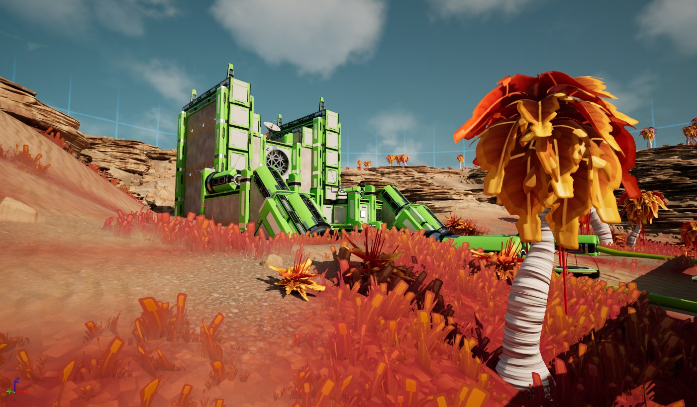
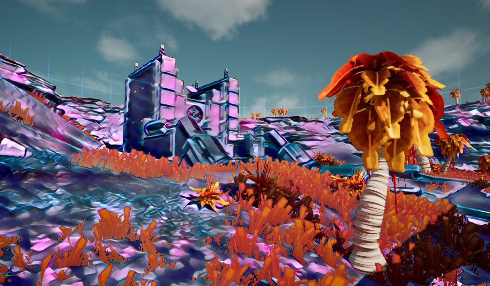

# 神经后期处理

> 路径：虚幻引擎5.7文档 / Gameplay系统 / 人工智能 / 神经网络引擎 / 神经后期处理

> 原始页面：https://dev.epicgames.com/documentation/unreal-engine/neural-post-processing-in-unreal-engine

**神经后期处理（Neural Post Processing）** 是一种在后期处理管线中使用神经网络的用户友好型方法。你可以使用材质编辑器设置利用神经网络的后期处理材质（Post Process Material），而无需编写任何代码。

## 启用神经后期处理

在开始前，你需要先在项目中启用 **Neural Rendering** 插件。具体方法是在主菜单的 **编辑（Edit）** 下打开 **插件（Plugin）** 浏览器。此插件包含了基于神经配置以及由材质编辑器设置的神经缓冲区/纹理集来运行网络所需的所有代码。

## 设置神经后期处理材质

请按下文所述导入并设置ONNX格式的神经网络，并创建一个可以使用此神经网络的后期处理材质。

### 设置神经网络配置

请按以下步骤将一个兼容的神经网络模型导入虚幻引擎并对其进行设置。

1. 将一个

   ONNX（*.onnx）

   机器学习模型文件导入虚幻引擎，创建一个

   NNE模型数据（NNE Model Data）

   资产。
2. 在内容浏览器中，使用 **添加（+）** 菜单创建一个 **神经配置（Neural Profile）** 资产。你可以从 **材质（Material） > 配置（Profiles）** 菜单添加一个。
3. 打开新创建的 ***神经配置（Neural Profile）** 资产。
4. 在导入ONNX文件时，使用NNE模型数据分配插槽设置创建的NNE模型数据资产。

### 创建后期处理材质

按以下步骤设置一个使用神经配置和某些图表逻辑的后期处理材质。

1. 在内容浏览器中新建一个

   材质

   并打开它。
2. 在材质编辑器中，使用 **细节** 面板进行以下设置：

   - 材质域（Material Domain）

     ：后期处理（Post Process）
   - 配合神经网络使用（Used with Neural Networks）

     ：勾选
   - 神经配置（Neural Profile）

     ：神经配置资产
3. 在材质图表中，使用 **Neural Input** 节点准备网络的输入，并通过 **Neural Output** 节点从网络中获取输出。在连接到主材质节点的 **Emissive Color** 引脚后，你的图表应该如下图所示：
4. 点击材质编辑器工具栏中的

   应用（Apply）

   。

使用此设置后，材质就可以使用材质编辑器中的所有可用节点对数据进行预处理和后期处理了。此示例应用了一个简单的1/2.2常数伽马校正，并将输入值范围从0 ~ 1调整为0 ~255，然后在从神经网络输出获取结果后将其反转回显示范围。缩放并非总是必需的。这取决于神经网络模型的输入和输出范围。如果模型的输入和输出在0 ~ 1的范围内，那么我们有如下更简单的设置：

下面的示例进一步说明了如何将自定义区域应用于使用默认光源材质作为遮罩的情况。

此设置可以创建如下结果：

Basic Scene

Scene with Neural Post Process Material

## 神经配置资产设置

神经配置用于与神经网络进行绑定，指定运行时、批次大小以及图块配置。

| 属性 | 说明 |
| --- | --- |
| 模型 |  |
| **运行时类型（Runtime Type）** | 支持的NNE运行时类型，NNERuntimeORTDml或者NNERuntimeRDGHlsl。 |
| **NNE模型数据（NNE Model Data）** | 存储导入引擎的NNE模型数据，如ONNX模型。 |
| **输入尺寸（Input Dimension）** | 正在使用的神经网络引擎（NNE）模型数据的输入尺寸。 |
| **输出尺寸（Output Dimension）** | 正在使用的神经网络引擎（NNE）模型数据的输出尺寸。 |
| 重载 |  |
| **批次大小（Batch Size）** | 用于在批次尺寸为动态（-1）的情况下重载批次大小。 |
| 图块 |  |
| **图块大小（Tile Size）** | 使用的图块总数。每个批次执行一个图块。NNE模型被加载并直接使用，而不会放大其尺寸。例如，如果输入纹理具有不同的尺寸，那么在应用之前会将其缩小。如果将此项设置为"自动（Auto）"，则会在批次尺寸中自动创建平铺缓冲区，其中每个图块都会运行神经模型。例如，如果模型的输入尺寸为（1x3x200x200）且后期处理使用的缓冲区大小为1000x1000，那么将运行并重新合并5x5个的图块（(5x5)x3x200x200）。 |
| **边界重叠（Border Overlaps）** | 图块边界（左右上下）的重叠幅度。当"图块大小（Tile Size）"被设置为"自动（Auto）"时，此数值越大，覆盖整个屏幕所需的图块就越多。 |
| **重叠解算类型（Overlap Resolve Type）** | 设置重叠的解算方式。忽略此项表示重叠的图块区域对相邻图块没有影响。羽化表示重叠区域以线性方式与相邻图块混合。 |

### 平铺

纹理索引模式支持平铺，包括图块的重叠。在平铺过程中，你可以将重叠的图块区域设为 **忽略（Ignored）** 或 **羽化（Feathered）**，以支持诸如神经过滤和风格转换等应用。更多的图块有助于增加细节，但基于网络的复杂程度，可能会造成较高的开销。

下面是一个展示神经风格转换的示例，使用了2X2的图块，羽化设置并隐藏接缝。

你可以使用控制台可视化命令 `r.Neuralpostprocess.TileOverlap.Visualize 1` 将图块的重叠情况可视化。

在将"图块大小（Tile Size）"设为 **自动（Auto）** 时，图块大小不会应用缩放，但会直接将网络应用于神经输入纹理。此时，纹理外的图块会被镜像。下面的示例展示了在将图块大小设为自动时，图块的重叠情况。

### 缓冲区索引

纹理会被缩放至目标尺寸，如果将将"图块大小（Tile Size）"设为 **自动（Auto）**，则纹理保持不变。当前纹理索引模式默认支持[1 x 3 x H x W]的纹理索引模式。

若要使用具有其他尺寸[B x C x H x W]的任意ONNX模型，你可以使用 **缓冲区索引模式（Buffer Indexing Mode）** 。此模式提供了对实际读取/写入值的完全控制。它本身不会进行任何过滤操作，你需要使用材质图表中的逻辑或编写自定义着色器代码来应用所需的任何过滤器。

下面的示例将场景划分成了B=2x2个批次，并通过Neural Input和Neural Output (Buffer)节点对每个批次进行了设置。

你还需要修改神经配置（Neural Profile）资产中的部分设置。你可以在以下选项中任选一项：

- 如果支持动态批次，则将

  批次大小重载（Batch Size Override）

  设为

  4

  。
- 如果

  不

  支持动态批次，则将

  图块大小（Tile Size）

  设为

  2x2

  。

图块会被依次调用，而对批次操作会在一个运行周期内完成。这两个选项也可以结合使用，这取决于你如何设计从缓冲区读取/写入数据的流程。目前，*Neural Output** 节点的每次调用都会读取三个连续的通道。

### 运行时类型

有两种NNE运行时可供选择：

- NNERuntimeORTDml

  ：此类型将DirectML作为后端使用。
- NNERuntimeRDGHlsl

  ：此类型采用了针对输出宽度进行优化的卷积运算，其结果取模为32 。

## 应用场景

你可以在项目的实时渲染过程中使用神经后期处理，也可以通过场景捕获（Scene Capture）工具来使用它。以下是一些潜在的应用场景：

- 风格化

  ：快速风格转换、AnimeGAN、CartoonGAN、Pix2Pix、CycleGAN
- 素描风格

  ：ShadeSketch
- 神经色调映射
- 图像分割与分类

## 其他注意事项

- 神经输入/输出节点的调用数量

  - 虽然一个后期处理材质中只能调用一个Neural Input节点，但可以多次调用Neural Output节点。
- Neural Input遮罩

  - 可以使用遮罩来选取屏幕的一部分以写入缓冲区/纹理。例如，如果有一个矩形区域位于屏幕的左上角，你可以将遮罩设置为0，并将该区域设置为1，使其UV坐标和输入生效，以将其写入缓冲区，同时忽略其他UV坐标和输入。
- 如果最终分辨率过低

  - 最终分辨率受模型输出尺寸影响。请在神经配置（Neural Profile）中检查输出尺寸。要提升分辨率，你可以导出更高分辨率的模型，也可以使用上文中提到的缓冲区索引/平铺方法来提高尺寸。注意，有些模型在边界处可能出现不连贯的情况。
- 缓冲区布局

  - 纹理缩影模式原生支持的布局为BCHW。由于开发的模型的布局可能是BHWC（如tensorflow），你应该明确将其导出为BCHW。

## 实用控制台命令

- r.Neuralpostprocess.Apply

  可以启用或禁用神经网络。在禁用时，神经输入会被直接返回为神经输出。
