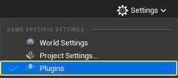
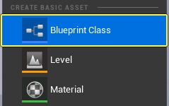
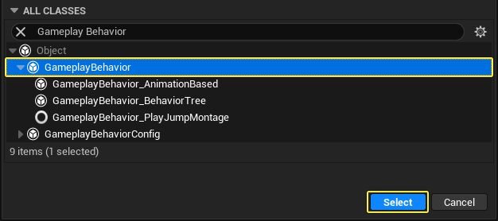
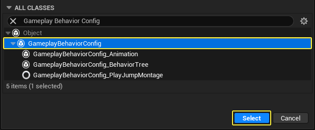
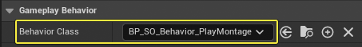

# 智能对象快速入门

> 路径：虚幻引擎5.7文档 / Gameplay系统 / 人工智能 / 智能对象 / 智能对象快速入门

> 原始页面：https://dev.epicgames.com/documentation/unreal-engine/smart-objects-in-unreal-engine---quick-start

## 概述

**智能对象（Smart Objects）** 是一种放置在关卡中，并且供AI代理和玩家交互的对象。这些对象自带了交互所需的所有信息。

简要来说，智能对象表示关卡中的一组活动，可通过预留系统使用。该系统跟踪关卡中的所有智能对象，并允许AI代理"预留"一个智能对象，这样，在该智能对象再次可用之前，其他代理不能使用它。

## 目标

在本快速入门指南中，你将了解如何通过AI代理创建和使用智能对象。

## 目标

- 创建AI代理在访问智能对象时可以使用的AI游戏行为和行为定义。
- 创建一个智能对象来持有行为定义播放动画蒙太奇。
- 使用行为树和行为树任务创建简单的AI行为。
- 创建可以在关卡中搜索和使用智能对象的AI代理。

## 1 - 必要设置

1. 基于 **第三人称（Third Person）** 模板新建 **蓝图（Blueprint）** 项目。
2. 在主菜单中，转到 **设置（Settings）> 插件（Plugins）**，打开 **插件（Plugins）** 窗口。

   
3. 找到 **游戏（Gameplay）** 分段，启用 **智能对象（Smart Objects）**、**AI行为（AI Behaviors）** 和 **Gameplay行为智能对象（Gameplay Behavior Smart Objects）** 插件。如果出现提示，请重新启动编辑器。

   

   

   

### 阶段成果

在本节中，你创建了一个新项目并启用了智能对象和AI行为插件。你现在已经准备好为AI代理创建AI游戏行为。

## 2 - 创建AI游戏行为

在本节中，你将创建游戏行为和游戏配置蓝图，用于定义代理在访问智能对象插槽时将执行的操作。

1. 在 **内容浏览器（Content Browser）** 中，右键单击并从 **创建基本资产（Create Basic Asset）** 分段中选择 **蓝图类（Blueprint Class）**。

   
2. 在 **选取父类（Pick Parent Class）** 窗口中，展开 **所有类（All Classes）** 分段，然后搜索并选择 **游戏行为（Gameplay Behavior）**。单击 **选择（Select）** 并将新资产命名为 **BP_SO_Behavior_PlayMontage**。

   
3. 创建一个新的蓝图类，然后搜索并选择 **游戏行为配置（Gameplay Behavior Config）**。单击 **选择（Select）** 并将新资产命名为 **BP_SO_BehaviorConfig**。

   
4. 在 **内容浏览器（Content Browser）** 中，双击 **BP_SO_BehaviorConfig** 将其打开。转到 **细节（Details）** 面板，然后单击 **行为类（Behavior Class）** 下拉框。选择 **BP_SO_Behavior_PlayMontage**。编译并保存蓝图。

   
5. 在 **内容浏览器（Content Browser）** 中，双击 **BP_SO_Behavior_PlayMontage** 将其打开。单击 **函数（Functions）** 旁边的 **重写（Override）** 下拉框，然后选择 **OnTriggeredCharacter**。

   > 图片已省略：Override the OnTriggeredCharacter function
6. 右键单击 **Event OnTriggeredCharacter** 节点的 **游戏对象（Avatar）** 引脚，然后选择 **提升为变量（Promote to Variable）**。

   > 图片已省略：Right-click the Avatar pin of the Event OnTriggeredCharacter node and select Promote to Variable
7. 将 **游戏对象（Avatar）** 变量拖到 **事件图表（Event Graph）** 并选择 **获取游戏对象（Get Avatar）**。从 **游戏对象（Avatar）** 节点拖动，然后搜索并选择 **按类获取组件（Get Component by Class）**。

   > 图片已省略：Search for and select Get Component by Class
8. 单击 **组件类（Component Class）** 下拉框，然后搜索并选择 **骨骼网格体组件（Skeletal Mesh Component）**。

   > 图片已省略：Add the Skeletal Mesh component
9. 右键单击 **事件图表（Event Graph）**，然后搜索并选择 **播放蒙太奇（Play Montage）**。

   1. 将 **按类获取组件（Get Component by Class）** 节点的 **返回值（Return Value）** 引脚连接到 **播放蒙太奇（Play Montage）** 节点的 **在骨骼网格体中（In Skeletal Mesh Component）** 引脚。
   2. 将 **设置游戏对象（Set Avatar）** 节点连接到 **播放蒙太奇（Play Montage）** 节点。

   > 图片已省略：Add a Play Montage node

   > 图片已省略：Connect the Play Montage node to the Set Avatar node
10. 单击 **播放蒙太奇（Play Montage）** 节点上的 **蒙太奇播放（Montage to Play）** 下拉框。从列表中选择动画蒙太奇。

    > 图片已省略：Select an animation montage to play

    > [!NOTE]
    > 如果没有可用的动画，可以从[Fab](https://www.fab.com/)获得免费的动画资产包，例如[动画初学者内容包]](https://www.fab.com/listings/98ff449d-79db-4f54-9303-75486c4fb9d9)。你也可以将任意动画序列转换成动画蒙太奇，方法是右键点击要转换的序列并选择 **创建（Create）> 创建蒙太奇（Create AnimMontage）**。
11. 将 **游戏对象（Avatar）** 变量拖到 **事件图表（Event Graph）** 并选择 **获取游戏对象（Get Avatar）**。从 **游戏对象（Avatar）** 节点拖动，然后搜索并选择 **结束行为（End Behavior）**。

    > 图片已省略：Add the End Behavior node
12. 将 **完成时（On Completed）** 和 **中断时（On Interrupted）** 引脚从 **播放蒙太奇（Play Montage）** 节点连接到 **结束行为（End Behavior）** 节点。

    > 图片已省略：Connect On Completed and On Interrupted to the End Behavior node
13. 编译并保存蓝图。

    > [!NOTE]
    > 此示例使用 **播放蒙太奇（Play Montage）** 节点，而不是 **播放动画蒙太奇（Play Anim Montage）** 节点，从而使用 **完成时（On Completed）** 和 **中断时（On Interrupted）** 引脚来结束行为。这可确保智能对象保持占用状态，直到动画播放完毕。

### 阶段成果

在本节中，你创建了游戏行为和游戏配置蓝图，代理访问智能对象插槽之后，将使用它们来播放动画蒙太奇。你现在可以创建智能对象将使用的行为定义。

## 3 - 创建智能对象定义数据资产

在本节中，你将创建智能对象定义数据资产，它将定义智能对象的每个插槽的行为。

1. 在 **内容浏览器（Content Browser）** 中，右键单击并选择 **杂项（Miscellaneous）>数据资产（Data Asset）**。

   1. 在 **为数据资产实例选择类（Pick Class for Data Asset Instance）** 窗口中，搜索并选择 **智能对象定义（Smart Object Definition）**。
   2. 单击 **选择（Select）** 创建资产并将其命名为 **SO_Definition_PlayMontage**。

   > 图片已省略：Select Miscellaneous - Data Asset

   > 图片已省略：Select the Smart Object Definition
2. 在 **内容浏览器（Content Browser）** 中，双击 **SO_Definition_PlayMontage** 将其打开。向下滚动到 **智能对象（Smart Object）** 分段，然后单击 **插槽（Slots）** 旁边的 **添加（+）"（Add (+)）"** 按钮以添加新插槽。这是AI代理在执行该行为时将使用的插槽。

   > 图片已省略：单击 **插槽（Slots）** 旁边的添加（+）
3. 单击 **默认行为定义（Default Behavior Definitions）** 旁边的 **添加（+）"（Add (+)）"** 按钮，然后为 **索引0（Index 0）** 选择 **Gameplay行为智能对象定义（Gameplay Behavior Smart Object Behavior Definition）**。单击 **游戏行为配置（Gameplay Behavior Config）** 下拉框并选择 **BP_SO_BehaviorConfig**。

   > 图片已省略：Add a new Default Behavior Definition
4. 保存并关闭蓝图。

### 阶段成果

在本节中，你创建了定义智能对象的每个插槽及其默认行为定义的智能对象定义数据资产。

## 4 - 创建一个智能对象

在本节中，你将创建一个智能对象，该对象可以被关卡中的代理找到和使用。

1. 在 **内容浏览器（Content Browser）** 中，右键单击并从 **创建基本资产（Create Basic Asset）** 分段中选择 **蓝图类（Blueprint Class）**。

   > 图片已省略：Create a new Blueprint Class
2. 在 **选取父类（Pick Parent Class）** 窗口中，单击 **Actor** 类按钮以创建资产。将新资产命名为 **BP_SO_RunBT**。

   > 图片已省略：Select the Actor class
3. 在 **内容浏览器（Content Browser）** 中，双击 **BP_SO_RunBT** 将其打开。转到 **组件（Components）** 窗口，然后单击 + **添加（Add）** 按钮。搜索并选择 **智能对象（Smart Object）**。

   > 图片已省略：Select the SOComponent component
4. 选择 **SmartObject** 组件后，转到 **细节（Details）** 面板并向下滚动到 **智能对象（Smart Object）** 分段。单击 **定义资产（Definition Asset）** 下拉框并选择 **SO_Definition_PlayMontage**。

   > 图片已省略：Add the Definition Asset
5. 编译并保存蓝图。

### 阶段成果

在本节中，你创建了一个智能对象并添加了定义其插槽默认行为的行为定义。

## 5 - 为AI代理创建行为树

在本节中，你将为AI代理创建必要的行为，以便在关卡中搜索和使用智能对象。你将使用一个简单的行为树和两个自定义行为树任务来完成这个任务。

### 创建行为树和黑板

1. 在 **内容浏览器（Content Browser）** 中，右键单击并选择 **AI > 黑板（Blackboard）**。将黑板命名为 **BB_SO_Agent**。

   > 图片已省略：Create a Blackboard
2. 双击 **BB_SO_Agent** 将其打开。单击 **新关键帧（New Key）** 下拉框并选择 **SO声明句柄（SO Claim Handle）**。将关键帧命名为 **ClaimHandle**。保存并关闭黑板。

   > 图片已省略：Add a SmartObject Claim Handle
3. 在 **内容浏览器（Content Browser）** 中，右键单击并选择 **AI > 行为树（Behavior Tree）**。将行为树命名为 **BT_SO_Agent**。

   > 图片已省略：Create a Behavior Tree

### 创建行为树任务

**寻找智能对象**

1. 在 **内容浏览器（Content Browser）** 中，右键单击并从 **创建基本资产（Create Basic Asset）** 分段中选择 **蓝图类（Blueprint Class）**。

   > 图片已省略：Create a new Blueprint Class
2. 在 **所有类（All Classes）** 分段，搜索并选择 **BT任务蓝图基类（BT Task Blueprint Base）**，然后单击 **选择（Select）**。将蓝图命名为 **BTT_FindSmartObject**。

   > 图片已省略：Search for and select BT Task Blueprint Base, then click Select
3. 在 **内容浏览器（Content Browser）** 中，右键单击 **BTT_FindSmartObject** 并选择 **复制（Duplicate）**。将新蓝图命名为 **BTT_UseSmartObject**。

   > 图片已省略：Duplicate BTT_FindSmartObject
4. 在 **内容浏览器（Content Browser）** 中，双击 **BTT_FindSmartObject** 将其打开。在 **事件图表（Event Graph）** 中右键单击，然后搜索并选择 **事件接收执行AI（Event Receive Execute AI）**。

   > 图片已省略：Add the Event Receive Execute AI node
5. 从 **事件接收执行AI（Event Receive Execute AI）** 节点的 **所有者控制器（Owner Controller）** 引脚拖动，然后搜索并选择 **获取黑板（Get Blackboard）**。

   1. 右键单击 **获取黑板（Get Blackboard）** 节点的 **返回值（Return Value）** 引脚，然后选择 **提升为变量（Promote to Variable）**。将变量命名为 **Blackboard**。
   2. 将 **事件接收执行AI（Event Receive Execute AI）** 节点连接到 **设置黑板（Set Blackboard）** 节点。

   > 图片已省略：Add the Get Blackboard node

   > 图片已省略：Connect the Set Blackboard node to the Event Receive Execute AI node
6. 从 **事件接收执行AI（Event Receive Execute AI）** 节点的 **控制Pawn（Controlled Pawn）** 引脚拖动，然后搜索并选择 **获取Actor位置（Get Actor Location）**。

   1. 从 **获取Actor位置（Get Actor Location）** 节点的 **返回值（Return Value）** 拖动，然后搜索并选择 **减（Subtract）**。
   2. 从 **获取Actor位置（Get Actor Location）** 节点的 **返回值（Return Value）** 拖动，然后搜索并选择 **加（Add）**。
   3. 将这两个节点的 **X**、**Y** 和 **Z** 值都设置为 **2000**。这会在代理周围创建一个4000x4000单位或40x40米的搜索框。

   > 图片已省略：Add the Get Actor Location node

   > 图片已省略：Add Subtract and Add nodes
7. 在 **事件图表（Event Graph）** 中右键单击，然后搜索并选择 **创建盒体（Make Box）**。

   1. 将 **减（Subtract）** 节点连接到 **创建盒体（Make Box）** 节点的 **最小（Min）** 引脚。
   2. 将 **加（Add）** 节点连接到 **创建盒体（Make Box）** 节点的 **最大（Max）** 引脚。

   > 图片已省略：Add a Make Box node

   > 图片已省略：Connect the Make Box node
8. 在 **事件图表（Event Graph）** 中右键单击，然后搜索并选择 **获取智能对象子系统（Get Smart Object Subsystem）**。

   1. 从 **智能对象子系统（Smart Object Subsystem）** 节点拖动，然后搜索并选择 **查找智能对象（Find Smart Objects）**。
   2. 从 **查找智能对象（Find Smart Objects）** 节点的 **请求（Request）** 引脚拖动，并选择 **创建智能对象请求（Make SmartObjectRequest）**。

   > 图片已省略：Add a Get Smart Object Subsystem node

   > 图片已省略：Add a Find Smart Objects node

   > 图片已省略：Select Make SmartObjectRequest
9. 将 **创建盒体（Make Box）** 节点的 **返回值（Return Value）** 引脚连接到 **创建智能对象请求（Make SmartObjectRequest）** 节点的 **查询盒体（Query Box）** 引脚。

   1. 从 **创建智能对象请求（Make SmartObjectRequest）** 节点的 **过滤器（Filter）** 引脚拖动，并选择 **创建智能对象请求过滤器（Make SmartObjectRequestFilter）**。
   2. 从 **行为定义类（Behavior Definition Classes）** 拖出引脚并搜索，然后选择 **创建数组（Make Array）**。
   3. 点击 **创建数组（Make Array）** 的下拉菜单并选择 **Gameplay行为智能对象行为定义（GameplayBehaviorSmartObjectBehaviorDefinition）**。
   4. 将 **设置黑板（Set Blackboard）** 节点连接到 **查找智能对象（Find Smart Objects）** 节点。

   > 图片已省略：Connect the Return Value pin of the Make Box node to the Query Box pin of the Make SmartObjectRequest node

   > 图片已省略：Select GameplayBehaviorSmartObjectBehaviorDefinition from the dropdown
10. 这是蓝图目前的样子。

    > 图片已省略：The Blueprint so far
11. 右键单击 **查找智能对象（Find Smart Objects）** 节点的 **输出结果（Out Results）** 引脚，然后选择 **提升为变量（Promote to Variable）**。将 **输出结果（Out Results）** 节点连接到 **黑板（Blackboard）** 节点。

    1. 从 **输出结果（Out Results）** 节点的引脚拖动，然后搜索并选择 **是有效索引（Is Valid Index）**。
    2. 从 **是有效索引（Is Valid Index）** 节点拖动，然后搜索并选择 **分支（Branch）**。将 **输出结果（Out Results）** 节点连接到 **分支（Branch）** 节点。

    > 图片已省略：Right-click the Out Results pin of the Find Smart Objects node and select Promote to Variable

    > 图片已省略：Select Is Valid Index

    > 图片已省略：Select Is Valid Index
12. 从 **分支（Branch）** 节点的 **False** 引脚拖动，然后搜索并选择 **完成执行（Finish Execute）**。如果附近没有符合搜索条件的智能对象，**输出结果（Out Results）** 将无效。

    > 图片已省略：Drag from the False pin of the Branch node, then search for and select Finish Execute
13. 在 **事件图表（Event Graph）** 中创建一个 **智能对象子系统（Smart Object Subsystem）** 节点。从该节点拖动，然后搜索并选择 **声明（Claim）**。

    1. 将 **分支（Branch）** 节点的 **True** 引脚连接到 **声明（Claim）** 节点。
    2. 将 **输出结果（Out Results）** 变量拖到 **事件图表（Event Graph）** 并选择 **获取输出结果（Get Out Results）**。从该节点拖动，然后搜索并选择 **随机数组项（Random Array Item）**。
    3. 从 **随机（Random）** 节点拖动并将其连接到 **声明（Claim）** 节点的 **请求结果（Request Results）** 引脚。

    > 图片已省略：Add a Claim node

    > 图片已省略：Drag from the node, then search for and select Random Array Item

    > 图片已省略：Drag from the Random node and connect it to the Request Results pin of the Claim node
14. 右键单击 **声明（Claim）** 节点的 **返回值（Return Value）** 引脚，然后选择 **提升为变量（Promote to Variable）**。将变量命名为 **ClaimHandle**。

    1. 从 **声明句柄（Claim Handle）** 节点引脚拖动，然后搜索并选择 **是有效智能对象声明句柄（Is Valid Smart Object Claim Handle）**。
    2. 从 **是有效智能对象声明句柄（Is Valid Smart Object Claim Handle）** 节点的 **返回值（Return Value）** 拖动，然后搜索并选择 **分支（Branch）**。

    > 图片已省略：右键单击

    > 图片已省略：Drag from the Claim Handle node pin, then search for and select Is Valid Smart Object Claim Handle

    > 图片已省略：Drag from the Return Value of the Is Valid Smart Object Claim Handle node, then search for and select Branch
15. 从 **分支（Branch）** 节点的 **False** 引脚拖动，然后搜索并选择 **完成执行（Finish Execute）**。

    > 图片已省略：Drag from the False pin of the Branch node, then search for and select Finish Execute
16. 将 **Blackboard** 变量拖到 **事件图表（Event Graph）** 并选择 **获取黑板（Get Blackboard）**。

    1. 从 **黑板（Blackboard）** 节点拖动，然后搜索并选择 **将值设置为SOClaim句柄（Set Value as SOClaim Handle）**。
    2. 将 **分支（Branch）** 节点的 **True** 引脚连接到 **将值设置为SOClaim句柄（Set Value as SOClaim Handle）** 节点。
    3. 右键单击 **将值设置为SOClaim句柄（Set Value as SOClaim Handle）** 节点的 **关键帧名称（Key Name）** 引脚，然后选择 **提升为变量（Promote to Variable）**。
    4. 选择 **关键帧名称（Key Name）** 变量后，转到 **细节（Details）** 面板并启用 **实例可编辑（Instance Editable）** 复选框。将 **默认值（Default Value）** 设置为 **ClaimHandle**。

    > 图片已省略：Drag from the Blackboard node, then search for and select Set Value as SOClaim Handle

    > 图片已省略：Right-click the Key Name pin of the Set Value as SOClaim Handle node and select Promote to Variable

    > 图片已省略：启用
17. 拖动 **ClaimHandle** 变量并将其连接到 **将值设置为SOClaim句柄（Set Value as SOClaim Handle）** 节点的 **值（Value）** 引脚。

    > 图片已省略：Drag the ClaimHandle variable and connect it to the Value pin of the Set Value as SOClaim Handle node
18. 从 **将值设置为SOClaim句柄（Set Value as SOClaim Handle）** 节点拖动，然后搜索并选择 **完成执行（Finish Execute）**。启用节点上的 **成功（Success）** 复选框。

    > 图片已省略：Add a Finish Execute node and enable the Success checkbox
19. 编译并保存蓝图。

**使用智能对象**

1. 在 **内容浏览器（Content Browser）** 中，双击 **BTT_UseSmartObject** 将其打开。在 **事件图表（Event Graph）** 中右键单击并搜索，然后选择 **事件接收执行AI（Event Receive Execute AI）**。

   > 图片已省略：Add the Event Receive Execute AI node
2. 从 **事件接收执行AI（Event Receive Execute AI）** 节点的 **所有者控制器（Owner Controller）** 引脚拖动，然后搜索并选择 **获取黑板（Get Blackboard）**。

   > 图片已省略：Drag from the Owner Controller pin of the Event Receive Execute AI node, then search for and select Get Blackboard
3. 从 **获取黑板（Get Blackboard）** 节点的 **返回值（Return Value）** 引脚拖动，然后搜索并选择 **获取SOClaim句柄形式的值（Get Value as SOClaim Handle）**。

   > 图片已省略：Drag from the Return Value pin of the Get Blackboard node, then search for and select Get Value as SOClaim Handle
4. 右键单击 **获取SOClaim句柄形式的值（Get Value as SOClaim Handle）** 节点的 **关键帧名称（Key Name）** 引脚，然后选择 **提升为变量（Promote to Variable）**。

   1. 选择

      关键帧名称（Key Name）

      变量后，转到

      细节（Details）

      面板并启用

      实例可编辑（Instance Editable）

      复选框。将

      默认值（Default Value）

      设置为

      ClaimHandle

      。

   > 图片已省略：启用
5. 从 **获取SOClaim句柄形式的值（Get Value as SOClaim Handle）** 节点的 **返回值（Return Value）** 引脚拖动，然后搜索并选择 **使用声明的Gameplay行为智能对象（Use Claimed Gameplay Behavior Smart Object）**。

   1. 将 **获取SOClaim句柄形式的值（Get Value as SOClaim Handle）** 节点连接到 **使用声明的智能对象（Use Claimed Smart Object）** 节点。
   2. 从 **事件接收执行AI（Event Receive Execute AI）** 节点的 **所有者控制器（Owner Controller）** 引脚拖动并连接到 **使用声明的智能对象（Use Claimed Smart Object）** 节点的 **控制器（Controller）** 引脚。

   > 图片已省略：Drag from the Return Value pin of the Get Value as SOClaim Handle node, then search for and select Use Claimed Smart Object

   > 图片已省略：Drag from the Owner Controller pin of the Event Receive Execute AI node and connect it to the Controller pin of the Use Claimed Smart Object node
6. 从 **使用声明的智能对象（Use Claimed Smart Object）** 节点 **On Succeeded** 引脚拖出，然后搜索并选择 **完成执行（Finish Execute）**。启用节点上的 **成功（Success）** 复选框。

   > 图片已省略：Drag from the On Finished pin of the Use Claimed Smart Object node, then search for and select Finish Execute
7. 编译并保存蓝图。

**创建行为树**

1. 在 **内容浏览器（Content Browser）** 中，双击 **BT_SO_Agent** 将其打开。从 **根（Root）** 节点拖动并选择 **选择器（Selector）**。

   > 图片已省略：Drag from the Root node and select Selector
2. 从 **选择器（Selector）** 节点拖动并选择 **序列（Sequence）**。

   1. 从"选择器（Selector）"节点拖动并选择 **等待（Wait）**。如果初始搜索不成功，该节点将让代理等待5秒再搜索新智能对象。
   2. 确保 **序列（Sequence）** 节点位于 **等待（Wait）** 节点的左侧。这确保序列首先在行为树中执行。

   > 图片已省略：Drag from the Selector node and select Sequence
3. 从 **序列（Sequence）** 节点拖动并选择 **BTT_FindSmartObjects**。

   > 图片已省略：Drag from the Sequence node and select BTT_FindSmartObjects
4. 从 **序列（Sequence）** 节点拖动并选择 **BTT_UseSmartObjects**。

   > 图片已省略：Drag from the Sequence node and select BTT_UseSmartObjects
5. 从 **序列（Sequence）** 节点拖动并选择 **等待（Wait）**。选择节点后，将 **等待时间（Wait Time）** 设置为 **2.0**，将 **随机偏差（Random Deviation）** 设置为 **0.5**。该节点将让代理等待1.5至2.5秒，然后再搜索新的智能对象。

   > 图片已省略：Drag from the Sequence node and select Wait

   > 图片已省略：Final Behavior Tree
6. 保存并关闭行为树。

**阶段成果**

在本节中，你创建了允许代理在关卡中查找和使用智能对象的行为树和行为树任务。

## 6 - 创建AI代理

在本节中，你将创建在关卡中搜索智能对象的AI代理。

1. 在 **内容浏览器（Content Browser）** 中，双击 **BP_ThirdPersonCharacter** 蓝图将其打开。

   > 图片已省略：Double-click the ThirdPersonCharacter Blueprint to open it
2. 选择 **Event Graph（事件图表）** 中的所有节点并将其删除。右键单击 **事件图表（Event Graph）**，然后搜索并选择 **拥有的事件（Event Possessed）**。

   > 图片已省略：Right-click in the Event Graph and search for then select Event Possessed
3. 从 **拥有的事件（Event Possessed）** 节点的 **新控制器（New Controller）** 引脚拖动，然后搜索并选择 **转换为AI控制器（Cast to AI Controller）**。将 **拥有的事件（Event Possessed）** 节点连接到 **转换为AI控制器（Cast to AI Controller）** 节点。

   > 图片已省略：Drag from the New Controller pin of the Event Possessed node, then search for and select Cast to AI Controller
4. 从 **转换为AI控制器（Cast to AI Controller）** 节点的 **作为AI控制器（As AIController）** 引脚拖动，然后搜索并选择 **运行行为树（Run Behavior Tree）**。单击 **BTAsset** 下拉框并选择 **BT_SO_Agent**。

   > 图片已省略：Drag from the As AIController pin of the Cast to AIController node, then search for and select Run Behavior Tree
5. 编译并保存蓝图。

**阶段成果**

在本节中，你创建了在关卡中搜索智能对象的AI代理蓝图。你还修改了动画蓝图以确保动画蒙太奇可以正确播放。

## 7 - 测试智能对象

现在，将测试代理以确保它可以查找和使用关卡中的智能对象。

1. 在主工具栏中，单击 **添加内容 (****+****) > 体积（Volumes） > NavMeshBoundsVolume**，将新的 **导航网格体（Navigation Mesh）** Actor添加到关卡。将网格体缩放至可以覆盖关卡，以便代理可以导航到其目的地。

   > 图片已省略：Add a NavMeshBoundsVolume to your Level
2. 将多个 **BP_SO_RunBT** 蓝图拖到关卡中。

   > 图片已省略：Drag several BP_SO_RunBT** **Blueprints to your level
3. 将 **ThirdPersonCharacter** 蓝图拖到关卡中。

   > 图片已省略：Drag the ThirdPersonCharacter** **Blueprint to your Level
4. 按 **模拟（Simulate）** 可以查看代理在关卡中查找和使用智能对象。

**阶段成果**

在本节中，你确认了代理可以在关卡中查找和使用智能对象。
