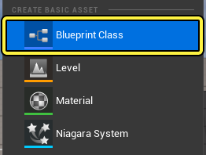
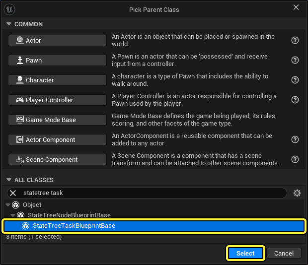
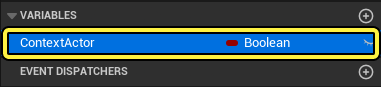
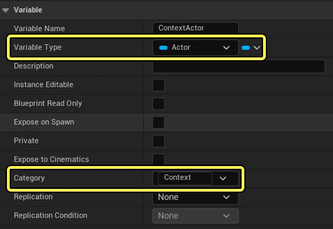
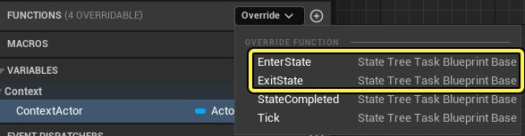
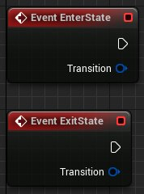
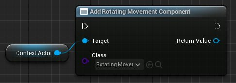
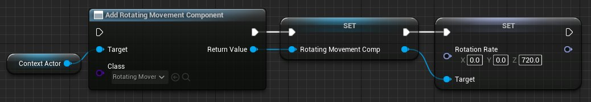

# 外部StateTree快速入门指南

> 路径：虚幻引擎5.7文档 / Gameplay系统 / 人工智能 / StateTree / 外部StateTree快速入门指南

> 原始页面：https://dev.epicgames.com/documentation/unreal-engine/external-statetree-quickstart-guide

## 介绍

虚幻引擎5.4引入了在一个StateTree中链接另一个StateTree资产的功能。这样，在项目中编译和复用StateTree时，就可以采用更加模块化的方法。

现在你可以创建带有特定功能的状态树并根据需要复用。

本指南将逐步介绍如何创建简单的状态树，并将其链接到[StateTree快速入门指南](../statetree-quick-start-guide/index.md)中创建的状态树。

## 目标

在本指南中，你将创建一个状态树，它使移动目标在被击中时旋转。你要将此状态树作为外部资产添加到另一个处理目标移动的状态树。

## 目的

- 创建新的Hit Reaction StateTree和使移动目标在被击中时旋转的StateTree任务
- 将Hit Reaction StateTree作为外部资产添加到ShootingTarget StateStree，并对其进行配置
- 修改BP_ShootingTarget和STT_MoveAlongSpline以适应此新功能

## 1 - 先决条件

本指南将使用[StateTree快速入门指南](../statetree-quick-start-guide/index.md)中创建的StateTree来演示如何使用外部StateTree。请先完成该快速入门指南的学习，以便按本文档中的示例操作。

学习完快速入门指南后，按 **运行（Play）** 以验证行为。

> 动图已省略：移动目标

## 2 - 创建StateTree任务以使目标旋转

在本章节中，你将创建一个使移动目标旋转的StateTree任务。

1. 右键点击

   内容浏览器（Content Browser）

   ，在

   创建基本资产（Create Basic Asset）

   分段中点击

   蓝图类（Blueprint Class）

   。

   - 在

     选取父类（Pick Parent Class）

     窗口中，展开

     所有类（All Classes）

     并搜索

     StateTree Task Blueprint Base

     。选择它并点击

     选择（Select）

     。
   - 将资产命名为

     STT_RotateTarget

     。

   

   
2. 双击打开 **STT_RotateTarget** 。创建新的变量，然后将其命名为 **ContextActor** 。

   
3. 转到

   细节（Details）

   面板，点击

   变量类型（Variable Type）

   下拉菜单，并选择

   Actor对象引用（Actor Object Reference）

   。

   - 点击

     类别（Category）

     文本框并输入

     Context

     。这会自动将变量绑定到StateTree中的Context Actor。
   - 编译

     并

     保存

     蓝图。

   
4. 转到 **函数（Functions）** 分段，然后点击 **重载（Override）** 下拉菜单。点击 **EnterState** 以在 **事件图表（Event Graph）** 中创建 **EventEnterState** 节点。重复此过程并点击 **ExitState** 。

   

   
5. 将

   Context Actor

   拖动到事件图表中，然后选择

   Get ContextActor

   。

   - 从

     ContextActor

     拖出引线，然后搜索并选择

     Add Actor Component By Class

     。
   - 点击

     类（Class）

     下拉菜单，然后搜索并选择

     Rotating Movement Component

     。

   
6. 右键点击

   Add Rotating Movement Component

   节点的

   返回值（Return Value）

   引脚，然后点击

   提升到变量（Promote to Variable）

   。

   - 将变量命名为

     RotatingMovementComp

     。
   - 从

     RotatingMovementComp

     引脚拖出引线，然后搜索并选择

     Set Rotation Rate

     ，并且输入

     720

     作为

     Z

     值。

   
7. 将

   RotatingMovementComp

   拖入

   事件图表（Event Graph）

   ，并选择

   Get RotatingMovementComp

   。

   - 从

     RotatingMovementComp

     拖出引线，然后搜索并选择

     Is Valid

     。

     将

     EventEnterState

     节点连接到

     Is Valid

     节点。

     将

     Is Valid

     节点的

     无效（Is Not Valid）

     引脚连接到

     Add Rotating Movement Component

     节点。

   > 图片已省略：检查旋转移动组件是否有效。如果无效，连接到之前的节点
8. 将

   RotatingMovementComp

   拖入

   事件图表（Event Graph）

   ，并选择

   Get RotatingMovementComp

   。

   - 从

     RotatingMovementComp

     拖出引线，然后搜索并选择

     Set Component Tick Enabled

     。
   - 勾选

     启用（Enabled）

     引脚，将其设置为

     True

     。

   > 图片已省略：在旋转移动组件上启用更新
9. 将

   RotatingMovementComp

   拖入

   事件图表（Event Graph）

   ，并选择

   Get RotatingMovementComp

   。

   - 从

     RotatingMovementComp

     拖出引线，然后搜索并选择

     Set Component Tick Enabled

     。
   - 确保将

     启用（Enabled）

     引脚设置为

     False

     （未勾选）。 *将

     EventExitState

     节点连接到

     SetComponentTickEnabled

     节点。

   > 图片已省略：在旋转移动组件上禁用更新
10. 验证你的蓝图图表是否类似于以下示例。

    > 图片已省略：验证你的蓝图代码是否类似于此内容

### 阶段成果

在本小节中，你创建了一个StateTree任务，它将 **旋转Actor组件（Rotating Actor component）** 添加到目标Actor并旋转它。

## 3 - 创建StateTree以使目标旋转

在本小节中，你将创建一个StateTree，它使移动目标在被击中时旋转。此StateTree将被链接到你根据StateTree快速入门指南创建的 **ST_ShootingTarget** StateTree。

1. 右键点击内容浏览器，然后点击"人工智能（Artificial Intelligence）> StateTree"。点击StateTree组件，将资产命名为ST_Reaction。

   > 图片已省略：创建新状态树

   > 图片已省略：点击状态树组件
2. 双击打开 **ST_Reaction** 。展开 **模式（Schema）** 分段，点击 **Context Actor类（Context Actor Class）** 下拉菜单。搜索并选择 **BP_ShootingTarget** 。

   > 图片已省略：将Context Actor类设置为BP_ShootingTarget
3. 点击 **+添加状态（Add State）** 创建新状态。将状态命名为 **Reaction** 。

   > 图片已省略：添加新状态并将其命名为Reaction
4. 添加 **延迟任务（Delay Task）** 并输入 **0.5** 作为其 **时长（Duration）** 。然后添加新任务并从下拉菜单选择 **STT旋转目标（STT Rotate Target）** 。

   > 图片已省略：添加延迟和STT旋转目标任务
5. 创建 **过渡（Transition）** ，将 **触发器（Trigger）** 设置为 **状态完成时（On State Completed）** ，并将 **过渡到（Transition To）** 设置为 **树成功（Tree Succeeded）** 。

   > 图片已省略：将过渡设置为树成功
6. **编译** 并 **保存** StateTree。

### 阶段成果

在此小节中，你创建了运行 **STT_RotateTarget** 任务的 **ST_Reaction** StateTree。此任务将在执行StateTree时旋转目标。

## 4 - 添加外部StateTree

在此小节中，你会将 **ST_Reaction** 作为外部（链接的）StateTree添加到 **ST_ShootingTarget** 。

1. 打开 **ST_ShootingTarget** 并点击 **+添加状态（Add State）** 创建新状态。将状态命名为 **Hit Reaction** 。

   > 图片已省略：添加新状态并将其命名为Hit Reaction
2. 选择 **击中反应（Hit Reaction）** 状态，然后转到 **细节（Details）** 面板。点击 **类型（Type）** 下拉菜单，然后选择 **链接的资产（Linked Asset）** 。点击 **链接的资产（Linked Asset）** 下拉菜单，然后选择 **ST_Reaction** 。

   > 图片已省略：将ST_Reaction添加为链接的资产
3. 添加

   进入条件（Enter Condition）

   ，点击

   If

   下拉菜单并选择

   整型比较（Integer Compare）

   。

   - 点击

     运算符（Operator）

     下拉菜单，然后选择

     小于（Less）

     。
   - 将

     右（Right）

     值设置为

     5

     。
   - 点击

     左（Left）

     下拉菜单，然后选择

     Actor > 击中数量（Hit Count）

     。

   > 图片已省略：添加一个进入条件来比较击中数量是否小于5
4. 添加新 **过渡（Transition）** 并将 **触发器（Trigger）** 设置为 **状态完成时（On State Completed）** 。将 **过渡到（Transition To）** 设置为 **闲置（Idle）** 。

   > 图片已省略：添加在状态完成并过渡到闲置状态时触发的过渡
5. 选择

   MoveAlongSpline

   状态并创建新的

   过渡（Transition）

   。

   - 点击

     触发器（Trigger）

     下拉菜单，然后选择

     发生事件时（On Event）

     。
   - 点击

     事件标签（Event Tag）

     下拉菜单，然后选择

     管理Gameplay标签（Manage Gameplay Tags）

     。

   > 图片已省略：添加在发生事件时触发的新过渡
6. 点击 **+** 按钮以添加称为 **StateTree** 的新条目。在它下面添加另一个条目，将其命名为 **HitReaction**，如下所示。

   > 图片已省略：添加Gameplay标签状态树 - HitReaction
7. 点击 **事件标签（Event Tag）** 下拉菜单，然后选择 **StateTree > 击中反应（Hit Reaction）**。将 **过渡到（Transition To）** 设置为 **击中反应（Hit Reaction）**。

   > 图片已省略：将事件标签设置为StateTree.HitReaction并过渡到击中反应状态

### 阶段成果

在此小节中，你通过将 **ST_Reaction** 添加为 **Hit Reaction** 状态中的外部StateTree，修改了 **ST_ShootingTarget**。你还将 **MoveAlongSpline** 状态修改为在调用Gameplay事件时过渡到 **击中反应（Hit Reaction）*。

## 5 - 修改BP_ShootingTarget

在此小节中，你将修改 **ShootingTarget** 蓝图，使其将击中反应事件发送到StateTree，并导致目标旋转。

1. 在 **内容浏览器（Content Browser）** 中，双击打开 **BP_ShootingTarget**。创建新的浮点变量，然后将其命名为 **DistanceTraveled*。

   > 图片已省略：创建新的浮点变量，然后将其命名为DistanceTraveled
2. 将

   StateTree

   组件拖入

   事件图表（Event Graph）

   中。

   - 从

     StateTree

     引用拖出引线，然后搜索并选择

     Send State Tree Event

     。
   - 将

     ++

     节点连接到

     Send State Tree Event

     节点。

   > 图片已省略：添加Send State Tree Event节点
3. 从 **Send State Tree Event** 节点中的 **事件（Event）** 引脚拖出引线，然后搜索并选择 **Make StateTree Event**。

   > 图片已省略：从事件引脚拖出引线，然后搜索并选择Make StateTree Event
4. 点击 **标签（Tag）** 下拉菜单，然后选择 **StateTree > 击中反应（Hit Reaction）** 。

   > 图片已省略：点击标签下拉菜单并选择StateTree > 击中反应
5. 从

   OnComponentHit

   节点的

   击中组件（Hit Component）

   引脚拖出引线，然后搜索并选择

   Get Display Name

   。

   - 从

     Get Display Name

     节点的

     返回值（Return Value）

     引脚拖出引线，并将其连接到

     Make StateTree Event

     节点的

     原点（Origin）

     引脚。

   > 图片已省略：将击中组件连接到Make StateTree Event节点的原点引脚
6. 编译

   并

   保存

   蓝图。

### 阶段成果

在此小节中，你修改了 **ShootingTarget** 蓝图，以便它在被击中时发送StateTree **击中反应（Hit Reaction）** 事件。

## 6 - 修改STT_MoveAlongSpline

在此小节中，你将修改 **STT_MoveAlongSpline** 以使用 **BP_ShootingTarget** 中的 **DistanceTraveled** 变量，而不是本地距离变量来计算其沿样条线的位置。

1. 在 **内容浏览器（Content Browser）** 中，双击打开 **STT_MoveAlongSpline** 。点击函数旁边的 **重载（Override）** 下拉菜单，然后选择 **EnterState**，在**事件图表（Event Graph）** 中创建 **Event EnterState** 节点。

   > 图片已省略：重载Enter State事件
2. 将

   Actor

   变量拖入

   事件图表（Event Graph）

   ，然后选择

   Get Actor

   。

   - 从

     Actor

     拖出引线，然后搜索并选择

     Cast to BP_ShootingTarget

     。
   - 右键点击

     Cast to BP_ShootingTarget

     节点中的

     作为BP_ShootingTarget（As BP_ShootingTarget）

     引脚，然后选择

     提升到变量（Promote to Variable）

     。
   - 将

     Event EnterState

     节点连接到

     Cast to BP_ShootingTarget

     节点。

   > 图片已省略：从Actor拖出引线，然后搜索并选择Cast to BP_ShootingTarget。将此项保存变量
3. 将

   AsBPShootingTarget

   拖入

   事件图表（Event Graph）

   ，并选择

   Get AsBPShootingTarget

   。

   - 从

     AsBPShootingTarget

     拖出引线，然后搜索并选择

     Get Distance Traveled

     。
   - 将

     DistanceTraveled

     连接到

     Get Location at Distance Along Spline

     节点的

     距离（Distance）

     引脚。这会替换与距离的当前连接。

   > 图片已省略：将DistanceTraveled连接到Get Location at Distance Along Spline节点的距离引脚
4. 将

   AsBPShootingTarget

   拖入

   事件图表（Event Graph）

   ，并选择

   Get AsBPShootingTarget

   。

   - 从

     AsBPShootingTarget

     拖出引线，然后搜索并选择

     Get Distance Traveled

     。
   - 将

     DistanceTraveled

     连接到

     Less Than

     节点，替换与距离的连接。

   > 图片已省略：将DistanceTraveled连接到Less Than节点
5. 将

   AsBPShootingTarget

   拖入

   事件图表（Event Graph）

   ，并选择

   Get AsBPShootingTarget

   。

   - 从

     AsBPShootingTarget

     拖出引线，然后搜索并选择

     Get Distance Traveled

     。
   - 将

     DistanceTraveled

     连接到

     +

     节点，替换与距离的连接。
   - 将

     AsBPShootingTarget

     拖入

     事件图表（Event Graph）

     ，并选择

     Get AsBPShootingTarget

     。从节点拖出引线，然后搜索并选择

     Set DistanceTraveled

     。
   - 替换连接到

     Branch

     节点的

     True

     引脚的

     Set Distance

     节点。

   > 图片已省略：将DistanceTraveled连接到+节点并将Set Distance节点替换为Set Distance Traveled节点
6. 将

   AsBPShootingTarget

   拖入

   事件图表（Event Graph）

   ，并选择

   Get AsBPShootingTarget

   。

   - 从节点拖出引线，然后搜索并选择

     Set DistanceTraveled

     。
   - 替换连接到

     Branch

     节点的

     True

     引脚的

     Set Distance

     节点。

   > 图片已省略：将Set Distance节点替换为Set Distance Traveled节点
7. 编译

   并

   保存

   蓝图。

### 阶段成果

在此小节中，你修改了 **STT_MoveAlongSpline** 以使用 **BP_ShootingTarget** 中的 **DistanceTraveled** 变量，而不是本地距离变量。

## 7 - 测试结果

按 **运行（Play）** 并朝目标射击。你应该会看到目标在被击中时旋转，并在0.5秒后继续移动。

> 动图已省略：现在目标在被击中时会旋转
