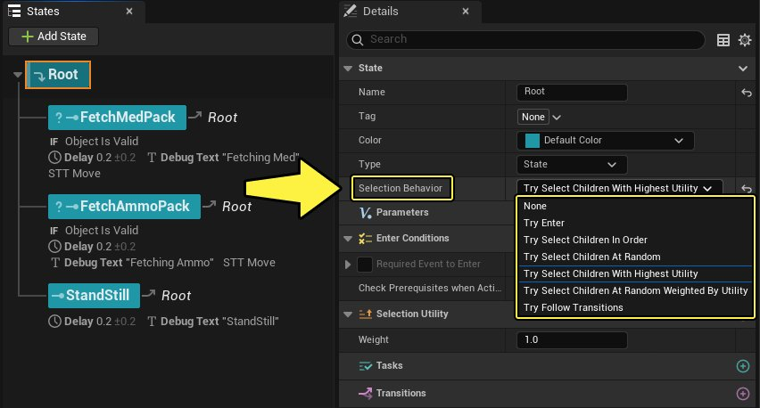
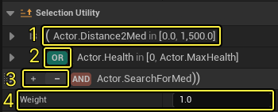
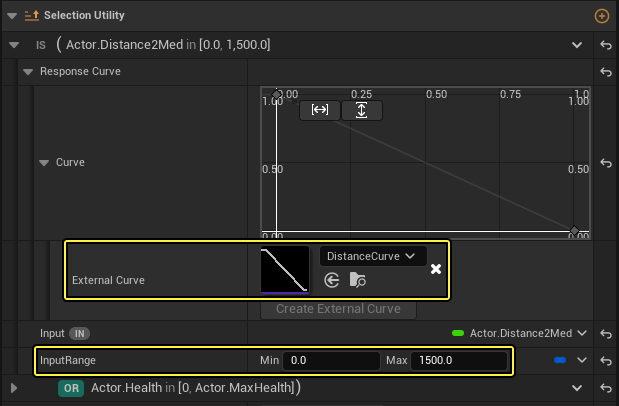
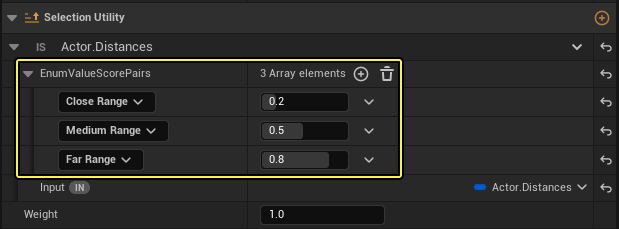
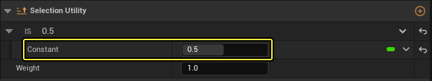
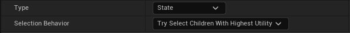
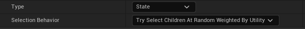

# 状态树选择器概览

> 路径：虚幻引擎5.7文档 / Gameplay系统 / 人工智能 / StateTree / 状态树选择器概览

> 原始页面：https://dev.epicgames.com/documentation/unreal-engine/state-tree-selectors-overview

## 状态树选择器概览

StateTree包含以树状结构排列的状态，包括父状态和子状态。当StateTree运行时，它会从根状态开始向下移动，根据子状态的 **选择行为** 和进入条件选择子状态。本文档将概述各状态可用的选择行为。

StateTree的子状态具有以下状态选择行为：

| 选择行为 | 说明 |
| --- | --- |
| 尝试进入（Try Enter） | 状态即使有子状态，也会被选中。 |
| 尝试按顺序选择子项（Try Select Children in Order） | 尝试按子状态在列表中出现的顺序选择第一个子状态。如果没有子状态，则行为与尝试进入（Try Enter）相同。 |
| 尝试随机选择子项（Try Select Children at Random） | 打乱子状态的顺序，并尝试选择第一个满足进入条件的子状态。如果没有子状态，则行为与尝试进入（Try Enter）相同。 |
| 尝试选择最高效用的子项（Try Select Children with Highest Utility） | 尝试选择具有最高效用分数的子状态。如果多个状态的分数相同，则选择列表中的第一个状态。 |
| 尝试按效用随机加权选择子项（Try Select Children at Random Weighted by Utility） | 按各状态的效用分数随机选择一个子状态。选择各状态的概率是规格化的效用分数。 |
| 尝试遵循过渡（Try Follow Transitions） | 当状态被认为需要过渡时，改为尝试触发过渡。 |

## 状态树效用选择器

此类选择器基于子状态的效用分数。当父状态开始选择要进入的子状态时，所有子状态都会分别输出一个分数。父状态会从所有子状态中选择效用最高的那一个。

效用选择器的组件如下：

- (1) 考虑因素（Consideration）
- (2) 逻辑运算符（Logical operators） （AND、OR）
- (3) 缩进（Indent）
- (4) 权重（Weight）

**考虑因素** 是一种新的StateTree节点类型，代表用户在给状态打分时希望考虑的因素。考虑因素会输出一个介于0和1之间的规格化分数。

例如"敌人低生命值考虑因素"，它输出的枫树会随着生命值降低而增加。你还可以根据特定的条件（如敌人是否在玩家附近）设置可输出固定分数的考虑因素。

使用 **逻辑运算符** 即可将多个考虑因素组合在一起。目前可用的运算符有两种：**AND** 和 **OR** 。

AND运算符会输出两个考虑因素输入分数中较低的一个。OR运算符则输出两个考虑因素输入分数中较高的一个。所有考虑因素分数都在合并后变成一个规格化的分数（0-1）。

存在多个考虑因素时，使用 **缩进** 控制运算符的优先级。上方示例中，将在OR运算符之前计算AND运算符。

将合并后的考虑因素规格化分数乘以 **权重** ，即可得出该状态的最终分数。默认情况下，权重值为1，此时最终分数将与合并后的规格化分数相同。用户可以修改权重值，以在考虑因素的基础上对子状态给予额外的偏向性。经权重调整的最终分数不会被规格化。

上图示例中，假设Distance2Med输出的分数为0.6，Health输出的分数为0.4，SearchForMed输出的分数为0.2，权重为1。那么该状态的最终效用分数如下：

Weight *Max(Distance2Med , Min(Health , SearchForMed )) 1* Max(0.6, Min(0.4, 0.2)) = 0.6

### 考虑因素的类型

#### 浮点输入考虑因素

**浮点输入考虑因素（Float Input Consideration）** 使用 **响应曲线（Response Curve）** 来输出分数。你可直接在 **细节（Details）** 面板中编辑该曲线，也可输入 **外部浮点曲线** 资产。

**输入值** 可与变量绑定，并通过输入范围进行规格化。响应曲线将使用此规格化的值获取规格化值。曲线上0至1之外的值都不会对数值产生影响。

#### 枚举输入考虑因素

**枚举输入考虑因素（Enum Input Consideration）** 使用枚举分数查找表来输出分数。**输入** 与外部蓝图枚举资产类型相绑定，用户可以配置枚举值及其分数。表中的任何缺失值都将输出0分。

#### 常量输入考虑因素

**常量输入考虑因素（Constant Input Consideration）** 会输出一个常量分数。此考虑因素可与 **尝试按效用随机加权选择子项（Try Select Children At Random Weighted by Utility）** 一起使用，以模拟加权随机选择行为。

### 状态树效用选择行为

#### 尝试选择效用最高的子项

**尝试选择效用最高的子项（Try Select Children With Highest Utility）** 选择行为会在所有子状态中选择满足进入条件且效用分数最高的子状态。

#### 尝试按效用随机加权选择子项

**尝试按效用随机加权选择子项（Try Select Children At Random Weighted by Utility）** 选择行为会在满足进入条件的子状态中随机选择。各子状态被选中的概率将按其效用分数加权计算。
