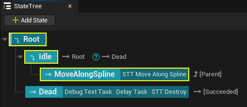
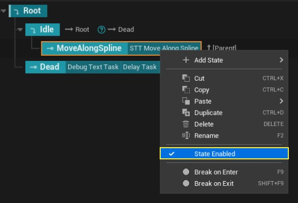
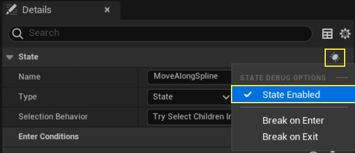
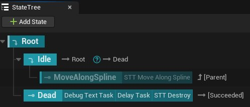
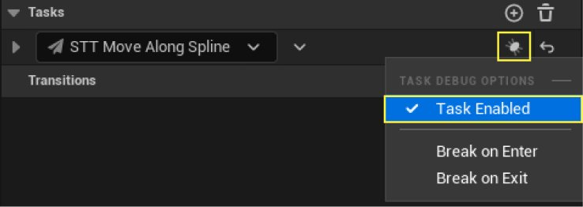
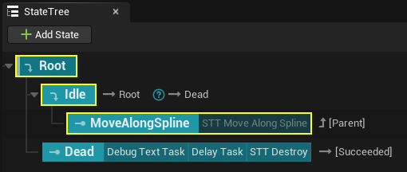
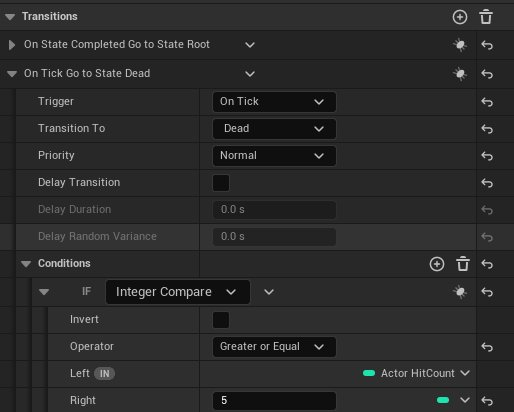
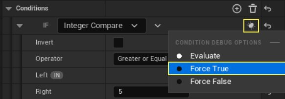

# StateTree调试器快速入门指南

> 路径：虚幻引擎5.7文档 / Gameplay系统 / 人工智能 / StateTree / StateTree调试器快速入门指南

> 原始页面：https://dev.epicgames.com/documentation/unreal-engine/statetree-debugger-quick-start-guide

## 介绍

**StateTree调试器** 可监控并记录StateTree运行时行为，帮助开发人员了解和诊断StateTree中的潜在问题。

创建该系统主要有两个目的，一是直观呈现树中的激活状态，二是实时监控状态、任务、条件的运行时值。

该系统可为编辑器会话（例如，在编辑器中运行）和远程会话（例如独立安装程序、客户端、服务器）提供实时调试。此外，通过保存和加载已记录的追踪文件，用户可以执行延迟分析。

StateTree调试器使用虚幻引擎的 **TraceServices** ，比如[Unreal Insights](../../../../testing-and-optimizing-content/unreal-insights/index.md)，来生成和分析追踪事件。该系统在追踪分析器和追踪提供程序的基础上创建，会收集与特定StateTree资产关联的一个或多个实例的相关事件。

这种方法使系统能够从单个进程同时调试多个编辑器、客户端和专用服务器进程。

## 先决条件

本指南将使用在[StateTree快速入门指南](../statetree-quick-start-guide/index.md)中创建的StateTree来演示StateTree调试器。请完成快速入门，然后再查看本文档中的示例。

完成快速入门指南后，请按 **运行（Play）** 按钮以验证行为。

> 动图已省略：b115afd647c234659b6c875fc760009c6d82bbf93418d5688af592de252d83ea

## 启用和禁用状态

你可以启用和禁用状态树中的各个特定状态。

1. 打开StateTree资产 **ST_ShootingTarget**。

   
2. 右键单击 **MoveAlongSpline** 状态并取消选择 **已启用状态（State Enabled）**。或者，选择状态，然后前往 **细节（Details）** 面板。点击 **调试选项（Debug Options）** 按钮，并取消选择 **已启用状态（State Enabled）**。

   

   
3. **编译（Compile）** 并 **保存（Save）** 状态树。注意已禁用状态如何在窗口中以较深的颜色显示。

   
4. 按 **运行（Play）** 查看结果。**MoveAlongSpline** 状态被禁用，因此状态树立即从 **空闲（Idle）** 进入 **死亡（Dead）** 状态。

   > 动图已省略：MoveAlongSpline状态被禁用，因此树从空闲进入死亡状态

## 启用和禁用任务

你可以启用和禁用一个状态中的各个任务。

1. 启用 **MoveAlongSpline** 状态，前往 **细节（Details）** 面板。点击 **STT_MoveAlongSpline** 任务旁边的 **调试选项（Debug Options）** 按钮，并取消选择 **已启用任务（Task Enabled）**。

   
2. **编译（Compile）** 并 **保存（Save）** 状态树。注意已禁用任务如何以较深的颜色显示。

   
3. 按 **运行（Play）** 查看结果。**MoveAlongSpline** 状态已启用，但 **STT_MoveAlongSpline** 任务已禁用。这使得MoveAlongSpline状态被求值，但由于没有激活的任务，树返回到空闲状态。

   > 动图已省略：MoveAlongSpline状态被求值，但由于没有激活的任务，树返回到空闲状态

## 条件调试选项

你可以出于测试目的在状态树中强制执行条件检查的结果。

1. 对于此示例，选择 **空闲（Idle）** 状态，然后前往 **细节（Details）** 面板。 A. 展开 **过渡（Transitions）** 分段，然后，展开 **On Tick Go to State Dead** 结构体。 B. 最后，展开 **条件（Conditions）**，查看 **HitCount** 和值 **5** 之间的 **整型对比（Integer Compare）** 条件。

   
2. 点击 **条件调试（Conditions Debug）** 按钮，并选择 **强制为True（Force True）**。这将使得该条件在被求值时始终返回true。

   
3. 按 **运行（Play）** 查看结果。当执行空闲状态时，**过渡（Transitions）** 被求值。在这种情况下，**On Tick Go to State Dead** 返回 **True**，因为Actor **HitCount** 和 **5** 之间的整型比较始终返回True。换句话说，我们在模拟Actor被击中5次以上。

   > 动图已省略：On Tick Go to State Dead返回True，因为Actor HitCount和5之间的整型对比始终返回True

## 断点

你可以在进入或退出状态和任务以及执行过渡时添加断点。

断点在整个编辑器会话期间临时存储。但是，如果重新加载资产，断点将会丢失。断点不同于禁用状态或任务，不需要编译StateTree。

1. 对于此示例，右键单击 **MoveAlongSpline** 状态，并选择"进入时中断（Break on Enter）"。请注意，状态现在有一个红色图标，表示一旦树进入此状态，执行就会中断。

   > 图片已省略：右键单击MoveAlongSpline状态并选择

   > 图片已省略：状态现在有一个红色图标，表示执行将中断
2. **编译（Compile）** 并 **保存（Save）** 。点击 **运行（Play）** 测试结果。如你所见，一旦进入状态，执行就会停止。

   > 动图已省略：一旦进入状态执行就停止
3. 你还可以点击任务名称旁边的 **任务调试选项（Task Debug Options）** 按钮并选择 **进入时中断（Break on Enter）** 或 **退出时中断（Break on Exit）** ，从而向任务添加断点。

   > 图片已省略：点击任务名称旁边的调试图标并选择进入时中断或退出时中断

## 调试器选项卡

**调试器（Debugger）** 选项卡提供了关于状态树的详细运行时信息。调试器选项卡可用于跟踪其执行并在暂停期间获取变量数据。

点击 **窗口（Window）> 调试器（Debugger）** 可以打开选项卡。

> 图片已省略：点击窗口 - 调试器可打开调试器

调试器选项卡界面具有以下区域：

> 图片已省略：调试器界面

- (1) 编辑器模拟功能按钮

  ：这些按钮可控制视口中的模拟。你可以开始、暂停和停止模拟。
- (2) 追踪会话记录器

  ：此按钮可在可视记录器中记录实时会话以供以后查看。按下按钮将启动追踪，同时启用Frame和StateTreeDebug通道。
- (3) 分析功能按钮

  ：这些按钮可控制已记录会话的播放。你可以启动和停止追踪分析，一次一帧地单步调试会话，或者跳转到上一个或下一个更改的帧。
- (4) 追踪和执行区域

  ：你可以从下拉列表中选择特定的追踪。你还可以选择特定的已记录执行。
- (5) 时间轴

  ：时间轴显示了可用执行及其激活状态。你可以手动推移时间轴，获取有关特定状态的信息。
- (6) 细节面板

  ：此面板显示了有关所选执行的激活状态的执行详情。面板中显示全局任务和求值器、任务和过渡等信息。面板还显示了在状态中执行过的数据和逻辑。

在下面的示例中，我们点击 **运行（Play）** 按钮来启动运行会话并记录首次 **执行** 。停止运行模式后，我们推移了时间轴以查看已执行状态的记录详情。

> 动图已省略：正在记录一项执行
