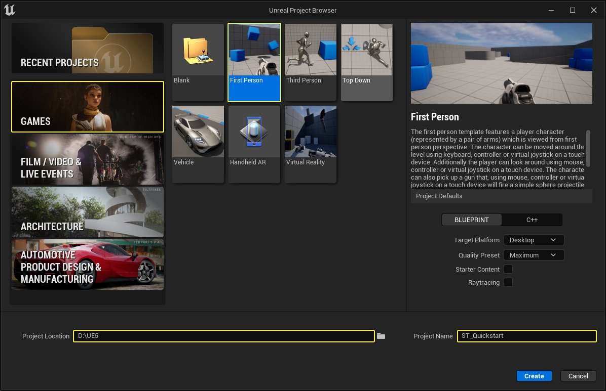
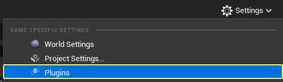
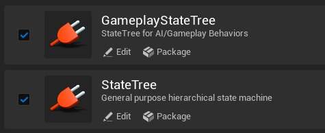
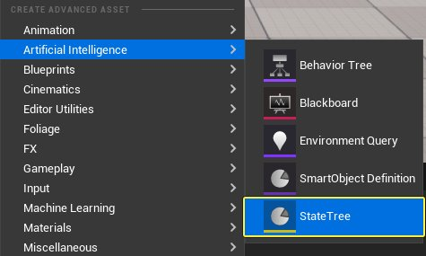
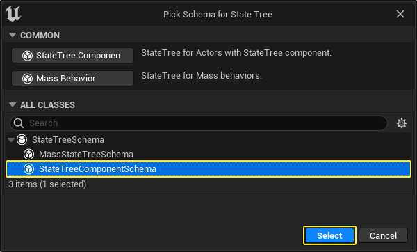
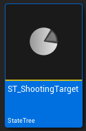
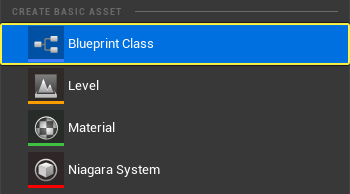
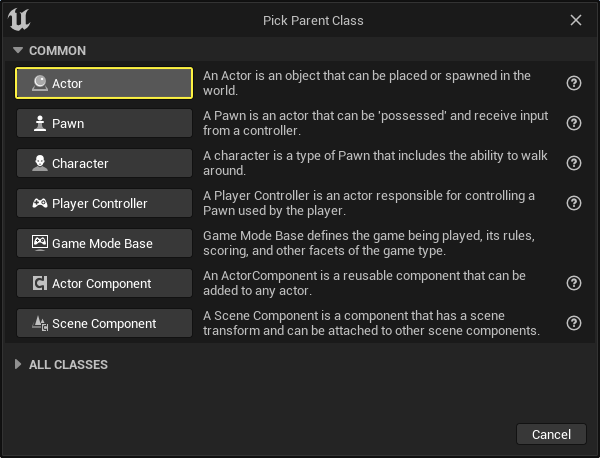

# StateTree快速入门指南

> 路径：虚幻引擎5.7文档 / Gameplay系统 / 人工智能 / StateTree / StateTree快速入门指南

> 原始页面：https://dev.epicgames.com/documentation/unreal-engine/statetree-quick-start-guide

## 概述

**StateTree** 是一种通用分层状态机，组合了行为树中的 **选择器（Selectors）** 与状态机中的 **状态（States）** 和 **过渡（Transitions）** 。用户可以创建非常高效、保持灵活且井然有序的逻辑。

你可以阅读[状态树概述](../overview-of-state-tree/index.md)文档，详细了解状态树。

## 目标

在本指南中，你将使用状态树创建玩家可以射击和销毁的移动目标。

## 目的

- 为目标Actor创建玩家可以射击和销毁的 **蓝图** 。
- 创建包含逻辑从而可移动和销毁目标Actor的状态树。
- 创建状态树任务并在状态树中使用。
- 创建状态树求值器并在状态树中使用。

## 1 - 必要设置

1. 创建新项目，然后选择 **游戏（Games）** 类别和 **第一人称（First Person）** 模板。输入项目的位置和名称。点击 **创建（Create）** 。

   

   点击查看大图。
2. 点击 **设置（Settings）> 插件（Plugins）** 打开 **插件（Plugins）** 窗口。

   
3. 搜索并 **启用** **GameplayStateTree** 和 **StateTree** 插件。重启虚幻引擎编辑器。

   

### 阶段成果

在本分段中，你创建了新项目并启用了状态树插件。你现在可以创建将在目标Actor中使用的状态树。

## 2 - 创建状态树

在本分段中，你将创建一个将由目标Actor使用的状态树。该状态树旨在用作目标Actor的组件，因此你会将 **状态树组件模式（State Tree Component Schema）** 用于该示例。

1. 在 **内容浏览器（Content Browser）** 中，右键点击并选择 **人工智能（Artificial Intelligence）> StateTree** 。

   

   StateTree"" loading="lazy" />
2. 选择 **StateTreeComponentSchema** 类并点击 **选择（Select）** 。

   
3. 将状态命名为 **Tree ST_ShootingTarget** 。

   

### 阶段成果

在本分段中，你创建了一个将由目标Actor使用的带有组件模式的状态树。

## 3 - 创建射击目标蓝图

在本分段中，你将为目标Actor创建蓝图，该蓝图将移动并受到来自玩家的伤害。

1. 在 **内容浏览器（Content Browser）** 中，右键点击并在 **创建基本资产（Create Basic Asset）** 分段中，选择 **蓝图类（Blueprint Class）** 。

   1. 在 **选择父类（Pick Parent Class）** 窗口中，点击 **Actor** 按钮创建新的Actor蓝图。
   2. 将蓝图命名为 **BP_ShootingTarget** 。

   

   

   > 图片已省略：将蓝图命名为BP_ShootingTarget
2. 打开 **BP_ShootingTarget** 并转至 **组件（Components）** 窗口。点击 **+添加（Add）** 并选择 **静态网格体（Static Mesh）** 。

   1. 转到 **细节（Details）** 面板，然后向下滚动到 **静态网格体（Static Mesh）** 分段。
   2. 点击 **静态网格体（Static Mesh）** 下拉菜单并选择 **1M_Cube** 。

   > 图片已省略：点击

   > 图片已省略：点击
3. 将 **静态网格体（Static Mesh）** 的 **缩放（Scale）** 设置为 **X = 0.2** 、 **Y = 2.0** 、 **Z = 2.0** 。

   > 图片已省略：将静态网格体的缩放设置为X = 0.2、Y = 2.0、Z = 2.0
4. 在 **组件（Components）** 窗口中，点击 **+添加（Add）** ，并选择 **StateTree** 。

   1. 转到 **细节（Details）** 面板，然后向下滚动到 **AI** 分段。
   2. 点击 **状态树（State Tree）** 下拉菜单并选择 **ST_ShootingTarget** 。

   > 图片已省略：点击

   > 图片已省略：点击

   > [!NOTE]
   > 如果状态树未显示在下拉菜单中，说明选错了模式。必须选择 **StateTreeComponentSchema** 才能在状态树组件中使用。
5. 右键点击 **静态网格体（Static Mesh）** 组件并选择 **添加事件（Add Event）> 添加OnComponentHit（Add OnComponentHit）** 。

   > 图片已省略：右键点击静态网格体组件并选择
6. 创建新的变量，然后将其命名为 **HitCount** 。

   1. 转到

      细节（Details）

      面板，将

      变量类型（Variable Type）

      设置为

      整型（Integer）

      。

   > 图片已省略：创建新的变量，然后将其命名为HitCount

   > 图片已省略：将变量类型设置为整型
7. 将 **HitCount** 变量拖动到 **事件图表（Event Graph）** ，然后选择 **Get HitCount** 。

   1. 从 **HitCount** 节点拖出，然后搜索并选择 **Increment Int** 。
   2. 将 **On Component Hit** 节点连接到 **Increment Int** 节点。

   > 图片已省略：将On Component Hit节点连接到Increment Int节点

### 阶段成果

在本分段中，你创建了玩家将在Gameplay期间射击的射击Actor蓝图。你现在可以创建状态树的静止和死亡状态。

## 4 - 创建静止和死亡状态

1. 返回 **ST_ShootingTarget** 并在 **模式（Schema）** 分段下点击 **上下文Actor类（Context Actor Class）** 下拉菜单。选择 **BP_ShootingTarget** 。

   > 图片已省略：点击
2. 点击 **+ 添加状态（Add State）** 创建新状态并将其命名为 **静止（Idle）** 。

   > 图片已省略：点击
3. 转到 **细节（Details）** 面板，然后向下滚动到 **过渡（Transitions）** 分段。

   1. 展开

      转至状态（Go to State）

      分段并点击

      过渡至（Transition To）

      下拉菜单。选择

      根（Root）

      。这会将状态树设置为在该状态完成时过渡回根状态。

   > 图片已省略：点击

   > 图片已省略：静止状态现在显示
4. 创建另一个状态并将其命名为 **死亡（Dead）** 。

   > 图片已省略：创建另一个状态并将其命名为
5. 选择 **静止（Idle）** 状态并添加另一个 **过渡（Transition）** 。

   1. 点击 **触发器（Trigger）** 下拉菜单并选择 **更新时（On Tick）** 。
   2. 点击 **过渡至（Transition To）** 下拉菜单并选择 **死亡（Dead）** 。

   > 图片已省略：点击
6. 点击 **加号图标** 添加新 **条件（Condition）** 。点击下拉菜单并选择 **整型比较（Integer Compare）** 。

   1. 展开结构并点击 **左绑定（Left Bind）** 下拉菜单，然后选择 **Actor > 击中计数（Hit Count）** 。这会将 **BP_ShootingTarget** 中的 **击中计数（Hit Count）** 值绑定到StateTree条件。
   2. 输入 **5** 作为 **右（Right）** 整型的值。

   > 图片已省略：点击加号图标添加新条件。点击下拉菜单并选择

   > 图片已省略：展开结构并点击

   击中计数"" loading="lazy" />

   > 图片已省略：输入5作为右整型的值

### 阶段成果

在本分段中，你将静止和死亡状态添加到状态树。你现在可以创建将处理死亡状态的状态树任务。

## 5 - 创建新状态树任务

在本分段中，你将创建新 **状态树任务（State Tree Task）** ，用于在执行 **死亡（Dead）** 状态时销毁Actor。

1. 在 **内容浏览器（Content Browser）** 中，右键点击并选择 **蓝图类（Blueprint Class）** 。

   1. 在 **选择父类（Pick Parent Class）** 窗口中，展开 **全部类（All Classes）** 下拉菜单，搜索并选择 **StateTreeTaskBlueprintBase** 。
   2. 点击 **选择（Select）** ，创建资产。
   3. 将蓝图类命名为 **STT_Destroy** 。

   > 图片已省略：从

   > 图片已省略：展开

   > 图片已省略：将蓝图类命名为STT Destroy
2. 在 **内容浏览器（Content Browser）** 中双击打开 **STT_Destroy** 。转到 **函数（Functions）** 分段，然后点击 **覆盖（Override）** 下拉菜单。选择 **ExitState** 。

   > 图片已省略：转到
3. 创建新的变量，然后将其命名为 **Actor** 。将其类型设置为 **Actor对象引用（Actor Object Reference）** 。

   1. 转到 **细节（Details）** 面板，将其 **类别（Category）** 设置为 **上下文（Context）** 。
   2. 将 **Actor** 变量拖动到 **事件图表（Event Graph）** ，然后选择 **Get Actor** 。
   3. 从 **Actor** 节点拖出，然后搜索并选择 **Destroy Actor** 。
   4. 将 **Event ExitState** 节点连接到 **Destroy Actor** 节点。

   > 图片已省略：创建新的变量，然后将其命名为Actor将其类型设置为Actor对象引用

   > 图片已省略：转到细节面板，将其类别设置为上下文

   > 图片已省略：将Event ExitState 节点连接到Destroy Actor节点

### 阶段成果

在本分段中，你将创建新状态树任务，用于在执行死亡状态后运行。该任务会销毁Actor。

## 6 - 完成死亡状态

1. 返回 **ST_ShootingTarget** 并选择 **死亡（Dead）** 状态。添加新 **任务（Task）** 并从下拉菜单选择 **调试文本任务（Debug Text Task）** 。

   1. 在 **文本（Text）** 字段中输入 **'Actor已销毁（Actor Destroyed）'** 。
   2. 输入 **文本颜色（Text Color）** 和 **字体比例（Font Scale）** 。

   > 图片已省略：添加新任务并从下拉菜单选择
2. 添加另一个 **任务（Task）** 并从下拉菜单选择 **延迟任务（Delay Task）** 。

   1. 为

      时长（Duration）

      输入

      2.0

      。

   > 图片已省略：添加另一个任务并从下拉菜单选择
3. 添加第三个 **任务（Task）** 并从下拉菜单选择 **STT_Destroy** 。这将销毁Actor。

   > 图片已省略：添加第三个任务并从下拉菜单选择STT_Destroy
4. 创建新的 **过渡（Transition）** 并将 **触发器（Trigger）** 设置为 **在状态完成时（On State Completed）** 。

   1. 将

      过渡至（Transition To）

      下拉菜单设置为

      树已成功（Tree Succeeded）

      。

   > 图片已省略：创建新的过渡并将触发器设置为
5. 将 **BP_ShootingTarget** 拖入你的关卡中并按 **播放（Play）** 。射击蓝图并确认状态树可正常运行。

   > 图片已省略：将BP_ShootingTarget拖入你的关卡中并按

   > 动图已省略：玩家射击并销毁射击目标

### 阶段成果

在本分段中，你完成了死亡状态并测试了射击Actor蓝图是否可以受到伤害并被销毁。

## 7 - 添加样条线路径

在本分段中，你将创建带有样条线组件的Actor。该样条线将由射击目标蓝图用于在关卡中移动。

1. 在 **内容浏览器（Content Browser）** 中，右键点击并在 **创建基本资产（Create Basic Asset）** 分段中，选择 **蓝图类（Blueprint Class）** 。

   1. 在 **选择父类（Pick Parent Class）** 窗口中，点击 **Actor** 按钮创建新的Actor蓝图。
   2. 将蓝图命名为 **BP_SplineActor** 。

   > 图片已省略：从

   > 图片已省略：点击Actor按钮创建新Actor蓝图

   > 图片已省略：将蓝图命名为BP_ShootingTarget
2. 打开 **BP_SplineActor** 并转至 **组件（Components）** 窗口。点击 **+添加（Add）** 并选择 **样条线（Spline）** 。

   1.**编译（Compile）** 并 **保存（Save）** 蓝图。

   > 图片已省略：点击

### 阶段成果

在本分段中，你创建了有样条线组件的泛型蓝图Actor。该样条线将用于在关卡中为射击Actor创建移动路径。

## 8 - 添加状态树求值器

现在你将创建 **状态树求值器（State Tree Evaluator）** ，用于搜索关卡中的所有样条线Actor并返回最接近状态树的Actor。

1. 在 **内容浏览器（Content Browser）** 中，右键点击并在 **创建基本资产（Create Basic Asset）** 分段中，选择 **蓝图类（Blueprint Class）** 。

   1. 在 **选择父类（Pick Parent Class）** 窗口中，展开 **全部类（All Classes）** 下拉菜单，搜索并选择 **StateTreeEvaluatorBlueprintBase** 。
   2. 点击 **选择（Select）** ，创建资产。
   3. 将蓝图类命名为 **STE_GetSpline** 。

   > 图片已省略：从

   > 图片已省略：在

   > 图片已省略：将蓝图类命名为STE_GetSpline
2. 打开 **STE_GetSpline** 并转至 **我的蓝图（My Blueprint）** 面板的 **函数（Functions）** 分段。

   1. 点击

      覆盖（Override）

      下拉菜单并选择

      TreeStart

      。

   > 图片已省略：点击
3. 从 **Event TreeStart** 节点拖出，然后搜索并选择 **Get All Actors of Class** 。

   1. 点击

      Actor类（Actor Class）

      下拉菜单并选择

      BP_SplineActor

      。

   > 图片已省略：从Event TreeStart节点拖出，然后搜索并选择Get All Actors of Class
4. 创建新的变量，然后将其命名为 **Actor** 。

   1. 转到 **细节（Details）** 面板，将 **变量类型（Variable Type）** 设置为 **Actor对象引用（Actor Object Reference）** 。
   2. 点击 **类别（Category）** 下拉菜单并输入 '**Context**' 。

   > 图片已省略：创建新的变量，然后将其命名为Actor

   > 图片已省略：将变量类型设置为Actor对象引用，点击
5. 从 **Get All Actors from Class** 节点的 **输出Actor（Out Actors）** 引脚拖出，搜索并选择 **Find Nearest Actor** 。

   1. 将 **Actor** 变量拖动到 **事件图表（Event Graph）** ，然后选择 **Get Actor** 。
   2. 从 **Actor** 节点拖出，然后搜索并选择 **Get Actor Location** 。
   3. 将 **Get Actor Location** 节点的 **返回值（Return Value）** 连接到 **Find Nearest Actor** 节点的 **源（Origin）** 引脚。

   > 图片已省略：从Get All Actors from Class节点的输出Actor引脚拖出，搜索并选择Find Nearest Actor
6. 从 **Find Nearest Actor** 节点的 **返回值（Return Value）** 引脚拖出，搜索并选择 **Cast to BP_SplineActor** 。

   1. 右键点击 **Cast to BP_SplineActor** 节点的 **作为BP样条线Actor（As BP Spline Actor）** 引脚，然后选择 **提升到变量（Promote to Variable）** 。
   2. 将此变量命名为 **SplineActor** 并输入 '**Output**' 作为其 **类别（Category）** 。
   3. **编译（Compile）** 并 **保存（Save）** 蓝图。

   > 图片已省略：从Find Nearest Actor节点的返回值引脚拖出，搜索并选择Cast to BP_SplineActor

   > 图片已省略：将此变量命名为SplineActor并输入'Output'作为其类别
7. 返回 **ST_ShootingTarget** ，在 **StateTree** 窗口下，点击 **求值器（Evaluators）** 旁边的 **加号** 。

   1. 点击下拉菜单并选择

      STE_GetSpline

      。

   > 图片已省略：点击下拉菜单并选择STE_GetSpline

### 阶段成果

在本分段中，你创建了一个状态树求值器，它将在状态树开始执行时执行。该求值器会检查关卡中的所有样条线Actor并返回最接近射击Actor的Actor。

## 9 - 添加状态树任务以沿样条线移动

在本分段中，你将创建新 **状态树任务（State Tree Task）** ，用于沿 **BP_SplineActor** 的样条线移动Actor。

1. 在 **内容浏览器（Content Browser）** 中，右键点击并选择 **蓝图类（Blueprint Class）** 。

   1. 在 **选择父类（Pick Parent Class）** 窗口中，展开 **全部类（All Classes）** 下拉菜单，搜索并选择 **StateTreeTaskBlueprintBase** 。
   2. 点击 **选择（Select）** ，创建资产。
   3. 将蓝图类命名为 **STT_MoveAlongSpline** 。

   > 图片已省略：从

   > 图片已省略：在

   > 图片已省略：将蓝图类命名为STT_MoveAlongSpline
2. 打开 **STT_MoveAlongSpline** 并转至 **我的蓝图（My Blueprint）** 面板的 **函数（Functions）** 分段。点击 **覆盖（Override）** 下拉菜单并选择 **Tick** 。

   > 图片已省略：点击
3. 创建新的变量，然后将其命名为 **Actor** 。

   1. 转到 **细节（Details）** 面板，将 **变量类型（Variable Type）** 设置为 **Actor对象引用（Actor Object Reference）** 。
   2. 点击"类别（Category）"下拉菜单并输入 '**Context**' 。

   > 图片已省略：创建新的变量，然后将其命名为Actor

   > 图片已省略：将变量类型设置为Actor对象引用，点击
4. 创建新的变量，然后将其命名为 **SplineActor** 。

   1. 转到 **细节（Details）** 面板，将 **变量类型（Variable Type）** 设置为 **BP_SplineActor** 。
   2. 输入 '**Input**' 作为 **类别（Category）** 。

   > 图片已省略：创建新的变量，然后将其命名为SplineActor

   > 图片已省略：将变量类型设置为B SplineActor并输入'Input'作为类别
5. 将 **Actor** 变量拖动到 **事件图表（Event Graph）** ，然后选择 **Get Actor** 。

   1. 从 **Actor** 节点拖出，然后搜索并选择 **Set Actor Location** 。
   2. 将 **Tick** 节点连接到 **Set Actor Location** 节点。

   > 图片已省略：从Actor节点拖出，然后搜索并选择Set Actors Location
6. 将 **SplineActor** 拖动到 **事件图表（Event Graph）** ，然后选择 **Get Spline Actor** 。

   1. 从 **SplineActor** 节点拖出，然后搜索并选择 **Spline** 。
   2. 从 **Spline** 节点拖出，然后搜索并选择 **Get Location at Distance Along Spline** 。
   3. 将 **Get Location** at **Distance Along Spline** 节点的 **返回值（Return Value）** 连接到 **Set Actor Location** 节点的 **新位置（New Location）** 引脚。
   4. 右键点击 **Get Location at Distance Along Spline** 节点的 **距离（Distance）** 引脚，然后选择 **提升到变量（Promote to Variable）** 。

   > 图片已省略：将Get Location at Distance Along Spline节点的返回值连接到Set Actor Location节点的新位置引脚
7. 从 **Set Actor Location** 节点拖出，然后搜索并选择 **Branch** 。

   1. 将 **Distance** 变量拖动到 **事件图表（Event Graph）** ，然后选择 **Get Distance** 。
   2. 从 **Distance** 节点拖出，然后搜索并选择 **Less** 。
   3. 将 **Less** 节点连接到 **Branch** 节点的 **条件（Condition）** 引脚。

   > 图片已省略：将Less节点连接到Branch节点的条件引脚
8. 将 **SplineActor** 拖动到 **事件图表（Event Graph）** ，然后选择 **Get Spline Actor** 。

   1. 从 **SplineActor** 节点拖出，然后搜索并选择 **Spline** 。
   2. 从 **Spline** 节点拖出，然后搜索并选择 **Get Spline Length** 。
   3. 将 **Get Spline Length** 节点的 **返回值（Return Value）** 连接到 **Less** 节点的下方引脚。

   > 图片已省略：将Get Spline Length节点的返回值连接到Less节点的下方引脚
9. 将 **Distance** 变量拖动到 **事件图表（Event Graph）** ，然后选择 **Get Distance** 。

   1. 从 **Distance** 节点拖出，然后搜索并选择 **Add** 。
   2. 创建类型为 **浮点** 的新变量，然后将其命名为 **MovementSpeed** 。
   3. 将 **MovementSpeed** 连接到 **Add** 节点的下方引脚。
   4. 将 **Distance** 变量拖动到 **事件图表（Event Graph）** ，然后选择 **Set Distance** 。
   5. 将 **Add** 节点连接到 **Set Distance** 节点。
   6. 将 **Branch** 节点的 **True** 引脚连接到 **Set Distance** 节点，如下所示。

   > 图片已省略：将Branch节点的True引脚连接到Set Distance节点，如下所示
10. 选择 **MovementSpeed** 变量，将其 **默认（Default）** 值设置为 **5.0** 。

    > 图片已省略：选择MovementSpeed变量，将其默认值设置为5.0
11. 将 **Distance** 变量拖动到 **事件图表（Event Graph）** ，然后选择 **Set Distance** 。

    1. 将 **Branch** 节点的 **False** 引脚连接到 **Set Distance** 节点。
    2. 将两个 **Set Distance** 节点都连接到带有 **返回值（Return Value）** **正在运行（Running）** 的 **返回节点（Return Node）** 。

    > 图片已省略：将Branch节点的False引脚连接到Set Distance节点

    > 图片已省略：将两个Set Distance节点都连接到带有返回值

### 阶段成果

在本分段中，你创建了一个状态树任务，它沿使用样条线Actor蓝图创建的样条线移动射击Actor蓝图。

## 10 - 完成状态树

1. 返回 **ST_ShootingTarget** 并点击 **+添加状态（Add State）** 。将新状态命名为 **MoveAlongSpline** 。

   1. 点击

      MoveAlongSpline

      状态并将其拖入

      静止（Idle）

      状态中作为其子状态。

   > 图片已省略：返回ST_ShootingTarget并点击

   > 图片已省略：点击MoveAlongSpline状态并将其拖入静止状态中作为其子状态
2. 转至 **细节（Details）** 面板并点击 **+** 按钮添加新 **任务（Task）** 。

   1. 点击 **下拉菜单** 并选择 **STT_MoveAlongSpline** 。
   2. 点击 **样条线Actor（Spline Actor）** 旁边的 **绑定（Bind）** 下拉菜单并选择 **STE获取样条线（STE Get Spline）> 样条线Actor（Spline Actor）** 。

   > 图片已省略：点击下拉菜单并选择STT_MoveAlongSpline

   > 图片已省略：点击样条线Actor旁边的绑定下拉菜单并选择

   样条线Actor"" loading="lazy" />

   > 图片已省略：样条线Actor现在绑定到STE获取样条线中的样条线Actor变量
3. 将 **BP_SplineActor** 拖入关卡中。

   > 图片已省略：将B SplineActor拖入关卡中
4. 选择 **BP_SplineActor** 的 **样条线（Spline）** 组件。**按住Alt并拖动** 以创建新的样条线点并创建闭合形状。

   1. 选择

      样条线Actor（Spline Actor）

      蓝图的

      样条线（Spline）

      组件并向下滚动到

      样条线（Spline）

      分段。

      启用

      闭环（Closed Loop）

      复选框，使样条线成为闭合形状。

   > 动图已省略：选择BP_SplineActor的样条线组件。按住Alt并拖动以创建新的样条线点并创建闭合形状

   > 图片已省略：启用闭环复选框，使样条线成为闭合形状
5. 按 **播放（Play）** 并向目标射击。

   > 动图已省略：按
