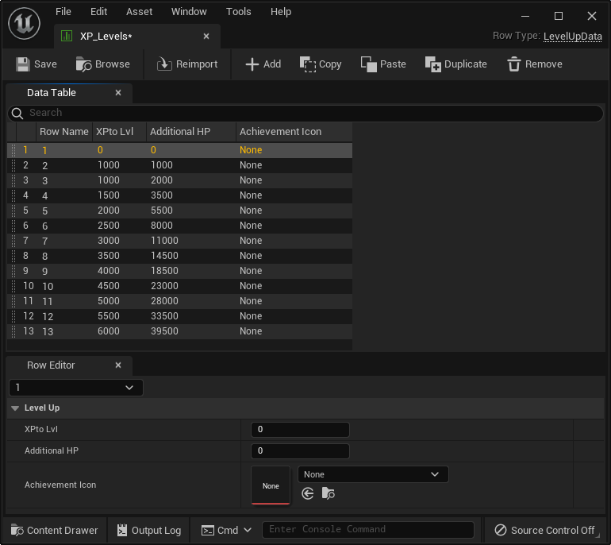
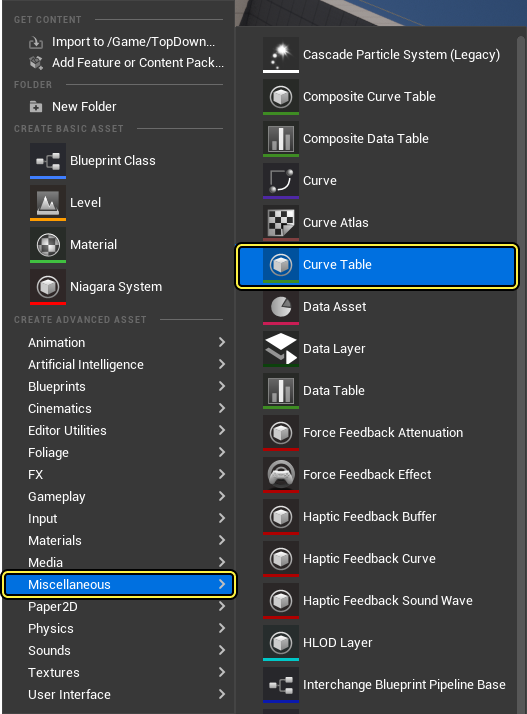
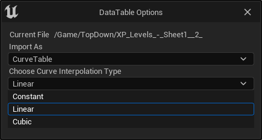
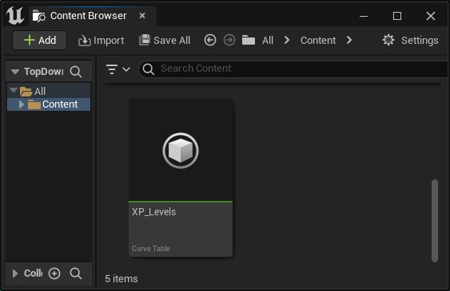
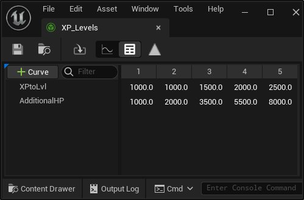
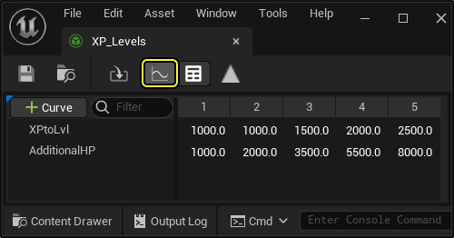
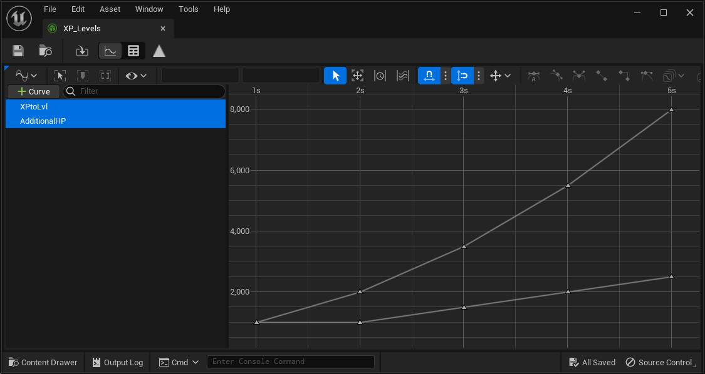

# 数据驱动的Gameplay元素

> 路径：虚幻引擎5.7文档 / Gameplay系统 / 数据驱动的Gameplay元素

> 原始页面：https://dev.epicgames.com/documentation/unreal-engine/data-driven-gameplay-elements-in-unreal-engine

**基于数据驱动的游戏逻辑（Data Driven Gameplay）** 有助于减少开发人员的工作量，让开发者可以直观查看数据的创建和使用流程。这点特别适用于那些生命周期较长、需要不断根据玩家反馈调整和平衡数据的游戏。

在基于数据驱动的游戏逻辑流程中，你可以通过一个界面来查看和调整数据的创建和变化。你可以把数据放在 **Microsoft Excel** 或其他可维护的电子表格中，然后导入游戏，并使之自动生效。

**数据表（DataTables）** 和 **曲线表（CurveTables）** 可以通过Excel文档导入到 **虚幻引擎**。这些Excel文件的类型是 `.xlsm`（启用宏的Excel文件），有基于宏的导出按钮，能够便捷地将数据导出为中间数据格式，即逗号分隔值（`.csv`）。

这些文件存放在一个地方，这让数据更容易找到和修改。你可以通过 **右键点击** > **另存为** 来下载一个 `.xlsm` 文件示例：

[Sample .xlsm file](https://d1iv7db44yhgxn.cloudfront.net/documentation/attachments/32142ada-7662-4cee-bc49-425aa6443faf/example.xlsm)

## 数据表

数据表是一种表格，包含各种杂七杂八但彼此相关的数据，并以某种特定方式整理归纳。表中的数据字段可以是任何有效的 `UObject` 属性，包括资产引用。在设计师将CSV文件导入到数据表之前，程序员必须创建行容器，告诉引擎如何解释数据。

这些表格由列名组成，这些列名与基于给定代码的 `UStruct` 及其变量具有1:1映射关系，这些变量必须继承自 `FTableRowBase` 才能被导入程序识别。

第一列名为名称（Name），这一列中的名称可供游戏访问各行。随后的列具有变量名称作为标题，下面在同一列中，是该行/列交点的数据。鉴于这种格式，单个行直接与继承自 `FTableRowBase` 的结构具有1:1的映射关系。

我们创建了以下CSV文档，展示了一个游戏数据示例，其中角色可以获得经验值以进行"升级"：

```
	/** 用于定义数据表的结构体 */	USTRUCT(BlueprintType)	struct FLevelUpData : public FTableRowBase	{		GENERATED_USTRUCT_BODY() 	public: 		FLevelUpData()		: XPtoLvl(0)		, AdditionalHP(0)		{} 		/ ** "Name"一列中的字段表示当前的经验等级 * / 		/ ** 升级到下一级所需的经验值 * /		UPROPERTY(EditAnywhere, BlueprintReadWrite, Category=LevelUp)		int32 XPtoLvl; 		/ ** 升级后获得生命值加成 * /		UPROPERTY(EditAnywhere, BlueprintReadWrite, Category=LevelUp)		int32 AdditionalHP; 		/ ** 升级成就图标 * /		UPROPERTY(EditAnywhere, BlueprintReadWrite, Category=LevelUp)		TSoftObjectPtr<UTexture> AchievementIcon;	};
```

**CSV表格：**

```
	Name,XPtoLvl,AdditionalHP,AchievementIcon	1,0,0,"Texture2d'/Game/Textures/AchievementIcon1'"	2,1000,9,"Texture2d'/Game/Textures/AchievementIcon2'"	3,1000,10,"Texture2D'/Game/Textures/AchievementIcon3'"	4,1500,12,"Texture2D'/Game/Textures/AchievementIcon4'"	5,2000,14,"Texture2D'/Game/Textures/AchievementIcon5'"
```

> [!TIP]
> 此处的双引号对于能否正确导入属性很重要。如果不使用双引号，此处导入的内容会变为 `Texture2d` 。

### 数据表导入过程

按照以下步骤导入CSV文件：

1. 使用 `.csv` 扩展名从Excel或其他电子表格软件保存你的文件。
2. 打开虚幻编辑器，并点击 **内容浏览器（Content Browser）** 中的 **导入（Import）** 。
3. 找到并选择你想导入为DataTable的CSV文件。你可以选择以下

   导入为（Import As）

   选项：

   - 数据表（DataTable）
   - 曲线表（CurveTable）
   - 浮点曲线（Float Curve）
   - 向量曲线（Vector Curve）
   - 线性颜色曲线（Linear Color Curve）
4. 你可以在下拉菜单中选择 **数据表行类型（DataTable Row Type）**。
5. 有更多 **导入选项（Import Options）** 可供使用：

| 导入选项 | 说明 |
| --- | --- |
| **忽略额外字段（Ignore Extra fields）** | 设置为true可忽略导入数据中的额外字段，如果设置为false，将对此发出警告 |
| **忽略缺失字段（Ignore Missing Fields）** | 设置为true可忽略本该出现但实际缺失的字段，如果设置为false，将对此发出警告 |
| **导入密钥字段（Import Key Field）** | 导入数据中要用作密钥的显式字段。如果为空，将对 `.JSON` 使用Name，并对 `.CSV` 使用找到的字段 |

1. 这将在 **内容浏览器（Content Browser）** 的当前目录中创建DataTable对象。
2. 你可以 **双击** 对象以在编辑器中查看DataTable的内容。你可以 **右键点击** 对象并从菜单中选择 **重新导入（Reimport）** 来更新该对象。

   

   > [!NOTE]
   > The original file path is used when reimporting the object.

## 数据曲线

**数据曲线** 的工作方式类似于DataTable，但仅支持浮点类型。与DataTable一样，第一列名为"名称（Name）"，这一列中的名称可供游戏访问各行。

第一列之后的每个列标题将存储用于绘制曲线的X轴变量。此标题下的数据是给定行的Y轴值。采用这种格式，单个行对应一条曲线，代码可以访问这条曲线并在其中内插数据。

下面是不同等级下的伤害数据：

|  | 0 | 1 | 2 | 3 |
| --- | --- | --- | --- | --- |
| Melee_Damage | 15 | 20 | 25 | 30 |
| Melee_KnockBack | 1 | 2 | 4 | 8 |
| Melee_KnockBackAngle | 10 | 45 | 60 | 65 |
| Melee_StunTime | 0 | 1 | 5 | 7 |

## 曲线表

**曲线表（Curve Tables）** 很适合用于定义二维数字数据。你可以在曲线数据表编辑器中编辑简单曲线和富曲线。

创建曲线表时，你可以打开编辑器，编辑表或曲线视图中的曲线，无需返回你创建它们时所用的外部程序。

你可以在内容浏览器中找到 **杂项（Miscellaneous）** 分段，创建曲线表。



### 曲线表导入过程

以下是导入CSV文件的步骤：

1. 在Excel或其他电子表格软件中，将你的文件保存为 `.csv` 格式。
2. 打开虚幻编辑器，并点击 **内容浏览器（Content Browser）** 中的 **导入（Import）** 。
3. 选择你想导入为DataTable的CSV文件。你可以 **导入为（Import As）** 以下类型：

   - 数据表（DataTable）
   - 曲线表（CurveTable）
   - 浮点曲线（Float Curve）
   - 向量曲线（Vector Curve）
   - 线性颜色曲线（Linear Color Curve）
4. 从下拉列表选择 **曲线表类型（Curve Table Type）** 。选择之后，系统将提示你在 **常量（Constant）** 、 **线性（Linear）** 、 **三次方（Cubic）** 之间选择你的插值类型。

   

   | 插值类型 | 说明 |
   | --- | --- |
   | **常量（Constant）** | Y中的值将不会在X中的数据点之间内插。它们将限制为X的之前已知值。 |
   | **线性（Linear）** | Y中的值将在X中的数据点之间线性内插。 |
   | **三次（Cubic）** | Y中的值将在X中的数据点之间三次内插。 |
5. 这将在 **内容浏览器（Content Browser）** 的当前目录中创建曲线表对象。

   
6. 你可以双击曲线表打开曲线表编辑器。

   
7. 要以图表格式查看曲线表数据，请点击图表按钮。

   
8. **曲线表视图（Curve Table View）** 允许显示多条曲线。

   
9. 你可以右键点击曲线来 **重命名（Rename）** 和 **删除（Delete）** 曲线。

## 数据连接

要使用这些表格中的数据，您必须放置一个Blueprint-exposed变量，可以是 **FDataTableRowHandle** 或 **FCurveTableRowHandle**， 具体取决于您想使用数据表还是曲线表。

从内容提供者的视角来看，这将公开一个具有两个子字段的数据字段：

| 子字段 | 说明 |
| --- | --- |
| DataTable/CurveTable | 用于保存数据的表格的引用。 |
| RowName | 第一列中的不同数据行的名称/标题。 |

### 数据用法（仅限C++程序员）

连接数据之后，使用数据非常简单。句柄结构提供了辅助函数 `FindRow()` 和 `GetCurve()` ，可用于检索填充了数据的结构体或曲线。

对于 `FCurveTableRowHandle` ，将返回 `FRichCurve` 指针。而 `FDataTableRowHandle` 则 允许你指定模板函数调用中的结构。该结构可以是最终结构 或继承层级中的任意父结构。

最后需要注意，返回的所有结构和曲线在缓存时都不应超出函数的本地范围。若表格通过重新导入而刷新，这可以保证数据更改 立即生效，不会访问无效的指针。

在上面的DataTable示例中，引用的资产是延迟加载的资产（`TSoftObjectPtr` 会处理此情况）。 如果资产字段类型设置为UTexture，每次加载DataTable时都会加载所有资产。

- [数据注册表](data-registries/index.md) - 使用数据注册表可以存储、合并、读取和管理不同来源的数据。
