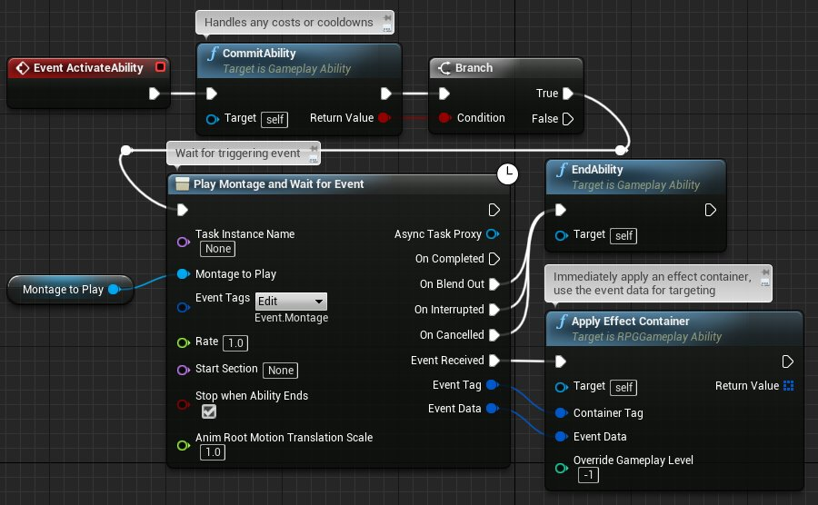

# 技能任务

> 路径：虚幻引擎5.7文档 / Gameplay系统 / Gameplay技能系统 / 技能任务

> 原始页面：https://dev.epicgames.com/documentation/unreal-engine/gameplay-ability-tasks-in-unreal-engine

技能任务（C++类"UAbilityTask"）是更常规的技能任务类的特殊形式，旨在使用游戏性技能。使用游戏性技能系统的游戏通常包括各种自定义技能任务，这些任务实施其独特的游戏功能。它们在游戏性技能执行过程中执行异步工作，并且能够通过调用[委托（Delegate）](../../../cpp-programming/delegates-and-lambda-functions/index.md) （在本地C++代码中）或移经一个或多个输出执行引脚（在蓝图中）来影响执行流。这使技能能够跨多个帧执行，并可在同一帧内执行多个不同的函数。大部分技能任务都有一个即时触发的执行引脚，使蓝图能够在任务开始后继续执行。此外，通常还有一些特定于任务的引脚，它们会在延迟后或在可能发生或不发生的某个事件之后触发。

技能任务可以通过调用"EndTask"函数自行终止，或者等待运行它的游戏性技能结束，此时它会自动终止。这可以防止幻影技能任务运行，有效地泄漏CPU周期和内存。例如，某个技能任务可能播放一个施法动画，而另一个任务则在玩家的瞄准点处放置一个靶向标线。如果玩家点击确认输入来施放该法术，或者等待动画结束而未确认该法术，游戏性技能就会结束。虽然它们可以在任何时候自动终止，但是技能任务保证最晚在主要技能结束时终止。

> [!NOTE]
> 技能任务设计用于网络环境和非网络环境，但它们不会通过网络直接更新自己。它们通常是间接保持同步的，因为它们是由游戏性技能（会进行复制）创建，并且使用复制的信息（例如玩家输入或网络变量）来确定它们的执行流。

*近战攻击游戏性技能，在蓝图中实施。中央的"播放蒙太奇并等待事件"技能任务是ActionRPG样本的一部分。*

> [!NOTE]
> 要查看如何在UE4项目中进行此设置，查看[ARPG中的近战技能](../../../samples-and-tutorials/index.md)文档。
