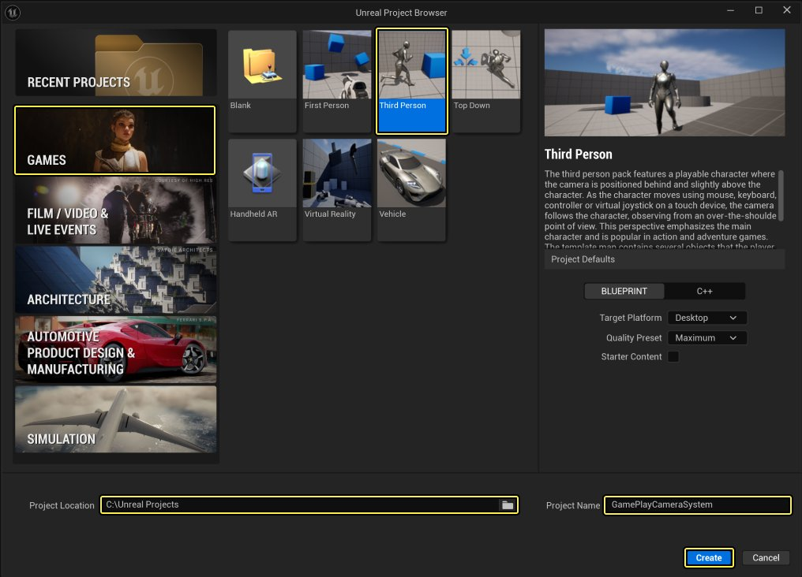
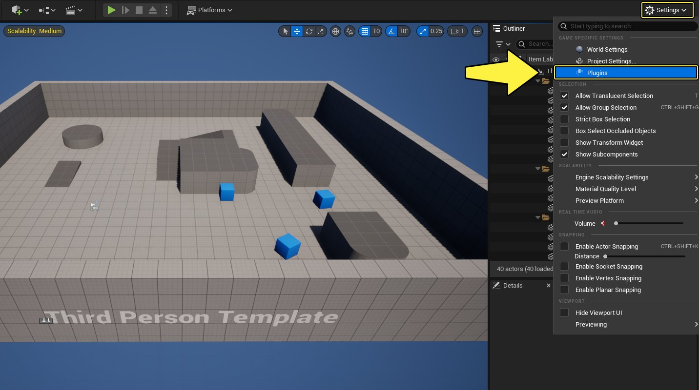
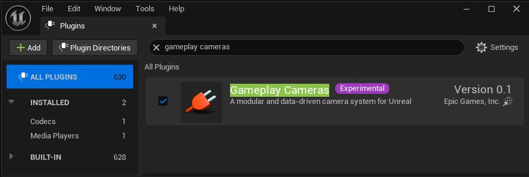
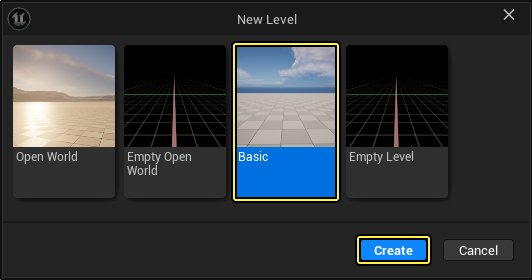
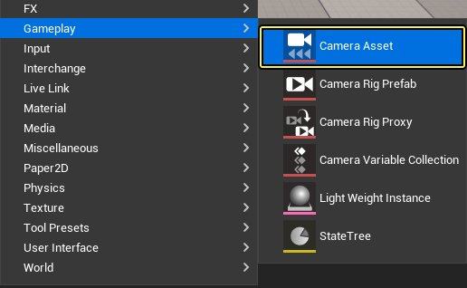
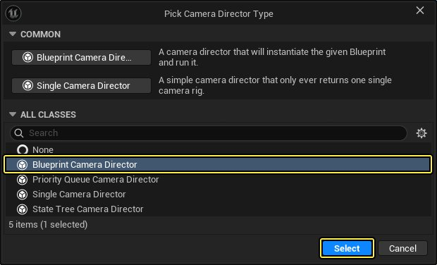
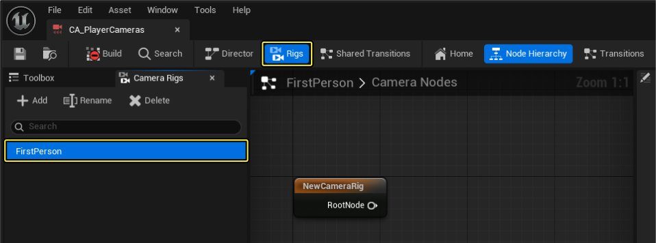
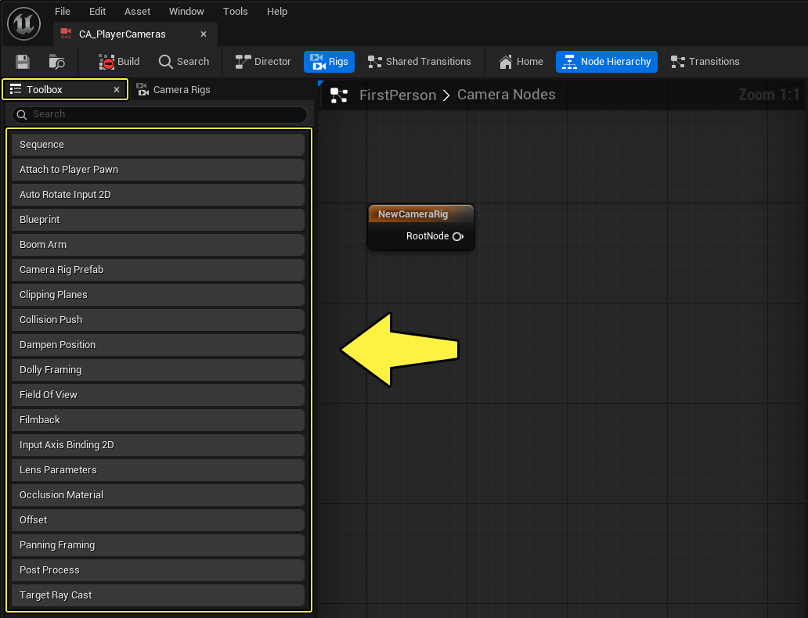

# Gameplay摄像机系统快速入门

> 路径：虚幻引擎5.7文档 / Gameplay系统 / Gameplay摄像机系统 / Gameplay摄像机系统快速入门

> 原始页面：https://dev.epicgames.com/documentation/unreal-engine/gameplay-camera-system-quick-start

本篇快速入门指南将教你如何使用 **Gameplay摄像机系统** 创建三种不同的摄像机绑定。这些摄像机绑定将复制虚幻引擎自带模板中的以下摄像机设置：

- 第三人称
- 第一人称
- 俯视角

如需详细了解本系统，请参阅[Gameplay摄像机系统概览](../gameplay-camera-system-overview/index.md)文档。

## 必要设置

1. 新建项目并选择

   游戏（Games）

   类别和

   第三人称（Third Person）

   模板。

   - 输入项目的

     位置（Location）

     和

     名称（Name）

     。
   - 点击

     创建（Create）

     。

   
2. 点击

   设置（Settings）> 插件（Plugins）

   打开

   插件（Plugins）

   窗口。

   - 搜索并

     启用

     Gameplay摄像机（Gameplay Cameras）

     插件。如有必要，请重启编辑器。

   

   
3. 在编辑器中，点击

   文件（File）> 新关卡（New Level）

   。

   - 选择

     基础（Basic）

     模板并点击

     创建（Create）

     。

   

### 阶段成果

在本节中，你新建了项目并进行了设置，以便使用Gameplay摄像机系统为玩家创建多套摄像机设置。

## 创建摄像机资产

**摄像机资产（Camera Asset）** 包含一个或多个 **摄像机绑定（Camera Rigs）** 、 **过渡（Transitions）** 和 **摄像机指示器（Camera Director）** 的信息，用于确定游戏过程中的活动摄像机绑定。

要创建摄像机资产，请按照以下步骤操作：

1. 右键点击 **内容浏览器（Content Browser）** ，选择 **Gameplay > 摄像机资产（Camera Asset）** 。

   
2. 在 **选择摄像机指示器类型（Pick Camera Director Type）** 窗口中，选择 **蓝图摄像机指示器（Blueprint Camera Director）** 并点击 **选择（Select）** 。

   
3. 将资产命名为 **CA_PlayerCameras** 。

### 第一人称摄像机绑定

1. 打开 **CA_PlayerCameras** 并点击工具栏中的 **绑定（Rigs）** 以查看可用的摄像机绑定。
2. 将默认绑定重命名为 **FirstPerson** 。

   
3. 点击 **工具箱（Toolbox）** 面板以查看可用节点。

   
4. 添加 **Sequence** 节点和 **Boom Arm** 节点，如下所示。
5. 选择 **Boom Arm** 节点，转到 **细节（Details）** 面板并将 **吊臂偏移（Boom Offset）** 的X、Y和Z分别设为 **50** 、 **0** 和 **50** 。

   > 图片已省略：添加Sequence和Boom Arm节点，设吊臂偏移为50、0、50
6. 添加 **Field of View** 节点，转到 **细节（Details）** 面板，将 **视野（Field of View）** 设为 **100** 。

   > 图片已省略：添加Field of View节点并设为100

### 第三人称摄像机绑定

1. 创建新的 **摄像机绑定（Camera Rig）** ，将其命名为 **ThirdPerson** 。

   > 图片已省略：创建新的摄像机绑定，命名为ThirdPerson
2. 添加 **Sequence** 节点和 **Boom Arm** 节点，如下所示。
3. 选择 **Boom Arm** 节点，转到 **细节（Details）** 面板并将 **吊臂偏移（Boom Offset）** 的X、Y和Z分别设为 **-500** 、 **0** 和 **50** 。

   > 图片已省略：添加Sequence和Boom Arm节点，设吊臂偏移为-500、0、50
4. 拖出 **输入插槽（Input Slot）** 引脚并选择 **输入轴绑定2D（Input Axis Binding 2D）** 。这将把InputSlot公开给蓝图，供你之后修改。

   > 图片已省略：拖移输入插槽引脚并选择输入轴绑定2D
5. 转到

   细节（Details）

   面板并添加

   IA_Look

   轴动作。

   - 勾选

     Y轴最小限制（Clamp Y Min）

     和

     最大限制（Max）

     复选框，分别为

     最小值（Min Value）

     和

     最大值（Max Value）

     输入

     -80

     和

     10

     。
   - **勾选** **反转Y轴（Revert Axis Y）** 复选框。

     > 图片已省略：添加IA_Look轴动作，为Clamp Y Min输入-80，Max输入10，勾选反转Y轴
6. 拖出 **BoomOffset** 引脚并点击 **摄像机绑定参数（Camera Rig Parameter）** ，将此变量公开给蓝图。

   > 图片已省略：拖出BoomOffset引脚并点击摄像机绑定参数，将此变量公开给蓝图
7. 添加 **Field of View** 节点和 **Dampen Position** 节点。选择 **Dampen Position** 节点，转到 **细节（Details）** 面板并为 **前向阻尼系数（Forward Damping Factor）** 输入 **5** 。

   > 图片已省略：添加Field of View节点和Dampen Position节点，设前向阻尼系数为5
8. 添加 **Occlusion Material** 节点，转到 **细节（Details）** 面板，从 **遮蔽透明度材质（Occlusion Transparency Material）** 下拉菜单中选择一项材质。下面示例中显示了使用的半透明材质。

   > 图片已省略：添加Occlusion Material节点，从遮蔽透明度材质下拉菜单中选择一项材质

   > 图片已省略：此示例使用的半透明材质

### 俯视角摄像机绑定

1. 创建新的 **摄像机绑定（Camera Rig）** ，将其命名为 **TopDown** 。

   > 图片已省略：创建新摄像机绑定，命名为TopDown
2. 添加 **Sequence** 节点和 **Boom Arm** 节点，如下所示。 选择 **Boom Arm** 节点，转到 **细节（Details）** 面板并将 **吊臂偏移（Boom Offset）** 的X、Y和Z分别设为 **-1000** 、 **0** 和 **0** 。

   > 图片已省略：添加Sequence和Boom Arm节点，设吊臂偏移为-1000、0、0
3. 添加 **Field of View** 节点和 **Dampen Position** 节点。选择 **Dampen Position** 节点，转到 **细节（Details）** 面板并为 **前向阻尼系数（Forward Damping Factor）** 输入 **5** 。

   > 图片已省略：添加Field of View节点和Dampen Position节点，设前向阻尼系数为5
4. 添加 **Occlusion Material** 节点，转到 **细节（Details）** 面板，从 **遮蔽透明度材质（Occlusion Transparency Material）** 下拉菜单中选择一项材质。使用与 **第三人称摄像机绑定** 相同的材料。

   > 图片已省略：添加Occlusion Material节点，从遮蔽透明度材质下拉菜单中选择一项材质

### 摄像机指示器

1. 点击 **指示器（Director）** 按钮，前往 **指示器（Director）** 选项卡。
2. 点击 **+** 以创建新的 **指示器蓝图（Director Blueprint）** 。

   > 图片已省略：点击指示器按钮，点击+以创建新的指示器蓝图
3. 选择 **目标文件夹** ，输入名称 **CDE_PlayerCameras** 并点击 **保存（Save）** 。

   > 图片已省略：选择目标文件夹，输入CDE_PlayerCameras并点击保存
4. 点击 **编译（Build）** 。

   > 图片已省略：点击编译

### 阶段成果

在本节中，你创建了供玩家角色蓝图使用的三个摄像机绑定。

## 创建摄像机过渡

在本节中，你将为上一节创建的摄像机绑定创建过渡效果。

按照以下步骤操作，创建摄像机绑定的过渡：

1. 打开

   第一人称摄像机绑定（First Person Camera Rig）

   并点击

   过渡（Transitions）

   。

   - 拖出

     退出过渡0（Exit Transitions 0）

     引脚并选择

     退出过渡（Exit Transition）

     。
   - 拖出

     Camera Rig Transition

     节点的

     混合（Blend）

     引脚并选择

     平滑混合（Smooth Blend）

     。

   > 图片已省略：打开第一人称摄像机绑定并点击过渡

   > 图片已省略：拖出退出过渡0引脚并选择退出过渡，拖出混合引脚并选择平滑混合
2. 为 **第三人称（Third Person）** 摄像机绑定和 **俯视角（Top Down）** 摄像机绑定重复以上步骤。

   > 图片已省略：为第三人称摄像机绑定重复以上步骤

   > 图片已省略：为俯视角摄像机绑定重复以上步骤

### 阶段成果

在本节中，你为摄像机绑定创建了过渡效果。

在下一节中，你将修改玩家蓝图，使其能够在游戏过程中使用摄像机绑定。

## 为玩家添加Gameplay摄像机组件

要为玩家蓝图添加 **Gameplay摄像机组件** ，请按照以下步骤操作：

1. 在 **内容浏览器（Content Browser）** 中，转至 **第三人称（ThirdPerson）> 蓝图（Blueprints）** 并双击 **BP_ThirdPersonCharacter** 以打开蓝图。

   > 图片已省略：打开BP_ThirdPersonCharacter蓝图
2. 转到 **组件（Components）** 窗口，删除 **CameraBoom** 和 **FollowCamera** 组件。

   > 图片已省略：删除CameraBoom和FollowCamera组件
3. 点击

   +添加（+Add）

   并选择

   GameplayCamera

   以添加该组件。

   - 转到

     细节（Details）

     面板并向下滚动到

     摄像机（Camera）

     分段，为其下拉菜单添加

     CA_PlayerCameras

     。
   - 转到

     激活（Activation）

     分段并

     勾选

     自动激活（Auto Activate）

     复选框。然后选择

     为玩家自动激活（Auto Activate for Player）

     下拉菜单中的

     玩家0（Player 0）

     。

   > 图片已省略：点击+添加，搜索并选择GameplayCamera以添加组件

   > 图片已省略：添加CA_PlayerCameras到摄像机下拉菜单，勾选自动激活，选择为玩家自动激活下拉菜单的玩家0
4. 转到

   事件图表（Event Graph）

   并添加键盘按键

   1

   、

   2

   、

   3

   作为

   三个输入事件

   。

   - 创建新的

     整型变量

     ，将其命名为

     ActiveCameraRig

     。
   - 将该变量拖入

     事件图表

     ，选择

     设置活动摄像机绑定（Set Active Camera Rig）

     并将其连接到第一个键盘事件。
   - 为另外两个事件重复上述步骤，并将其值设为

     0

     、

     1

     和

     2

     ，如下所示。

   > 图片已省略：转到事件图表并添加三个输入事件，即键盘按键1、2、3，然后选择设置活动摄像机绑定并连接到键盘事件

   该变量的值稍后将被用于确定游戏过程中要激活哪个摄像机绑定。
5. 在

   事件图表（Event Graph）

   中添加

   鼠标滚轮上滚（Mouse Wheel Up）

   和

   鼠标滚轮下滚（Mouse Wheel Down）

   为输入事件。

   - 创建名为

     BoomLength

     的浮点变量，将其

     默认值

     设为

     -500

     。
   - 创建名为

     BoomZoomStep

     的浮点变量，将其

     默认值

     设为

     25

     。

   > 图片已省略：在事件图表中添加鼠标滚轮上滚和鼠标滚轮下滚输入事件，创建名为BoomLength和BoomZoomStep的浮点变量
6. 将 **BoomLength** 和 **BoomZoomStep** 节点添加至 **事件图表（Event Graph）** ，如下所示。

   - 在

     鼠标滚轮上滚（Mouse Wheel Up）

     上，为

     吊臂长度（Boom Length）

     添加

     吊臂缩放步长（Boom Zoom Step）

     。
   - 相反地，在

     鼠标滚轮下滚（Mouse Wheel Down）

     上，为

     吊臂长度（Boom Length）

     删减

     吊臂缩放步长（Boom Zoom Step）

     。

   如此一来，当鼠标滚轮上滚时，会拉近摄像机；下滚时则拉远摄像机。

   > 图片已省略：添加或删减BoomZoomStep以设置BoomLength
7. 将

   GameplayCamera组件（GameplayCamera component）

   拖到

   事件图表（Event Graph）

   以创建节点。

   - 从

     GameplayCamera

     节点拖出引线，然后搜索并选择

     Get Initial Variable Table

     。

   > 图片已省略：将GameplayCamera组件拖入事件图表，然后从GameplayCamera节点拖出引线并选择Get Initial Variable Table
8. 拖出

   Get Initial Variable Table

   节点的

   返回值（Return Value）

   引脚，搜索并选择

   Set Camera Rig Parameters

   。

   - 选择

     CA_PlayerCameras

     并点击

     ThirdPerson

     绑定。
   - 连接

     Set BoomLength

     节点和

     Set Camera Rig Parameters

     节点。

   > 图片已省略：拖移Get Initial Variable Table节点，搜索并选择Set Camera Rig Parameters，然后选择CA_PlayerCameras并点击ThirdPerson绑定
9. 右键点击 **吊臂偏移（Boom Offset）** 引脚，选择 **Split Struct Pin** ，将 **吊臂长度（Boom Length）** 变量连接至 **X轴吊臂偏移（Boom Offset X）** 引脚。

   > 图片已省略：连接Set BoomLength节点和Camera Rig Parameters节点
10. 为 **鼠标滚轮下滚（Mouse Wheel Down）** 输入事件重复上述步骤。最终的蓝图代码见下方。

    > 图片已省略：为鼠标滚轮下滚输入事件重复上述步骤

### 阶段成果

在本节中，你为玩家蓝图添加了Gameplay摄像机组件。你还添加了脚本，可以在不同的摄影机绑定之间切换，并拉远和拉近第三人称摄影机绑定。

在下一节中，你将配置摄像机指示器蓝图，使其能够在玩家按下1-3键的同时切换不同的摄像机绑定。

## 配置摄像机指示器

在本节中，你将修改摄像机指示器求值器蓝图（Camera Director Evaluator Blueprint），让玩家能够在游戏过程中切换摄像机绑定。

请按照以下步骤配置摄像机指示器：

1. 打开

   CDE_PlayerCameras

   并右键点击

   事件图表（Event Graph）

   。

   - 搜索并选择

     Find Evaluation Context Owner Actor

     。 *点击下拉菜单并选择

     BP_ThirdPersonCharacter

     。

   > 图片已省略：索并选择Find Evaluation Context Owner Actor，点击下拉菜单并选择BP_ThirdPersonCharacter
2. 拖出

   Find Evaluation Context Owner Actor

   节点的

   返回值（Return Value）

   引脚，搜索并选择

   Get Active Camera Rig

   。

   - 从

     Active Camera Rig

     节点拖出引线，搜索并选择

     Switch on Int

     。
   - 点击三次

     添加引脚 +（Add Pin +）

     以添加引脚

     0

     、

     1

     和

     2

     。

   > 图片已省略：从Find Evaluation Context Owner Actor节点拖出引线，选择Active Camera Rig

   > 图片已省略：从Active Camera Rig节点拖出引线，选择Switch on Int
3. 拖出

   Switch on Int

   节点的

   0

   引脚，搜索并选择

   Activate Camera Rig

   。

   - 点击

     摄像机绑定（Camera Rig）

     下拉菜单，选择

     ThirdPerson

     。

   > 图片已省略：拖出Switch on Int节点的0引脚，搜索并选择Activate Camera Rig，点击摄像机绑定下拉菜单并选择ThirdPerson
4. 添加另外两个

   Activate Camera Rig

   节点，连接

   Switch on Int

   节点的

   1

   和

   2

   引脚。

   - 将

     摄像机绑定（Camera Rig）

     下拉菜单设为

     FirstPerson

     和

     TopDown

     ，如下图所示。

   > 图片已省略：添加另外两个Activate Camera Rig节点，连接Switch on Int节点的1、2引脚，将摄像机绑定下拉菜单设为FirstPerson和TopDown
5. 从

   Find Evaluation Context Owner Actor

   节点拖出引线，搜索并选择

   Get Controller

   。

   - 从

     Get Controller

     节点拖出引线，搜索并选择

     Set Control Rotation

     。
   - 右键点击

     Set Control Rotation

     节点的

     旋转（Rotation）

     引脚，然后选择

     Split Struct Pin

     。
   - 将

     新Y轴旋转（俯仰）（New Rotation Y (Pitch)）

     设为

     -50

     。
   - 连接

     Activate Camera Rig

     节点和

     Set Control Rotation

     节点，如下所示。

   > 图片已省略：从Find Evaluation Context Owner Actor节点拖出引线，选择Get Controller，从Get Controller节拖出引线，选择Set Control Rotation
6. 按下 **运行（Play）** 以测试Gameplay摄像机系统。按下 **按键1 - 3** 以切换不同的 **摄像机绑定** ，并在使用 **第三人称** 摄像机绑定时，通过 **鼠标滚轮** 来拉远或拉近摄像机。

### 阶段成果

在本节中，你将学习了如何配置摄像机指示器，从而在Gameplay中切换不同的摄像机绑定。

## 6 - 自行尝试！

现在你已经学会了如何使用Gameplay摄像机系统，可以自行尝试创建具有不同行为的摄像机绑定。
