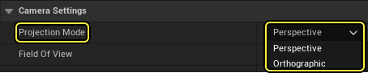
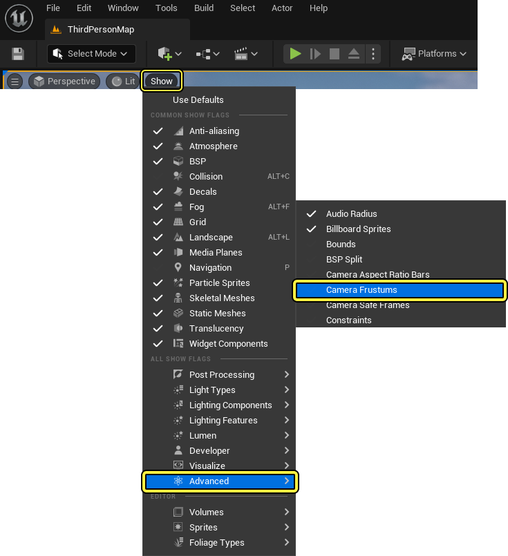
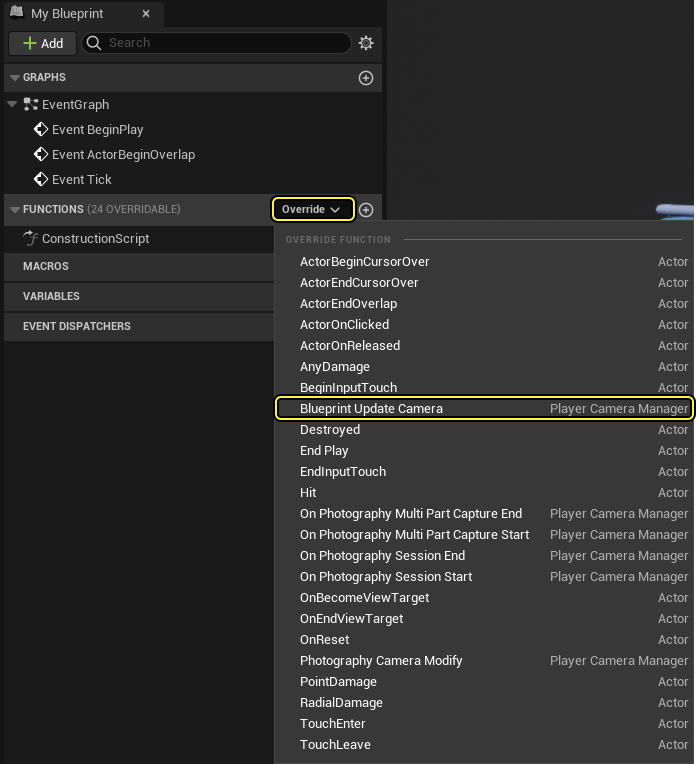

# 摄像机

> 路径：虚幻引擎5.7文档 / Gameplay系统 / Gameplay框架 / 摄像机

> 原始页面：https://dev.epicgames.com/documentation/unreal-engine/cameras-in-unreal-engine

**摄像机（Camera）** 代表了玩家的视角，比如玩家如何查看世界。因此， 摄像机只和玩家控制的人物有关。[PlayerController](../controllers/player-controllers/index.md)会指定一个摄像机类， 并实例化一个Camera Actor (`ACameraActor`)，以此计算玩家从哪个位置和角度 观察世界。

> [!NOTE]
> 有关如何使用摄像机的基本示例，请参见[使用摄像机](using-cameras/index.md)文档。有关如何在摄像机上分层放置动画的示例，请参见[CameraAnim功能](camera-animation/index.md)文档。

## CameraActor

有关摄像机的所有属性和行为均在[CameraComponent](https://dev.epicgames.com/documentation/unreal-engine/API/Runtime/Engine/Camera/UCameraComponent?application_version=5.7)中设置。`CameraActor` 类主要用作 CameraComponent 的包装器，以使摄像机可以被直接放置在该关卡内，而非另一个类中。在编辑器中使用CameraComponent时，可以前往 **细节（Details） > 摄像机设置（Camera Settings）** 来设置摄像机为 **透视（Perspective）** 或者 **正交（Orthographic）** 模式。

透视模式可以设置垂直视野（FOV），正交模式可以用世界单位设置宽度。在这两种模式下可以指定宽高比，并会提供常见设备预设宽高比和显示类型。

> [!NOTE]
> [后期处理效果](../../../designing-visuals-rendering-and-graphics/post-process-effects/index.md)可以添加至摄像机，并且也可以调整后期处理效果的强度。

两个组件被添加到CameraComponent，以辅助编辑器中的视觉位置，不过它们在游戏期间将不可见。 **FrustumComponent** 显示 摄像机的视场位置。默认不显示，但可以通过在 **视口（Viewport）** 中选择 **显示（Show） > 高级（Advanced） > 摄像机视锥体（Camera Frustums）** 来启用。

## CameraComponent

**CameraComponent** 代表摄像机视角和设置，比如 **投射类型（Projection Type）**、**视野（Field Of View）** 和 **后期处理覆盖（Post-Process Overrides）**。如果ViewTarget是一个CameraActor或者包含CameraComponent并且 `bFindCameraComponentWhenViewTarget` 设为 *true* 的Actor。 `bTakeCameraControlWhenPossessed` 是一个可以为任何Pawn设置的相关属性，Pawn会在PlayerController占有时自动变为ViewTarget。

## Actors和PlayerControllers

**PlayerControllers**和[Actors](../actors/index.md)都含有 `CalcCamera` 函数。如果 `bFindCameraComponentWhenViewTarget` 为 *true*，而且CameraComponent存在，Actor的CalcCamera函数返回 Actor中的首个CameraComponent的摄像机视图，否则，它获取Actor 的位置和旋转方向。在PlayerController类中，CalcCamera 函数的行为方式与第二种情况类似，如果存在占有Pawn， 则返回其位置以及PlayerController的控制旋转。

## PlayerCameraManager

**PlayerCameraManager** 用于为一个特定的玩家管理摄像机。它定义最终查看属性，供渲染器这类的其它系统使用。PlayerCameraManager的功能类似于一个用来查看世界的 "虚拟眼球"。 它可以直接计算最终摄像机属性，也能够在其它物体或者影响摄像机的Actor之间混合（从一个CameraActor混合到另外一个）。

PlayerCameraManager的主要外部职责是要可靠地对各种 `Get()` 函数做出响应，比如 `GetCameraViewPoint`。 默认情况下，PlayerCameraManager保留一个查看目标，为摄像机所关联的主要Actor。它可以向最终查看状态应用各种后期效果，比如摄像机动画、后期处理效果或者特殊效果（比如摄像机镜头上的尘土）。

如果你需要从PlayerCameraManager继承，并且你是创建一个父类蓝图而不是C++，那么PlayerCameraManager会包含 `BlueprintUpdateCamera` 函数来实现你自己的自定义摄像机。

> [!NOTE]
> 使用该函数时，返回 *true* 来使用返回的数据，或者返回 *false* 来忽略数据。

PlayerCameraManager中的 **UpdateViewTarget** 函数查询ViewTarget，并返回该ViewTarget 的视角。如果你有子类化的 APlayerCameraManager， 并且没在查看 CameraComponent，该函数也用于调用 BlueprintUpdateCamera函数。

## ViewTarget

**ViewTarget** 结构体在PlayerCameraManager中定义，负责向 PlayerCameraManager提供理想的视角(POV)。ViewTarget包含有关 Actor目标、 Actor目标的控制器 （用于非本地控制的 Pawn），以及 PlayerState的信息（用于在观看时跟随同一个玩家完成[Pawn](../pawn/index.md) 过渡和其它变更）。

摄像机信息被通过视角（POV）属性以 "FMinimalViewInfo" 结构体的形式传给PlayerCameraManager。该结构包含来自 CameraComponent 的基本摄像机信息，包括 **位置（Location）**、**旋转（Rotation）**、 **投射模式（Projection Mode）**（透视或正交）、**视场（FOV）**、**投影宽度（Orthographic Width）**、**宽高比（Aspect Ratio）** 和 **后期处理效果（Post Process Effects）**。 让 PlayerCameraManager访问这些值使PlayerCameraManager能在 摄像机管理期间混合两种摄像机模式。

## 摄像机责任链

游戏特定的摄像机行为和摄像机可以随时通过 "责任链" 提供（从上到下通过以下类传递，然后转到 `ALocalPlayer`，并以[渲染](../../../designing-visuals-rendering-and-graphics/index.md), **场景视图（Scene View）** (`FSceneView`) 以及其它相关系统结束）。

## 摄像机话题

- [摄像机动画](camera-animation/index.md) - 介绍摄像机动画

- [正交摄像机](orthographic-camera/index.md) - 介绍摄像机的正交投影设置。

- [使用摄像机](using-cameras/index.md) - 介绍如何通过虚幻引擎在场景中查找 Actor 的操作指南。
