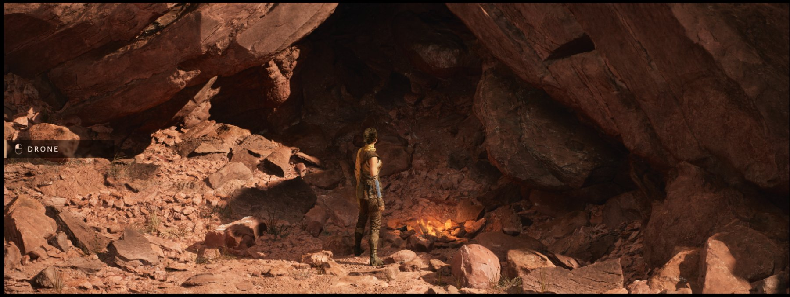
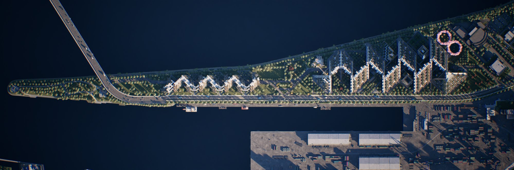
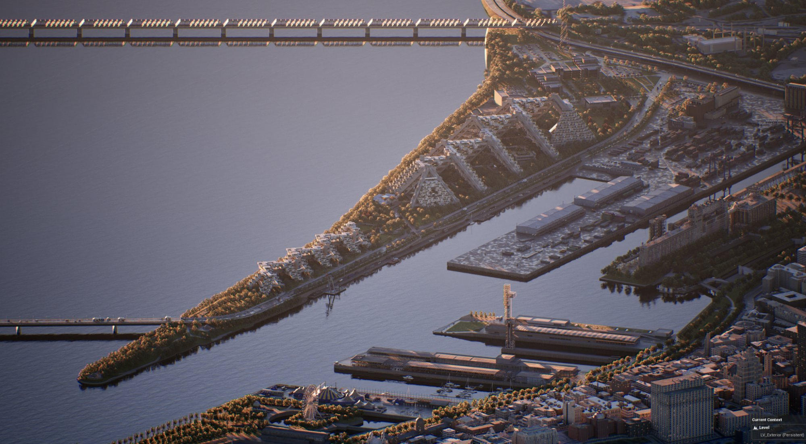
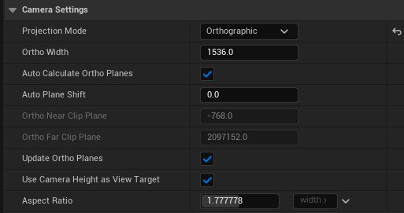
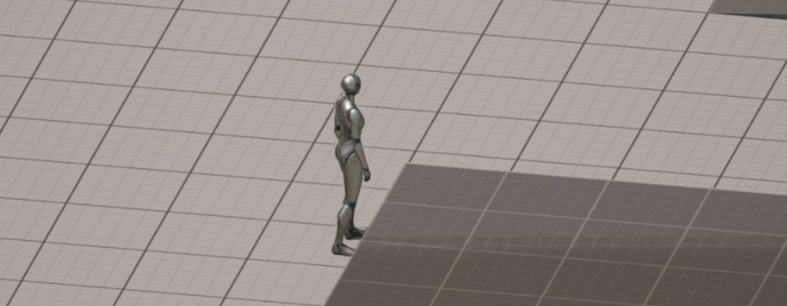
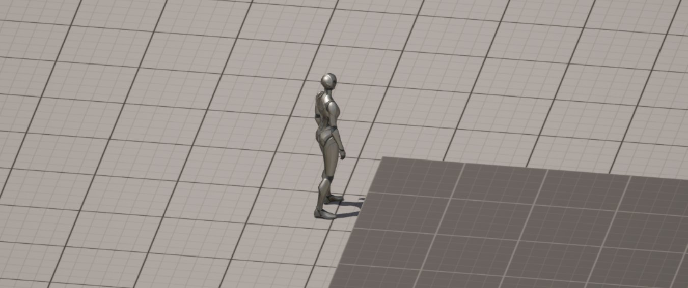

# 正交摄像机

> 路径：虚幻引擎5.7文档 / Gameplay系统 / Gameplay框架 / 摄像机 / 正交摄像机

> 原始页面：https://dev.epicgames.com/documentation/unreal-engine/orthographic-camera-in-unreal-engine

虚幻引擎支持正交摄像机投影，可用于等距游戏项目和建筑可视化项目。正交摄像机可与虚幻引擎的其他功能配合使用，包括Lumen、Nanite、虚拟阴影贴图（VSM）、时间超级分辨率、反射、体积、路径追踪和水系统。

## 示例场景

> 图片已省略：Orthographic camera example 3

## 设置摄像机的正交投影

要设置摄像机的正交投影设置，请执行以下步骤：

1. 在关卡中放置一个

   摄像机（Camera）

   Actor。
2. 在关卡编辑器

   大纲视图（Outliner）

   中选择刚才放置的摄像机。
3. 在

   细节（Details）

   面板的

   摄像机设置（Camera Settings）

   下，使用

   投影模式（Projection Mode）

   下拉菜单选择

   正交（Orthographic）

   。
4. 使用细节面板中的

   Actor变换（Actor Transforms）

   移动和旋转你的摄像机。

> [!NOTE]
> 过场动画摄影机不提供正交视图选项。

你可以更改以下设置来调整正交渲染。

| 设置名称 | 说明 |
| --- | --- |
| **正交宽度（Ortho Width）** | 展开此设置可以查看有关媒体的分辨率、帧率、大小、方法、格式、合并细节级别偏差及其mip和图块数量的细节。 |
| **自动计算正交平面（Auto Calculate Ortho Planes）** | 选中后，会自动解析指定正交宽度的深度裁剪平面。未选中时，你可以手动设置正交摄像机的近裁剪平面和远裁剪平面。 |
| **自动平面移位（Auto Plane Shift）** | 手动调整此摄像机的平面，保持平面之间的距离。正值将移出远平面，负值将移向近平面。 |
| **正交近裁剪平面（Ortho Near Clip Plane）** | 当未选择 **自动计算正交平面（Auto Calculate Ortho Planes）** 时，此项将设置正交摄像机的近裁剪平面的位置。 |
| **正交远裁剪平面（Ortho Far Clip Plane）** | 当未选择 **自动计算正交平面（Auto Calculate Ortho Planes）** 时，此项将设置正交摄像机的远裁剪平面的位置。 |
| **更新正交平面（Update Ortho Planes）** | 自动调整当前摄像机的近平面、远平面和视图原点，以避免裁剪和造成光照瑕疵。 |
| **将摄像机高度用作视图目标（Use Camera Height as View Target）** | 当选择 **更新正交平面（Update Ortho Planes）** 时，此设置使用摄像机的当前高度补偿离一般视图的距离（当不存在此距离时，视为离视图目标的伪距离）。 |
| **纵横比（Aspect Ratio）** | 设置摄像机视图遮罩的宽度与高度比，或使用下拉菜单选择其中一个常见的预配置纵横比。 |

## 自动计算正交平面

**自动计算正交平面（Auto Calculate Ortho Planes）** 属性根据摄像机相对于地面的角度缩放近裁剪平面。使用正交高度，近裁剪平面距离求值为负值。默认的最小近裁剪平面位置约为在摄像机后面应用的正交高度大小的1.4倍。这可以通过使用下列控制台变量来补偿。

远裁剪平面距离将初步确定每像素虚幻单位（默认以厘米为单位）的比率。此值用于将近裁剪平面和远裁剪平面之间的距离缩放为FP16最大值（66504.0f）的倍数。根据正交宽度和虚幻单位与像素的比率，这个距离可以放大到UE_OLD_WORLD_MAX（21公里）。场景越小，远裁剪平面距离就应该越短，以便在缩减到16位缓冲区时保持深度精度。

### 自动计算正交平面控制台变量

| 控制台变量名称 | 说明 |
| --- | --- |
| `r.Ortho.AutoPlanes` | 全局允许正交摄像机使用自动近裁剪平面和远裁剪平面计算。 |
| `r.AutoPlanes.ClampToMaxFPBuffer` | 自动计算正交平面时，此变量决定是否应使用16位深度缩放。16位缩放有助于处理发生的任何深度缩减。例如，HZB缩减使用16位纹理而非32位纹理。此功能将根据虚幻单位（默认为厘米）与像素的比率计算所需的最大深度比例。较小的场景不需要32位深度范围，因为大多数Actor都会在合理的可见视锥体内，所以改为使用16位深度范围。对于较大的场景，平面距离最大可放大至UE_OLD_WORLD_MAX（21公里），这是深度缓冲区的典型全范围。 |
| `r.Ortho.AutoPlanes.DepthScale` | 从默认的FP16最大值（66504.0f）调整16位深度缩放。如果远裁剪平面不需要那么远，此变量就很有用，它将改善深度增量。 |
| `r.Ortho.AutoPlanes.ShiftPlanes` | 沿Z方向移动整个视锥体。如果你需要近裁剪平面更靠近摄像机，此变量会很有用，可以通过减少远裁剪平面的值实现（例如，在水平2.5D场景中）。 |
| `r.AutoPlanes.ScaleIncrementingUnits` | 在按单位增加像素比时，选择是否要缩放近平面或远平面的最小和最大值。例如，从厘米到米到千米。 |

## 视图原点校正

正交摄像机存在一个问题，即由于缺乏深度，摄像机的世界位置无法与实际视图位置正确对齐。当光照和其他效果无法在视图位置和摄像机的真实世界位置之间正确解析时，可以直观地看到这一点。因此，你可以使用控制台变量来校正摄像机的视图原点，以表示真实视图位置而非摄像机世界位置。

### 视图原点校正控制台变量

| 控制台变量名称 | 说明 |
| --- | --- |
| `r.Ortho.AllowNearPlaneCorrection` | 启用后，正交摄像机会自动更新以匹配近平面位置，并强制用近裁剪平面位置替换摄像机位置，以进行投影矩阵计算。此变量很有用，因为正交近裁剪平面可能位于摄像机位置后面，这会导致引擎在解析摄像机位置后面的光照时出问题。 |
| `r.Ortho.DefaultUpdateNearClipPlane` | 使用近平面校正时要更新的正交近裁剪平面值。 |
| `r.Ortho.CameraHeightAsViewTarget` | 启用后，计算近平面校正时使用摄像机高度作为视图目标。主要有助于VSM裁剪图选择，并避免过度校正近平面。 |

## 虚拟阴影贴图

当使用Nanite和非Nanite几何体组合时，虚拟阴影图在正交渲染方面可能很难处理，就像在透视模式下一样。实现合理的设置平衡可能很困难。对于VSM如何解析和为场景选择正确的绘制分辨率，以下控制台变量允许进行一些自定义控制。

### 虚拟阴影贴图控制台变量

| 控制台变量名称 | 说明 |
| --- | --- |
| `r.Ortho.VSM.EstimateClipmapLevels` | 启用后，根据当前摄像机正交宽度计算第一级VSM。 |
| `r.Ortho.VSM.ClipmapLODBias` | 用于调整第一级VSM的LOD偏差。 |
| `r.Ortho.VSM.ProjectViewOrigin` | 启用后，移动VSM裁剪图的WorldOrigin，以聚焦ViewTarget（如果存在）。 |
| `r.Ortho.VSM.RayCastViewOrigin` | 启用后，如果ViewTarget不存在（例如独立摄像机），则使用光线投射估计ViewOrigin。 |

## 调试摄像机视图

正交摄像机包含调试选项，你可以用来强制所有摄像机（编辑器视图除外）解析到正交。这些选项在发行版本中被禁用。

### 调试摄像机视图控制台变量

| 控制台变量名称 | 说明 |
| --- | --- |
| `r.Ortho.Debug.ForceAllCamerasToOrtho` | 启用后，强制场景中的所有摄像机使用正交视图。 |
| `r.Ortho.Debug.ForceOrthoWidth` | 启用后，在使用ForceAllCamerasToOrtho选项时，调整正交宽度。 |
| `r.Ortho.Debug.ForceUseAutoPlanes` | 启用后，在使用ForceAllCamerasToOrtho选项时，使用自动近裁剪平面和远裁剪平面求值。 |
| `r.Ortho.Debug.ForceCameraNearPlane` | 启用后，在使用ForceAllCamerasToOrtho选项时，调整近裁剪平面。如果启用了ForceUseAutoPlanes，则忽略。 |
| `r.Ortho.Debug.ForceCameraFarPlane` | 启用后，在使用ForceAllCamerasToOrtho选项时，调整远裁剪平面。如果启用了ForceUseAutoPlanes，则忽略。 |
| `r.Ortho.EditorDebugClipPlaneScale` | 仅影响光照（Lit）模式下的编辑器正交调试视口。设置比例以根据当前的 **正交宽度（Ortho Width）** 按比例改变近裁剪平面。当场景中的几何体因正交缩放发生变化而裁剪时，此项将发生变化。有助于在调试平面视图中可视化不同大小的光照网格体。当此值发生变化时，可能会出现其他光源瑕疵。 |

## 限制和其他说明

虚幻引擎的重点始终是透视视角摄像机，随着新引擎功能的添加，这些功能可能不会针对正交摄像机进行优化，但我们未来会努力实现功能对等。

以下控制台变量在某些情况下可能有用。

| 控制台变量名称 | 说明 | | --- | --- | |

r.Ortho.DepthThicknessScale

| 调整场景的深度厚度比例。正交场景深度的缩放比例通常低于透视视角，比例为1/100。例如，Lumen深度差异测试在此比例的效果更好。在某些情况下，例如如果使用的表面到表面深度差异非常小，你可能需要使用此值来同时调整跨各种屏幕追踪通道的深度厚度比例测试值。 | |

r.Ortho.CalculatingDepthThicknessScale

| 是否自从从近/远平面差异提取深度厚度测试比例。此项为默认开启，但在被禁用（0）时，会使用 r.Ortho.DepthThicknessScale` 指定的比例。 |

| 列 1 | 列 2 |
| --- | --- |
| `r.Ortho.FogHeightAdjustment` | 启用时，使用正交摄像机高度决定雾的截断高度。 |
| `r.Ortho.UsePreviousMotionVelocityFlattenPass` | 设置正交摄像机运动模糊通道是否使用之前的扁平化纹理（如来自时间超级分辨率的纹理）。注意，禁用此项可能导致一定距离外的平面出现闪烁情况。 |

### 使用正交摄像机的体积云

体积在正交摄像机视图中可能出现问题，尤其是体积云。这主要是由使用正交摄像机视图的场景的缩放方式导致的。例如，如果你在正交摄图中查看体积云，你无法看到云的透视部分，而是会看到一个10米乘10米的窗口。
