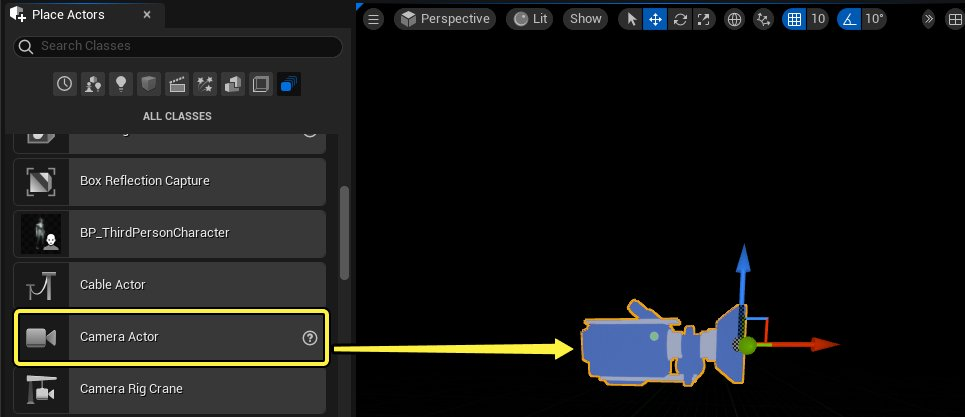
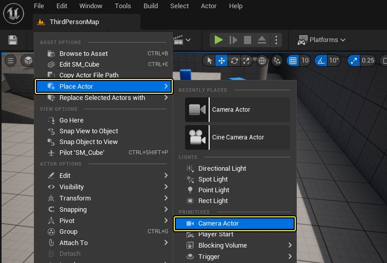
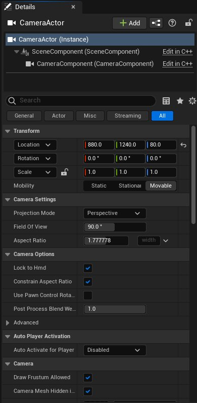

# 使用摄像机

> 路径：虚幻引擎5.7文档 / Gameplay系统 / Gameplay框架 / 摄像机 / 使用摄像机

> 原始页面：https://dev.epicgames.com/documentation/unreal-engine/using-cameras-in-unreal-engine

选择实现方法：

Blueprints

C++

本教程系列将介绍如何在虚幻引擎中使用 **摄像机（Camera）**。摄像机可以单独使用（直接放到关卡中），也可以充当蓝图的一部分（例如，在玩家驾驶飞机、车辆或控制某个人物时提供专门视角）。

## 创建和放置摄像机Actor

1. 在编辑器中，找到 **窗口（Window） > 放置Actor（Place Actors） > 所有类（All Classes）**，将一个 **摄像机Actor** 添加至关卡。

   
2. 你可以使用搜索栏直接查找摄像机Actor。或者，你可以右键点击关卡视图（Level Viewport）并使用弹出菜单（选择 **Place Actor**，然后选择 **Camera Actor**）。

   
3. 当你在关卡中选中摄像机后，在视口中会出现一副画中画，表示该摄像机拍摄到的画面。画中画的中间上方位置显示着摄像机的名。在画面左下角有一个大头针图标，可用于固定该窗口（未选中摄像机时，画中画仍会出现在窗口画面中）。
4. 在选择摄像机后，你会发现 **Details** 面板被填入了与摄像机有关的设置。

   

本教程将介绍如何通过C++在虚幻引擎中放置 **摄像机** [(ACameraActor)](https://dev.epicgames.com/documentation/404)。摄像机可以直接放置在关卡中，也可以作为蓝图的一部分使用（例如，在玩家驾驶飞机、车辆或控制某个人物时提供专门视角）。

## 创建并放置摄像机

1. 使用[C++ 类向导](../../../../cpp-programming/setting-up-your-development-environment-for-cplusplus/using-the-cplusplus-class-wizard/index.md)来创建摄像机。首先打开向导，勾选 **显示所有类（Show All Classes）**，然后在搜索栏中输入 **CameraActor** ，选中并新建你的摄像机Actor类。
2. 在 **源（Sources）** 面板中，找到你的C++类文件夹，然后为摄像机Actor创建一个蓝图类。
3. 当你在关卡中选中摄像机后，在视口中会出现一副画中画，表示该摄像机拍摄到的画面。画中画的中间上方位置显示着摄像机的名。在画面左下角有一个大头针图标，可用于固定该窗口（未选中摄像机时，画中画仍会出现在窗口画面中）。

选中摄像机后，**细节** 面板中会显示与该摄像机有关的设置信息。

## 摄像机Actor细节面板介绍

下面是对摄像机 Actor 的 **细节** 面板中各部分的介绍：

| 属性 | 说明 |
| --- | --- |
| **Transform** | 这部分描述了摄像机在世界中的位置。 |
| **Camera Settings** | 这部分可用于修改摄像机所用的投影类型、视野、纵横比以及后处理混合。 |
| **Auto Player Activation** | 指定由哪个激活的玩家控制器（如存在）来自动使用此摄像机。 |
| **Film** | 在这部分中，你可以应用胶片效果，如色调、饱和度或对比度。另请参见[胶片](../../../../designing-visuals-rendering-and-graphics/post-process-effects/index.md#%E8%83%B6%E7%89%87)。 |
| **Scene Color** | 用于对摄像机应用效果。另请参见[场景颜色](https://www.fab.com/listings/017fabb0-78ac-400e-8c97-fafa226b73f0)。 |
| **Bloom** | 可模拟人眼在看到明亮物体时感受到的效果。另请参见[泛光](../../../../designing-visuals-rendering-and-graphics/post-process-effects/bloom/index.md)。 |
| **Light Propagation Volume** | 可实现实时全局光照（GI）。另请参见[Light Propogation Volumes](../../../../building-virtual-worlds/lighting-the-environment/index.md)。 |
| **Ambient Cubemap** | 用提供的图像来给场景照明。另请参见[环境立方体贴图]designing-visuals-rendering-and-graphics/post-process-effects#环境立方体贴图)。 |
| **Auto Exposure** | 可模拟人眼对明暗区域的调节。另请参见[自动曝光](../../../../designing-visuals-rendering-and-graphics/post-process-effects/auto-exposure/index.md)。 |
| **Lens Flares** | 模拟因摄像机镜头瑕疵导致观看明亮物体时出现的光线散射。另请参见[镜头光晕](../../../../designing-visuals-rendering-and-graphics/post-process-effects/index.md#%E9%95%9C%E5%A4%B4%E5%85%89%E6%99%95)。 |
| **Ambient Occlusion** | 近似模拟出因遮挡造成的光线衰减效果。另请参见[环境光遮挡](../../../../designing-visuals-rendering-and-graphics/post-process-effects/index.md#%E7%8E%AF%E5%A2%83%E5%85%89%E9%81%AE%E6%8C%A1)。 |
| **Global Illumination** | 影响光团发出的间接光照，从而改变场景的亮度、颜色或色调。另请参见[全局光照](../../../../designing-visuals-rendering-and-graphics/post-process-effects/index.md#%E5%85%A8%E5%B1%80%E5%85%89%E7%85%A7)。 |
| **Depth Of Field** | 根据在焦点前方或后方的距离对场景应用模糊效果。另请参见[景深](../../../../designing-visuals-rendering-and-graphics/post-process-effects/depth-of-field/index.md)。 |
| **Motion Blur** | 用于产生动态模糊效果，根据运动情况将物体变模糊。另请参见[动态模糊](../../../../designing-visuals-rendering-and-graphics/post-process-effects/index.md#%E5%8A%A8%E6%80%81%E6%A8%A1%E7%B3%8A)。 |
| **Misc** | 应用可融合效果（屏幕覆层），为摄像机设置抗锯齿方法或屏幕百分比选项。详见[Blendables](../../../../designing-visuals-rendering-and-graphics/post-process-effects/blendables/index.md)、[屏幕百分比](https://www.fab.com/listings/017fabb0-78ac-400e-8c97-fafa226b73f0)或[AA方法和上采样](../../../../designing-visuals-rendering-and-graphics/optimizing-and-debugging-projects-for-realtime-rendering/anti-aliasing-and-upscaling/index.md)。 |
| **Screen Space Reflections** | 这是一个默认启用的效果，可以改变物体材质表面的外观。另请参见[屏幕空间反射](../../../../designing-visuals-rendering-and-graphics/post-process-effects/index.md#%E5%B1%8F%E5%B9%95%E7%A9%BA%E9%97%B4%E5%8F%8D%E5%B0%84)。 |
| **Activation** | 决定是否自动启用摄像机。 |
| **Tags** | 用于在 Actor 上放置的标签。 |
| **Actor** | 摄像机 Actor 本身的相关信息。 |
| **Blueprint** | 用于将 Actor 变为蓝图，或者将事件添加到 Actor 的关卡蓝图（Level Blueprint）。 |

> [!NOTE]
> 关于使用摄像机实现影片效果的信息，请参考[过场动画和Sequencer](../../../../animating-characters-and-objects/cinematics-and-movie-making/index.md)文档和"摄像机"部分。[ICVFX制片测试](../../../../samples-and-tutorials/engine-feature-examples/incamera-vfx-production-test-sample-project/index.md)也是一份出色的样本动画资源和构建范例。

现在，你已经了解了如何在关卡中放置摄像机 Actor，以及用于改变其外观的一些设置，而下面的示例则介绍了一些摄像机的使用方法，包括如何使用摄像机作为玩家视点，如何将摄像机组件用作Actor类的一部分，如何将弹簧臂组件（Spring Arm Component）与摄像机组件一起使用（通常用于创建第三人称视角），以及如何在游戏过程中切换不同的摄像机。

## 实现指南

- [使用弹簧臂组件](https://dev.epicgames.com/documentation/unreal-engine/using-spring-arm-components-in-unreal-engine) - 弹簧臂组件用于自动控制摄像机被遮挡时的响应情况。

- [在多个固定摄像机视角间切换](https://dev.epicgames.com/documentation/unreal-engine/switching-between-multiple-fixed-camera-perspectives-in-unreal-engine) - 有关如何从使用静态摄像机页面修改现有脚本逻辑，以便混合关卡中多个摄像机Actor视点的指导页面。

- [使用摄像机组件](https://dev.epicgames.com/documentation/unreal-engine/working-with-camera-components-in-unreal-engine) - 介绍了如何为角色类添加摄像机组件，以及如何将摄像机用于关卡内的任何Actor上。

- [使用静态摄像机](using-a-static-camera/index.md) - 本操作指南介绍如何使用静态摄像机来混合玩家视点。
