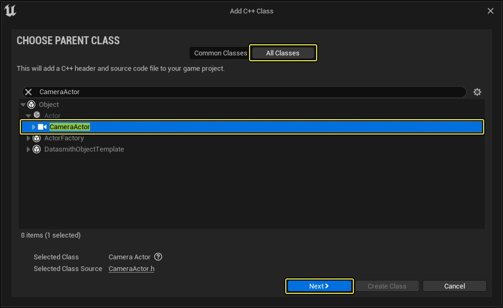
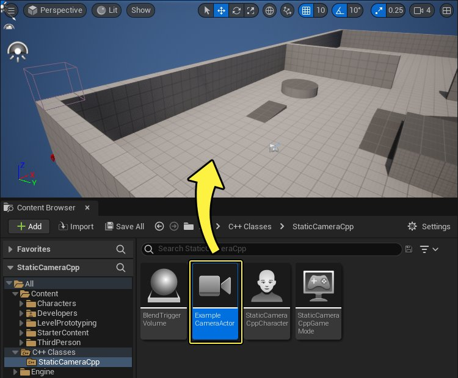
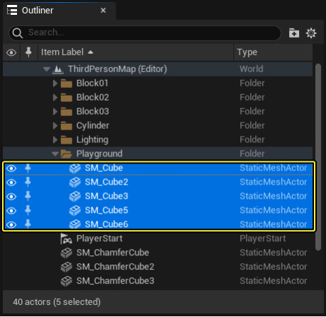
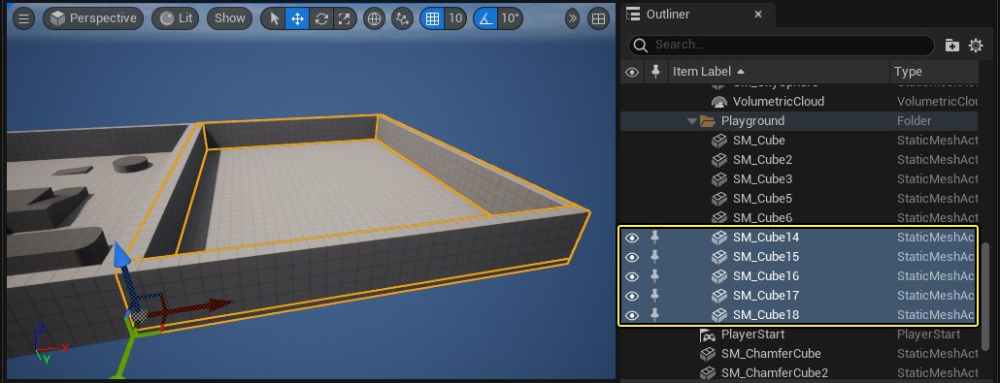
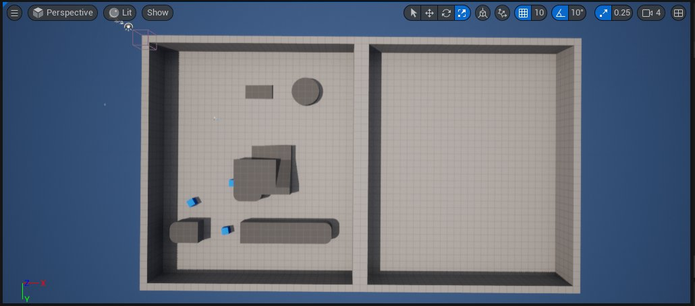
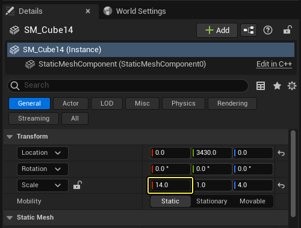
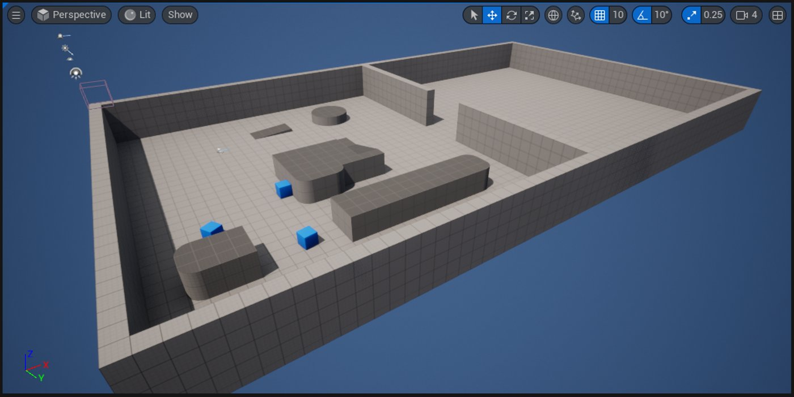
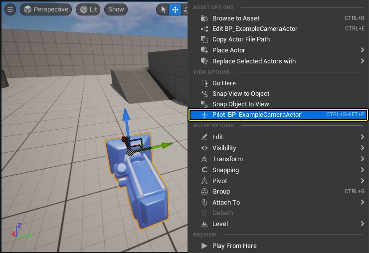

# 使用静态摄像机

> 路径：虚幻引擎5.7文档 / Gameplay系统 / Gameplay框架 / 摄像机 / 使用摄像机 / 使用静态摄像机

> 原始页面：https://dev.epicgames.com/documentation/unreal-engine/using-a-static-camera-in-unreal-engine

编程语言

C++

从下拉菜单中选择一个选项以查看与之相关的内容

在此操作指南教程中，你将创建一个静态（或固定）摄像机角度，用于玩家在第三人称示例地图中Gameplay时的玩家角度，然后你将创建一个在你的角色与体积重叠时将你的视点过渡到新静态摄像机的触发器体积。 完成此教程时，你可以将此处使用的流程应用到你自己的游戏中，为玩家设置固定角度。

## 创建静态摄像机Actor

1. Begin by creating a **New > Games > Third Person > C++** project named **StaticCameras**.
2. Launch the **C++ Class Wizard**, enable the checkbox for **Show All Classes**, then type **CameraActor** within the search field to select and create your new **Camera Actor** class named **ExampleCameraActor**.

   
3. From the **C++ Class** panel, right click on your **ExampleCamera** and from the dropdown **C++ Class** actions menu select **Create a Blueprint class based on ExampleCameraActor**. Then drag an instance of **BP_ExampleCameraActor** into the level.

   

   Click image to expand.

## 关卡设置

为了展示玩家摄像机和静态摄像机actor之间的视角过度，你需要设置场景。 要完成此目标，你需要从第三人称模板关卡中修改某些静态网格体几何体。

1. 首先找到世界大纲视图面板，转到**ArenaGeometry > Arena**文件夹，按住Shift选择**地板（Floor）**和4个**墙体（Wall）**静态网格体Actor。

   

   > [!NOTE]
   > 在上图中，四个墙体静态网格体Actor分别是**Wall6**、**Wall7**、**Wall8**和**Wall9**。
2. **按住Alt并点击****变换（Transform）**小工具然后拖动，创建重复的地板和墙体设置。
3. 这将创建第二个**地板**和其他四个**墙体**静态网格体Actor。

   

   > [!NOTE]
   > 在上图中，重复的地板是Floor2，重复的墙体是**Wall10**、**Wall11**、**Wall12**和**Wall13**。
4. 移动新复制的静态网格体以组装下面的布局，从原始房间复制而来的新房间将出现，但没有任何内容。

   

   点击查看大图。
5. 在世界大纲视图中，选择连接两个房间的两面墙，然后将其**X轴比例（X Scale）**的值设置为14。

   > [!NOTE]
   > 在上图中，这两面墙是**Wall9**和**Wall12**。

   
6. 选择这两面相连的墙体，然后使用**变换（Transform）**小工具移动它们，使它们成为房间之间的分区，并具有如下所示的间隔。

   > [!NOTE]
   > 在上图中，这两面墙是**Wall9**和**Wall10**
7. 已完成的关卡设置看起来应该类似于下图，第二个房间通过墙上的一个开口连接到第一个房间。

   

   点击查看大图。

## 摄像机视角设置

现在你已经完成了关卡设置，可以将 **BP_ExampleCameraActor**放置在关卡中了，从而更好地了解在玩家在与触发器体积重叠时获得的视野。 将**视口（Viewport）**锁定到摄像机Actor并进入**导航（Pilot）**模式，即可从摄像机的角度获取第一人称视角。

1. 在关卡中选择摄像机之后，右键点击摄像机，然后从上下文菜单中选择**导航CameraActor（Pilot CameraActor）**。

   
2. 你现在可以在按住**鼠标左键**或**鼠标右键**的时候使用**WASD**键来在视口中移动。 在关卡中飞翔时，摄像机的位置将随着你的移动而移动，从而让你了解摄像机在Gameplay期间获得的角度。
3. 要解锁摄像机，点击**解锁**按钮即可。

   > 图片已省略：解锁按钮

   摄像机将留在解锁时的位置。 解锁按钮旁边的图标可以用于在显示游戏内摄像机视图和关卡编辑器视图之间进行切换。
4. 将摄像机导航到在第二个房间上俯视的位置，类似于下面的gif。
5. 已完成的摄像机场景设置看起来应该类似于下图，静态摄像机俯视新房间，而原始摄像机跟随第三人称Actor。

   > 图片已省略：已完成的摄像机设置

   点击查看大图。

## 创建重叠触发器Actor

在这个示例中，触发器Actor充当了玩家摄像机视角和静态摄像机视角之间的过渡管理器，一旦玩家碰到它的碰撞盒，两种视角就会切换。

1. Using the **C++ Class Wizard**, create a new Actor class named BlendTriggerVolume.

   > 图片已省略：New C++ Blend Trigger Volume class
2. Navigate to your `BlendTriggerVolume.h` file, and declare the following code in your **class definition**.

   C++

   ```
   protected:

            //Collision Bounds of the Actor Volume
            UPROPERTY(EditAnywhere, BlueprintReadWrite)
                class UBoxComponent* OverlapVolume;

                //Camera Actor which the Actor Volume blends to
                UPROPERTY(EditAnywhere, BlueprintReadWrite)
                TSubclassOf<ACameraActor> CameraToFind;

   ```
3. Next, navigate to your `BlendTriggerVolume.cpp` file to set up your constructor and box component overlap methods. Declare the following include class libraries.

   C++

   ```
   `#include "Components/BoxComponent.h"`		         `#include "StaticCamerasCharacter.h"`		         `#include "Camera/CameraActor.h"`		         `#include "Runtime/Engine/Classes/Kismet/GameplayStatics.h"`
   ```
4. In the constructor **ABlendTriggerVolume::ABlendTriggerVolume**, declare the following code.

   C++

   ```
   ABlendTriggerVolume::ABlendTriggerVolume()         {         //Create box component default components         OverlapVolume = CreateDefaultSubobject<UBoxComponent>(TEXT("CameraProximityVolume"));         //Set the box component attachment to the root component.         OverlapVolume->SetupAttachment(RootComponent);         }
   ```
5. Next, implement your `NotifyActorBeginOverlap` and `NotifyActorEndOverlap` class methods:

   C++

   ```
   void ABlendTriggerVolume::NotifyActorBeginOverlap(AActor* OtherActor){
            //Cast check to see if overlapped Actor is Third Person Player Character

            if (AStaticCamerasCharacter* PlayerCharacterCheck = Cast<AStaticCamerasCharacter>(OtherActor))
                {

            //Cast to Player Character's PlayerController

            if (APlayerController* PlayerCharacterController = Cast<APlayerController>(PlayerCharacterCheck->GetController()))
                    {
   ```
6. **Compile** your code.

## Finished Code

### BlendTriggerVolume.h

C++

```
#pragma once

	#include "CoreMinimal.h"
	#include "GameFramework/Actor.h"
	#include "BlendTriggerVolume.generated.h"

	UCLASS()
	class STATICCAMERAS_API ABlendTriggerVolume : public AActor
	{
		GENERATED_BODY()
```

### BlendTriggerVolume.cpp

C++

```
#include "BlendTriggerVolume.h"
	#include "Components/BoxComponent.h"
	#include "StaticCamerasCharacter.h"
	#include "Camera/CameraActor.h"
	#include "Runtime/Engine/Classes/Kismet/GameplayStatics.h"

	// Sets default values
	ABlendTriggerVolume::ABlendTriggerVolume()
	{
```

## Setting up the Overlap Trigger Actor

Now that you have created your overlap Actor, you will need to place it into the level and set up its bounds.

1. Begin by navigating to your **C++ Classes** folder, right-click on your **BlendTriggerVolume** class, select **Create Blueprint Class based on BlendTriggerVolume**, then name your **Blueprint Actor** **BP_BlendTriggerVolume**.

   > 图片已省略：Create Blueprint class
2. From the class defaults, navigate to **Camera To Find** in the **Details** panel, open the drop down menu, then select **BP_ExampleCameraActor**.

   > 图片已省略：Finding the camera
3. Optionally, you can change the default blend time for this Blueprint without having to go back into the source code, or affecting other Blueprints with the same inherited parent class.

   > 图片已省略：Change default Blend time
4. **Compile** and **Save**.

   > 图片已省略：Compile button
5. From the **Content Browser**, drag an instance of **BP_BlendTriggerVolume** into the level.

   > 图片已省略：Place Volume actor

   Click image to expand.
6. Move the **BP_BlendTriggerVolume** into the room with your **BP_ExampleCameraActor**, and from the **Details** panel select the box component. Navigate to the **Shape** category and modify the **Box Extent** X, Y, and Z values so the volume will fit your room.

   > 图片已省略：Adjust Volume actor to fit room

   Click image to expand.
7. From the **Main Editor View**, click the **Play** button to play in the Editor.

## 最终结果

游戏启动后，玩家可以使用**WASD**控制角色的移动。 在与**BP_BlendTriggerVolume**重叠时，摄像机视图会被指定到你创建并放置到关卡中的**摄像机Actor（Camera Actor）**上，同时视图将被切换到玩家控制的角色的俯拍镜头。

你可能还会注意到，视图采用了宽屏模式；要禁用此设置，请转到**细节（Details）**面板，为摄像机Actor取消勾选**约束高宽比（Constrain Aspect Ratio）**选项。

> 图片已省略：约束高宽比的复选框
