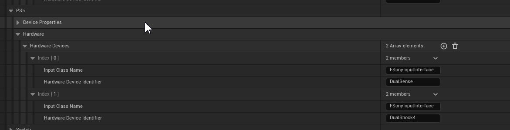
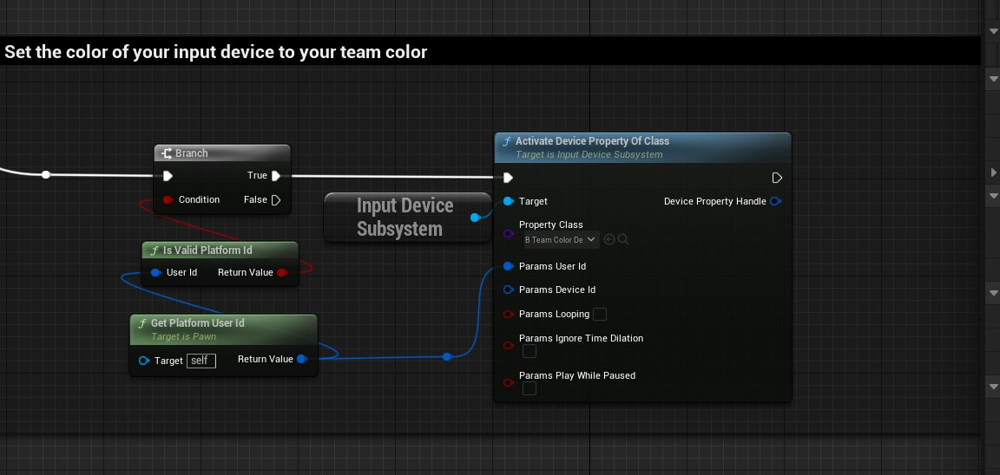
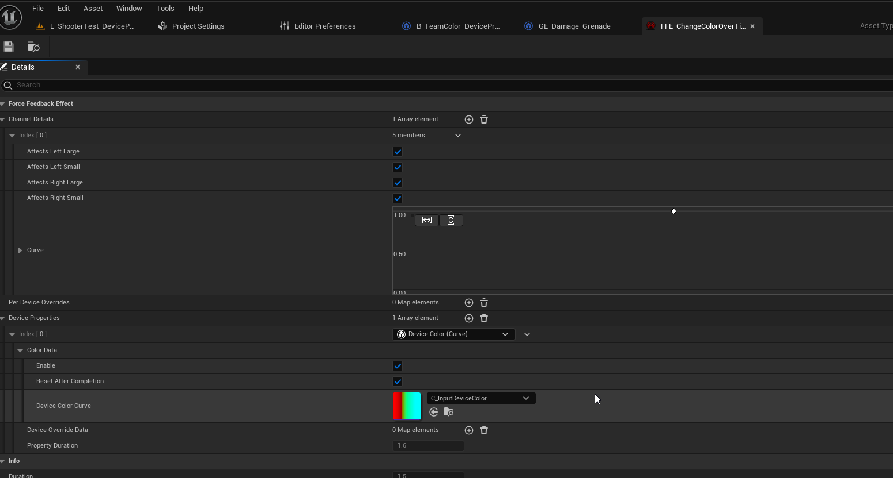
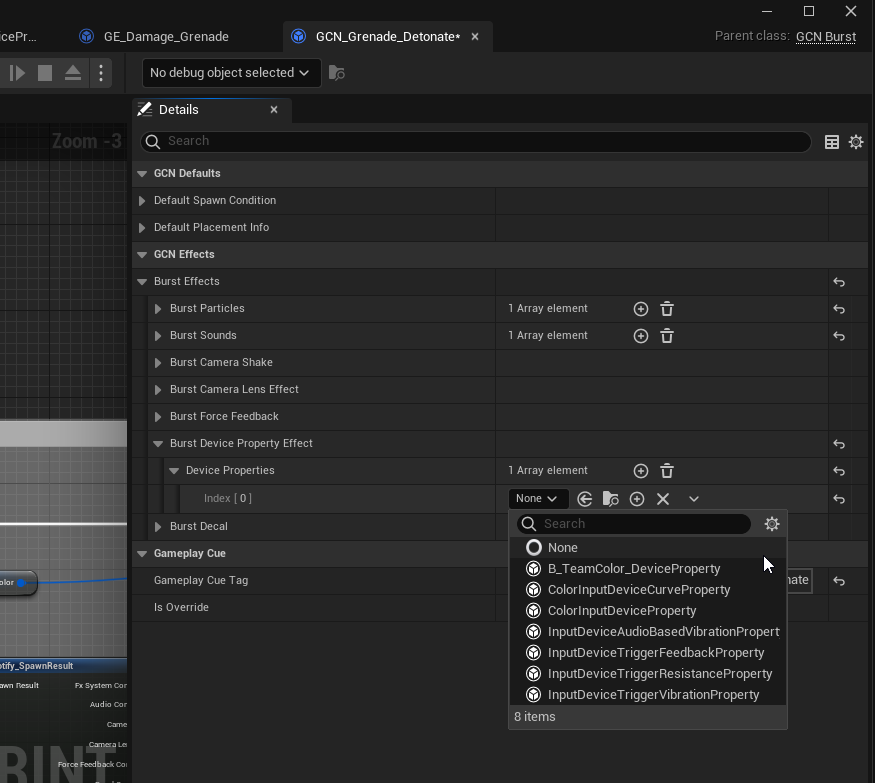
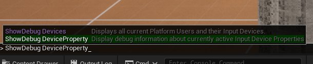
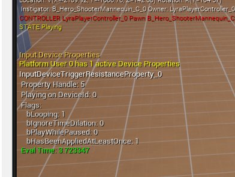

# 设备属性

> 路径：虚幻引擎5.7文档 / Gameplay系统 / 输入 / Force Feedback / 设备属性

> 原始页面：https://dev.epicgames.com/documentation/unreal-engine/device-properties-in-unreal-engine

**设备属性** 表示输入设备的物理属性，其中包括光源颜色显示或触觉扳机阻力等属性。你可以通过以下方式激活设备属性：

- 使用

  输入设备子系统（Input Device subsystem）

  。
- 将属性添加到"设备属性（Device Properties）"类别中的现有

  力反馈资产

  。
- 使用

  迸发Gameplay提示通知蓝图（Burst Gameplay Cue Notify Blueprint）

  。

设备列表由配置文件填充，因此第三方供应商可以添加自己的设备作为选项。默认情况下，虚幻提供主机支持。你可以在编辑器中找到 **项目设置（Project Settings）** > **输入（Input）** > **平台设置（Platform Settings）** > （ **平台（Platform）** ）> **硬件（Hardware）** ，查看这些配置设置。

例如，PlayStation5主机可以使用DualSense或DualShock4作为选项。



> [!TIP]
> 你可以根据所拥有的武器类型让输入扳机具有触觉阻力，或随着时间的推移更改光源颜色，实现特殊效果以及其他Gameplay可能性。

你可以在蓝图或C++中使用输入设备子系统。该系统具有：

- 创建控制器输入功能（如获取"最近使用的硬件设备"）的能力。
- OnInputHardwareDeviceChanged

  委托的监听器，用于在用户更改输入设备（如从键盘更改为控制器）时在PC或主机上创建快速响应的用户界面，而不必使用

  通用UI

  插件。

## 设备属性的生命周期

设备属性具有简单的生命周期，你可以使用公开的虚拟函数进行自定义。每个设备属性都有一个 **时长** ，其工作机制与力反馈效果的时长属性相同。属性经历 **激活** 、 **求值** 、 **应用** 阶段，然后在达到其时长后重置。

| 函数 | 说明 |
| --- | --- |
| `求值设备属性（Evaluate Device Property）` | 覆盖 `EvaluateDeviceProperty()` 函数可更改设备属性中的数据。该函数在每次更新时被调用，可提供当前时长信息，以便你可以获取状态变化，如曲线类型值随时间推移而发生的变化。请参阅 `UColorInputDeviceCurveProperty::EvaluateDeviceProperty` 类的实现方案，查看C++中的一个简单示例，或者参阅位于[Lyra游戏示例](../../../../samples-and-tutorials/sample-game-projects/lyra-sample-game/index.md)中的 `B_TeamColor_DeviceProperty` 蓝图。 |
| `应用设备属性（Apply Device Property）` | 覆盖此函数可更改将属性的内部设置传递给平台代码的方式。 |
| `重置设备属性（Reset Device Property）` | 将在达到设备属性的时长时被调用。你可以使用此函数来重置你可能对设备属性做出的状态更改，如重置光源颜色，使其恢复到首次应用时的颜色。 |

## 如何使用输入设备

知道自己想要使用的输入设备属性后，你可以通过 ***输入设备子系统*** 将它 **激活** 。当你激活设备属性时，将获得一个 **输入设备属性句柄** 。 此句柄可用于从输入设备子系统获取属性的当前状态，以及在需要时删除或重置属性。

当你想要激活属性时，有几个选项可通过 `FActivateDevicePropertyParams` 结构体进行配置。

| 结构体属性 | 说明 |
| --- | --- |
| 用户ID（User Id） | 你想设置输入设备的所属玩家的平台用户ID |
| 设备ID（Device Id） | 要激活此属性的输入设备ID。如果不显式地设置此属性，将使用给定用户ID的默认设备。 |
| 循环（Looping） | 若为true，则此属性在生命周期结束时应循环。 |
| 忽略时间膨胀（Ignore Time Dilation） | 若为true，则此属性在求值时将忽略时间膨胀。 |
| 暂停时运行（Play while paused） | 是否即使游戏暂停也会应用此属性？ |

#### C++

你可以通过C++中的输入设备子系统手动激活输入设备属性。

**ManualExample.h**

```
	| // 在头文件中…	// 一个实例化设备属性。如果你希望能够在细节面板中编辑属性，请使用此属性	UPROPERTY(EditDefaultsOnly, Instanced, BlueprintReadOnly, Category = "Input Devices")	TObjectPtr<UInputDeviceProperty> DevicePropertyInstance;	 	// 如果你没有想要在细节面板中更改的属性，可以使用子类。	UPROPERTY(EditAnywhere, BlueprintReadOnly, Category = "Input Devices")	TSubclassOf<UInputDeviceProperty> DevicePropertyClass; |
```

**ManualExample.cpp**

```
	| // 在cpp文件中…	#include "GameFramework/InputDeviceSubsystem.h"	#include "GameFramework/InputDeviceProperties.h"	 	**void** ApplyProperties()	{		**const** FPlatformUserId UserId = GetOwningUserId();	 		**if** (UserId.IsValid())		{			**if** (UInputDeviceSubsystem* InputDeviceSubsystem = UInputDeviceSubsystem::Get())			{    					FActivateDevicePropertyParams Params = {};					Params.UserId = UserId;	 					// 默认情况下，设备属性将在平台用户的主输入设备上运行。					// 如果你想覆盖它并设置特定设备，则可以设置DeviceId参数。					//Params.DeviceId = <某个特定设备ID>;				 					// 使用给定的实例化属性并修改它。请谨慎使用它					FInputDevicePropertyHandle Handle = InputDeviceSubsystem->ActivateDeviceProperty(DeviceProp, Params);	 					// 生成此设备属性类的新实例并使用该实例					FInputDevicePropertyHandle Handle = InputDeviceSubsystem->ActivateDevicePropertyOfClass(DeviceProp, Params);    		 } 		}	}	 | 
```

> [!NOTE]
> 请参阅[Lyra游戏示例](../../../../samples-and-tutorials/sample-game-projects/lyra-sample-game/lyra-inventory-and-equipment/index.md)中的LyraWeaponInstance.cpp，查看装备和未装备武器时应用设备属性的示例。

#### 蓝图

你可以使用设备属性制作自己的蓝图来打造自定义Gameplay体验。例如，我们可以使用位于[Lyra游戏示例](../../../../samples-and-tutorials/sample-game-projects/lyra-sample-game/index.md)中的 `B_TeamColor_DeviceProperty` 变量设置控制器的灯光颜色来匹配你的团队颜色（红色或蓝色）。



使用蓝图脚本的设备属性系统的Lyra游戏示例。

蓝图代码只能使用子类类型来避免有害的对象引用。这意味着你需要为这些用例制作特定设备属性蓝图。

> [!TIP]
> 如果你想手动删除某个输入设备属性，请在子系统上调用函数 `RemoveDevicePropertyHandles()`。

#### 力反馈资产

你可以通过将设备属性添加到你想要应用于玩家的某项现有[力反馈资产](https://dev.epicgames.com/documentation/404)来激活这些属性。要执行此操作，请找到 **细节（Details）** > **设备属性（Device Properties）** 类别。



#### 迸发Gameplay效果提示

你可以找到 **细节（Details）** > **GCN效果（GCN Effects）** > **迸发效果（Burst Effects）** > **迸发设备属性效果（Burst Device Property Effect）** > **设备属性（Device Properties）** 类别，指定你在应用 **Gameplay提示通知迸发（Gameplay Cue Notify Burst）** 时希望激活的输入设备属性。



## 调试

在屏幕上显示当前激活的设备属性的信息。按波浪号（~）可打开控制台并使用控制台命令

```
 	| showdebug DeviceProperty | 
```



在控制台中键入showdebug deviceproperty命令。

此命令将在视口上显示当前激活的设备属性的调试信息。它会显示设备激活时使用的标记、将设备应用到的输入设备ID，以及设备已经激活了多久。



## 创建新的硬件属性

`Engine` 模块中的 `UInputDeviceProperty` 提供了对 `ApplicationCore` 模块中声明的低级 `FInputDeviceProperty` 结构体的抽象概念。`FInputDeviceProperty` 传递给平台代码，后者对每个属性的实现进行处理。

当新的开发工具包发布时，你可以通过覆盖该硬件的 `IInputDevice` 或 `IInputInterface` 上的 `SetDeviceProperty()` 函数，使用不同的输入设备属性添加对其的支持。

> [!TIP]
> 如果你要新增 `FInputDeviceProperty` 的子类，则需要确保它并非设备专用，并且可以在引擎中随处引用而不会破坏NDA。如果你有一台项目专用硬件，请在项目代码中声明它。
