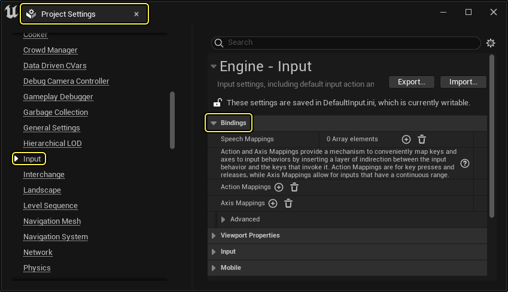
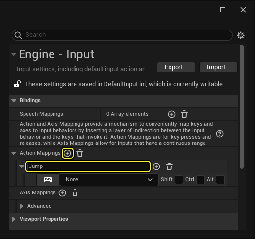
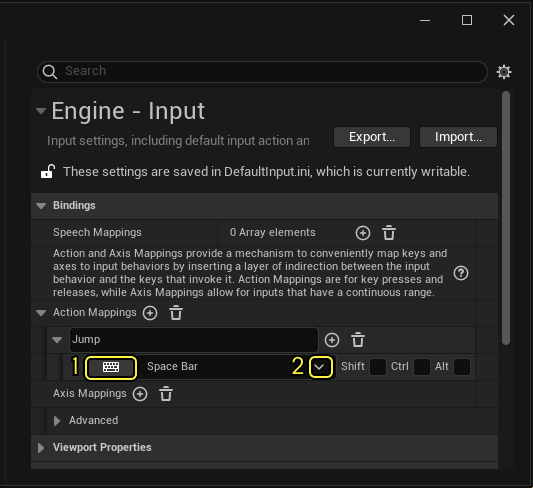
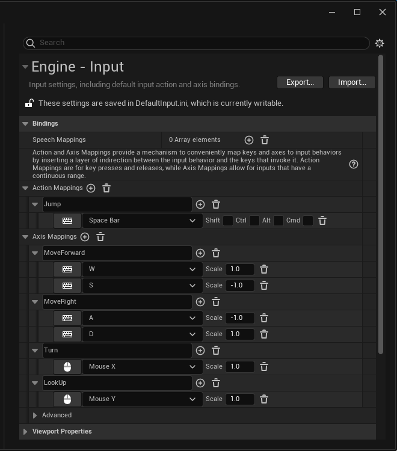
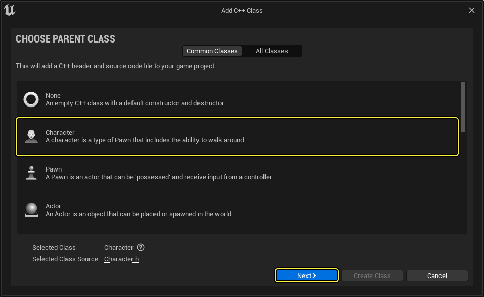
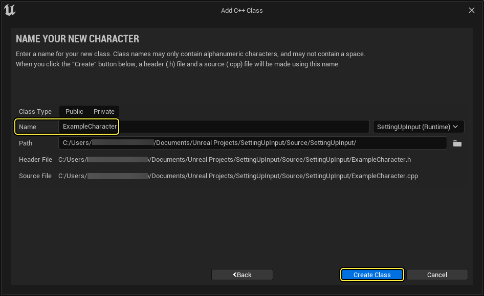
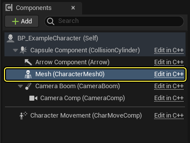
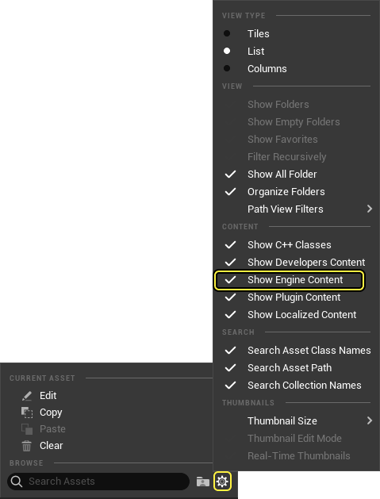

# 设置输入

> 路径：虚幻引擎5.7文档 / Gameplay系统 / 输入 / 设置输入

> 原始页面：https://dev.epicgames.com/documentation/unreal-engine/setting-up-user-inputs-in-unreal-engine

编程语言

C++

从下拉菜单中选择一个选项以查看与之相关的内容

在本教程中，你将创建一个[角色](../../gameplay-framework/pawn/characters/index.md)并进行设置以接收输入，之后，你将为该角色指定一个[游戏模式](../../gameplay-framework/game-mode-and-game-state/index.md)，从而让该角色成为Gameplay过程中的默认Pawn。 创建好人物后，你需要定义其如何对玩家输入做出反应。

> [!NOTE]
> 虚幻引擎为各种项目类型提供了更加复杂的输入映射。 如需了解详情，请参阅[增强输入](../enhanced-input/index.md)文档。

## 项目设置

1. Create a new **Games** > **Blank > C++**project named "**SettingUpInput**".
2. In the **编辑器**, navigate to **Edit** > **Project Settings** > **Input > Bindings**.



### 动作和轴映射设置

输入通常通过用户定义的**动作（Action）**和**轴映射（Axis Mappings）**的**绑定（Binding）**来定义。 这两种映射提供了一种方便的机制，能够在输入行为和触发它的按键之间插入一个间接层，从而将按键和坐标轴映射到输入行为。

动作映射用于按键的按下和抬起，而轴映射对应有持续范围的输入。 定义完映射后，你可以将其在蓝图或者C++中绑定到行为。

1. 点击**动作映射（Action Mappings）**旁边的**添加**（**+**）按钮，创建一个新的动作，命名为**跳跃（Jump）**。

   
2. 点击下拉菜单箭头（1）或者点击**选择按键值（Select Key Value）**按钮（2），找到并选择**空格（Space Bar）**按键值。

   
3. 找到**轴映射（Axis mappings）**并点击**添加**（**+**）来创建以下**轴映射**名称、**按键**值以及**缩放**值：

   | 轴映射名称 | 键值 | 大小值 |
   | --- | --- | --- |
   | 向前移动 | W | 1.0 |
   |  | S | -1.0 |
   | 向右移动 | A | -1.0 |
   |  | D | 1.0 |
   | Turn | 鼠标X | 1.0 |
   | LookUp | 鼠标Y | -1.0 |

   

## 创建示例角色

A [Character](../../gameplay-framework/pawn/characters/index.md) is a special type of **Pawn** that has the ability to walk around. Characters extend from the Pawn class, and inherit similar properties such as physical representation of a player or AI entity within the world.

> [!NOTE]
> Refer to the [Pawn](../../gameplay-framework/pawn/index.md) and [Input](../index.md) pages for additional documentation.

1. From the **Content Drawer**, navigate to the **C++ classes** folder, right-click and select **New C++ Class**, then choose **Character** as your parent class.

   
2. Name your character class "**ExampleCharacter**", then click **Create Class**.

   

### 创建弹簧臂和摄像机组件

When the **Camera** and **SpringArm Components** are used together, they provide functionality for a third-person perspective that can dynamically adjust to your game world. The camera component contains a camera that represents the player's point of view or how the player sees the world. The SpringArm component is used as a "camera boom" to keep the camera for a player from colliding into the world.

1. In your code editor, navigate to ExampleCharacter.h**.**In the **Class defaults,** declare the following classes.

   C++

   ```
   protected:         UPROPERTY(EditDefaultsOnly, BlueprintReadOnly, Category = "Components")         class USpringArmComponent* CameraBoom;		         UPROPERTY(EditDefaultsOnly, BlueprintReadOnly, Category = "Components")         class UCameraComponent* FollowCamera; |
   ```

   > [!NOTE]
   > [UProperty Specifiers](https://dev.epicgames.com/documentation/unreal-engine/unreal-engine-uproperties?application_version=5.7) are used to provide visibility of the component in the Blueprint Editor.
2. Navigate to your `ExampleCharacter.cpp` file. Add the following libraries to the include line.

   C++

   ```
   #include "GameFramework/SpringArmComponent.h"         #include "Camera/CameraComponent.h"
   ```
3. Next, implement the following in the `AExampleCharacter` constructor.

   C++

   ```
   AExampleCharacter::AExampleCharacter()
           {
           //Initialize the Camera Boom
           CameraBoom = CreateDefaultSubobject<USpringArmComponent>(TEXT("CameraBoom"));

           //Setup Camera Boom attachment to the Root component of the class
           CameraBoom->SetupAttachment(RootComponent);

           //Set the boolean to use the PawnControlRotation to true.
           CameraBoom->bUsePawnControlRotation = true;
   ```

   > [!NOTE]
   > The component calls the [FObjectInitializer::CreateDefaultSubobject](https://dev.epicgames.com/documentation/unreal-engine/API/Runtime/CoreUObject/UObject/FObjectInitializer/CreateDefaultSubobject?application_version=5.5)template, then uses the [SetupAttachment](https://dev.epicgames.com/documentation/unreal-engine/API/Runtime/Engine/Components/USceneComponent/SetupAttachment?application_version=5.5) method to attach to a parent Scene Component. When setting the Camera Boom to use the Pawn's [control rotation](https://dev.epicgames.com/documentation/unreal-engine/API/Runtime/Engine/GameFramework/USpringArmComponent/bUsePawnControlRotation?application_version=5.5), it uses its parent pawn's rotation instead of its own.
4. Compile your code.

#### Creating the Action/Axis Functions to your Input Component

1. In your `ExampleCharacter.h` class defaults, declare the following Input functions.

   C++

   ```
   protected:		         void MoveForward(float AxisValue);		         void MoveRight(float AxisValue);
   ```
2. Navigate to your `ExampleCharacter.cpp` and implement your `MoveForward` and `MoveRight` methods.

   C++

   ```
   void AExampleCharacter::MoveForward(float AxisValue)
            {
                if ((Controller != NULL) && (AxisValue != 0.0f))
                {
                    // find out which direction is forward
                    const FRotator Rotation = Controller->GetControlRotation();
                    const FRotator YawRotation(0, Rotation.Yaw, 0);

                    // get forward vector
                    const FVector Direction = FRotationMatrix(YawRotation).GetUnitAxis(EAxis::X);
   ```
3. Navigate to the SetupPlayerInputComponent(UInputComponent* PlayerInputComponent) method, then implement the following code.

   C++

   ```
   void AExampleCharacter::SetupPlayerInputComponent(UInputComponent* PlayerInputComponent)
            {
                Super::SetupPlayerInputComponent(PlayerInputComponent);

                PlayerInputComponent->BindAction("Jump", IE_Pressed, this, &ACharacter::Jump);
                PlayerInputComponent->BindAction("Jump", IE_Released, this, &ACharacter::StopJumping);

                PlayerInputComponent->BindAxis("MoveForward", this, &AExampleCharacter::MoveForward);
                PlayerInputComponent->BindAxis("MoveRight", this, &AExampleCharacter::MoveRight);
                PlayerInputComponent->BindAxis("Turn", this, &APawn::AddControllerYawInput);
   ```

   > [!NOTE]
   > The [Player Input Component](../input-overview/index.md) links the AxisMappings and ActionMappings in your project to game actions. Both the Pawn and Character class contain methods that are inherited and can be used or extended for your custom characters. In our example, we've used the Pawn's AddControllerYawInput and AddControllerPitchInput functions, and the Character's Jump and StopJumping functions.
4. Compile your code.

## Finished Code

#### ExampleCharacter.h

C++

```
#pragma once

		#include "CoreMinimal.h"
		#include "GameFramework/Character.h"
		#include "ExampleCharacter.generated.h"

		UCLASS()
		class SETTINGUPINPUT_API AExampleCharacter : public ACharacter
		{
			GENERATED_BODY()
```

#### ExampleCharacter.cpp

C++

```
// Sets default values
		AExampleCharacter::AExampleCharacter()
		{
			//Initialize the Camera Boom
			CameraBoom = CreateDefaultSubobject<USpringArmComponent>(TEXT("CameraBoom"));

			//Setup its attachment to the Root component of the class
			CameraBoom->SetupAttachment(RootComponent);

			//Set the boolean to use the PawnControlRotation to true.
```

## Creating the Character Blueprint

1. Navigate to your **C++ Classes Folder** and right click your **ExampleCharacter**, from the drop down menu select **Create Blueprint class based on ExampleCharacter**. Name your Blueprint **BP_ExampleCharacter**.
2. In the **Components** panel, select the **Mesh** Skeletal Mesh Component.

   
3. Navigate to**Details** > **Mesh** > **Skeletal Mesh** and expand the drop-down menu. In the Browser section, click the **Settings** Icon. Then from the context menu, select **Content** > **Show Engine Content**.

   
4. Search for and select the **TutorialTPP**Skeletal Mesh.

   > 图片已省略：details-skeletalmesh-select
5. Navigate to the **Transform** category, then set the **Location** and **Rotation** vector values to (**0.0, 0.0, -90**)

   > 图片已省略：transform-details

## 创建游戏模式蓝图

The [GameMode](../../gameplay-framework/game-mode-and-game-state/index.md) defines the game's set of rules. These rules include what default pawn the player will spawn when the game is launched. You need to set up these rules to spawn the Player Character you created.

1. In the **Content Drawer**, navigate to your **C++ Classes** folder, right-click the **SettingUpInputGameModeBase**, then in the drop-down menu select **Create Blueprint Based on SettingUpInputGameModeBase**. Name your game mode Blueprint "**BP_InputGameMode**".

   > 图片已省略：image alt text
2. In the **Class** defaults, navigate to **Classes** > **Default Pawn Class**, and select the **BP_ExampleCharacter**.

   > 图片已省略：image alt text
3. **Compile** and **Save**.

   > 图片已省略：compile-and-save
4. Navigate to **Edit** > **Project Settings** > **Maps and Modes**. Set the **Default GameMode** to **BP_InputGameMode.**

   > 图片已省略：project-settings
5. Navigate to the **编辑器** and select **Play** (**Play in Editor**)

   > 图片已省略：play-in-editor

You can now control your character's movement using the W, A, S, D keys. Moving the mouse moves the camera, and pressing the spacebar causes the character to jump.

## 结果

> 动图已省略：image alt text
