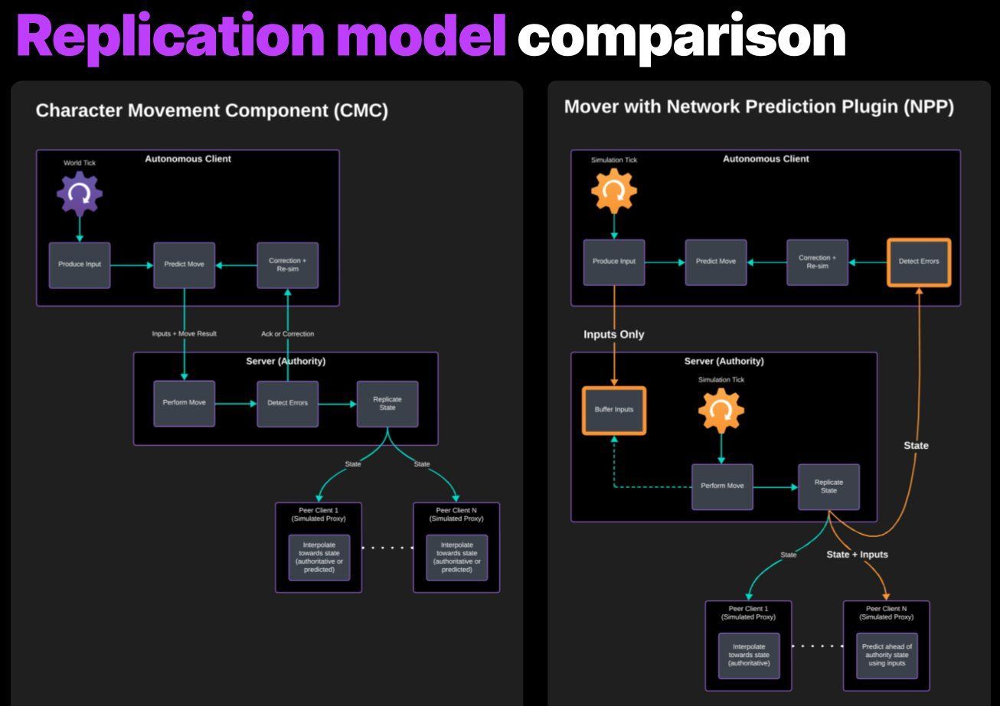

# 对比Mover和角色移动组件

> 路径：虚幻引擎5.7文档 / Gameplay系统 / Mover / 对比Mover和角色移动组件

> 原始页面：https://dev.epicgames.com/documentation/unreal-engine/comparing-mover-and-character-movement-component-in-unreal-engine

我们希望 **Mover** 插件能够取代 **角色移动组件（CMC）** 系统。本文档旨在帮助你更好地理解这两种系统的区别。

## 上层对比

| **Mover** | **CMC** |
| --- | --- |
| 模块化 不受Actor类型限制 支持更多形状 统一的回滚操作 在客户端上校正 状态受到保护 由服务器驱动的移动节奏（统一型） 尚未经过充分测试 支持联网物理 | 一体化 只支持ACharacter Actor 对胶囊体形状有限制 孤立的回滚操作 在服务器上校正 开放状态访问 由客户端RPC驱动的移动节奏 经历过众多发行项目的严格考验 有限的物理交互 |

## 复制模型差异

使用CMC时，Actor的所属客户端会以客户端帧率发送输入和状态组合作为"移动"操作。服务器接收这些信息并立即执行相同的移动操作。然后，服务器会将状态进行比较，以决定是否需要进行修正，并通过确认消息或包含修正状态数据的块来作出回复。

而使用Mover和网络预测（Network Prediction）时，服务器和客户端会在同一条时间轴上进行模拟，但客户端会提前服务器一小段时间来运行预测操作。客户端为特定的模拟时间段编写输入内容，并且这就是它们向服务器发送的所有内容。服务器会缓存这些输入，直到它们对应的模拟时间到来。在执行完成所有移动更新后，服务器会将状态广播给所有客户端。客户端会决定是否需要通过回滚和重新模拟来进行校正。

与CMC不同的是，Mover Actor的状态在任何时候都无法通过外部直接进行修改。例如，没有可以直接操作的速度属性。相反，开发人员必须使用模式、瞬时效果和其他机制来影响在下一个可用的模拟周期中的变化。此外，玩家提供的输入，例如移动输入和按键操作，必须组合成一个单一的输入命令，以便在移动模拟周期中进行处理，而不是立即影响Mover模型的运行状态。

> [!NOTE]
> 根据项目设置，你可能会有来自多个游戏世界帧的玩家输入共同作用于一个单一的移动模拟时步（tick）。

此图仅展示了网络预测模型，但Chaos联网物理的复制流程与此类似。

## 其他显著差异

- 两个系统中的

  移动模式

  很相似，但Mover中的移动模式是模块化的。
- Mover里的

  分层移动

  类似CMC的根运动源（RMS）。
- 过渡

  、

  瞬时效果

  和

  移动修饰符

  都是Mover中新实现的概念。
- 在CMC中，由控制器（Controller）和Pawn来处理基础移动输入。而Mover对输入不做假设，而是把将输入转换为移动模拟所需的额外工作留给项目来完成。
- 在Mover中，你可以将不同模式下的移动以及分层移动混合使用
- Mover使得添加自定义移动模式变得更加容易，即便是在插件中或是运行时也能实现。
- MoverComponent

  不需要也不假定存在骨骼网格体作为视觉表示。
- MoverComponent需要一个根SceneComponent，但它不必是一个单一的垂直方向胶囊体，甚至也不必是一个PrimitiveComponent。这对于创建非人类角色（比如狗或马）特别有用。
- 你可以用Mover自由创建不带碰撞图元的Mover Actor。
- 使用Mover时，Z轴的正方向不一定要朝上。
