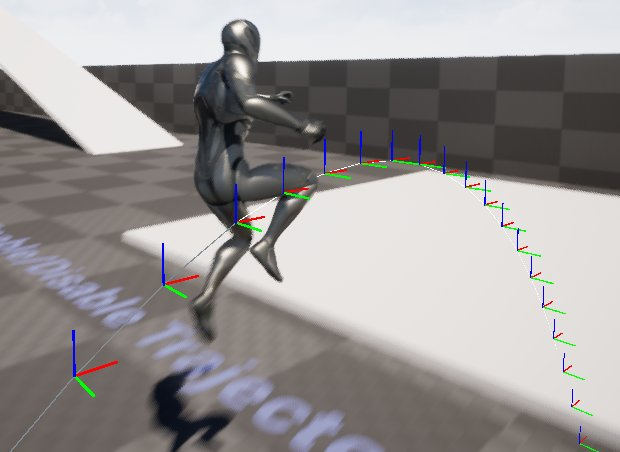

# Mover调试参考

> 路径：虚幻引擎5.7文档 / Gameplay系统 / Mover / Mover调试参考

> 原始页面：https://dev.epicgames.com/documentation/unreal-engine/mover-debugging-reference-for-unreal-engine

本文将介绍一些可以帮助你解决 **Mover** 项目问题的调试选项。

## 可视化与状态读出信息

你可以通过[Gameplay调试器工具（GDT）](../../../testing-and-optimizing-content/using-the-gameplay-debugger/index.md)查看可视化及状态读出信息。

要在PIE（编辑器中运行）模式下为Mover激活GDC，请按以下步骤操作：

1. 按下单引号键（

   '

   ）显示GDT面板。
2. 在GDT面板中，找到与Mover类别相关的编号。
3. 在数字小键盘上按下Mover类别对应的编号。

> [!NOTE]
> GDT默认选择由本地控制的玩家角色，但你可以通过GDT输入和 `gdt.*` 控制台命令进行更改。

你可以在输出日志中找到Mover的日志信息，方法是使用 *LogMover** 类别进行筛选。

## 控制台命令

| **命令** | **说明** |
| --- | --- |
| `Mover.Debug.MaxMoveIntentDrawLength=X` | 移动意图可视化箭头的最大长度（以厘米为单位）。 |
| `Mover.Debug.OrientationDrawLength=X` | 朝向可视化箭头的最大长度（以厘米为单位）。 |
| `Mover.Debug.ShowTrail` | 开启/关闭所选服务器控制Actor的尾迹显示。尾迹会显示其先前的路径和回滚信息。对于本地玩家，请使用 `Mover.LocalPlayer.ShowTrail` 替代此操作。 |
| `Mover.Debug.ShowTrajectory` | 开启/关闭所选服务器控制Actor的轨迹预测显示。对于本地玩家，请改用 `Mover.LocalPlayer.ShowTrajectory`。 |
| `Mover.Debug.ShowCorrections` | 开启/关闭所选服务器控制Actor的网络校正显示。对于本地玩家，请改用 `Mover.LocalPlayer.ShowCorrections`。 |
| `Mover.Debug.LogAnimRootMotionSteps=X` | 启用后，将记录关于动画根动作分层移动的详细信息。（0：禁用，1：启用） |
| `Mover.Debug.LogRootMotionAttrSteps=X` | 启用后，将记录关于根动作属性分层移动的详细信息。（0：禁用，1：启用） |
| `Mover.Debug.DisableRootMotionAttributes=X` | 启用后，忽略根运动属性带来的影响，转而依据其他Mover的影响进行处理。（0：禁用，1：启用） |
| `Mover.LocalPlayer.ShowTrail` | 根据Mover组件开启/关闭玩家的轨迹。轨迹会显示其先前的路径和回滚信息。在默认情况下，此项适用于第一个本地玩家控制器。 |
| `Mover.LocalPlayer.ShowTrajectory` | 根据Mover组件开启/关闭玩家的尾迹。尾迹会显示其先前的路径和回滚信息。在默认情况下，此项适用于第一个本地玩家控制器。 |
| `Mover.LocalPlayer.ShowCorrections` | 开启/关闭玩家的网络校正显示。绿色表示校正后更新过的位置，红色表示校正前的位置。在默认情况下，此项适用于第一个本地玩家控制器。 |
