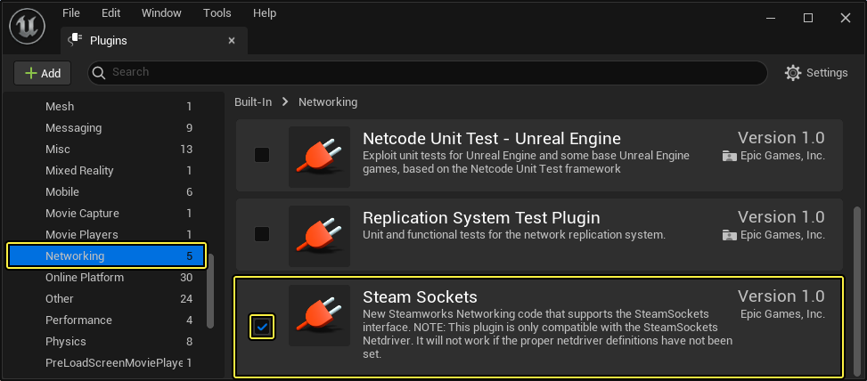

# 使用Steam Sockets

> 路径：虚幻引擎5.7文档 / Gameplay系统 / 联网和多人游戏 / 部署多人游戏 / 使用Steam Sockets

> 原始页面：https://dev.epicgames.com/documentation/unreal-engine/using-steam-sockets-in-unreal-engine

> [!NOTE]
> 在虚幻引擎4.27.0中，`FUniqueNetIdSteam` 的一个问题导致Steam Sockets无法成功创建连接。该问题在4.27.2以及之后的版本中得到了修复。

**Steam Sockets** 是一款利用Steam新网络协议层的网络插件，从 **Steamworks SDK** 1.46版起，**虚幻引擎** 支持此款插件。

与上一个SteamNetworking协议相比，此插件利用Steam通信网络提供更高的安全性和可靠性，并内置DDoS保护、端到端加密和NAT遍历。Steam Sockets还为监听服务器提供 **ping计算** 功能，匹配系统可利用此功能将用户匹配到性能更佳的服务器。与仅在用户连接到服务器后才能提供ping计算的SteamNetworking相比，这是一个重大的改进。

> [!NOTE]
> Steam Sockets用自身的网络驱动器取代了虚幻引擎的默认网络驱动器，且使用Steam Sockets创建的版本仅可连接其他使用Steam Sockets的版本。此外，Steam Sockets版本支持Windows、Mac和Linux之间的跨平台运行，但不支持其他设备。

## 启用Steam Sockets插件

基于Windows、Mac和Linux的版本可通过以下步骤启用Steam Sockets：

1. 在 **虚幻编辑器** 中打开项目，单击 **编辑（Edit）** > **插件（Plugins）**。
2. 在 **插件菜单（Plugins Menu）** 中，单击 **内置插件（Built-in Plugins）** 下的 **网络（Networking）** 插件组。
3. 找到 **Steam Sockets** 插件，单击 **启用（enabled）**。需重启虚幻编辑器，使更改生效。



1. 对于要使用Steam Sockets插件的各个平台，打开其

   Engine.ini

   文件，将

   Net Driver Definitions

   更改为使用

   SteamSockets.SteamSocketsNetDriver

   。例如，若要为某个Windows版本启用Steam Sockets，可将以下内容添加到

   WindowsEngine.ini

   ：

WindowsEngine.ini

```
[/Script/Engine.GameEngine]!NetDriverDefinitions=ClearArray+NetDriverDefinitions=(DefName="GameNetDriver",DriverClassName="/Script/SteamSockets.SteamSocketsNetDriver",DriverClassNameFallback="/Script/SteamSockets.SteamNetSocketsNetDriver")
```

> [!NOTE]
> 任何针对非Windows、Mac和Linux设备的版本在打包前都将剥离Steam Sockets，而默认使用UE4的标准网络协议。
>
> 若在任意这些操作系统上使用非Steam平台，例如Windows上的Oculus商店，则版本仍将使用Steam网络驱动器打包，但针对该平台的设置会不正确。考虑到这一点，有必要为分布于不同PC平台上的版本适当地配置项目。

## 使用Steam Sockets功能

可使用配置参数自定义Steam Sockets，以启用和禁用大规模功能。

OnlineSubsystemSteam.bUseSteamNetworking 控制是否将SteamSockets SocketSubsystem作为默认子系统。此参数默认设为true。大部分项目不需要更改此设置，对于从之前的SteamNetworking协议迁移过来的开发人员，此参数主要作为向后兼容选项。

OnlineSubsystemSteam.bAllowP2PPacketRelay控制在使用专用服务器时，数据包是否应通过Steam通信网络传递。此参数默认设为true。禁用此设置后，专用服务器直接公开连接地址，提供自定义实施。启用此设置后，专用服务器通过Steam的中继网络运行，从而免受DDoS攻击，获得更高的安全性。P2P监听服务器始终使用Steam的通信网络，不受此设置影响。

包括ping计算在内的其他功能是通过UE4中的现有网络接口提供的。

欲了解Steamworks SDK的更多详情，参见Valve的官方文档。
