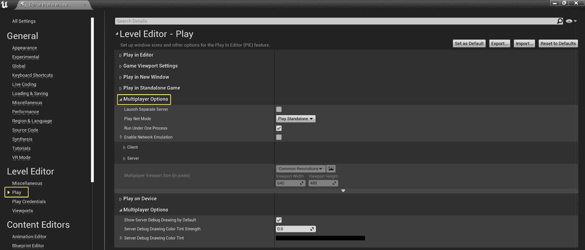
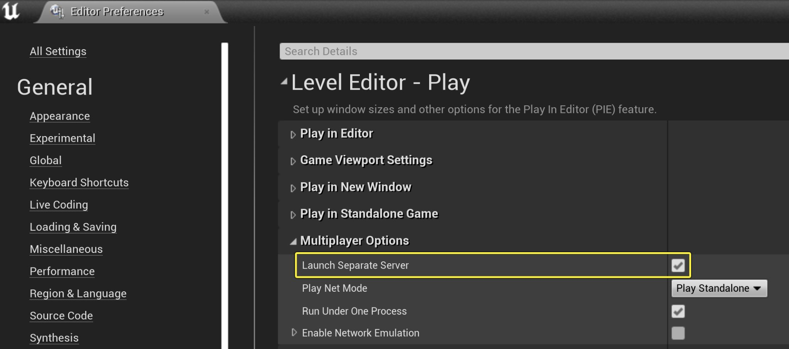
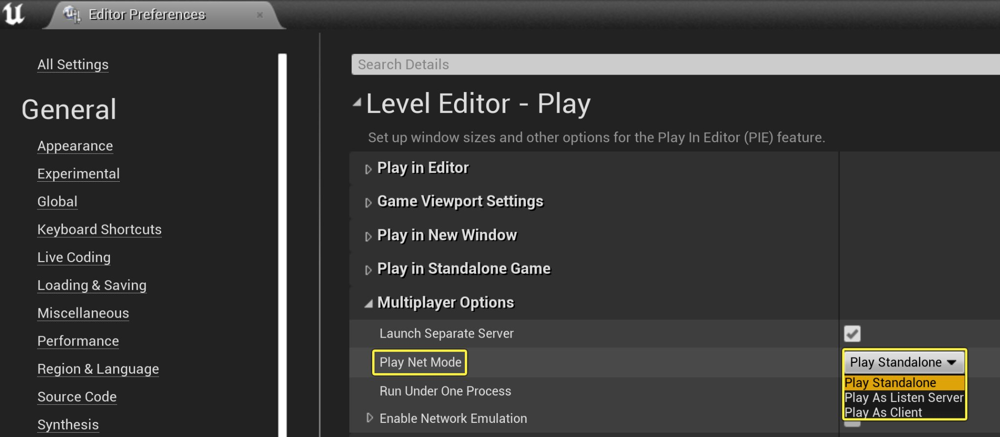
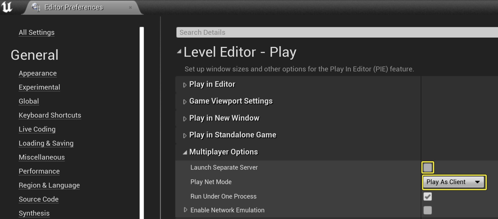
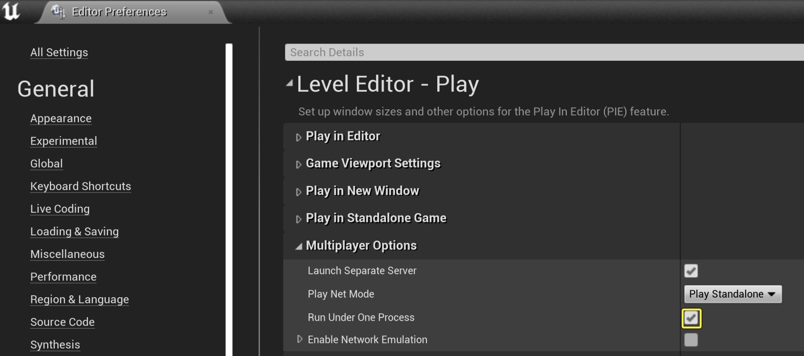
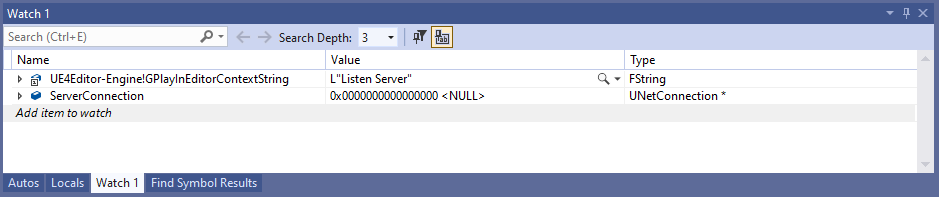
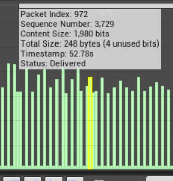
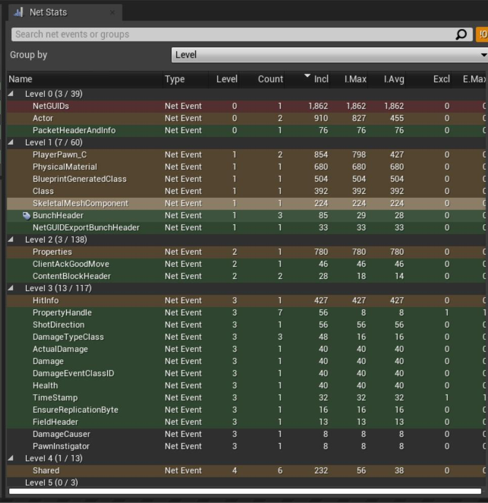

# 测试和调试网络游戏

> 路径：虚幻引擎5.7文档 / Gameplay系统 / 联网和多人游戏 / 网络调试 / 测试和调试网络游戏

> 原始页面：https://dev.epicgames.com/documentation/unreal-engine/testing-and-debugging-networked-games-in-unreal-engine

## 在虚幻编辑器中测试网络选项

**虚幻编辑器** 包含可调整的设置，有助于测试多人游戏项目。这些选项包括设置 **玩家数量（Number Of Players）**、运行多个 **运行窗口（Play windows）** 和运行 **专用服务器（Dedicated Server）**。

要查看这些设置，请启动 **编辑器（Editor）** 并找到 **工具栏（Toolbar）**，然后选择 **运行（Play）** 按钮旁边的 **模式（Modes）** 下拉箭头。

> [!NOTE]
> 有关在编辑器中调整多人游戏设置的更多详细信息，请参阅[测试多人游戏](../testing-multiplayer/index.md)

## 启动专用服务器

你还可以使用其他方法启动多人游戏。按照以下步骤启动单独的专用服务器实例。

1. 你可以从

   模式（Modes）

   下拉箭头中选择

   高级设置（Advanced Settings）

   ，或者找到

   编辑器偏好设置（Editor Preferences）

   >

   关卡编辑器（Level Editor）

   >

   运行（Play）> 多人游戏选项（Multiplayer Options）

   。



1. 从

   多人游戏选项（Multiplayer Options）类别

   ，找到

   启动独立服务器（Launch Independent Server）

   变量，然后点击该框，将其布尔值设为

   true

   。



1. 点击

   运行网络模式（Play Net Mode）

   变量旁边的下拉菜单，然后选择

   单机游戏（Play Standalone）

   。



这样将创建新的服务器实例，但是，其他实例不会自动与它连接。

## 连接到独立服务器实例

你可以使用以下命令将 **独立实例** 连接到 **服务器**：

```
open 127.0.0.1:<port number>
```

你也可以使用[会话接口](../../../online-subsystems-and-services/online-subsystem/online-subsystem-session-interface/index.md)。这样会创建在服务器上运行的游戏实例，其他客户端可以发现并加入该实例。这对于测试项目的连接流很有用。

如果 **运行网络模式（Play Net Mode）** 变量设置为 **作为客户端运行（Play as Client）**，则不需要启用 **启动独立服务器（Launch Independent Server）** 变量，因为启动专用服务器实例不需要它。



在编辑器的 **网络模式选项（Net Mode options）** 中使用 **作为客户端运行（Play as Client）** 或 **作为侦听服务器运行（Play As Listen Server）** 时，这些实例会自动通过IP地址直接相互连接。这相当于在 **客户端** 上运行 `open 127.0.0.1:17777` 命令，以便连接到 **服务器**。

> [!NOTE]
> 此连接过程不 使用 **会话接口**，因此，服务器不会创建在线多人会话，客户端不会搜索并加入此会话。对于大多数Gameplay测试目的，这不会有很大区别。但是，某些依赖会话接口的在线功能（例如语音聊天）将不可用。

如果启用 **在一个进程下运行（Run Under One Process）** 变量旁边的方框，则所有客户端和服务器实例将作为编辑器共享相同的 **函数更新率**。



这与单独运行这些实例不同。例如，在 **独立模式** 中，你可以使用BaseEngine.ini文件中的NetServerMaxTickRate config配置值来控制服务器的函数更新率。

```
[/Script/OnlineSubsystemUtils.IpNetDriver]NetServerMaxTickRate=30
```

这可能会影响某些使用函数更新率的行为，例如计算单个网络更新的带宽限制。

使用在编辑器中运行（PIE）时，[服务器/客户端移动](../../managing-multiplayer-sessions/travelling-in-multiplayer/index.md)等功能存在限制。你的项目需要在独立模式下作为编辑器之外的单独进程运行，以便测试这些功能。

如果你在单独的进程下运行实例，一个实例将被视为在编辑器中运行，而其他实例将被视为独立运行。与统一运行实例相比，不论是统一在编辑器中运行还是统一独立运行，单独运行可能会导致不同的行为。例如，需要调用UEditorEngine::NetworkRemapPath函数，以便在其路径通过网络发送的静态Actor上添加或删除PIE前缀。

## 调试多个客户端和服务器实例

运行多个客户端和服务器实例具有独特的挑战，尤其是不容易知道要附加到哪个实例。你可以使用断点来帮助调试PIE实例，从而缓解这些挑战。

在你的代码编辑器中，你可以将以下变量添加到你的 **观察（Watch）** 窗口。

| 观察变量 | 用途 |
| --- | --- |
| UE4Editor-Engine!GPlayInEditorContextString | 确定你当前正在逐步执行的实例。 |
| NetDriver's ServerConnection | 在客户端上，这将保存对服务器的NetConnection的引用。在服务器上，该值将为Null，允许你在调试复制系统时快速检查你所在的实例。 |



此外，你可以调用观察中的GetLocalRole()函数或者直接在代码中调用它，从而检查Actor的[角色](https://dev.epicgames.com/documentation/404)属性。GetLocalRole函数将返回实例对该Actor的控制程度。如果你在复制Actor中调试问题，那么它将返回三个角色之一：

| 角色 | 说明 |
| --- | --- |
| ROLE_Authority | 存在于服务器实例上的Actor。 |
| ROLE_AutonomousProxy | 此Actor是此客户端实例上的本地PlayerController拥有的角色或Pawn。 |
| ROLE_SimulatedProxy | 存在于客户端实例上的Actor。 |

## 分析网络游戏

你可以使用[Networking Insights](../../../../testing-and-optimizing-content/unreal-insights/networking-insights/index.md)分析联网游戏。这是 **Unreal Insights** 分析工具的组件，可提供详细信息，帮助分析、调试和优化项目的网络流量。

该工具的 **数据包概述面板（Packet Overview Panel）** 中的每一列将对应一个数据包，**数据包内容面板（Packet Content Panel）** 将提供对所选数据包中每个元素的全面信息，包括有关内容、偏移量、大小等的数据。



将鼠标悬停在数据包上会显示信息

**网络统计数据（Net Stats）** 面板将提供有关网络追踪事件的信息，例如事件的计数和总计/最大包含大小（以位为单位），并且这些事件会根据事件起源的位置形成级别。你可以找到有关如何设置和使用[Networking Insights](../../../../testing-and-optimizing-content/unreal-insights/networking-insights/index.md)的更多信息。



事件按级别分组的网络统计数据面板

虚幻引擎还包括[Network Profiler](../using-the-network-profiler/index.md)，这是一个传统工具，可提供项目网络流量的不同视图。虽然Network Profiler提供的信息不如Networking Insights提供的信息详细，但它仍然可以提供有关游戏带宽使用情况的简要概览以及单个Actor、属性或RPC的统计数据。

## Gauntlet自动化框架

[Gauntlet自动化框架](../../../../testing-and-optimizing-content/automation-test-framework/gauntlet-automation-framework/index.md)支持启动多个会话，例如服务器和客户端，它可以成为测试和验证多人游戏项目的宝贵工具。

> [!TIP]
> ShooterGame项目中有使用Gauntlet进行多人游戏的自动化脚本的示例实现。它包含ShooterGame自动化C#（用于驱动测试，位于 `/Build/Scripts` 文件夹）以及项目的本机测试控制器代码（位于 `/Source/ShooterGame/Private` 和 `Public/Tests` 目录）。

## 功能测试

UE具有通过[关卡蓝图](https://dev.epicgames.com/documentation/404)设置和运行[功能测试](https://dev.epicgames.com/documentation/404)的能力。 你的功能测试最初需要在项目的单个实例上运行。之后，你可以在多人游戏项目中运行这些测试。你可以在客户端实例、专用服务器或侦听服务器实例中启动包含测试的关卡。

> [!WARNING]
> 当前不支持设置跨多个实例（例如客户端和服务器同时）运行的功能测试。所需功能 **不会** 运行的示例场景：如果服务器将复制属性设置为新值，则客户端会检查是否收到了这个新的复制值。
