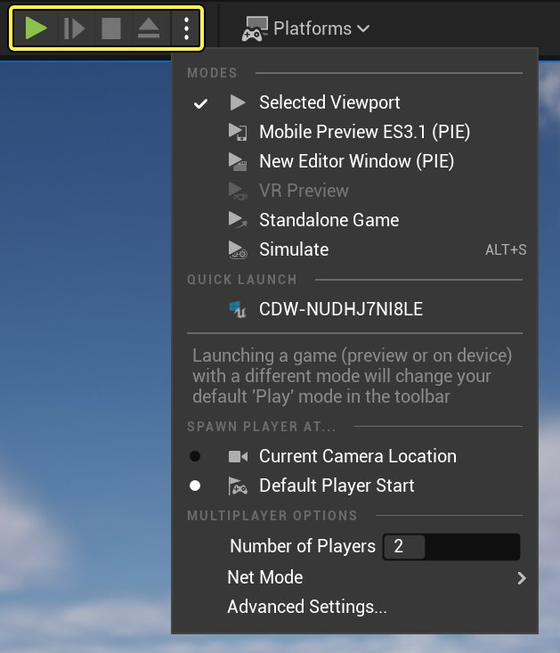
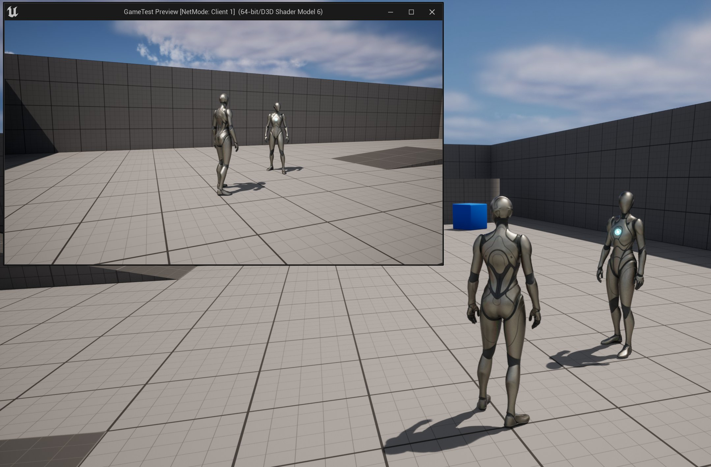
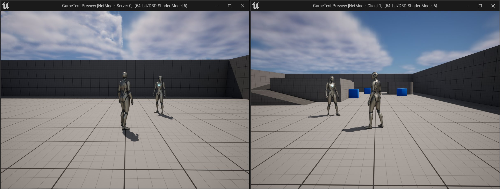
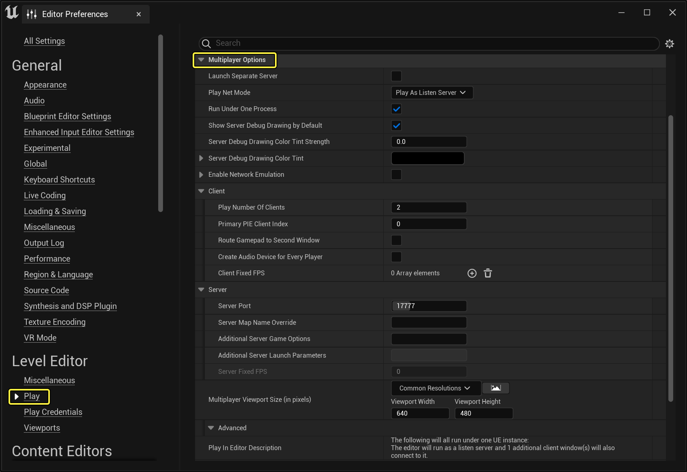

# 测试多人游戏

> 路径：虚幻引擎5.7文档 / Gameplay系统 / 联网和多人游戏 / 网络调试 / 测试多人游戏

> 原始页面：https://dev.epicgames.com/documentation/unreal-engine/testing-multiplayer-in-unreal-engine

本页介绍了如何更改编辑器的某些设置，以测试不同的多人场景。

## 多人游戏选项

### 设置玩家数量

点击 **运行（Play）** 按钮旁的更多选项按钮，然后输入 **玩家数量（Number of Players）** 的值。

默认情况下，服务器将使用 **选中的视口（Selected Viewport）** 作为运行窗口，并为已添加的每个客户端创建新窗口：

### 调整运行窗口

你完全可以使用编辑器的视口作为运行窗口，但为了清晰起见，你可能需要针对每位玩家分别使用不同的窗口。要调整服务器的运行窗口，请点击 **运行（Play）** 按钮旁边的更多选项按钮，然后选择 **新建编辑器窗口（编辑器中运行）（New Editor Window (PIE)）** 。虽然模拟的客户端拥有自己的窗口，但此设置还会为模拟的服务器创建单独的窗口。

## 高级设置

如果你已将 **运行** 方式设置为使用新的编辑器窗口，可能还需要调整编辑器窗口的大小。请点击 **运行（Play）** 按钮旁的更多选项按钮，然后选择 **高级设置（Advanced Settings）** 。在 **多人游戏视口大小（以像素为单位）（Multiplayer Viewport Size (in pixels)）** 分段下设置需要的窗口大小。**多人游戏视口大小（以像素为单位）（Multiplayer Viewport Size (in pixels)）** 允许你为已创建的窗口设置大小。你可以从若干预设的窗口大小中进行选择，也可以手动输入窗口大小（此例中，我们指定了 `640x480` ）。输入窗口大小后，在编辑器中运行时，每个新窗口都会采用相同的大小。

当在编辑器中使用新窗口运行各个游戏会话时，你会注意到，每个窗口的顶部会显示玩家是服务器还是客户端。同时，在 **运行** 模式下，当你移动窗口时，窗口的位置将被记忆下来，以备下次在编辑器会话中 **运行** 时使用（这样就不必总是要移动，测试起来更轻松）。

### 多人选项

**高级设置（Advanced Settings）** 中还包含设置其他多人选项的部分：

| 选项 | 说明 |
| --- | --- |
| **玩家数量（Number of Players）** | 此选项可定义游戏启动时将生成的玩家数量。编辑器和监听服务器均会被视作玩家，而专用服务器则不会。剩余的玩家则由客户端构成。 |
| **服务器游戏选项（Server Game Options）** | 你可以在此处指定作为URL参数传递给服务器的额外选项。 |
| **运行专用服务器（Run Dedicated Server）** | 勾选后，将启动独立的专用服务器。否则，第一位玩家将充当监听服务器，供其他所有玩家连接。 |
| **将第一个游戏手柄路由到第二个客户端（Route 1st Gamepad to 2nd Client）** | 在单个进程中运行多个玩家窗口时，此选项将决定游戏手柄输入数据的路由方式。如果未勾选（默认），第一个游戏手柄将连接到第一个窗口，第二个游戏手柄则连接到第二个窗口，以此类推。如果勾选，第一个游戏手柄将连接到第二个窗口。然后，第一个窗口可通过键盘/鼠标控制，便于两人在同一台计算机上进行测试。 |
| **使用单个进程（Use Single Process）** | 此选项将在虚幻引擎的单个实例中生成多个玩家窗口。这样加载速度更快，但有可能出现更多问题。未勾选此选项时，额外选项将变为可用状态。 |
| **创建所有玩家的音频设备（Create Audio Device for Every Player）** | 启用此选项将允许从每位玩家的角度渲染精确的音频，但会占用更多CPU资源。 |
| **编辑器中运行描述（Play In Editor Description）** | 基于当前已应用的多人游戏设置运行时，此选项会描述当前将发生的情况。 |

勾选 **使用单个进程（Use Single Process）** 后，虚幻引擎的单个实例中将生成多个窗口。未勾选此选项时，将针对被分配的每位玩家启动多个UE实例，并且额外选项将变为可用状态：

| 选项 | 说明 |
| --- | --- |
| **编辑器多人游戏模式（Editor Multiplayer Mode）** | 此选项将定义在编辑器中运行时使用的网络模式（包括 **离线运行（Play Offline）** 、 **作为监听服务器运行（Play As Listen Server）** 和 **作为客户端运行（Play as Client）** ） |
| **命令行参数（Command Line Arguments）** | 你可在此处指定将传递给独立游戏实例的附加命令行选项。 |
| **多人游戏窗口大小（以像素为单位）（Multiplayer Window Size (in pixels)）** | 定义生成额外独立游戏实例时所采用的宽度/高度。 |

## 监听服务器与专用服务器

启动多人游戏时，游戏托管方式有两种。第一种方式是使用 **监听服务器** （默认设置），这表示拥有权限的机器也将运行客户端，在正常玩游戏的同时为其他玩家提供托管。

第二种方式是使用 **专用服务器** ，顾名思义，专用服务器仅用于托管游戏，不会有本地玩家在此机器上玩游戏，因为连接的所有玩家均是客户端玩家。通常情况下，与作为监听服务器运行相比，作为专用服务器运行更能充分利用资源，因为不显示视觉效果和输入内容。

默认情况下，在编辑器中运行或作为独立游戏运行时，服务器类型会被设置为监听服务器。

### 运行专用服务器

点击 **运行（Play）** 按钮旁的更多选项按钮，然后勾选 **运行专用服务器（Run Dedicated Server）** 复选框。如需更多为项目设置专用服务器的信息，请参阅[设置专用服务器](../../network-programming-tutorials-and-examples/setting-up-dedicated-servers/index.md)文档。
