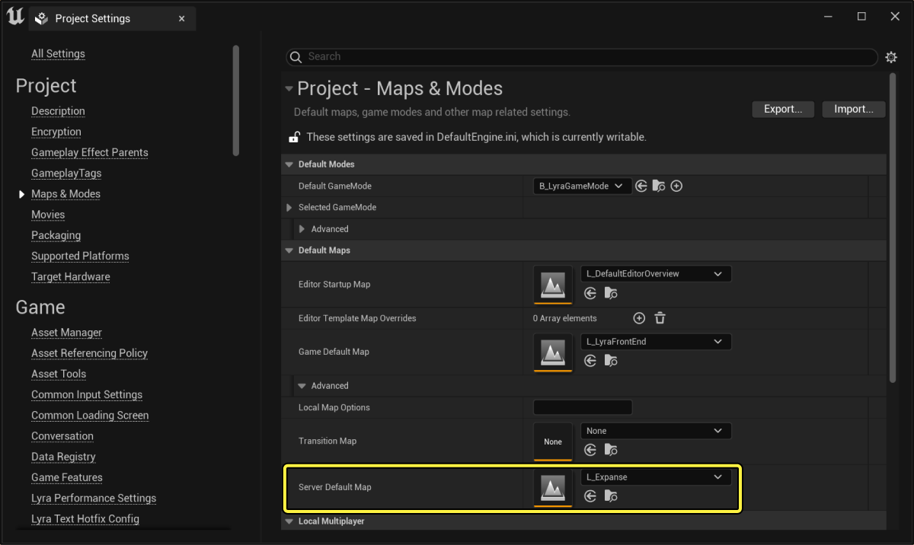
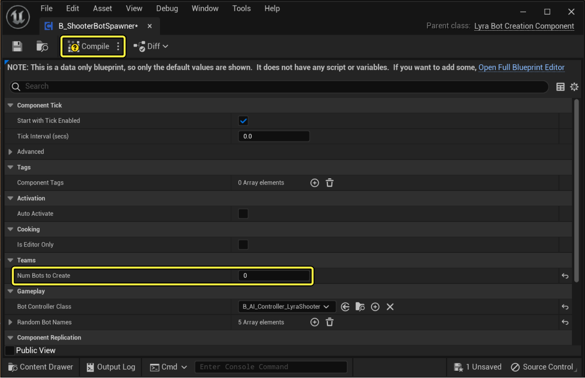
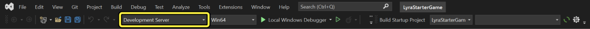
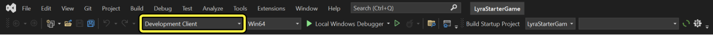
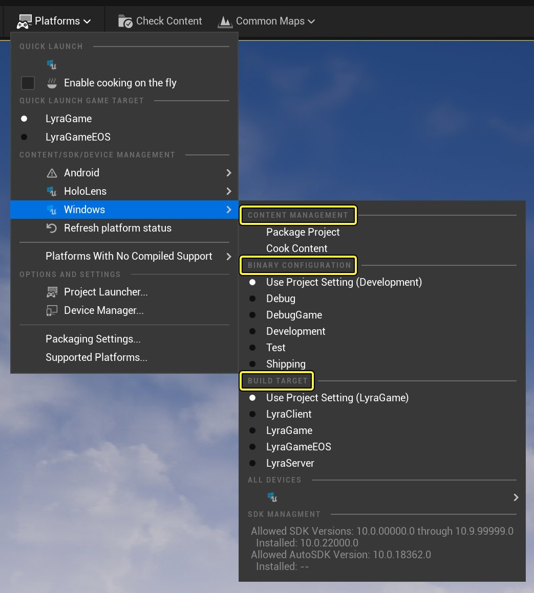
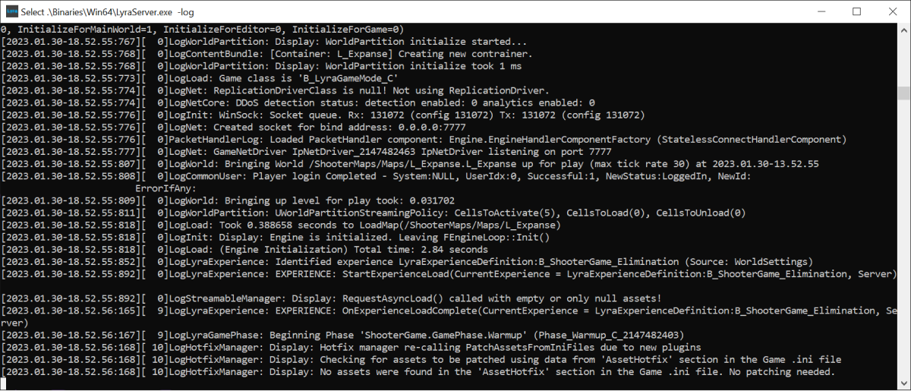
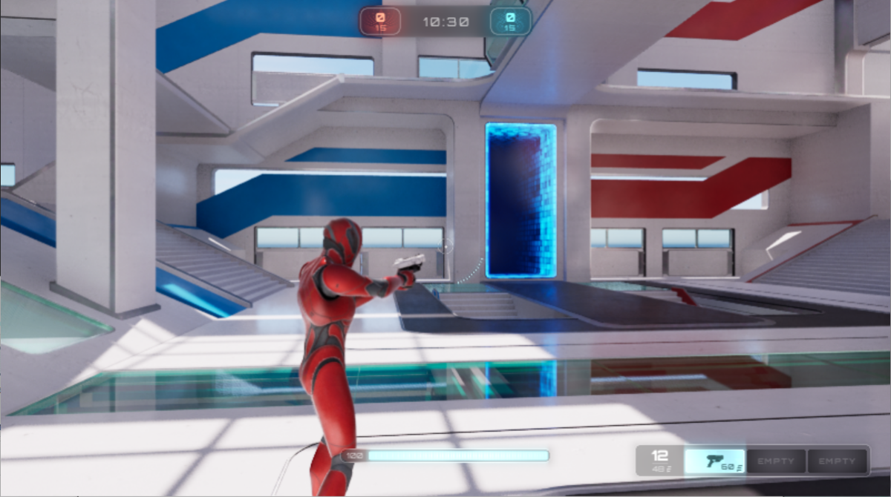
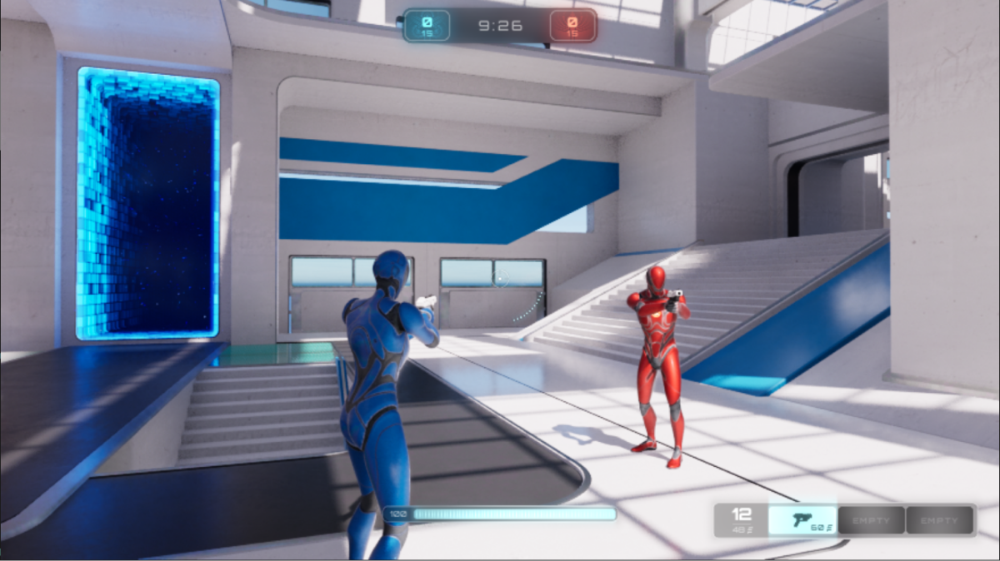

# 设置专用服务器

> 路径：虚幻引擎5.7文档 / Gameplay系统 / 联网和多人游戏 / 网络编程教程和示例 / 设置专用服务器

> 原始页面：https://dev.epicgames.com/documentation/unreal-engine/setting-up-dedicated-servers-in-unreal-engine

## 概述

**虚幻引擎（UE）** 会将 **客户端-服务器** 模型用于多人网络游戏。一个服务器充当游戏的 **主机** ，而玩家作为 **客户端** 连接到主机。实际的游戏状态由服务器调整，这称为服务器作为 **权威主机** 。玩家使用 **自主代理** 控制其Pawn。服务器将 **复制** 每个联网客户端的更改，从而模拟每个联网客户端的实际游戏状态。玩家在客户端看到的画面非常接近服务器上正在运行的实际游戏。

### 专用服务器

**监听服务器** 是在机器上托管游戏并充当服务器的客户端。其他客户端将连接到该托管客户端，并在托管客户端的实例上运行游戏。在此模型中，托管客户端是 **权威主机** 。这样一来，托管客户端比联网客户端更具优势，因为托管客户端在以实际游戏状态主动运行。

**专用服务器** 是无界面运行的服务器。这意味着没有客户端直接在专用服务器游戏实例中运行。每个玩家来自联网的远程客户端。无界面服务器不会呈现视觉效果，并且玩家不会在无界面服务器本地运行游戏。

相对于监听服务器而言，这有多项优势：

- 体量更小
- 消除了主机客户端的不当优势
- 专注于Gameplay逻辑和调整来自客户端的信息

监听服务器通常适用于多人休闲游戏和合作游戏，但专用服务器是大型或竞技游戏的理想之选。

本教程将介绍如何构建、烘焙和测试专用服务器。

## 教程

本教程将以 **Lyra新手游戏（Lyra Starter Game）** 为基础来设置专用服务器和客户端。Lyra提供了开箱即用的多人游戏功能，非常适合用作本教程的示例游戏。

要执行本教程中的步骤，你的项目需要满足以下要求：

- 你必须使用虚幻引擎的源代码版本。请参阅我们的

  下载虚幻引擎源代码

  页面，了解更多信息。
- 你必须使用支持客户端-服务器多人Gameplay的C++项目。

### 配置Lyra

确保你为Lyra生成了Visual Studio项目文件。此外，确保你将虚幻引擎版本切换为源代码版本。如需具体操作的说明，请参阅[下载适用于引擎源代码版本的Lyra](../../../../samples-and-tutorials/sample-game-projects/lyra-sample-game/index.md#%E4%B8%8B%E8%BD%BD%E9%80%82%E7%94%A8%E4%BA%8E%E5%BC%95%E6%93%8E%E6%BA%90%E4%BB%A3%E7%A0%81%E7%89%88%E6%9C%AC%E7%9A%84lyra)文档页面。完成上述操作之后，在 **虚幻编辑器（Unreal Editor）** 中找到你的项目源目录，并打开 `LyraStarterGame.uproject` ，以打开Lyra。

在构建Lyra示例的专用服务器和客户端版本之前，你需要更改几个设置：

- 将

  服务器默认地图（Server Default Map）

  设置为

  L_Expanse

  ，这样客户端会直接进入地图，而不是主菜单。
- 将生成的机器人数量更改为0，这样机器人不会在客户端连接到服务器之后立即开始攻击客户端。

#### 设置服务器默认地图



1.在菜单栏中，找到 **编辑（Edit）> 项目设置...（Project Settings...）** 。这将打开新的 **项目设置（Project Settings）** 窗口。 1.使用左侧的目录找到 **项目（Project）> 地图和模式（Maps & Modes）** 。 1.将 **默认地图（Default Maps）> 高级（Advanced）> 服务器默认地图（Server Default Map）** 更改为 **L_Expanse** 。 1.关闭 **项目设置（Project Settings）** 窗口。

> [!NOTE]
> 有关Lyra中可用地图的更多信息，请参阅[Lyra示例游戏](../../../../samples-and-tutorials/sample-game-projects/lyra-sample-game/index.md#%E8%BF%90%E8%A1%8C%E6%B8%B8%E6%88%8F%E7%A4%BA%E4%BE%8B)文档。

#### 更改机器人数量



1. 若要更改机器人数量，你需要编辑Lyra的某个

   资产

   。要编辑资产，请打开

   内容侧滑菜单（Content Drawer）

   。
2. 将目录切换到

   插件

   。
3. 搜索

   B_ShooterBotSpawner

   蓝图。这是你更改生成的机器人数量所需编辑的蓝图。
4. 打开

   B_ShooterBotSpawner

   蓝图。这将为此蓝图的设置打开新窗口。
5. 在

   团队（Teams）

   分段下，找到字段

   要创建的机器人数量（Num Bots to Create）

   。
6. 默认情况下，此数量设置为3，这样当游戏在

   虚幻编辑器（Unreal Editor）

   中启动时，它会开始2v2淘汰式游戏。将

   要创建的机器人数量（Num Bots to Create）

   设置为0。这样一来，你可以看到那些连接到相同专用服务器的客户端，而且没有机器人活动的干扰。
7. 在窗口左上角，有一个

   编译（Compile）

   按钮。点击

   编译（Compile）

   ，让你对蓝图做出的更改生效。
8. 关闭蓝图窗口。

初始项目设置现在已配置。关闭 **虚幻编辑器（Unreal Editor）** 。

> [!TIP]
> 如果你使用Lyra学习本指南，对于Lyra示例，文件路径中的 `PROJECT_NAME` 变量为 `LyraStarterGame` 。

### 构建

#### 服务器



你可以开始构建 **Lyra新手游戏（Lyra Starter Game）** 项目的 **开发服务器（Development Server）** 配置。

1. 在

   文件资源管理器（File Explorer）

   中找到你的项目的根目录。
2. 右键点击你的项目的

   *.uproject

   文件，选择

   生成Visual Studio项目文件（Generate Visual Studio project files...）
3. 在

   Visual Studio (VS)

   中打开生成的

   *.sln

   Visual Studio解决方案文件。
4. 如果你的项目在

   <PROJECT_DIRECTORY>/Source

   目录中还没有

   <PROJECT_NAME>Server.Target.cs

   ，请创建一个。

   - 如需示例，请参阅

     LyraServer.Target.cs

     。
5. 将

   解决方案配置（Solution Configuration）

   更改为

   开发服务器（Development Server）

   。
6. 在菜单栏选择

   构建（Build）> 构建解决方案（Build Solution）

   。这样会为你的项目构建专用服务器。
7. 构建过程成功完成后，你可以在

   <PROJECT_DIRECTORY>/Binaries/Win64

   中找到新构建的文件，尤其是可执行文件

   <PROJECT_NAME>Server.exe

   。

   - 对于Lyra，这些文件位于

     LyraStarterGame/Binaries/Win64

     中，尤其是可执行文件

     LyraServer.exe

     。

#### 客户端



你已经构建服务器，现在可以为 **Lyra新手游戏（Lyra Starter Game）** 构建 **开发客户端（Development Client）** 配置。

1. 在

   构建服务器

   步骤之后，Visual Studio仍处于打开状态的情况下，将

   解决方案配置（Solution Configuration）

   更改为

   开发客户端（Development Client）

   。
2. 如果你的项目在

   <PROJECT_DIRECTORY>/Source

   目录中还没有

   <PROJECT_NAME>Client.Target.cs

   ，请创建一下。

   - 如需示例，请参阅

     LyraClient.Target.cs

     。
3. 在菜单栏选择

   构建（Build）> 构建解决方案（Build Solution）

   。这样会为你的项目构建客户端游戏。
4. 构建过程成功完成后，你可以在

   <PROJECT_DIRECTORY>/Binaries/Win64

   中找到新构建的文件，尤其是可执行文件

   <PROJECT_NAME>Client.exe

   。

   - 对于Lyra，这些文件位于

     LyraStarterGame/Binaries/Win64

     中，尤其是可执行文件

     LyraClient.exe

     。

### 烘焙



#### 服务器内容

现在你已经构建专用服务器和连接到该服务器的客户端。如果你尝试从VS运行服务器，你会收到错误消息，称缺少着色器。这是因为你尚未烘焙内容。要烘焙服务器内容，请执行以下操作：

1. 从VS启动

   开发编辑器（Development Editor）

   ，或在你的项目的目录中找到

   UnrealEditor.exe

   来启动。
2. 从

   主工具栏（Main Toolbar）

   ，将

   平台（Platforms）> Windows > 构建目标（Build Target）

   设置为

   Server

   ，并将

   平台（Platforms）> Windows > 二进制配置（Binary Configuration）

   设置为

   开发（Development）

   。
3. 从

   平台（Platforms）> Windows > 内容管理（Content Management）

   运行

   烘焙（Cook）

   。
4. 右下角将显示一个对话框，表明内容正在烘焙。点击此对话框中的

   显示输出日志（Show Output Log）

   ，监控烘焙过程。
5. 如果过程成功退出，输出日志将显示

   BUILD SUCCESSFUL

   。
6. 要查看在烘焙过程中创建的文件，请找到

   <PROJECT_DIRECTORY>/Saved/Cooked/WindowsServer

   。
7. 在命令提示符中找到你的项目目录，并执行

   ./Binaries/Win64/<PROJECT_NAME>Server.exe -log

   ，测试服务器是否成功运行。
8. 关闭

   日志记录（Logging）

   窗口以关闭专用服务器。

#### 客户端内容

要烘焙客户端内容，请执行以下操作：

1. 如果

   虚幻编辑器（Unreal Editor）

   尚未运行，请从VS启动

   开发编辑器（Development Editor）

   ，或在你的项目的目录中找到

   UnrealEditor.exe

   来启动。
2. 从

   主工具栏（Main Toolbar）

   ，将

   平台（Platforms）> Windows > 构建目标（Build Target）

   设置为

   Client

   ，并将

   平台（Platforms）> Windows > 二进制配置（Binary Configuration）

   设置为

   开发（Development）

   。
3. 从

   平台（Platforms）> Windows > 内容管理（Content Management）

   运行

   烘焙（Cook）

   。
4. 右下角将显示一个对话框，表明内容正在烘焙。点击此对话框中的

   显示输出日志（Show Output Log）

   ，监控烘焙过程。
5. 如果过程成功退出，输出日志将显示

   BUILD SUCCESSFUL

   。
6. 要查看在烘焙过程中创建的文件，请找到

   <PROJECT_DIRECTORY>/Saved/Cooked/WindowsClient

   。
7. 找到VS，将

   解决方案配置（Solution Configuration）

   更改为

   开发客户端（Development Client）

   并选择

   不带调试运行（Run without Debugging）

   ，从而运行客户端。
8. 此时将显示启动画面，画面上显示

   体验仍在加载中...（Experience Still Loading...）

   客户端成功运行，但它应该连接到专用服务器，后者未运行。关闭Lyra客户端窗口。

### 测试

#### 启动专用服务器



在终端窗口中，从你的项目的根目录运行以下命令：

```
	./Binaries/Win64/<PROJECT_NAME>Server.exe -log 
```

这将启动专用服务器，并将弹出日志记录窗口。

> [!NOTE]
> 默认情况下，专用服务器在localhost Ip地址（ `127.0.0.1` ）的端口 `7777` 处监听。你可以添加命令行参数 `-port=<PORT_NUMBER>` ，更改专用服务器的端口。如果你更改服务器正在使用的端口，则还需要更改将客户端连接到服务器时的端口。

#### 将客户端连接到专用服务器

在终端窗口中，从你的项目的根目录运行以下命令：

```
	./Binaries/Win64/<PROJECT_NAME>Client.exe 127.0.0.1:7777 -WINDOWED -ResX=800 -ResY=450 
```



这会启动客户端游戏的实例。要演示连接到同一个专用服务器的两个客户端，请重复相同命令来启动另一个客户端实例：

```
	./Binaries/Win64/<PROJECT_NAME>Client.exe 127.0.0.1:7777 -WINDOWED -ResX=800 -ResY=450 
```



你现在应该会在游戏中看到两个玩家。你还可以检查服务器日志，确认两个玩家都连接到该服务器。

> [!NOTE]
> 为方便起见，此处设置了 `-WINDOWED` 、 `-ResX=<HORIZONTAL_RESOLUTION>` 和 `-ResY=<VERTICAL_RESOLUTION>` 命令行参数。这样你可以轻松地在同一个屏幕上看到两个客户端窗口，以供测试之用。有关此处使用的命令行参数的更多信息，请参阅我们的[命令行参数](../../../../cpp-programming/programming-in-the-unreal-engine-architecture/command-line-arguments/index.md)页面。

## 扩展多人游戏体验

本教程将介绍如何在你的本地机器上构建、烘焙和测试专用服务器。后续步骤包括：提供正常运行的前端，扩展游戏的Gameplay，以及为玩家提供途径来通过互联网连接到专用服务器。

### Lyra示例

请参阅Lyra示例，了解虚幻引擎中正常运行的游戏示例。

%samples-and-tutorials/sample-games/lyra-game-sample:topic%

### 扩展Gameplay

请参阅《网络多人游戏快速入门指南》（Network Multiplayer Quick Start Guide），详细了解如何扩展游戏的多人Gameplay。


- [多人游戏编程快速入门指南](../../basics-of-network-multiplayer/multiplayer-programming-quick-start/index.md)
